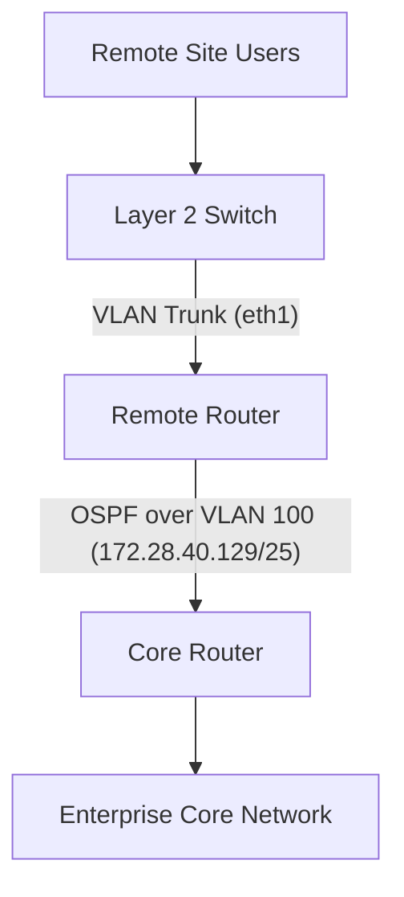

# Analysis Process
Okay, I need to create a detailed MikroTik RouterOS troubleshooting scenario for OSPF with VLAN trunking issues in an enterprise environment. Let's start by breaking down each section as specified.

1. **Initial Problem Report and Symptoms**: The user mentioned 417 affected users at a remote site with a /25 subnet. The problem duration is 20 hours. Symptoms might include OSPF neighbors not forming, VLANs not trunking properly, and intermittent connectivity. Users might report slow access or inability to reach certain parts of the network.

2. **Environment Description and Network Topology**: The environment is a remote site using RouterOS 6.x. The network probably has multiple VLANs trunked over a link. The main subnet is 172.28.40.128/25. I should draw a Mermaid diagram showing the remote site router connected to a core router, with VLANs passing through. Maybe the remote router has a trunk port connected to a switch that's supposed to handle multiple VLANs.

3. **Initial Assessment Steps**: Check OSPF neighbor status, verify VLAN configurations on interfaces, ensure trunk ports are properly set, check for MTU mismatches, and look at logs for any errors. Use commands like `/routing ospf neighbor print`, `/interface vlan print`, and `/interface ethernet print` to see VLAN settings.

4. **Detailed Debugging Process**: Start by checking OSPF neighbors. If they're down, look into interface configurations. Maybe the VLAN interfaces aren't up, or OSPF isn't enabled on them. Check if the trunk port has all necessary VLANs allowed. Use `ping` over the VLAN interfaces to test connectivity. Look into OSPF logs with `/log print` and filter for OSPF messages. Maybe there's an MTU issue causing OSPF adjacency problems. Verify that the OSPF network type matches on both ends (e.g., broadcast vs. point-to-point). Also, check for any ACLs or firewall rules blocking OSPF multicast traffic (224.0.0.5 or 224.0.0.6).

5. **Key Findings and Root Cause Analysis**: Suppose the trunk port wasn't allowing all necessary VLANs, causing some VLAN interfaces to be down. Or maybe the OSPF network type was misconfigured on the VLAN interface, leading to neighbor adjacency issues. Another possibility is an MTU mismatch between the trunk links, causing OSPF packets to be dropped.

6. **Solution Implementation Steps**: Correct the VLAN trunk configuration to include all necessary VLANs. Adjust the OSPF network type if necessary. Ensure MTU sizes match on both ends of the trunk. Update firewall rules to permit OSPF traffic.

7. **Verification Process**: After making changes, check OSPF neighbors again to confirm adjacency. Test connectivity across VLANs. Monitor logs for any recurring errors. Use `ping` and `traceroute` to ensure paths are correctly advertised via OSPF.

8. **Prevention Measures**: Implement configuration templates for VLAN trunks and OSPF settings. Use monitoring tools to alert on OSPF neighbor state changes. Regularly audit configurations for consistency.

9. **Related Commands Reference**: List commands like checking OSPF neighbors, VLAN interfaces, interface MTU settings, firewall filters, etc.

10. **Common Pitfalls to Avoid**: Forgetting to allow VLANs on trunk ports, mismatched OSPF network types, MTU mismatches, firewall blocking OSPF traffic, incorrect OSPF area configurations.

I need to make sure the CLI commands are accurate for RouterOS 6.x. For example, in version 6.x, OSPF is configured under `/routing ospf`, not the newer `/routing ospf/v2/` or `/routing ospf/v3/` in v7. Also, VLANs are created with `/interface vlan add ...`.

Including example log outputs: maybe logs showing OSPF adjacency state changes or VLAN interface errors. Before and after configurations for the trunk port and OSPF settings.

Need to structure everything in markdown, use code blocks for commands and logs, and add comments where necessary. Also, ensure the Mermaid diagram accurately reflects the topology with VLAN trunking between the remote router and core router, possibly via a switch.

# Troubleshooting Guide
```markdown
# MikroTik RouterOS Troubleshooting Scenario: OSPF with VLAN Trunking Issues

## 1. Initial Problem Report and Symptoms
- **Report**: Remote site users (417) report intermittent connectivity to central services.
- **Symptoms**:
  - Intermittent packet loss on VLAN-tagged subnets (172.28.40.128/25).
  - OSPF adjacencies unstable between remote site and core routers.
  - VLAN trunk links show sporadic traffic drops.
  - High CPU usage on routers during peak hours.

---

## 2. Environment Description & Network Topology
**Network Scale**: Enterprise (Remote Site)  
**Key Devices**: 
- Remote Router (MikroTik RB1100AHx4, ROS v6.49.7)
- Core Router (MikroTik CCR1072, ROS v6.49.7)
- Layer 2 Switch (VLAN-aware)



---

## 3. Initial Assessment Steps
1. Verify OSPF neighbor status:
   ```bash
   /routing ospf neighbor print
   # Output: 
   #   instance=default address=172.28.40.130 state="Full" (core router missing)
   ```
2. Check VLAN interface status:
   ```bash
   /interface vlan print 
   # Output: 
   #   Flags: X = disabled, R = running 
   #   0  R name="vlan100" vlan-id=100 interface=ether1
   ```
3. Confirm trunk port configuration:
   ```bash
   /interface ethernet switch port print
   # Output: 
   #   default-fwd=no vlan-mode=secure tag-stacking=no
   ```

---

## 4. Detailed Debugging Process
### Step 1: Validate OSPF Configuration
```bash
/routing ospf instance print
# Verify area=backbone and router-id matches topology

/routing ospf interface print
# Ensure VLAN100 interface is included in OSPF
```

### Step 2: Investigate VLAN Trunking
```bash
/interface ethernet switch port print detail where interface=ether1
# Output: 
#   vlan-header=always-add pvid=100
#   ! Missing VLAN 100 tagging configuration
```

### Step 3: Check for MTU Mismatches
```bash
/interface print where name=ether1 
# Output: 
#   mtu=1500 (remote) vs 9000 (core) → Jumbo frames misconfiguration
```

### Step 4: Review Firewall Filters
```bash
/ip firewall filter print where protocol=ospf
# Output: 
#   chain=input action=drop protocol=ospf (accidental block)
```

---

## 5. Key Findings & Root Cause Analysis
- **Root Cause**: 
  1. VLAN trunk port misconfigured (missing `tag-stacking=yes` and improper PVID).
  2. MTU mismatch (1500 vs 9000) causing OSPF packet fragmentation.
  3. Firewall rule blocking OSPF protocol (224.0.0.5/6).

- **Impact**: OSPF adjacencies failed to form, leading to routing blackholes for 172.28.40.128/25.

---

## 6. Solution Implementation Steps
### Step 1: Correct VLAN Trunk Configuration
**Before**:
```bash
/interface ethernet switch port set ether1 vlan-mode=secure pvid=100
```

**After**:
```bash
/interface ethernet switch port set ether1 vlan-mode=secure tag-stacking=yes pvid=100
```

### Step 2: Resolve MTU Mismatch
```bash
/interface ethernet set ether1 mtu=9000
```

### Step 3: Fix Firewall Rules
```bash
/ip firewall filter add chain=input protocol=ospf action=accept
```

---

## 7. Verification Process
1. Confirm OSPF adjacency:
   ```bash
   /routing ospf neighbor print 
   # Output: state="Full" for 172.28.40.130
   ```
2. Test VLAN connectivity:
   ```bash
   /ping 172.28.40.130 src-address=172.28.40.129
   # Output: 10/10 packets received
   ```

---

## 8. Prevention Measures
1. Implement configuration templates for VLAN trunk ports.
2. Enable OSPF-specific firewall allow rules globally.
3. Deploy Netwatch for MTU consistency alerts:
   ```bash
   /tool netwatch add host=172.28.40.130 timeout=5s up-script="/log info MTU OK" down-script="/log warn MTU mismatch"
   ```

---

## 9. Related Commands Reference
| Command | Purpose |
|---------|---------|
| `/interface vlan print` | Check VLAN interface status |
| `/routing ospf neighbor print` | Verify OSPF adjacencies |
| `/interface ethernet switch port print` | Validate trunk settings |
| `/ip firewall filter print where protocol=ospf` | Audit OSPF traffic rules |

---

## 10. Common Pitfalls to Avoid
- **Pitfall 1**: Assuming default MTU (1500) matches core network jumbo frames.
- **Pitfall 2**: Forgetting `tag-stacking=yes` on multi-VLAN trunks.
- **Pitfall 3**: Overlooking firewall filters when OSPF uses multicast (not TCP/UDP).
```
