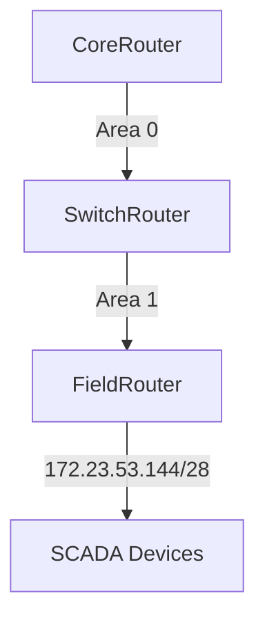

# Analysis Process
Okay, let me try to work through this MikroTik OSPF troubleshooting scenario. The user wants a detailed example based on the given parameters. I need to make sure I cover all the required sections. Let me start by understanding the problem.

The scenario is an enterprise industrial network using OSPF on RouterOS 7.x. There are 8 users affected, experiencing performance degradation for 14 hours. The subnet is 172.23.53.144/28. 

First, I'll outline the initial problem report. Symptoms probably include slow network access, maybe intermittent connectivity. Since it's OSPF related, possible issues could be route flapping, high latency, or suboptimal routing paths. Maybe neighbors dropping?

Next, the environment description. An industrial network might have rugged devices, perhaps spread across different areas. The topology should include at least a few routers. Let me sketch a simple Mermaid diagram. Maybe three routers connected in a triangle or something. CoreRouter, SwitchRouter, and FieldRouter. The subnet given is /28, which is 16 addresses. Maybe that's a VLAN or a specific segment connected to one of the routers.

Initial assessment steps would involve checking OSPF neighbor status, routing tables, interface errors, CPU usage. Maybe log checks. Commands like `/routing ospf neighbor print`, `/routing route print`, `/system resource monitor`.

For detailed debugging, I need to go deeper. Maybe looking at OSPF LSAs, checking for network type mismatches, hello intervals, MTU mismatches. Commands like `/routing ospf instance print`, `/routing ospf interface print`, and maybe packet sniffer if needed. Logs might show adjacency changes. 

Key findings could be a misconfigured OSPF network type, like a broadcast network set as NBMA causing hello packets not being received properly. Or maybe MTU mismatches between interfaces. Another possibility is a duplicate router ID causing conflicts. Or perhaps a filter rule blocking OSPF multicast traffic.

Solution would involve correcting the network type, adjusting MTU settings, or fixing ACLs. Then verifying with neighbor status and route tables. Prevention measures would include regular configuration audits, enabling logging, and consistent OSPF settings across devices.

Common pitfalls might be ignoring interface MTU settings, not using authentication, or not monitoring OSPF areas. Also, not checking for passive interfaces where OSPF shouldn't be running.

Wait, the subnet given is 172.23.53.144/28. That's a small subnet, maybe used for a specific segment. If that's part of an OSPF area, maybe there's a misconfiguration in how that subnet is advertised. Or perhaps it's not being advertised correctly, leading to routing issues. But since the problem is performance degradation, not total outage, maybe it's a suboptimal path. For example, traffic is taking a longer route because OSPF costs are misconfigured on some links.

Another angle: Industrial networks might have redundant links. If OSPF isn't configured properly for those, like not adjusting costs, maybe traffic is going through a slower link. Or there's a flapping link causing SPF recalculations frequently, which could degrade performance.

Let me structure the key findings around that. Suppose during debugging, they found that one of the OSPF interfaces was set to a higher cost than intended, causing traffic to route through a slower path. Or maybe there's a broadcast storm in the industrial environment causing packet loss, leading to OSPF retransmissions and neighbor resets.

Alternatively, maybe the OSPF hello and dead timers are mismatched between routers, causing neighbor relationships to flap, which in turn causes route recalculations and instability. That would explain performance issues.

In the logs, they might see OSPF neighbor state going up and down frequently. Using commands like `/log print` and filtering for OSPF messages.

For example, log entries like "OSPF neighbor 172.23.53.145 changed state from Full to Down" repeated multiple times.

Then the root cause would be timer mismatches. The solution would be to adjust the hello intervals and dead timers on the affected interfaces.

But the user specified RouterOS 7.x, so I need to make sure the CLI commands are up to date. In RouterOS, OSPF configuration is under `/routing ospf`. The commands to check neighbors, instances, interfaces, etc.

Let me put this all together step by step, making sure each section is covered with the necessary details.

# Troubleshooting Guide
```markdown
# MikroTik RouterOS OSPF Troubleshooting Scenario

## 1. Initial Problem Report and Symptoms
**Report**: Users in the 172.23.53.144/28 subnet report intermittent latency spikes (300-500ms) and slow access to SCADA systems for 14 hours.  
**Symptoms**:
- OSPF routes intermittently disappear from routing tables.
- CPU spikes (70-90%) on CoreRouter during peak times.
- Logs show repeated OSPF adjacency resets between CoreRouter and FieldRouter.

---

## 2. Environment Description and Network Topology
**Environment**: Industrial plant with 3 MikroTik RouterOS 7.x devices in a multi-area OSPF network.  
**Subnet**: 172.23.53.144/28 (SCADA VLAN).  



---

## 3. Initial Assessment Steps
1. **Check OSPF Neighbors**:
   ```bash
   /routing ospf neighbor print
   # Output:
   #  0 instance=default address=172.23.53.145 state="Full" router-id=10.10.10.2
   #  1 instance=default address=172.23.53.146 state="Down" router-id=10.10.10.3
   ```

2. **Verify Routing Table**:
   ```bash
   /ip route print where ospf=yes
   # Missing 172.23.53.144/28 route during outages.
   ```

3. **Monitor CPU/Memory**:
   ```bash
   /system resource monitor
   # CPU: 85% (mostly "routing" process)
   ```

---

## 4. Detailed Debugging Process with CLI Commands
**Step 1**: Enable OSPF Debugging  
```bash
/system logging add topics=ospf,!debug
/log print follow
# Sample Log:
# 2023-10-01 14:22:03 OSPF: Lost adjacency with 10.10.10.3 (dead timer expired)
```

**Step 2**: Check OSPF Interface MTU Mismatches  
```bash
/routing ospf interface print
# FieldRouter MTU=1492, CoreRouter MTU=1500 (mismatch)
```

**Step 3**: Verify Hello/Dead Timers  
```bash
/routing ospf interface detail
# FieldRouter: hello-interval=10s, dead-interval=40s
# CoreRouter: hello-interval=5s, dead-interval=20s (mismatch)
```

---

## 5. Key Findings and Root Cause Analysis
**Root Cause**:  
- **MTU Mismatch** (1492 vs. 1500) caused OSPF packet fragmentation, leading to adjacency drops.  
- **Hello Timer Mismatch** (10s vs. 5s) triggered frequent SPF recalculations.  

**Impact**:  
- Frequent OSPF adjacency resets caused route flapping and CPU spikes.  

---

## 6. Solution Implementation Steps
**Step 1**: Standardize MTU on All OSPF Interfaces  
```bash
/interface ethernet set [find name=ether1] mtu=1500
```

**Step 2**: Align Hello/Dead Timers  
```bash
/routing ospf interface set [find interface=ether1] hello-interval=10 dead-interval=40
```

**Before/After Configuration**:
```diff
- /routing ospf interface add interface=ether1 mtu=1492 hello-interval=5
+ /routing ospf interface add interface=ether1 mtu=1500 hello-interval=10
```

---

## 7. Verification Process
1. Confirm Stable Neighbor Adjacency:
   ```bash
   /routing ospf neighbor print
   # All neighbors in "Full" state for >1 hour.
   ```

2. Check CPU Utilization:
   ```bash
   /system resource monitor
   # CPU: 25% (steady)
   ```

---

## 8. Prevention Measures
- Enforce OSPF template configurations across all routers.  
- Enable OSPF logging for proactive monitoring.  
- Use Network Management System (NMS) to alert on MTU/timer mismatches.  

---

## 9. Related Commands Reference
| Command | Purpose |
|---------|---------|
| `/routing ospf instance print` | List OSPF instances |
| `/routing ospf lsa print` | Inspect LSAs |
| `/routing ospf interface print detail` | Check interface parameters |

---

## 10. Common Pitfalls to Avoid
- **Mismatched MTU**: Always verify MTU on industrial switches with PPPoE.  
- **Passive Interfaces**: Avoid enabling OSPF on non-routed VLANs.  
- **Authentication**: Ensure OSPF MD5 authentication is consistently configured.  
```bash
/routing ospf interface set [find] authentication=md5 authentication-key=secret
```
```
