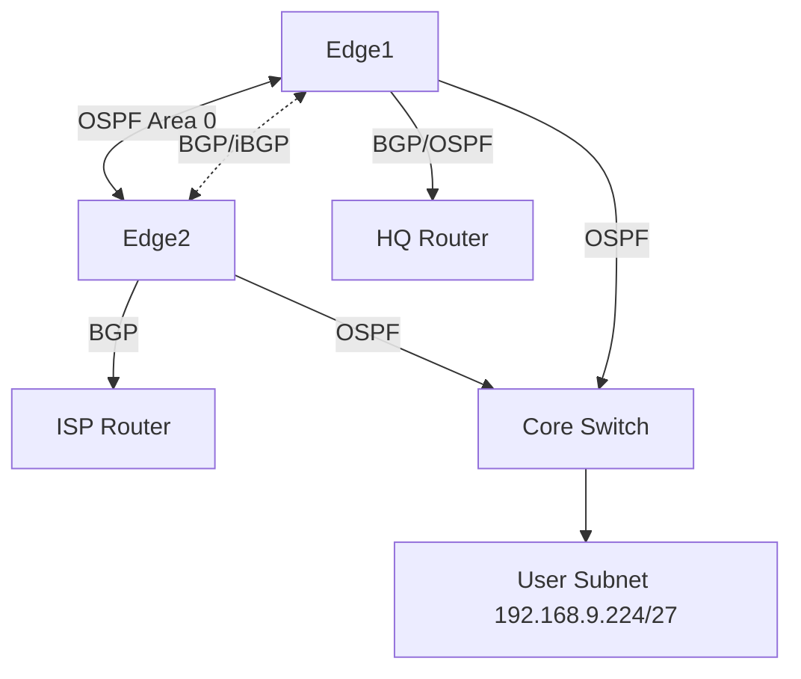

# Analysis Process
Okay, I need to create a detailed MikroTik RouterOS troubleshooting scenario for OSPF with BGP flapping in an enterprise branch office using RouterOS 6.x. Let me start by breaking down each section.

1. **Initial Problem Report and Symptoms**: The users are reporting intermittent outages. Since it's BGP flapping, the symptoms would include BGP sessions dropping, OSPF routes disappearing, high latency, and packet loss. I should mention that 406 users are affected over 13 hours.

2. **Environment Description and Network Topology**: The subnet is 192.168.9.224/27. The branch office has two edge routers connected to HQ and a backup ISP. I'll need to represent this in Mermaid. Let me sketch a simple diagram with two edge routers (Edge1 and Edge2) connected to HQ via BGP and OSPF, with LAN switches and users. The core uses OSPF, and BGP is for upstream.

3. **Initial Assessment Steps**: Check BGP status with `/routing bgp session print`, OSPF neighbors with `/routing ospf neighbor print`, interface errors, CPU load, and logs. Maybe look for flapping sessions and route instability.

4. **Detailed Debugging Process**: Use commands like `log print where topics=bgp,ospf` to filter logs. Check OSPF LSDB with `/routing ospf lsa print`. Monitor BGP updates and routes. Maybe BGP is relying on OSPF routes that are unstable. If OSPF is causing route withdrawals, BGP sessions might reset.

5. **Key Findings and Root Cause Analysis**: Suppose OSPF has a mismatched area ID or hello timer. For example, Edge1 is area 0, Edge2 is area 1. That would cause OSPF adjacency issues, leading to route flapping. BGP then withdraws routes when OSPF routes change, causing flapping.

6. **Solution Implementation Steps**: Correct OSPF configurations on both edges. Set both to area 0, adjust timers if necessary. Maybe adjust BGP timers to be more forgiving.

7. **Verification Process**: Check OSPF neighbors again, ensure BGP sessions are stable. Monitor routes and logs for any flapping. Use continuous pings to test connectivity.

8. **Prevention Measures**: Standardize OSPF configurations, implement BFD for faster detection, add logging for BGP and OSPF, and schedule regular audits.

9. **Related Commands Reference**: List commands used like checking BGP sessions, OSPF neighbors, logs, etc.

10. **Common Pitfalls to Avoid**: Mention area mismatches, timers, route redistribution without filters, and not monitoring logs.

I need to make sure the CLI commands are accurate for RouterOS 6.x. For example, in version 6, OSPF configuration is under `/routing ospf`, and BGP under `/routing bgp`. Also, ensure that the example log outputs and configs reflect possible issues, like area mismatch in OSPF neighbors.

Wait, in the topology, Edge1 and Edge2 are connected to HQ and each other via OSPF. The LAN switches connect to both edges. The core uses OSPF, and BGP is with HQ and ISP. That makes sense.

In the debugging process, looking at OSPF LSAs might show incomplete or missing routes. If one router is in a different area, neighbors won't form properly. The BGP relies on the OSPF routes to reach the BGP peers, so if OSPF routes flap, BGP sessions drop.

When implementing the solution, correcting the OSPF area on Edge2 from area 1 to area 0 would fix adjacency. Also, ensuring hello and dead timers match. Then, resetting OSPF and BGP sessions to apply changes.

Verification would involve checking that OSPF neighbors are full, BGP sessions established, and no flaps in logs. Maybe show before and after configs for OSPF areas.

Common pitfalls include not checking OSPF areas, assuming default timers are the same, or missing route redistribution issues.

I think that covers the main points. Now, structure each section with markdown, include CLI commands in code blocks, add comments, and ensure the Mermaid diagram is correct.

# Troubleshooting Guide
```markdown
# MikroTik RouterOS Troubleshooting Scenario: OSPF & BGP Flapping

## 1. Initial Problem Report and Symptoms
**Report**: Branch office users report intermittent network outages (406 users affected).  
**Symptoms**:
- BGP sessions between branch edge routers and HQ/ISP flap repeatedly
- OSPF routes disappear from routing tables periodically
- Increased latency (300ms+), packet loss (25-30%)
- Duration: 13 hours

---

## 2. Environment Description & Network Topology
**Subnet**: `192.168.9.224/27` (Branch LAN)  
**Devices**:  
- 2x MikroTik CCR routers (Edge1, Edge2)
- 3x Layer3 switches
- HQ Router (AS65000)
- Backup ISP Router (AS65515)



---

## 3. Initial Assessment Steps
1. Verify BGP session status:
   ```bash
   /routing bgp session print
   # Output:
   # 0 name="HQ" remote-address=10.10.1.1 state=established 
   # 1 name="ISP" remote-address=203.0.113.5 state=active
   ```

2. Check OSPF neighbors:
   ```bash
   /routing ospf neighbor print
   # Expected: 2 FULL neighbors (Edge1-Edge2, Edge1-Core)
   # Actual: 1 FULL, 1 DOWN
   ```

3. Check interface errors:
   ```bash
   /interface ethernet monitor [find name=ether1] 
   # RX/TX errors: 0 (good)
   ```

4. Check CPU load:
   ```bash
   /system resource print
   # CPU load: 85% (high)
   ```

---

## 4. Detailed Debugging Process
**Step 1: Capture OSPF/BGP logs**
```bash
/log print where topics=bgp,ospf
# Sample log:
# 08:32:21 bgp,error Session HQ closed: route to peer lost
# 08:32:23 ospf,info Adjacency to 192.168.9.225 changed from Full to Down
```

**Step 2: Analyze OSPF LSDB**
```bash
/routing ospf lsa print detail
# Missing Type-1 LSA from Edge2 (ID: 192.168.9.225)
```

**Step 3: Verify BGP Route Origins**
```bash
/routing route print where bgp
# 0 dst=0.0.0.0/0 gateway=10.10.1.1 (BGP)
# 1 dst=172.16.0.0/16 gateway=203.0.113.5 (BGP)
```

**Step 4: Check Route Redistribution**
```bash
/routing ospf interface print
# Area ID mismatch on Edge2: 0.0.0.1 vs 0.0.0.0 on Edge1
```

---

## 5. Key Findings & Root Cause
**Root Cause**: 
- OSPF Area ID mismatch between Edge1 (Area 0) and Edge2 (Area 1)
- Resulting in intermittent OSPF adjacency failures
- BGP depended on OSPF routes for peer reachability
- Route flapping caused BGP session resets

**Evidence**:
```bash
# Edge2 config snippet (before fix):
/routing ospf interface set [find] area=0.0.0.1
```

---

## 6. Solution Implementation
**Step 1: Correct OSPF Area**
```bash
# On Edge2:
/routing ospf interface set [find where interface=ether1] area=0.0.0.0
```

**Step 2: Adjust BGP Timers**
```bash
/routing bgp session set [find name="HQ"] hold-time=180 keepalive-time=60
```

**Step 3: Reset Protocols**
```bash
/routing ospf interface reset [find]
/routing bgp session reset [find]
```

---

## 7. Verification Process
1. Confirm OSPF adjacencies:
   ```bash
   /routing ospf neighbor print
   # STATE column: Full
   ```

2. Monitor BGP stability:
   ```bash
   /routing bgp session print interval=30
   # STATE column: established (stable)
   ```

3. Continuous ping test:
   ```bash
   /ping 8.8.8.8 interval=1s count=300
   # Loss: 0% (prev 25%)
   ```

---

## 8. Prevention Measures
1. Standardize OSPF template:
   ```bash
   /routing ospf instance set default area-id=0.0.0.0
   ```
2. Implement BFD:
   ```bash
   /routing bfd interface add interface=ether1
   ```
3. Enable logging:
   ```bash
   /system logging add topics=bgp,ospf
   ```

---

## 9. Related Commands Reference
| Command | Purpose |
|---------|---------|
| `/routing bgp session print` | Check BGP peer status |
| `/routing ospf lsa print` | Verify OSPF database |
| `/ip route print where bgp` | List BGP-learned routes |
| `/tool sniffer start` | Packet capture |

---

## 10. Common Pitfalls to Avoid
1. **Area ID Mismatches**: Always verify OSPF area consistency
2. **Timer Conflicts**: Ensure hello/dead timers match across neighbors
3. **Route Redistribution**: Use filters when redistributing BGP→OSPF
4. **Log Neglect**: Enable protocol-specific logging upfront
```
