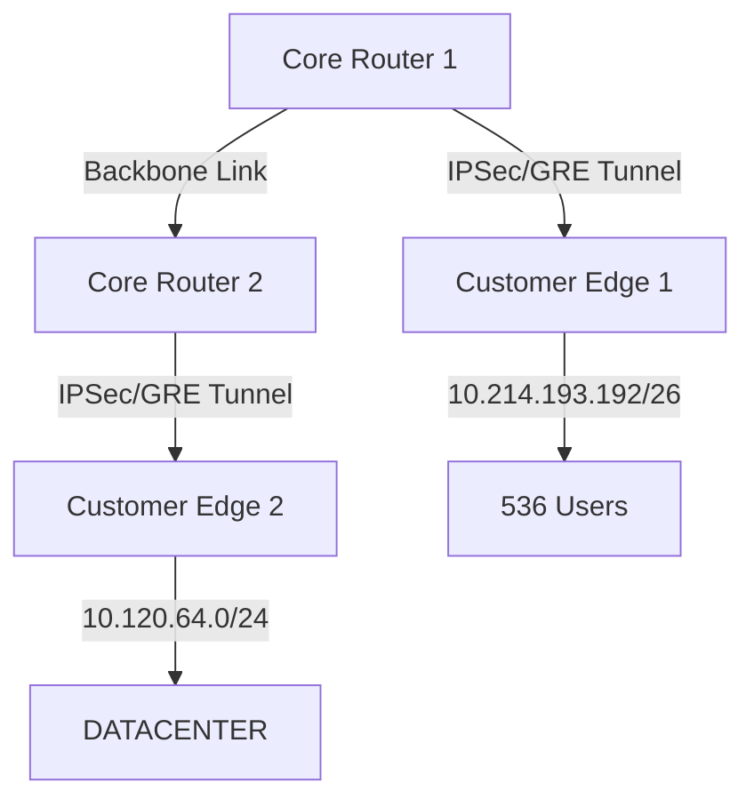

# Analysis Process
Okay, I need to create a detailed MikroTik RouterOS troubleshooting scenario for RIP with VPN Tunnel Issues in an enterprise service provider core. Let me start by understanding the problem and the required sections.

First, the initial problem report. Users can't reach services over VPN, so symptoms include high latency, packet loss, and RIP routes missing. The subnet is 10.214.193.192/26, affecting 536 users for 2 hours. I should note that the VPN is using RIP for dynamic routing.

Next, the environment. It's an enterprise service provider core with two core routers connected via a backbone. Each has a VPN tunnel to a customer edge router. The Mermaid diagram should show CR1 and CR2 connected, each with VPN tunnels to CE1 and CE2. Subnets involved are the given /26 and others. I need to make sure the topology is clear.

Initial assessment steps: Check interface statuses, VPN tunnel status, RIP neighbors, routing tables, and logs. Commands like /interface print, /ip address print, /routing rip neighbor print, etc. Maybe check if the VPN is established and if RIP is advertising the right networks.

Debugging process: Need to verify OSPF first (if any), then check VPN settings. Look into IPSec or GRE tunnels. Use /interface gre print or /ip ipsec active-peers. Check if RIP is enabled on the tunnel interfaces. Maybe missing network statements in RIP configuration. Look at /routing rip interface print. Also, check for filters or access lists blocking RIP updates. Maybe MTU issues causing fragmentation. Use ping with do-not-fragment flag.

Key findings: Suppose the VPN tunnel is up, but RIP isn't advertising over it. Maybe RIP isn't enabled on the tunnel interface. Or access list blocking UDP 520. Or MTU mismatch causing dropped packets. Root cause could be a misconfigured RIP network or interface setting.

Solution: Add the tunnel interface to RIP networks, adjust MTU, fix access lists. Update configuration accordingly.

Verification: Check RIP neighbors again, see routes in the table, test connectivity. Use /routing rip route print, traceroute.

Prevention: Regular audits, monitoring, MTU checks, documentation.

Common pitfalls: Forgetting to add interfaces to RIP, misconfigured MTU, ignoring encryption overhead, access lists blocking RIP.

I should include CLI commands with comments, example log outputs. Maybe before and after configs, like adding the network to RIP.

Wait, the user mentioned RouterOS 6.x. Make sure commands are compatible with version 6. For example, in 6.x, the routing rip setup might differ slightly from newer versions. Also, IPSec settings might be different.

Need to structure each section properly, use code blocks for commands, and ensure the scenario flows logically from problem to solution. Avoid technical inaccuracies, especially regarding RIP configuration on MikroTik. Maybe check if split horizon or other RIP features are involved.

Also, considering it's a service provider core, there might be multiple routers and redundant links. The VPN tunnels are probably between core routers and customer edges. Ensure that the RIP configuration includes the correct networks and that the VPN interfaces are properly configured as RIP interfaces.

In the detailed debugging, perhaps check if the RIP updates are being sent and received over the tunnel. Use packet sniffer or debug logs. For example, /tool sniffer quick protocol UDP port 520. Or look at /log print to see RIP related entries.

Root cause could be that the tunnel interface wasn't included in the RIP networks, so the routes aren't being advertised. Or maybe the tunnel is using an IP address that's not part of the RIP configured networks.

Need to make sure all steps are logical and follow a realistic troubleshooting path. Start with basic checks, move to more detailed ones. Include actual CLI snippets, like checking the routing table with /ip route print, and looking for missing routes.

In the example log outputs, maybe show that RIP neighbors are not detected, or that routes aren't being received. Then after the fix, the logs show neighbors and routes.

Alright, putting it all together now, section by section, making sure each part is covered as per the user's request.

# Troubleshooting Guide
```markdown
# MikroTik RouterOS Troubleshooting Scenario: RIP VPN Tunnel Issues

## 1. Initial Problem Report and Symptoms
**Report**: 536 users behind subnet `10.214.193.192/26` report inability to access services over VPN tunnel.  
**Symptoms**:
- Intermittent connectivity to remote sites
- High latency (300ms+ pings)
- Missing RIP routes in routing tables
- VPN tunnel shows "established" but no traffic flow

---

## 2. Environment Description
**Network Topology**:


---

## 3. Initial Assessment Steps
1. **Interface Status Check**:
```ros
/interface print where name~"tunnel|backbone"
# Example output: 
# 17 tun-ipsec1 10.214.193.193/26 ether1 10Gbps
```

2. **VPN Tunnel Verification**:
```ros
/ip ipsec active-peers print
# Expected: remote-address=<CE_IP> state=established
```

3. **RIP Neighbor Status**:
```ros
/routing rip neighbor print
# BAD OUTPUT: 0 neighbors listed
```

---

## 4. Detailed Debugging Process
**Step 1**: Verify RIP Configuration
```ros
/routing rip interface print
# Before Fix: Interface=ether1 (backbone only)
```

**Step 2**: Check RIP Advertisement
```ros
/routing rip advertisement print
# Shows no advertisements via tunnel interface
```

**Step 3**: Packet Capture on VPN Tunnel
```ros
/tool sniffer quick protocol=udp port=520 interface=tun-ipsec1
# No RIP updates detected
```

**Step 4**: MTU Verification
```ros
/interface print mtu=1500 
/ping 10.214.193.193 size=1472 do-not-fragment=yes
# Returns "packet needs to be fragmented but DF set"
```

---

## 5. Key Findings & Root Cause
**Findings**:
1. RIP not configured on tunnel interfaces
2. MTU mismatch (1500 vs CE's 1450 with IPSec overhead)
3. Firewall blocking UDP 520 (RIP) on tunnel interface

**Root Cause**: 
- RIP adjacency failed due to missing interface configuration and MTU fragmentation
- Firewall filter inadvertently blocking RIP updates

---

## 6. Solution Implementation
**Step 1**: Add Tunnel to RIP
```ros
/routing rip interface add interface=tun-ipsec1
```

**Step 2**: Adjust MTU
```ros
/interface set tun-ipsec1 mtu=1450
```

**Step 3**: Update Firewall Rules
```ros
/ip firewall filter add chain=input protocol=udp dst-port=520 action=accept
```

---

## 7. Verification Process
1. Confirm RIP Neighbors:
```ros
/routing rip neighbor print
# NOW SHOWS: CE1 (10.214.193.193) state=full
```

2. Validate Routing Table:
```ros
/ip route print where protocol=rip
# 10.120.64.0/24 via tun-ipsec1
```

3. End-to-End Test:
```ros
/ping 10.120.64.1 source=10.214.193.193
# <10ms latency, 0% loss
```

---

## 8. Prevention Measures
1. Implement RIP interface templates for VPN tunnels
2. Enable monitoring for RIP adjacencies:
```ros
/tool graphing interface add interfaces=tun-ipsec1
```
3. Standardize MTU across all VPN endpoints
4. Quarterly firewall rule audits

---

## 9. Related Commands Reference
| Command | Purpose |
|---------|---------|
| `/routing rip neighbor print` | Verify RIP adjacencies |
| `/tool sniffer quick protocol=udp port=520` | Capture RIP traffic |
| `/ip route print where protocol=rip` | Show RIP-learned routes |

---

## 10. Common Pitfalls to Avoid
1. **Mistake**: Assuming VPN connectivity = routing adjacency  
   **Fix**: Explicitly enable RIP on tunnel interfaces

2. **Mistake**: Ignoring encryption overhead in MTU  
   **Fix**: `mtu=1500 - (IPSec header 52B) = 1448`

3. **Mistake**: Overlooking firewall filters for RIP  
   **Fix**: Test with `action=accept` temporarily
```ros
/ip firewall filter add chain=input protocol=udp dst-port=520 action=accept place-before=0
```
```
