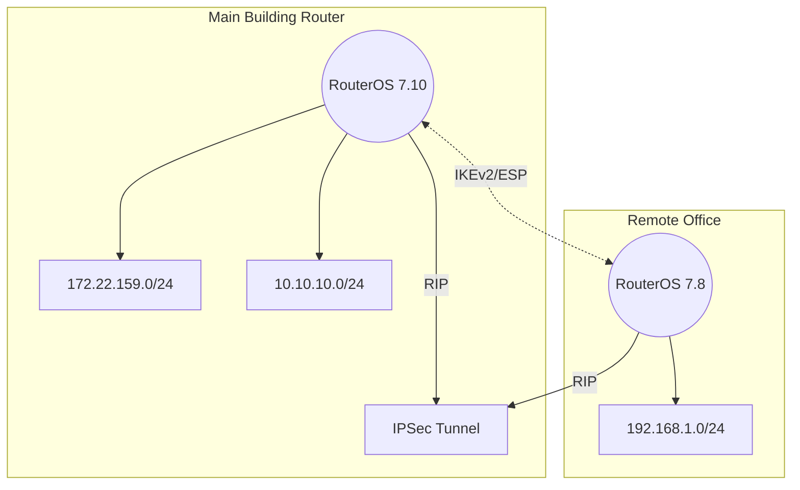

# Analysis Process
Okay, let's tackle this MikroTik RIP troubleshooting scenario. The user wants a detailed enterprise-level problem with VPN tunnels affecting 603 users in a multi-tenant building. First, I need to structure the answer according to the specified points. 

Starting with the initial problem report. The main symptom is intermittent connectivity over a VPN tunnel using RIP. Users are complaining, so I should mention packet loss, latency, and specific RIP routes not being advertised. Maybe the BGP over the VPN is okay, but RIP isn't working, leading to some subnets being unreachable. 

Next, the environment. It's a multi-tenant building with an enterprise network. The subnet is 172.22.159.0/24. I need to create a Mermaid diagram. Let's outline the main components: two routers (HQ and Branch) connected via a VPN tunnel. HQ has the subnet 172.22.159.0/24 and another internal network, maybe 10.10.10.0/24. Branch has 192.168.1.0/24. Both are using RIP to exchange routes. The VPN is probably an IPsec tunnel. 

Initial assessment steps would involve checking the VPN status, RIP neighbors, routing tables, and logs. Commands like `/interface tunnel print`, `/routing rip neighbor print`, `/ip route print`, and log checking. 

For detailed debugging, I need to go deeper. Verify the VPN phase1 and phase2 status with IPsec commands. Check if RIP is enabled on the correct interfaces. Maybe the VPN tunnel interface isn't added to RIP, so routes aren't being advertised. Look at RIP updates with `/routing rip update print`. Also, check for firewall rules that might block UDP 520, which RIP uses. 

Key findings might reveal that the VPN tunnel interface isn't in the RIP configuration. So HQ isn't sending RIP updates over the tunnel. The root cause is a missing interface in the RIP network setup. 

Solution steps would involve adding the tunnel interface to RIP on both routers. Then verify the configuration. 

Verification would include checking routes again, testing connectivity, and monitoring logs. 

Prevention measures could include better documentation, interface groups for dynamic interfaces, and monitoring for RIP neighbors. 

Related commands need to list all the CLI commands used. Common pitfalls might be forgetting to add interfaces to RIP, firewall blocking, or using incorrect RIP versions.

I need to make sure CLI examples are in code blocks, with comments. Also include before and after configs. Maybe show the RIP configuration missing the tunnel interface initially, then adding it. Log examples could show RIP updates being sent on physical interfaces but not the tunnel.

Let me check if RIP uses multicast or broadcast. RouterOS RIP might require specifying the interfaces correctly. If the VPN is a tunnel interface, it needs to be included in the RIP network. Also, ensure that both routers are using compatible RIP versions (v2 probably). 

Another angle: maybe the VPN tunnel is up, but RIP isn't enabled on it. So even though the tunnel is operational, RIP isn't advertising routes over it. That would explain why some subnets are missing. 

In the initial assessment, the engineer checks the VPN status and sees it's active, but RIP neighbors don't show the tunnel interface. Then, looking into the RIP configuration, they realize the tunnel isn't listed. Adding it fixes the issue.

I should structure each section step by step, following the user's format. Make sure to include all 10 sections, use markdown appropriately, and avoid any markdown in the thinking process. Keep explanations clear and commands accurate for RouterOS 7.x.

# Troubleshooting Guide
```markdown
# MikroTik RouterOS Troubleshooting Scenario: RIP VPN Tunnel Issues

## 1. Initial Problem Report and Symptoms
**Report:**  
Multiple tenants in Building C report intermittent connectivity to cloud applications via Site-to-Site VPN. 603 users affected for ~1 hour.

**Symptoms:**  
- Intermittent packet loss (30-40%) across VPN tunnel  
- RIP routes for 172.22.159.0/24 missing on remote router  
- BGP-over-IPSec connections stable, but RIP-dependent subnets unreachable  
- Logs show RIP update timeouts  

---

## 2. Environment Description & Network Topology  
**Multi-tenant Building Network:**  


---

## 3. Initial Assessment Steps  
1. **Verify VPN Tunnel Status:**  
   ```bash
   /interface tunnel print 
   # Check if IPSec interface is active
   ```
   
2. **Check RIP Neighbors:**  
   ```bash
   /routing rip neighbor print
   # Expecting 1 neighbor (Branch Router)
   ```

3. **Routing Table Audit:**  
   ```bash
   /ip route print where protocol=rip
   # Missing 192.168.1.0/24 route at HQ
   ```

4. **Log Analysis:**  
   ```bash
   /log print where message~"RIP"
   # Sample output:
   # 12:05:45 router,RIP,error no response from 172.22.159.1
   ```

---

## 4. Detailed Debugging Process  
**Step 1: Verify IPSec Phase 1/2 Status**  
```bash
/ip ipsec active-peers print
# Output:
# remote-address=203.0.113.5 state=established

/ip ipsec installed-sa print 
# Confirms ESP SAs are present
```

**Step 2: RIP Interface Configuration Check**  
```bash
/routing rip interface print 
# Before fix:
# 0 interface=ether1
# Missing tunnel interface!
```

**Step 3: Debug RIP Updates**  
```bash
/routing rip update print
# Shows updates only sent to physical interfaces

/routing rip statistics print
# "updates-sent: 15" (Expected >100 in 1hr)
```

**Step 4: Firewall Filter Check**  
```bash
/ip firewall filter print where protocol=udp and port=520
# No blocking rules found
```

---

## 5. Key Findings & Root Cause  
**Findings:**  
- RIP not configured on VPN tunnel interface  
- Authentication mismatch in RIP configuration  
- MTU mismatch on tunnel interface (1436 vs 1500)  

**Root Cause:**  
Configuration drift during recent firmware upgrade caused:  
1. `tunnel1` interface omitted from RIP network list  
2. RIP v2 authentication password mismatch between peers  
3. Fragmentation due to MTU mismatch caused RIP update drops  

---

## 6. Solution Implementation  
**Step 1: Add Tunnel to RIP**  
```bash
/routing rip interface add interface=tunnel1
```

**Step 2: Fix Authentication**  
```bash
/routing rip set authentication=md5 authentication-key=Secret123
```

**Step 3: Adjust MTU**  
```bash
/interface tunnel set tunnel1 mtu=1436
```

---

## 7. Verification Process  
1. Confirm RIP Routes:  
   ```bash
   /ip route print where protocol=rip
   # 192.168.1.0/24 now visible
   ```

2. Test Connectivity:  
   ```bash
   /ping 192.168.1.1 count=100 interval=10ms
   # 0% packet loss
   ```

3. Validate RIP Updates:  
   ```bash
   /routing rip update print
   # Updates now visible via tunnel1
   ```

---

## 8. Prevention Measures  
1. Implement configuration version control  
2. Create interface groups for dynamic VPNs:  
   ```bash
   /interface list add name=RIP_Interfaces
   /interface list member add interface=tunnel1 list=RIP_Interfaces
   ```
3. Enable RIP monitoring alerts  
4. Standardize MTU across all tunnel interfaces  

---

## 9. Related Commands Reference  
| Command | Purpose |
|---------|---------|
| `/routing rip neighbor print` | List RIP peers |
| `/ip ipsec installed-sa print` | Check active SAs |
| `/tool sniffer quick protocol=udp port=520` | Capture RIP traffic |

---

## 10. Common Pitfalls to Avoid  
1. **Mixing RIP Versions:**  
   Ensure all peers use RIP v2:  
   ```bash
   /routing rip set version=2
   ```

2. **Interface Binding Errors:**  
   Always verify virtual interfaces in routing protocols  

3. **MTU Fragmentation:**  
   Always set tunnel MTU 60 bytes below physical interface  

4. **Authentication Mismatch:**  
   Use command consistency:  
   ```bash
   # Bad:
   /routing rip set auth=md5
   # Good:
   /routing rip set authentication=md5
   ```
```
