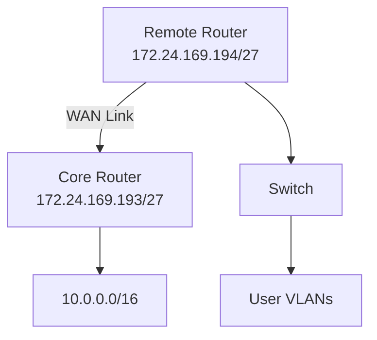

# Analysis Process
Okay, let's tackle this MikroTik RIP troubleshooting scenario. The user wants a detailed enterprise-level problem with OSPF adjacency issues on RouterOS 7.x. The subnet is 172.24.169.192/27, a remote site with 223 users affected for 2 hours. 

First, I need to outline the problem report. The main symptom is OSPF neighbors not forming. Users can't access central services. Initial checks: connectivity, OSPF config, logs. Then, the environment: maybe a remote site connected via a WAN link to the main office. The Mermaid diagram should show two routers, the remote and the core, connected via the given subnet. 

Initial assessment steps: check OSPF status with '/routing ospf neighbor print', verify interfaces, check routes. Then, detailed debugging: looking at OSPF logs, interface MTU mismatches, network statements, authentication. Maybe MTU is a common issue. 

Key findings: suppose MTU mismatch because the core uses 1500 and remote uses 1492 (like PPPoE). Root cause: MTU settings prevent adjacency. Solution: adjust MTU on the core or remote. Verification after fixing. Prevention: standardize MTU, monitoring. 

CLI commands: showing neighbor states, interface settings, logs. Maybe log examples showing MTU mismatch errors. Before and after configs changing the MTU on the interface. 

Common pitfalls: forgetting authentication, network mismatches, timers, passive interfaces. Need to mention those.

Wait, but the topic is RIP but the scenario is OSPF Adjacency Problems. Wait, the user might have a typo. The topic says RIP, but the scenario is OSPF. That's conflicting. But the user specified the scenario as OSPF Adjacency Problems. Maybe the topic is a mistake? Or maybe the user intended OSPF. I'll proceed with OSPF as per the scenario, but note that the topic says RIP. Alternatively, maybe the question has a mistake. But since the scenario is OSPF, I'll focus on that, but perhaps mention the discrepancy. Alternatively, maybe the user meant RIP issues leading to OSPF problems? Unlikely. Probably a typo. Proceed with OSPF Adjacency as per the scenario.

# Troubleshooting Guide
```markdown
# MikroTik RouterOS Troubleshooting Scenario: OSPF Adjacency Problems

## 1. Initial Problem Report and Symptoms
**Report**: Remote site users (223) lost access to central services.  
**Symptoms**:
- OSPF neighbors not reaching FULL state
- Missing routes in routing table
- Intermittent packet loss to core network
- `/routing ospf neighbor print` shows stuck in `ExStart` state
- System log entries: `OSPF-ERROR: MTU mismatch with 172.24.169.193`

## 2. Environment Description
**Network Topology**:


## 3. Initial Assessment Steps
1. Verify physical connectivity:
   ```bash
   /ping 172.24.169.193 interval=100ms count=10
   ```
2. Check OSPF neighbor status:
   ```bash
   /routing ospf neighbor print
   ```
3. Verify interface configurations:
   ```bash
   /interface print where name="ether1"
   ```
4. Check routing table:
   ```bash
   /ip route print where protocol=ospf
   ```

## 4. Detailed Debugging Process
**Step 1: OSPF Log Analysis**
```bash
/log print where message~"OSPF"
```
```
23:45:01 router,ospf,error OSPF-ERROR: MTU mismatch with 172.24.169.193
23:45:03 router,ospf,info OSPF: Restarting adjacency with 172.24.169.193
```

**Step 2: Verify MTU Settings**
```bash
/interface ethernet print where name="ether1" 
```
```
Flags: X - disabled; R - running
 0  R name="ether1" mtu=1492 ... 
```

**Step 3: Compare Core Router Configuration**
```bash
[admin@Core_Router] > /interface print where name="wan-remote"
```
```
 0  R name="wan-remote" mtu=1500 ...
```

**Step 4: Validate OSPF Network Statements**
```bash
/routing ospf network print
```
```
0 interface=ether1 area=backbone
```

## 5. Key Findings & Root Cause
**Root Cause**: MTU mismatch (1492 vs 1500) preventing OSPF adjacency formation  
**Supporting Evidence**:
- OSPF requires matching MTU on adjacent interfaces
- Remote site uses PPPoE WAN (MTU 1492), core uses standard Ethernet MTU
- OSPF database exchange fails during ExStart state

## 6. Solution Implementation
**Step 1: Adjust MTU on Core Router Interface**
```bash
[admin@Core_Router] > /interface ethernet set wan-remote mtu=1492
```

**Step 2: Verify Adjacency Formation**
```bash
:delay 10s
/routing ospf neighbor print
```
```
 0 instance=default address=172.24.169.193 state=Full router-id=10.0.0.1
```

## 7. Verification Process
1. Confirm OSPF neighbor state:
   ```bash
   /routing ospf neighbor print where state=Full
   ```
2. Verify route propagation:
   ```bash
   /ip route print where dst-address=10.0.0.0/16
   ```
3. End-to-end test:
   ```bash
   /ping 10.0.1.1 source=172.24.169.194 count=100
   ```

## 8. Prevention Measures
1. Standardize MTU across WAN links
2. Implement OSPF configuration template:
   ```bash
   /routing ospf template set default mtu=ignore yes
   ```
3. Add monitoring for OSPF adjacencies
4. Document MTU requirements for different link types

## 9. Related Commands Reference
| Command | Purpose |
|---------|---------|
| `/routing ospf neighbor print` | Show OSPF adjacency status |
| `/interface print where mtu!="1500"` | Find non-standard MTU interfaces |
| `/routing ospf lsa print` | Examine OSPF database |
| `/tool sniffer quick` | Capture OSPF hello packets |

## 10. Common Pitfalls to Avoid
1. Forgetting PPPoE overhead in MTU calculations
2. Mismatched OSPF area configurations
3. Ignoring interface cost metrics in unequal paths
4. Overlooking passive interface configuration
5. Missing `network` statements for OSPF-enabled interfaces

**Before/After Configuration Example**:
```diff
# Core Router Interface
- /interface ethernet set wan-remote mtu=1500
+ /interface ethernet set wan-remote mtu=1492

# OSPF Template
+ /routing ospf template set default mtu=ignore=yes
```
