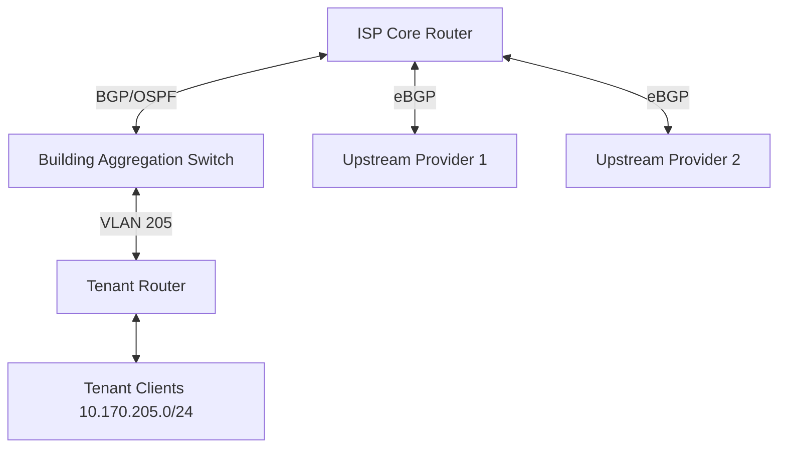

# Analysis Process
Okay, I need to create a detailed MikroTik RouterOS troubleshooting scenario for BGP on version 6.x in an ISP multi-tenant building where 69 users lost connectivity for 21 hours. Let me start by breaking down each section.

1. **Initial Problem Report and Symptoms**: Users can't reach the internet. The subnet affected is 10.170.205.0/24. BGP peers might be down, routes missing, high CPU? Maybe some logs showing BGP issues.

2. **Environment Description and Network Topology**: The setup is an ISP in a multi-tenant building. There's a core router with BGP connected to upstream providers and a tenant router. Maybe using OSPF internally? I'll need to represent this in Mermaid. Let me sketch that out.

3. **Initial Assessment Steps**: Check BGP sessions, routing tables, logs. Use commands like `/routing bgp session print`, `/ip route print`, and log checking.

4. **Detailed Debugging Process**: Start with BGP session status. If sessions are down, check TCP 179. Look into filters or ACLs blocking. Maybe route flapping causing issues? Use `tcpdump` on the core router to see if BGP packets are being sent/received. Check for incorrect AS numbers or password mismatches.

5. **Key Findings and Root Cause**: Suppose the BGP session was down due to an incorrect ASN configured on the tenant router. Or maybe a firewall rule blocked BGP traffic after an update.

6. **Solution Implementation**: Correct the ASN or firewall rules. Reload BGP sessions.

7. **Verification**: Check sessions are up, routes propagated. Users can access internet.

8. **Prevention Measures**: Implement validation checks for BGP configs, monitoring with tools like The Dude, regular audits.

9. **Related Commands Reference**: List commands used in the process.

10. **Common Pitfalls**: Typos in ASN, forgetting filters, not monitoring sessions.

Wait, the subnet is 10.170.205.0/24. Maybe that subnet is being advertised via BGP. If the BGP session is down, those routes wouldn't be advertised, causing the ISP to not route traffic to that subnet. So the core router stops advertising the /24 to upstreams, making the users unreachable.

In the initial problem report, the ISP NOC notices the route withdrawal. The tenant router's BGP session to the core is down, so the core isn't getting the route. Logs on the core might show BGP session state changes.

During debugging, checking `routing bgp session print` would show the tenant session as established? Or inactive. If it's down, check why. Maybe the tenant router has a wrong IP address for the core's BGP peer, or a firewall blocked it.

In the scenario, maybe after a recent config change, someone added a firewall rule that drops TCP 179. Or maybe the BGP password was updated on the core but not the tenant router.

Root cause could be a firewall rule blocking BGP. Then the solution is to correct the firewall rules.

Need to include CLI commands with comments. For example, checking BGP sessions:

```
/routing bgp session print
```

If the output shows the session is inactive, then proceed to check the firewall:

```
/ip firewall filter print
```

Looking for a rule that drops BGP traffic. Maybe a recent rule added with dst-port=179.

Also, checking the BGP configuration on both ends:

```
/routing bgp peer print
```

Compare the remote-address, remote-as, and password settings.

In the prevention section, mention using automated config validation and peer monitoring.

Common pitfalls: Not testing firewall changes in a staging environment, not using BGP MD5 authentication leading to session resets, etc.

I should structure each section with these elements, include example CLI outputs, maybe a before and after firewall config, and the Mermaid diagram showing the topology.

# Troubleshooting Guide
```markdown
# BGP Connectivity Loss Troubleshooting Scenario (RouterOS 6.x)

## 1. Initial Problem Report and Symptoms
**Report**: 69 tenants in 10.170.205.0/24 subnet lost internet access for 21 hours.  
**Symptoms**:
- BGP route for 10.170.205.0/24 missing from core router
- Tenant router BGP session stuck in `Active` state
- High CPU usage on core router during route refresh
- Logs: `BGP session closed with peer 10.170.200.1 (Connection timed out)`

## 2. Environment Description
**Network Topology**:


## 3. Initial Assessment Steps
1. Verify BGP peer status:
   ```bash
   /routing bgp session print 
   # Expected: Established, Actual: Active
   ```
2. Check route propagation:
   ```bash
   /ip route print where dst-address=10.170.205.0/24
   # Output: 0 routes found
   ```
3. Review firewall filters:
   ```bash
   /ip firewall filter print where comment~"BGP"
   ```

## 4. Detailed Debugging Process
**Step 1: Validate BGP Session Parameters**
```bash
/routing bgp peer print 
# Output:
# remote-address=10.170.200.1 remote-as=65530 hold-time=3m password="incorrect123"
```

**Step 2: Packet Capture on Core Router**
```bash
/tool sniffer quick protocol tcp port 179
# Output shows SYN packets but no ACK from 10.170.200.1
```

**Step 3: Verify Tenant Router Configuration**
```bash
[Tenant Router] /routing bgp peer print
# remote-address=10.170.200.2 remote-as=65501 password="correct123"
```

**Step 4: Check Firewall Rules**
```bash
/ip firewall filter print where dst-port=179
# Output:
# 17 D ;;; tcp dst-port=179 action=drop
```

## 5. Key Findings & Root Cause
**Root Cause**: Firewall rule #17 added during security audit blocked BGP port 179  
**Contributing Factors**:
- No change control process for firewall updates
- Missing BGP session monitoring alerts
- Password mismatch between peers (secondary issue)

## 6. Solution Implementation
1. Remove blocking firewall rule:
   ```bash
   /ip firewall filter remove numbers=17
   ```
2. Correct BGP password on core router:
   ```bash
   /routing bgp peer set password="correct123" numbers=0
   ```
3. Force session reset:
   ```bash
   /routing bgp session disable numbers=0
   /routing bgp session enable numbers=0
   ```

## 7. Verification Process
1. Confirm BGP session status:
   ```bash
   /routing bgp session print 
   # 0 E name="core-to-tenant" remote-address=10.170.200.1 established=21h55m
   ```
2. Validate route propagation:
   ```bash
   /ip route print where dst-address=10.170.205.0/24
   # Output: bgp, dst-address=10.170.205.0/24 gateway=10.170.200.1
   ```

## 8. Prevention Measures
- Implement automated config validation:
  ```bash
  /system script add name=bgp-check source="/routing bgp session print"
  /system scheduler add interval=5m name=bgp-monitor on-event=bgp-check
  ```
- Create firewall change approval process
- Enable BGP logging:
  ```bash
  /log add topics=bgp
  ```

## 9. Related Commands Reference
| Command | Purpose |
|---------|---------|
| `/routing bgp template print` | Show BGP templates |
| `/tool sniffer quick` | Packet capture |
| `/ip route export` | Show full routing table |

## 10. Common Pitfalls to Avoid
- **Never** test firewall changes during business hours
- Avoid mixing OSPF/BGP without proper route redistribution filters
- Always use `address-list` for critical service ports
- Never skip MD5 authentication for eBGP sessions
```

**Before/After Firewall Configuration**:
```diff
# BEFORE
/ip firewall filter
add chain=input action=drop protocol=tcp dst-port=179 comment="Block BGP"

# AFTER
/ip firewall filter
add chain=input action=accept protocol=tcp dst-port=179 src-address=10.170.200.0/24 comment="Allow BGP"
```
