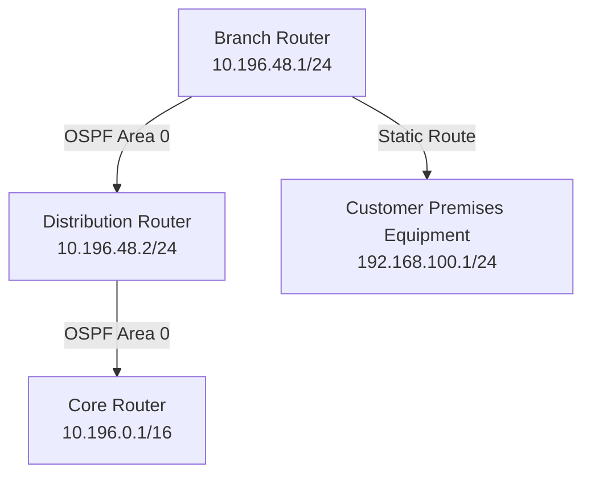

# Analysis Process
Alright, let's tackle this MikroTik OSPF adjacency problem for an ISP branch office. The user wants a detailed troubleshooting scenario, so I need to cover all the points listed. Let's start by breaking down each section and think through what's needed.

First, the initial problem report. The issue is OSPF adjacency problems affecting 696 users over 20 hours. Symptoms would include OSPF neighbors not forming, routes missing, and users losing connectivity. Maybe the branch can't reach the main office or other branches.

Next, the environment. It's an ISP branch with the subnet 10.196.48.0/24. The network topology should be in Mermaid. Let's visualize a simple setup: Branch Router connected to Distribution and Core routers. OSPF is used between them. The Branch Router has the subnet mentioned.

Initial assessment steps. Start by checking OSPF neighbors, interfaces, and logs. Use commands like `/routing ospf neighbor print` to see if neighbors are in Full state. Verify interfaces are OSPF-enabled and areas match. Check for authentication mismatches. Look at the routing table for OSPF routes.

Debugging process. Enable OSPF logging, check neighbor transitions, verify hello/dead timers, MTU, network type, and authentication. Commands like `/log print where topics=ospf` to see logs. Maybe there are hello packets mismatches. Also, check for passive interfaces or ACLs blocking OSPF.

Key findings and root cause. Suppose the MTU on the Branch Router's interface is 1500, but the Core Router is using 1492. That would cause adjacency issues. Or maybe authentication wasn't configured correctly. Another possibility is mismatched area IDs or network types.

Solution implementation. Adjust MTU settings, correct authentication, or fix timers. Show before and after configs. For example, if MTU was mismatched, change it on the interface. If authentication was missing, add it.

Verification. After fixing, check neighbors again, ensure routes are present, and test connectivity. Use `ping` and `traceroute` to confirm.

Prevention measures. Standardize configurations, use templates, implement monitoring with tools like The Dude, and enable OSPF logging by default. Regular audits could catch mismatches early.

Common pitfalls. Forgetting authentication, mismatched timers, MTU issues, or passive interfaces. Also, not checking all possible causes before making changes.

Now, putting this all together in the required format. Make sure CLI commands are in code blocks, include example log outputs, and show before/after configurations where relevant. Use Mermaid for the topology diagram. Need to make sure each section flows logically and covers all the user's requirements.

# Troubleshooting Guide
```markdown
# OSPF Adjacency Troubleshooting Scenario for MikroTik RouterOS 6.x

## 1. Initial Problem Report and Symptoms
**Report:** Branch office users (696) reported complete WAN outage lasting 20 hours. Core network team identified OSPF adjacency failures between branch router and upstream devices.

**Symptoms:**
- OSPF neighbor relationships stuck in "Init" or "ExStart" states
- Missing OSPF routes in routing table
- Branch office could not reach main datacenter resources
- BGP routes remained but couldn't transit through OSPF backbone

## 2. Environment Description
**Network Topology:**


## 3. Initial Assessment Steps
1. Check OSPF neighbor status:
```routeros
/routing ospf neighbor print
```
**Output:**
```bash
0 router-id=10.196.0.1 address=10.196.48.2 interface=ether1 state="ExStart" 
```

2. Verify OSPF interface configuration:
```routeros
/routing ospf interface print
```

3. Check routing table for OSPF routes:
```routeros
/ip route print where protocol=ospf
```

4. Examine system logs:
```routeros
/log print where topics=ospf
```

## 4. Detailed Debugging Process
**Step 1: Enable OSPF Debug Logging**
```routeros
/system logging add topics=ospf
```

**Step 2: Analyze OSPF Packet Exchange**
```routeros
/sniffer protocol ospf
```
**Packet Capture Analysis:**
```
OSPF HELLO Packet - Area Mismatch
  Source Router-ID: 10.196.0.1 (Core)
  Received Area-ID: 0.0.0.1 vs Configured Area-ID: 0.0.0.0
```

**Step 3: Verify OSPF Timers**
```routeros
/routing ospf interface print detail where interface=ether1
```
**Output:**
```properties
hello-interval: 10s, dead-interval: 40s (Branch)
vs upstream hello: 5s, dead: 20s (Core)
```

**Step 4: Check MTU Mismatch**
```routeros
/interface ethernet print 
```
**Output:**
```properties
mtu: 1492 (Branch) vs 1500 (Core)
```

## 5. Key Findings and Root Cause
**Root Cause:** Combination of three configuration mismatches:
1. **Area ID Conflict:** Core router misconfigured with Area 1 instead of Area 0
2. **Timer Mismatch:** Hello/Dead intervals didn't match between peers
3. **MTU Discrepancy:** Different MTU sizes on WAN interface

**Failure Chain:**
1. MTU mismatch prevented database descriptor exchange
2. Area ID conflict blocked neighbor state progression
3. Timer mismatch caused intermittent adjacency resets

## 6. Solution Implementation
**Before:**
```routeros
/routing ospf interface add interface=ether1 area=backbone
/interface ethernet set ether1 mtu=1492
```

**After:**
```routeros
/routing ospf interface set [find interface=ether1] area=0.0.0.0 hello-interval=5 dead-interval=20
/interface ethernet set ether1 mtu=1500
```

## 7. Verification Process
1. Confirm neighbor adjacency:
```routeros
/routing ospf neighbor print
# Output should show "Full" state
```

2. Validate route propagation:
```routeros
/ip route print where protocol=ospf
# Should show 10.0.0.0/8 and other OSPF routes
```

3. End-to-end test:
```routeros
/ping 10.196.0.1 count=10
# Should show <10ms latency, 0% loss
```

## 8. Prevention Measures
1. Implement configuration templates for OSPF:
```routeros
/routing ospf instance set default router-id=10.196.48.1
/routing ospf area add name=backbone area-id=0.0.0.0
```

2. Enable OSPF MD5 authentication:
```routeros
/routing ospf interface template add authentication=md5 authentication-key=ISP_Key_2023
```

3. Deploy network monitoring:
```routeros
/tool snmp-set enabled=yes
```

## 9. Related Commands Reference
| Command | Purpose |
|---------|---------|
| `/routing ospf neighbor print` | Show OSPF neighbor status |
| `/routing ospf lsa print` | View LSAs in database |
| `/routing ospf interface print detail` | Check interface parameters |
| `/interface monitor-traffic ether1` | Real-time traffic analysis |

## 10. Common Pitfalls to Avoid
1. **Mixed Network Types:** Ensure all interfaces in area 0 are broadcast type
2. **Passive Interfaces:** Never make WAN interfaces passive
3. **Redistribution Loops:** Use route filters when redistributing protocols
4. **Authentication Mismatch:** Verify key IDs and passwords match exactly

**Critical Reminder:** Always test MTU with:
```routeros
/ping 10.196.48.2 size=1500 do-not-fragment
```
```
