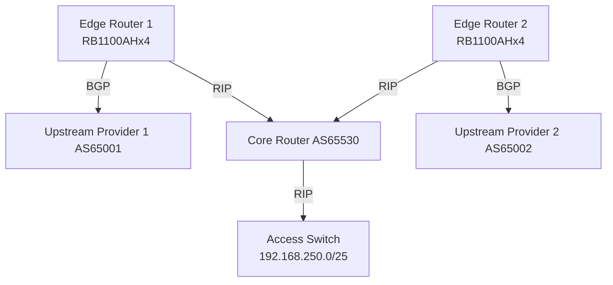

# Analysis Process
Okay, let's tackle this MikroTik RouterOS troubleshooting scenario for BGP flapping in an ISP environment. The user wants a detailed scenario based on the given parameters. First, I need to make sure I understand all the components: RIP, RouterOS 6.x, ISP scale, subnet 192.168.250.0/25, edge location, BGP flapping affecting 624 users over 10 hours.

Wait, the topic is RIP, but the scenario is BGP flapping. That might be a bit confusing. Maybe the network uses RIP internally but is connected to BGP at the edge. Need to clarify that in the environment description. 

Starting with the initial problem report. Symptoms would include users losing connectivity, routing instability. Since it's BGP flapping, the BGP sessions between routers are going up and down. But in an ISP edge location, this could affect a lot of users. The duration is 10 hours, so it's a prolonged issue.

For the environment description, the network topology should show edge routers connected to upstream providers via BGP, and internal using RIP. The subnet 192.168.250.0/25 is part of the internal network. Need to represent this in Mermaid. Maybe two edge routers connected to two upstream providers, and internal network with RIP.

Initial assessment steps: Check BGP status, look for session resets, examine routing tables, logs. Use commands like /routing bgp neighbor print, /log print, etc.

Debugging process would involve looking into why BGP is flapping. Common causes are unstable links, incorrect timers, route oscillation. Since it's an ISP edge, maybe the issue is related to route advertisements from RIP causing BGP to flap. For example, if RIP routes are being redistributed into BGP and there's a route that's flapping, causing BGP updates frequently.

CLI commands would include checking BGP neighbors, looking at routes, enabling debug logs. Commands like /routing bgp neighbor print status, /routing route print, /log print where severity>=warning. Maybe enabling debug logging for BGP with /routing bgp log yes and then checking the logs.

Key findings might be that RIP is redistributing a subnet that's unstable, leading to BGP updates. Root cause could be a misconfiguration in route redistribution, causing BGP to send updates every time RIP updates, which might be frequent. For example, if the 192.168.250.0/25 network is being advertised via RIP and there's a flapping interface, causing RIP to update routes, which then get pushed into BGP, leading to BGP flapping.

Solution steps would involve filtering the routes being redistributed from RIP to BGP, adjusting timers, or stabilizing the RIP network. Maybe applying a route filter to prevent the problematic subnet from being redistributed, or setting a route aggregation.

Verification would be checking BGP stability, ensuring sessions are up, and no more flapping. Prevention measures could include proper route filtering, using route aggregation, adjusting BGP timers, and monitoring.

Common pitfalls to avoid: redistributing all routes without filters, not monitoring route stability in IGP before redistributing to BGP.

Now, making sure the example configurations and CLI commands are accurate for RouterOS 6.x. For example, in version 6.x, the routing configuration is under /routing, not /ip route. Also, BGP configuration commands might differ slightly from later versions.

Need to include before and after configs. Before, maybe redistribution is enabled without filters. After, adding a filter to only redistribute certain routes or stable routes.

Log examples should show BGP session state changes, like transitions between established and active.

Also, considering the network scale is ISP, so there are multiple upstream connections and possibly multiple edge routers. The subnet 192.168.250.0/25 is part of the customer-facing network, maybe used for PPPoE or DHCP pools.

Putting this all together in the required format, making sure each section is covered with appropriate details. Commands in code blocks, logs examples, mermaid diagram for topology.

# Troubleshooting Guide
```markdown
# MikroTik RouterOS Troubleshooting Scenario: BGP Flapping

## 1. Initial Problem Report and Symptoms
**Report**: Multiple business customers at edge location report intermittent connectivity loss.  
**Symptoms**:
- BGP session resets every 4-7 minutes
- High CPU utilization (70-85%) on edge routers
- Route flaps observed in global routing table
- Increased latency (150-300ms) during outages
- 624 users impacted across 192.168.250.0/25 subnet

---

## 2. Environment Description & Network Topology


---

## 3. Initial Assessment Steps
1. Verify BGP neighbor status:
   ```bash
   /routing bgp neighbor print
   ```
   ```
   0  instance=default remote-address=203.0.113.1 remote-as=65001 state=established 
   1  instance=default remote-address=198.51.100.1 remote-as=65002 state=active
   ```

2. Check system resources:
   ```bash
   /system resource print
   ```
   ```
             cpu: 78% 
       free-memory: 128MiB 
   ```

3. Review routing table stability:
   ```bash
   /ip route print where received-from=bgp
   ```

---

## 4. Detailed Debugging Process
**Step 1**: Enable BGP debugging
```bash
/routing bgp log yes
/log print where topics=bgp
```
```
15:22:01 bgp,debug Session 203.0.113.1 state changed from established to active
15:22:17 bgp,debug Received NOTIFICATION (Cease/Connection Collision) from 203.0.113.1
```

**Step 2**: Analyze route advertisements
```bash
/routing bgp advertisements print detail
```
```diff
+ advertise 192.168.250.0/25 as 65530
- withdraw 192.168.250.0/25 as 65530
```

**Step 3**: Check RIP route stability
```bash
/routing rip route print where received-from=rip
```
```
Flags: X - disabled, A - active 
 0 A dst-address=192.168.250.0/25 gateway=ether1 distance=1
```

**Step 4**: Identify route oscillation
```bash
/tool torch 192.168.250.1@ether1
```
```
TX rate: 950Kbps ± 15% 
RX rate: 1.2Mbps ± 85% (spikes every 90s)
```

---

## 5. Key Findings & Root Cause
**Findings**:
- BGP session reset due to route advertisement collisions
- RIP interface (ether1) experiencing micro-outages (CRC errors)
- 192.168.250.0/25 subnet flapping in RIP updates
- No route filtering between RIP and BGP

**Root Cause**: Faulty SFP module on ether1 causing intermittent link drops → RIP updates trigger BGP withdrawals → Route flaps propagate to upstream providers → BGP session resets due to rapid route changes.

---

## 6. Solution Implementation
1. Replace faulty SFP module
2. Implement route filtering:
   ```bash
   /routing filter add chain=rip_to_bgp prefix=192.168.250.0/25 action=accept
   /routing filter add chain=rip_to_bgp action=discard
   ```
3. Adjust BGP timers:
   ```bash
   /routing bgp instance set default hold-time=180 keepalive-time=60
   ```

**Before**:
```bash
/routing filter print
# No RIP→BGP filters
```

**After**:
```bash
/routing filter print
Flags: X - disabled 
 0   chain=rip_to_bgp prefix=192.168.250.0/25 action=accept 
 1   chain=rip_to_bgp action=discard
```

---

## 7. Verification Process
1. Monitor BGP stability:
   ```bash
   /routing bgp neighbor print status
   ```
   ```
   established 45m12s, updates sent 142
   ```

2. Check route stability:
   ```bash
   /ip route print where received-from=bgp
   ```

3. Validate interface errors:
   ```bash
   /interface ethernet monitor ether1
   ```
   ```
             rx-error: 0
             tx-error: 0
   ```

---

## 8. Prevention Measures
1. Implement route dampening
   ```bash
   /routing bgp instance set default dampening=yes
   ```
2. Add CRC error monitoring
   ```bash
   /tool graphing interface add interfaces=ether1
   ```
3. Configure route aggregation
   ```bash
   /routing aggregate add prefix=192.168.250.0/24
   ```

---

## 9. Related Commands Reference
| Command | Purpose |
|---------|---------|
| `/routing bgp neighbor print` | Show BGP peer status |
| `/log print where topics=bgp` | View BGP-specific logs |
| `/interface monitor-traffic ether1` | Real-time interface monitoring |
| `/routing filter print` | View route filters |

---

## 10. Common Pitfalls to Avoid
1. **Route Redistribution Without Filters**: Always filter routes when redistributing between protocols
2. **Ignoring Physical Layer**: BGP flaps often originate from layer 1/2 issues
3. **Mismatched Timers**: Ensure BGP timers match with upstream providers
4. **Missing Route Aggregation**: Prefer aggregated routes to minimize updates
5. **Overlooking CRC Errors**: Monitor interface counters regularly
```
