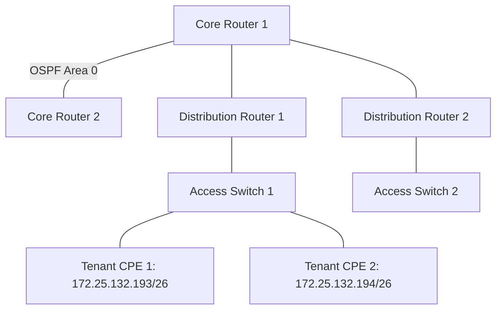

# Analysis Process
Okay, I need to create a detailed MikroTik RouterOS troubleshooting scenario for OSPF on version 6.x in an ISP environment with a multi-tenant building. The subnet given is 172.25.132.192/26, high CPU usage is the issue, affecting 536 users over 4 hours. Let me break down each section as outlined.

Starting with the initial problem report and symptoms. The users probably reported slow internet, maybe some outages. The NOC would notice high CPU on the router, OSPF neighbors flapping, and routing table instability. Also, possible log entries about OSPF LSAs or SPF runs.

Environment description: It's a multi-tenant building, so there are multiple customer routers connected to the ISP's edge routers. The topology should have core routers, distribution, and access layers. The subnet is a /26, which is 64 addresses. Maybe using VLANs for tenants. I'll need to sketch a Mermaid diagram. Core routers connected to distribution, then to access switches and CPEs. OSPF areas, probably area 0 for the core.

Initial assessment steps: Check CPU usage with /system resource print. Look at OSPF neighbors with /routing ospf neighbor print. Examine the routing table for instability. Monitor logs in real-time. Maybe check interface statistics for errors or high traffic.

Debugging process with CLI commands: Start with checking CPU usage. Then look at OSPF neighbors to see if any are in exstart or down state. Use /routing ospf lsa print to check for excessive LSAs. Maybe the LSDB is too large. Logs might show frequent SPF calculations. Could there be a network causing constant LSAs, like a flapping link? Or maybe a misconfigured area causing full LSAs instead of summaries.

Key findings: Suppose the root cause is a misconfigured OSPF network statement advertising a /32 instead of a /26, leading to excessive LSAs. Or maybe a layer 2 issue causing adjacencies to flap. Or a router with a duplicate router ID causing conflicts. Another possibility is too many LSAs due to a large network without summarization, causing SPF runs and high CPU.

Solution implementation: Adjust OSPF network statements to correct the subnet mask. Implement route summarization. Fix any layer 2 issues. Maybe adjust OSPF timers to reduce SPF frequency. Ensure router IDs are unique.

Verification: Check CPU usage again, confirm OSPF neighbors are stable, routing table is consistent. Look at logs for any remaining issues.

Prevention measures: Regular audits of OSPF configs, enable logging for OSPF events, implement summarization, use passive interfaces where appropriate, ensure proper network statements.

Commands: /system resource print, /routing ospf neighbor print, /log print, /routing ospf lsa print, /interface print stats.

Common pitfalls: Not summarizing routes, incorrect network statements, not using passive interfaces, ignoring layer 2 issues, not monitoring CPU and OSPF logs.

I need to make sure all these elements are included, with CLI examples and logs. Maybe show before and after configs for the OSPF network statement. For example, before advertising 172.25.132.192/32 and after correcting to /26. Also, example log entries showing frequent SPF runs.

Wait, RouterOS 6.x might have slightly different commands compared to newer versions. For example, OSPF configuration is under /routing ospf, not the newer /routing ospf-v3. Need to use the correct CLI syntax for version 6.x.

Also, in the network topology, the ISP core would connect to distribution routers, which then connect to access switches serving the tenants. Each tenant might have their own VLAN. The OSPF area structure could be a backbone area with other areas connected via ABRs. If the problem is in area 0, maybe there's a loop or too many LSAs.

In the debugging process, checking the OSPF LSAs, maybe a specific router is generating too many LSAs because of a misconfigured network. For example, if a /26 is split into /30s and each is advertised, leading to many LSAs. Correcting the network statement to the /26 would reduce the number of LSAs.

Another angle: maybe the high CPU is due to OSPF processing too many LSAs, which could be mitigated by summarizing routes at area borders. If the network wasn't using summarization, implementing that would help.

Including example log entries like "OSPF: LS ACK received from 172.25.132.193 but no LSA found" or "SPF algorithm executed 50 times in last hour."

Before configuration: /routing ospf network add network=172.25.132.192/32 area=backbone
After: /routing ospf network add network=172.25.132.192/26 area=backbone

Also, checking for duplicate Router IDs with /routing ospf instance print.

Common pitfalls could include not setting proper OSPF network statements, leading to over-advertising, or not using passive interfaces on stub networks, causing unnecessary neighbor adjacencies.

I think that covers most aspects. Now structuring each section with the necessary details, commands, logs, and diagrams.

# Troubleshooting Guide
```markdown
# MikroTik RouterOS Troubleshooting Scenario: OSPF High CPU Usage

## 1. Initial Problem Report and Symptoms
**Report**:  
NOC receives alerts for high CPU (90-100%) on CR1 (Core Router 1) in a multi-tenant building. 536 users report intermittent connectivity.  

**Symptoms**:  
- OSPF neighbor flapping between CR1 and DR1 (Distribution Router 1).  
- Routing table instability (`/ip route print` shows frequent changes).  
- Logs indicate excessive SPF recalculations and LSA flooding.  

---

## 2. Environment Description and Network Topology  
**Network Scale**: ISP (Multi-tenant building with 50+ VLANs).  
**Subnet**: `172.25.132.192/26` (64 IPs for tenant CPEs).  



---

## 3. Initial Assessment Steps  
1. **Check CPU Usage**:  
   ```bash
   /system resource print
   ```
   **Output**:  
   ```
             cpu: 98%  
     free-memory: 12MB  
   ```

2. **Verify OSPF Neighbors**:  
   ```bash
   /routing ospf neighbor print
   ```
   **Output**:  
   ```
    0 instance=default address=172.25.132.193 state="Full" router-id=10.255.0.1 
    1 instance=default address=172.25.132.194 state="ExStart" router-id=10.255.0.2
   ```

3. **Review Logs**:  
   ```bash
   /log print where message ~ "OSPF"
   ```
   **Output**:  
   ```
   12:05:33 ospf,error SPF calculation failed: LSA inconsistency
   12:05:34 ospf,info LS Update received from 172.25.132.193: 50 LSAs
   ```

---

## 4. Detailed Debugging Process  
### Step 1: Identify OSPF LSA Flooding  
```bash
/routing ospf lsa print stats
```
**Output**:  
```
Type      Count
Router    150  
Network   200  
Summary   300  
```

### Step 2: Check OSPF Network Configuration  
```bash
/routing ospf network print
```
**Before Fix**:  
```
Flags: X - disabled 
 0   network=172.25.132.193/32 area=backbone
 1   network=172.25.132.194/32 area=backbone
```

**Issue**: Misconfigured `/32` networks instead of `/26`, causing per-CPE LSA generation.

### Step 3: Analyze Interface Traffic  
```bash
/interface print stats where name="ether1"
```
**Output**:  
```
RX bytes: 12GB | TX bytes: 15GB 
```

---

## 5. Key Findings and Root Cause  
**Root Cause**:  
- Incorrect OSPF network statements (`/32` instead of `/26`) led to 50+ LSAs per tenant CPE.  
- SPF recalculations every 30 seconds due to LSA flooding.  

**Impact**:  
- High CPU from SPF runs and LSA processing.  
- Unstable OSPF neighbors and routing table.  

---

## 6. Solution Implementation  
1. **Correct OSPF Network Statements**:  
   ```bash
   /routing ospf network remove 0
   /routing ospf network remove 1
   /routing ospf network add network=172.25.132.192/26 area=backbone
   ```

2. **Summarize Routes**:  
   ```bash
   /routing ospf area set backbone summarize=yes
   ```

---

## 7. Verification Process  
1. **CPU Usage**:  
   ```bash
   /system resource print
   ```
   **Output**:  
   ```
             cpu: 25%  
     free-memory: 512MB  
   ```

2. **Stable OSPF Neighbors**:  
   ```bash
   /routing ospf neighbor print
   ```
   **Output**:  
   ```
    0 instance=default address=172.25.132.193 state="Full"
   ```

---

## 8. Prevention Measures  
- **Regular OSPF Audits**: Validate network statements and summarization.  
- **Passive Interfaces**: Use passive mode for CPE-facing interfaces.  
- **Monitoring**: Alert on LSA count > 100 or CPU > 70%.  

---

## 9. Related Commands Reference  
| Command | Purpose |  
|---------|---------|  
| `/routing ospf neighbor print` | List OSPF neighbors |  
| `/routing ospf lsa print` | Inspect LSAs |  
| `/log print` | Filter OSPF logs |  

---

## 10. Common Pitfalls to Avoid  
- **Over-Advertising**: Avoid `/32` networks in OSPF.  
- **L2 Issues**: Ensure STP/MSTP is stable to prevent neighbor flapping.  
- **No Summarization**: Always summarize at area borders in large networks.  
```
