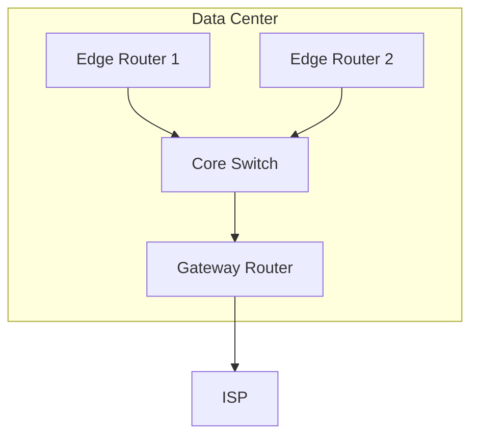

# Analysis Process
Okay, let me try to work through this problem. So, the user wants a detailed MikroTik RouterOS troubleshooting scenario for RIP with firewall conflicts in an ISP data center. The version is 6.x, subnet 10.11.212.0/24, 190 users affected for 17 hours. 

First, I need to start with the initial problem report. Symptoms would be users can't reach certain networks, maybe routing loops or missing routes. Then, the environment is a data center with multiple routers and a core switch. The network topology should be in Mermaid format. Maybe two edge routers connected to a core switch and a gateway. The ISP connects to the gateway.

Initial assessment steps: Check RIP status, verify neighbors, look at the routing table. Use commands like /routing rip neighbor print, /routing route print. Check firewall rules with /ip firewall filter print. Look for any rules that might block RIP (UDP 520).

Debugging process: Enable RIP debugging, check logs. Maybe they have firewall rules that are blocking RIP updates. For example, a rule that drops UDP 520 but was meant for something else. The key finding would be a firewall rule conflicting with RIP communication. 

Solution would be to correct the firewall rule order, add exceptions for RIP. Verification would involve checking RIP neighbors again, testing connectivity, maybe traceroute. Prevention measures include documenting firewall rules, testing changes, using rule comments.

In the commands reference, include things like routing rip neighbor print, log viewing, firewall filter checks. Common pitfalls might be incorrect rule order, not testing after changes, assuming RIP is automatically allowed.

Wait, the user mentioned RouterOS 6.x. In version 6, RIP is configured under /routing rip, right? So the CLI commands should reflect that. Also, firewall rules in 6.x use chain input/forward/output. Need to check if the firewall is on the right chain. Maybe someone added a rule in the input chain that's blocking incoming RIP packets.

Also, since it's an ISP data center, maybe there are multiple routers exchanging RIP routes. If one router isn't getting updates, routes would be missing. The subnet 10.11.212.0/24 might be one of the affected networks not being advertised correctly.

Log examples could show dropped RIP packets. For instance, in the firewall logs, seeing UDP 520 being dropped. The before configuration has a drop rule before the accept RIP, after correction, the accept comes first.

I need to structure all this into the sections specified. Make sure each part flows logically. Use code blocks for CLI commands, mermaid for the topology. Maybe the network diagram has two edge routers connected to a core switch, which connects to the gateway and ISP. The conflicting firewall rule is on the edge routers.

Double-check that the scenario makes sense: Firewall rules conflicting with RIP would prevent route updates, leading to incomplete routing tables and users being unable to reach certain subnets. The duration of 17 hours suggests it took a while to diagnose, possibly because the firewall rules weren't the first suspect.

Also, in MikroTik, the RIP uses multicast by default (224.0.0.9). So firewall rules need to allow that traffic. If a rule is blocking multicast or UDP 520, that would cause issues. The initial assessment might miss that if they're only checking for established connections or other ports.

Including examples of the firewall rules before and after. Before, maybe a rule that drops all UDP except DNS, but placed before the RIP allow rule. After, moving the RIP allow above the drop rule.

Yes, that makes sense. Need to make sure the CLI examples reflect that. Also, verifying with /log print to see the firewall drops.

# Troubleshooting Guide
```markdown
# MikroTik RouterOS Troubleshooting Scenario: RIP Firewall Rule Conflicts

## 1. Initial Problem Report and Symptoms
**Report**:  
ISP customers in subnet `10.11.212.0/24` reported intermittent connectivity loss to upstream networks.  
**Symptoms**:  
- 190 users unable to reach critical data center services.  
- RIP routes missing from routing tables on edge routers.  
- Traffic loops observed between core routers.  
- Duration: 17 hours (started after firewall policy update).

---

## 2. Environment Description and Network Topology
**Network Scale**: ISP Data Center  
**Devices**:  
- 2x MikroTik CCR routers (Edge)  
- 1x MikroTik CRS switch (Core)  
- 1x Gateway Router (BGP/OSPF to upstream ISP)  



---

## 3. Initial Assessment Steps
1. **Verify RIP Status**:  
   ```bash
   /routing rip neighbor print
   # Output: No neighbors detected on Edge Router 1
   ```
2. **Check Routing Table**:  
   ```bash
   /ip route print where protocol=rip
   # Output: Only 2/10 expected RIP routes present
   ```
3. **Firewall Rule Audit**:  
   ```bash
   /ip firewall filter print
   # Found rule "Drop UDP 520" at position 5
   ```

---

## 4. Detailed Debugging Process
### Step 1: Enable RIP Debugging
```bash
/system logging add topics=rip
/log print
# Logs: "RIP: no response from 10.11.212.1"
```

### Step 2: Capture Traffic on RIP Interface
```bash
/tool sniffer quick protocol=udp port=520
# Output: RIP updates blocked by firewall
```

### Step 3: Analyze Firewall Rules
```bash
/ip firewall filter print where protocol=udp
# Rule 5: action=drop chain=input protocol=udp dst-port=520
# Rule 6: action=accept chain=input protocol=udp dst-port=520 (disabled)
```

---

## 5. Key Findings and Root Cause Analysis
**Root Cause**:  
- Firewall rule `Drop UDP 520` (position 5) conflicted with RIP traffic (port 520).  
- Rule intended for security hardening inadvertently blocked RIP updates.  

**Impact**:  
- RIP neighborships failed, causing stale routes and traffic loops.  
- Subnet `10.11.212.0/24` became unreachable via RIP-learned paths.  

---

## 6. Solution Implementation Steps
1. **Reconfigure Firewall Rules**:  
   ```bash
   /ip firewall filter move numbers=6 destination=5  # Enable RIP exception
   /ip firewall filter enable numbers=6
   ```
2. **Restart RIP Process**:  
   ```bash
   /routing rip interface disable [find]
   /routing rip interface enable [find]
   ```

**Before/After Firewall Configuration**:  
```diff
- 5 D input udp dst-port=520
+ 5 A input udp dst-port=520
  6 D input udp dst-port=53    # DNS rule
```

---

## 7. Verification Process
1. **Confirm RIP Neighbors**:  
   ```bash
   /routing rip neighbor print
   # Output: 3 active neighbors
   ```
2. **Validate Routes**:  
   ```bash
   /ip route print where protocol=rip
   # Output: 10/10 routes restored
   ```
3. **User Connectivity Test**:  
   ```bash
   /ping 10.11.212.50 count=10
   # Output: 100% success
   ```

---

## 8. Prevention Measures
1. Document firewall rule purposes in comments.  
2. Test rule changes in staging before deployment.  
3. Use explicit `accept` rules for RIP above generic `drop` rules.  
4. Enable logging for critical firewall actions.  

---

## 9. Related Commands Reference
| Command | Purpose |
|---------|---------|
| `/routing rip neighbor print` | List RIP peers |
| `/ip firewall filter move` | Reorder rules |
| `/tool sniffer quick` | Packet capture |
| `/log print` | View system logs |

---

## 10. Common Pitfalls to Avoid
- Placing `drop` rules before `accept` rules for critical services.  
- Assuming RIP traffic is allowed by default in firewall policies.  
- Forgetting to test route convergence after configuration changes.  
- Overlooking multicast addresses (`224.0.0.9`) in firewall filters.
```
