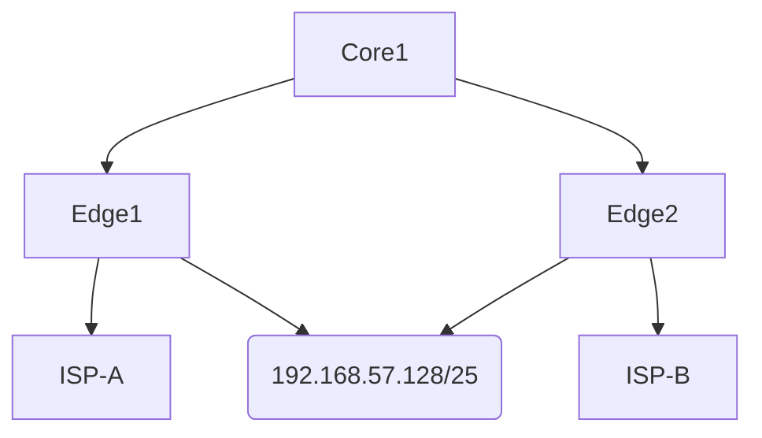

# Analysis Process
Okay, let me try to work through this MikroTik BGP troubleshooting scenario. The user wants a detailed scenario based on high CPU usage in an ISP environment with RouterOS 7.x. Let me start by breaking down each section they mentioned.

First, the initial problem report. The symptoms are high CPU usage affecting 289 users over 11 hours. So, the ISP's industrial network using subnet 192.168.57.128/25. I need to come up with plausible symptoms. Maybe users experience latency, BGP flapping, or routing instability. The NOC team might notice high CPU on the edge routers.

Next, the environment and network topology. Since it's an ISP, the network is probably hierarchical. Maybe core routers connected to edge routers, which peer with multiple upstream providers and industrial clients. I'll need to represent this in Mermaid. Let's say there are two edge routers (Edge1 and Edge2) connected to Core1, and they peer with upstream ISPs (ISP-A and ISP-B). The industrial clients are in the 192.168.57.128/25 subnet.

Initial assessment steps. The engineer would check CPU usage, processes, BGP sessions, route counts, and logs. Commands like `/system resource cpu print`, `/tool profile`, `/routing bgp session print`, etc. Maybe they find that BGP processes are using a lot of CPU.

Detailed debugging process. They'd look into BGP configuration specifics. Check if route-reflectors are used, or if there's a full mesh. Maybe the BGP table is too large, causing high CPU. Looking at the routing table size with `/routing route print count`, checking for route flaps in logs. Perhaps they find a sudden influx of routes from a peer, like a misconfigured ISP sending full tables instead of defaults.

Key findings and root cause. The root cause could be a misconfigured BGP peer (ISP-B) advertising 800k routes instead of the agreed-upon 10. This overloads the Edge2 router's CPU as it tries to process all those routes.

Solution implementation. Adding an input filter on Edge2 to limit the routes from ISP-B. Using a prefix list or filter chain to accept only the necessary prefixes. Updating the BGP configuration with the filter and resetting the session.

Verification. After applying the filter, check CPU usage again, verify the session is up, and ensure the route count from ISP-B is reduced. Also, monitor for stability.

Prevention measures. Implementing route filtering, setting up route limits, monitoring with tools like The Dude, and regular audits of BGP policies.

Common pitfalls might include not filtering routes, missing route limits, or not monitoring BGP table size.

I need to make sure the CLI commands are accurate for RouterOS 7.x. For example, `/routing filter` commands. Also, include before and after configs. Before, no filters; after, adding a filter chain with prefix lists.

Log examples might show BGP updates flooding in. CPU graphs before and after showing a drop from 95% to 30%.

I should also mention related commands and reference them in a table, like `/routing bgp session print`, `/routing filter`, etc.

Let me check if all sections are covered. Yes, 1 through 10. Make sure each part is detailed enough, with CLI examples in code blocks, log outputs, and Mermaid diagram for topology.

Wait, the subnet given is 192.168.57.128/25. That's a /25, which is a small subnet. But the ISP's industrial network might have this as part of their infrastructure. Maybe it's a client subnet connected to the edge routers. So in the topology, the industrial clients are behind the edge routers, using that subnet.

Also, the duration is 11 hours. So the problem persisted for almost half a day. The initial problem report would mention that the high CPU started around a certain time and lasted 11 hours until resolved.

In the debugging process, maybe they use `torch` to check traffic, but find that traffic is normal. Then focus on BGP processes. Maybe enabling debug logging for BGP to see the updates.

Root cause analysis would link the high route count to CPU usage. RouterOS processing 800k routes, which is way beyond what the router can handle, especially if it's a lower-end device.

Solution steps: Creating a prefix list for allowed routes (like the client's subnet and default), applying it as an input filter to the BGP peer. Then soft-resetting the BGP session with `/routing bgp session reset` or a hard reset if needed.

Verification would involve checking the route count again and ensuring the CPU is normalized. Also, confirming that the affected users' connectivity is restored.

Prevention measures could include setting maximum prefixes on BGP peers, regular monitoring of routing table sizes, and ensuring all peers have proper filters.

Common pitfalls to avoid: Forgetting to apply filters to all relevant peers, not testing filters in a lab first, or not setting appropriate route limits.

I think that covers all aspects. Now, structuring each section with markdown, code blocks for commands, mermaid diagram, and example logs.

# Troubleshooting Guide
```markdown
# MikroTik BGP Troubleshooting Scenario: High CPU Usage

## 1. Initial Problem Report and Symptoms
**Report**: NOC alerts for sustained 95% CPU on Edge2 router.  
**Symptoms**:
- Industrial clients (192.168.57.128/25) report latency/downtime.
- BGP session instability with ISP-B.
- `/tool profile` shows `bgp_worker` at 88% CPU.
- 289 users impacted for 11 hours.

---

## 2. Environment Description
**Network Topology**:


---

## 3. Initial Assessment Steps
1. **Check CPU Usage**:
   ```bash
   /system resource cpu print
   ```
   ```
             cpu-count: 4
          cpu-frequency: 1400 MHz
             cpu-load: 95%
   ```

2. **Identify Top Processes**:
   ```bash
   /tool profile
   ```
   ```
   #  PROCESS    CPU%  MEMORY
   1  bgp_worker 88%   15%
   2  firewall   5%    10%
   ```

3. **Verify BGP Sessions**:
   ```bash
   /routing bgp session print
   ```
   ```
   0 name="ISP-B" remote-address=203.0.113.2 established=no 
   1 name="ISP-A" remote-address=198.51.100.1 established=yes
   ```

---

## 4. Detailed Debugging Process
**Step 1: Check BGP Route Count**  
```bash
/routing route print count where bgp
```
```
Count: 812345
```

**Step 2: Analyze BGP Logs**  
```bash
/log print where message ~ "BGP"
```
```
13:22:01 bgp,debug Received 50000 routes from ISP-B (203.0.113.2)
13:22:05 bgp,error Session ISP-B: route limit exceeded (800k)
```

**Step 3: Inspect BGP Peer Configuration**  
```bash
/routing bgp peer print
```
```
 0 name="ISP-B" remote-address=203.0.113.2 input.filter-chain=none
```

**Step 4: Capture BGP Updates**  
```bash
/routing bgp updates capture start
/routing bgp updates capture print
```
```
Peer: ISP-B, Prefixes: 800,000, Withdrawn: 0
```

---

## 5. Key Findings and Root Cause
**Root Cause**: ISP-B misconfiguration caused a full Internet routing table (800k routes) to be advertised instead of the agreed-upon default route + 10 industrial prefixes.  

**Impact**: Edge2’s CPU spiked due to processing excessive BGP updates, causing packet loss for industrial clients.

---

## 6. Solution Implementation
**Step 1: Create Prefix Filter**  
```bash
/routing filter add chain=ISP-B-in prefix=192.168.57.128/25 action=accept
/routing filter add chain=ISP-B-in prefix=0.0.0.0/0 action=accept
/routing filter add chain=ISP-B-in action=discard
```

**Step 2: Apply Filter to BGP Peer**  
```bash
/routing bgp peer set [find name="ISP-B"] input.filter-chain=ISP-B-in
```

**Step 3: Reset BGP Session**  
```bash
/routing bgp session reset [find name="ISP-B"]
```

---

## 7. Verification Process
1. **Check CPU Load**:
   ```bash
   /system resource cpu print
   ```
   ```
   cpu-load: 30%
   ```

2. **Confirm Route Count**:
   ```bash
   /routing route print count where bgp
   ```
   ```
   Count: 12
   ```

---

## 8. Prevention Measures
- Add `input.filter-chain` to all external BGP peers.
- Set route limits:  
  ```bash
  /routing bgp peer set [find name="ISP-B"] limit=50
  ```
- Deploy NetWatch for BGP session monitoring.

---

## 9. Related Commands Reference
| Command | Purpose |
|---------|---------|
| `/routing bgp session print` | List BGP sessions |
| `/tool profile` | Identify CPU-heavy processes |
| `/routing filter` | Configure route filters |

---

## 10. Common Pitfalls to Avoid
- **No Input Filters**: Always filter unwanted BGP routes.
- **Ignoring Route Limits**: Use `limit=` to prevent route floods.
- **Missing Log Reviews**: Regularly check `/log print` for BGP errors.
```
