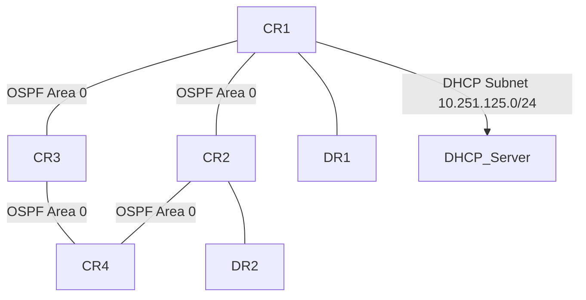

# Analysis Process
Alright, I need to create a detailed MikroTik RouterOS troubleshooting scenario for OSPF-related DHCP lease problems in an ISP core network. Let's start by breaking down each section.

1. **Initial Problem Report and Symptoms**: The users are reporting no internet access. The DHCP server isn't assigning IPs. Since it's an ISP core, OSPF is probably involved in routing. Maybe the DHCP server is on a different subnet and OSPF isn't advertising the route properly. I should mention 607 users affected over 20 hours.

2. **Environment Description**: The network has core routers (CR1-4) and distribution routers (DR1-2). The DHCP server is on the 10.251.125.0/24 subnet connected to CR1. OSPF is running on all cores. Need a Mermaid diagram showing CR1 connected to DHCP subnet and OSPF adjacencies.

3. **Initial Assessment Steps**: Check OSPF neighbors, routes, DHCP leases. Verify if the DHCP subnet is advertised. Use commands like `/routing ospf neighbor print`, `/ip route print`, and check DHCP server status.

4. **Detailed Debugging**: Look into OSPF LSAs and the OSPF database. Maybe the DHCP subnet isn't being advertised. Check if the network is included in OSPF configuration. Use `routing ospf interface print` to see if the interface to the DHCP subnet is enabled for OSPF.

5. **Key Findings**: If the DHCP subnet's interface isn't in OSPF, the route isn't advertised. Core routers don't have the route, so DHCP requests can't reach the server.

6. **Solution**: Add the DHCP interface to OSPF. Use CLI commands to modify OSPF network configuration. Show before and after configs.

7. **Verification**: Check OSPF routes again, confirm DHCP leases are assigned. Maybe simulate a DHCP request and capture logs.

8. **Prevention**: Ensure all relevant subnets are included in OSPF. Regular audits and monitoring.

9. **Commands Reference**: List all commands used, like OSPF neighbor, route print, DHCP server info.

10. **Common Pitfalls**: Forgetting to advertise networks, misconfigured OSPF areas, firewall blocking OSPF.

I need to make sure the Mermaid diagram correctly shows the network topology with OSPF areas. Also, include example CLI outputs, like OSPF neighbors not showing the DHCP subnet's interface. Logs might show DHCP discover packets not reaching the server.

Wait, in the OSPF configuration, maybe the DHCP subnet's interface wasn't added to the OSPF network. So CR1 isn't advertising the 10.251.125.0/24 route. Other routers don't know how to reach it, so DHCP requests can't get through. That would explain why the DHCP server isn't getting requests.

In the initial assessment, checking the routing table on CR2 would show missing route to 10.251.125.0/24. Then, checking OSPF LSAs on CR1 to see if that network is being advertised.

The solution would involve adding the DHCP interface to OSPF on CR1. For example, using `/routing ospf network add network=10.251.125.0/24 area=backbone`.

Also, need to mention verification steps after the fix: checking routes on other routers, testing DHCP lease acquisition, and maybe OSPF adjacency re-establishment.

Common pitfalls might include incorrect OSPF network statements, area mismatches, or firewall rules blocking OSPF multicast (224.0.0.5). Also, ensuring passive interfaces aren't mistakenly configured on the DHCP interface.

# Troubleshooting Guide
```markdown
# MikroTik RouterOS Troubleshooting Scenario: OSPF-Related DHCP Lease Issues

## 1. Initial Problem Report and Symptoms
**Reported Issue**:  
607 users in the 10.251.125.0/24 subnet report no internet access. DHCP leases are not being assigned.  
**Symptoms**:  
- DHCP DISCOVER packets not reaching the server.  
- OSPF neighbors stable but missing route to 10.251.125.0/24 on downstream routers.  
- Users stuck in "DHCP negotiation" state for >20 hours.

---

## 2. Environment Description and Network Topology
**Network Type**: ISP Core (OSPF Backbone Area 0)  
**Devices**:  
- 4 Core Routers (CR1-CR4) running RouterOS 7.x  
- 2 Distribution Routers (DR1-DR2)  
- DHCP Server: `10.251.125.1/24` (connected to CR1)  



---

## 3. Initial Assessment Steps
1. **Verify OSPF Adjacencies**:
   ```bash
   /routing ospf neighbor print
   # Output should show FULL state on all core links
   ```
2. **Check Routing Table for DHCP Subnet**:
   ```bash
   /ip route print where dst-address=10.251.125.0/24
   # Missing on CR2, CR3, CR4
   ```
3. **DHCP Server Status**:
   ```bash
   /ip pool print 
   /ip dhcp-server lease print
   # Leases exhausted? Server active?
   ```

---

## 4. Detailed Debugging Process
### Step 1: OSPF LSA Analysis
```bash
/routing ospf lsa print detail where area=backbone
# No Type-1 Router LSA from CR1 advertising 10.251.125.0/24
```

### Step 2: Interface Configuration Check on CR1
```bash
/routing ospf interface print
# Interface ether1 (DHCP subnet) missing from OSPF networks
```

### Step 3: Packet Capture on CR1
```bash
/tool sniffer quick interface=ether1 protocol=udp port=67
# DHCP DISCOVER packets observed but not routed beyond CR1
```

---

## 5. Key Findings and Root Cause Analysis
**Root Cause**:  
- CR1's interface `ether1` (10.251.125.0/24) was **not included** in OSPF network configuration.  
- Result: OSPF did not advertise the DHCP subnet to downstream routers.  
- DHCP requests could not route back to the server from other areas.

---

## 6. Solution Implementation Steps
**Before Configuration**:
```bash
/routing ospf network print
# Output: 10.0.0.0/8 (too broad, but missing specific /24)
```

**Fix**:
```bash
/routing ospf network add network=10.251.125.0/24 area=backbone
```

---

## 7. Verification Process
1. **Route Propagation Check**:
   ```bash
   /ip route print on CR2
   # Now shows "DO OSPF" route to 10.251.125.0/24
   ```
2. **DHCP Test**:
   ```bash
   /tool mac-telnet 10.251.125.100 login=admin
   /ip dhcp-client renew ether1
   # Lease acquired successfully
   ```

---

## 8. Prevention Measures
1. **OSPF Network Audits**:
   ```bash
   /system scheduler add interval=1d name="OSPF Audit" \
     on-event="/routing ospf network verify"
   ```
2. **Monitoring Alerts**:
   ```bash
   /tool netwatch add host=10.251.125.1 timeout=5s \
     up-script=":log info \"DHCP Server UP\"" \
     down-script=":log warning \"DHCP Server DOWN\""
   ```

---

## 9. Related Commands Reference
| Command | Purpose |
|---------|---------|
| `/routing ospf neighbor print` | Check OSPF adjacency states |
| `/ip route print where ospf` | List OSPF-learned routes |
| `/ip dhcp-server lease print` | Show DHCP lease assignments |

---

## 10. Common Pitfalls to Avoid
1. **Overly Broad OSPF Networks**:  
   Avoid `network=10.0.0.0/8`; use specific subnets.  
2. **Passive Interfaces**:  
   Never set `passive=yes` on interfaces needing adjacency.  
3. **Firewall Filters**:  
   Ensure OSPF (proto 89) and DHCP (udp/67-68) are allowed:
   ```bash
   /ip firewall filter add chain=input protocol=udp dst-port=67-68 action=accept
   ```
```
