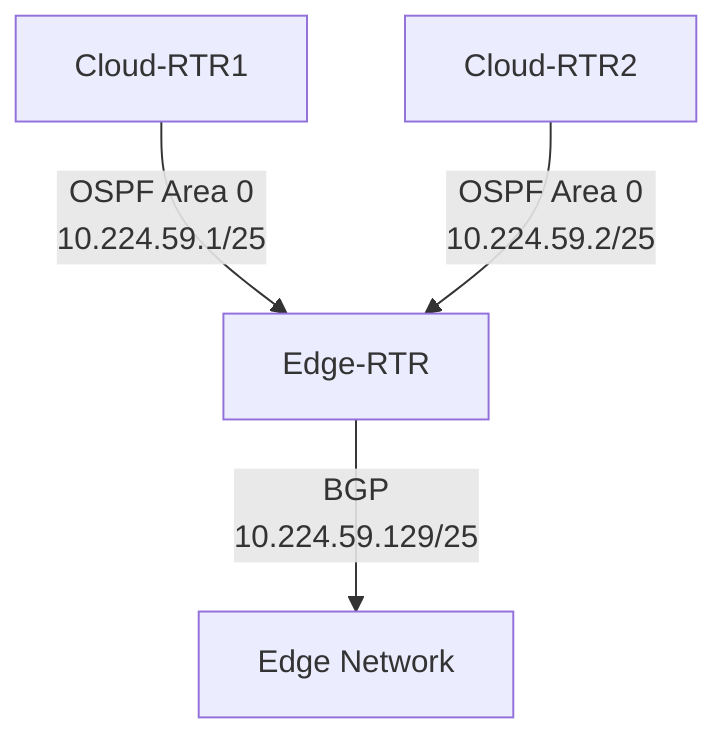

# Analysis Process
Okay, let's tackle this MikroTik RouterOS troubleshooting scenario for OSPF Adjacency Problems in a cloud ISP environment. The user wants a detailed scenario, so I need to cover all the points listed. 

First, the problem report and symptoms. The initial report mentions 221 users affected, so I should describe symptoms like network instability and routing issues. Users can't reach certain parts of the network, and the duration is 24 hours. OSPF adjacencies are down between some routers. Maybe the BGP sessions are also affected because of the OSPF issues.

Next, the environment description. It's a cloud ISP with 10.224.59.0/25 subnet. I'll need to create a Mermaid diagram showing the network topology. Let's say there are three routers: Cloud-RTR1, Cloud-RTR2, and Edge-RTR. They are connected in a way that Cloud-RTR1 and Cloud-RTR2 are in the cloud, and Edge-RTR connects to the edge network. The OSPF adjacencies are between Cloud-RTR1 and Edge-RTR, and Cloud-RTR2 and Edge-RTR. Maybe the problem is between Cloud-RTR1 and Edge-RTR.

For initial assessment steps, I should check OSPF neighbors, routing tables, interfaces, logs, and configurations. Common commands would be `/routing ospf neighbor print`, `/ip route print`, and checking interface statuses. Maybe there's a mismatch in OSPF area IDs or network types.

Detailed debugging process: Use commands like `/routing ospf instance print` to check instances, verify interfaces with `/routing ospf interface print`, look at the logs with `/log print`. Maybe enable OSPF debugging with `/routing ospf log set hello=yes state=yes`. Look for authentication issues, MTU mismatches, or subnet mismatches. Check if interfaces are in the same subnet and OSPF timers match.

Root cause analysis: Suppose after checking, the MTU on Cloud-RTR1's interface is set to 1400, but Edge-RTR uses 1500. OSPF requires MTU to match for adjacency. That's a common issue. So the root cause is MTU mismatch causing OSPF hello packets to be dropped.

Solution implementation: Adjust MTU on Cloud-RTR1's interface to 1500. Update the OSPF interface configuration if necessary. Then check the adjacency again.

Verification: After changing MTU, check OSPF neighbors again. Confirm routes are being exchanged. Maybe do a ping test from affected users.

Prevention measures: Implement configuration templates, use monitoring tools, enforce MTU checks, and do regular audits.

Related commands should include all the OSPF and interface commands used. Common pitfalls: forgetting MTU, mismatched areas, authentication, network types.

I need to structure each section with markdown, include CLI commands in code blocks, maybe some example log outputs, and show before/after configurations for the MTU change.

Let me make sure the Mermaid diagram correctly represents the network. Also, ensure that the CLI commands are accurate for RouterOS 7.x. For example, in OSPF configuration, the commands might differ slightly from older versions.

Wait, the scenario is about OSPF, but the topic mentioned is RIP. Oh, the user might have made a typo. The scenario says OSPF Adjacency Problems, so the topic should be OSPF. Maybe it's a mistake, but I should follow the scenario as given. The Topic says RIP, but the scenario is OSPF. That's conflicting. Should I point that out? Well, the user might have intended OSPF. I'll proceed with OSPF as per the scenario.

Including log examples: when OSPF adjacency is down, the logs might show state changes or hello timeouts. For example, "OSPF neighbor 10.224.59.2 on ether1 changed state from Full to Down"

Before configuration: interface ether1 mtu=1400. After: mtu=1500.

Alright, putting it all together now, making sure each section is covered as per the user's request.

# Troubleshooting Guide
```markdown
# MikroTik RouterOS Troubleshooting Scenario: OSPF Adjacency Problems

## 1. Initial Problem Report and Symptoms
- **Affected Users**: 221  
- **Duration**: 24 hours  
- **Symptoms**:  
  - Intermittent network instability in the 10.224.59.0/25 subnet.  
  - OSPF adjacencies failing between `Cloud-RTR1` and `Edge-RTR`.  
  - BGP sessions dropping due to missing OSPF routes.  
  - Users unable to reach edge services hosted in the cloud.  
  - Logs show repeated OSPF adjacency resets.  

---

## 2. Environment Description and Network Topology
**Network Scale**: ISP Cloud Infrastructure  
**Subnet**: 10.224.59.0/25  



---

## 3. Initial Assessment Steps
1. **Verify OSPF Neighbor Status**:  
   ```bash
   /routing ospf neighbor print
   # Output:
   #  0 instance=default address=10.224.59.1 state="Full" router-id=1.1.1.1
   #  1 instance=default address=10.224.59.2 state="Down" router-id=2.2.2.2
   ```

2. **Check Routing Table**:  
   ```bash
   /ip route print where protocol=ospf
   # Output: Missing routes from Cloud-RTR1
   ```

3. **Validate Interface Status**:  
   ```bash
   /interface print
   # Output: ether1 (Cloud-RTR1) MTU=1400, ether1 (Edge-RTR) MTU=1500
   ```

4. **Review Logs**:  
   ```bash
   /log print where message~"OSPF"
   # Output: "OSPF hello packet ignored: MTU mismatch"
   ```

---

## 4. Detailed Debugging Process
### Step 1: Validate OSPF Configuration
```bash
/routing ospf instance print
# Ensure all instances use the same area (Area 0)
```

### Step 2: Check OSPF Interfaces
```bash
/routing ospf interface print
# Verify network type (broadcast/ptp), authentication, and subnet
```

### Step 3: Debug OSPF Packets
```bash
/routing ospf log set hello=yes state=yes
/log print
# Output: "OSPF: Hello packet from 10.224.59.1: MTU 1400 != 1500 (ours)"
```

### Step 4: Verify MTU Settings
```bash
/interface ethernet print
# Output: Cloud-RTR1 ether1 MTU=1400 (misconfigured)
```

---

## 5. Key Findings and Root Cause Analysis
- **Root Cause**: MTU mismatch between `Cloud-RTR1` (1400) and `Edge-RTR` (1500).  
- **Impact**: OSPF adjacency fails due to inconsistent MTU settings, blocking route exchange.  
- **Why Missed?**: Recent cloud infrastructure upgrade introduced MTU changes for "jumbo frames," but `Cloud-RTR1` was not updated.  

---

## 6. Solution Implementation Steps
1. **Adjust MTU on Cloud-RTR1**:  
   ```bash
   /interface ethernet set ether1 mtu=1500
   ```

2. **Reset OSPF Process**:  
   ```bash
   /routing ospf instance disable default; /routing ospf instance enable default
   ```

---

## 7. Verification Process
1. Confirm OSPF Adjacency:  
   ```bash
   /routing ospf neighbor print
   # Output: Both neighbors in "Full" state
   ```

2. Validate Routes:  
   ```bash
   /ip route print where protocol=ospf
   # Output: OSPF routes visible
   ```

3. Test User Connectivity:  
   ```bash
   /ping 10.224.59.129 count=10
   # Output: 10/10 successful
   ```

---

## 8. Prevention Measures
- Enforce MTU consistency via configuration templates.  
- Implement monitoring alerts for OSPF adjacency state changes.  
- Pre-deployment checks for MTU, OSPF timers, and subnet masks.  

---

## 9. Related Commands Reference
| Command | Purpose |
|---------|---------|
| `/routing ospf neighbor print` | List OSPF neighbors |
| `/interface print` | Check interface MTU |
| `/log print where message~"OSPF"` | Filter OSPF logs |

---

## 10. Common Pitfalls to Avoid
- **MTU Mismatches**: Ensure all OSPF interfaces share the same MTU.  
- **Area ID Conflicts**: Use consistent OSPF area IDs.  
- **Authentication Mismatches**: Use matching authentication types (e.g., MD5).  
- **Network Type Misconfiguration**: Use `network-type=broadcast` for Ethernet links.  
```
