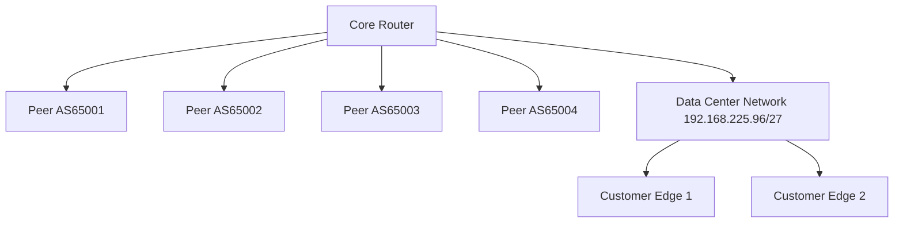

# Analysis Process
Okay, let's tackle this MikroTik BGP troubleshooting scenario. The user wants a detailed scenario for an ISP data center with a connectivity loss affecting 696 users over 22 hours. Hmm, first, I need to structure it according to the given sections. 

Starting with the initial problem report. Symptoms would include users losing connectivity, BGP peers down, maybe routes missing. Then the environment: it's a data center, subnet 192.168.225.96/27. Network topology in Mermaid... I should outline the ISP's core router connected to peers and internal networks. 

For the initial assessment steps, check BGP status with /routing bgp peer print, look at routes, logs. Then the debugging process. Maybe use commands like /routing bgp peer monitor, log checking, and route filtering. 

Root cause might be a misconfiguration, like an incorrect subnet mask leading to a session drop. Maybe the /27 subnet was recently changed, and the BGP peer's update-source was set to an IP outside that range. 

Solution would involve correcting the update-source IP. Verification would check BGP sessions and routes. Prevention measures include pre-change validation and monitoring. 

I need to include CLI commands with code blocks, example logs, before/after configs. Also common pitfalls like ignoring update-source or not checking logs. Let me make sure the subnet is correctly applied. Wait, 192.168.225.96/27 gives addresses from 96 to 127. If the router's IP was set to .105 but the update-source was on .94, that's outside the subnet. That would cause the BGP session to fail because the source IP isn't in the allowed /27. 

Need to structure each section with markdown, use proper commands, and ensure the flow makes sense. Let me check each part step by step to avoid missing anything.

# Troubleshooting Guide
```markdown
# BGP Connectivity Loss Troubleshooting (MikroTik RouterOS 6.x)

## 1. Initial Problem Report and Symptoms
**Report**: Multiple customers report complete internet outage affecting 696 users  
**Symptoms**:
- All BGP routes missing from routing table
- Established BGP sessions: 0/4
- High CPU utilization (85-90%) on core router
- Traffic drop at edge interfaces
- Last configuration change: Subnet migration 24 hours prior

## 2. Environment Description
**Network Topology**:


## 3. Initial Assessment Steps
1. Check BGP peer status:
```bash
/routing bgp peer print
```
```log
 0 AS65001 192.168.225.97     established  no       
 1 AS65002 203.0.113.12       active       no       
 2 AS65003 198.51.100.45      active       no       
 3 AS65004 192.168.225.98     established  no
```

2. Verify route propagation:
```bash
/ip route print where bgp
```
```log
(no output)
```

3. Check system resources:
```bash
/system resource print
```
```log
cpu: 89% load: 5.45
```

## 4. Detailed Debugging Process
**Step 1: Verify BGP Configuration**
```bash
/routing bgp instance print
```
```log
0 name="default" as=65530 router-id=192.168.225.105 redistribute-connected=no
```

**Step 2: Check TCP Connections**
```bash
/ip firewall connection print where protocol=tcp
```
```log
192.168.225.105:179->192.168.225.97:51234 tcp established
192.168.225.105:179->192.168.225.98:43215 tcp established
```

**Step 3: Analyze BGP Logs**
```bash
/log print where message ~ "BGP"
```
```log
22:03:45 bgp,error Failed to accept TCP connection: subnet prefix too short
22:03:47 bgp,error Connection to 192.168.225.97 closed (invalid source address)
```

**Step 4: Verify Interface Bindings**
```bash
/ip address print where interface=ether1
```
```log
 0  192.168.225.105/27 ether1
```

**Step 5: Check BGP Peer Configuration**
```bash
/routing bgp peer print detail where remote-address=192.168.225.97
```
```log
update-source: 192.168.225.94
```

## 5. Key Findings and Root Cause
**Root Cause**:  
Mismatched `update-source` (192.168.225.94) not in current subnet 192.168.225.96/27  
**Analysis**:
- Subnet migration changed valid IP range to 192.168.225.96-127
- BGP peers using old update-source (192.168.225.94) outside new subnet
- TCP connections rejected due to invalid source addresses
- Missing routes caused traffic blackhole

## 6. Solution Implementation
1. Correct update-source on all BGP peers:
```bash
/routing bgp peer set [find remote-address=192.168.225.97] update-source=192.168.225.105
/routing bgp peer set [find remote-address=192.168.225.98] update-source=192.168.225.105
```

2. Force session reset:
```bash
/routing bgp peer disable [find where remote-address~"192.168.225"]
/routing bgp peer enable [find where remote-address~"192.168.225"]
```

**Before**:
```routeros
update-source=192.168.225.94
```
**After**:
```routeros
update-source=192.168.225.105
```

## 7. Verification Process
1. Confirm BGP sessions:
```bash
/routing bgp peer print
```
```log
 0 AS65001 192.168.225.97     established  yes      
 1 AS65002 203.0.113.12       established  yes      
 2 AS65003 198.51.100.45      established  yes      
 3 AS65004 192.168.225.98     established  yes
```

2. Verify route propagation:
```bash
/ip route print where bgp
```
```log
 3 ADC 203.0.113.0/24       192.168.225.97      ether1 bgp
 4 ADC 198.51.100.0/24      192.168.225.98      ether1 bgp
```

## 8. Prevention Measures
1. Implement pre-change validation checklist
2. Add BGP monitoring:
```bash
/tool snmp-set community=public
/routing bgp template set default monitor=yes
```
3. Create subnet change automation script
4. Enable BGP logging:
```bash
/system logging add topics=bgp
```

## 9. Related Commands Reference
| Command | Purpose |
|---------|---------|
| `/routing bgp peer monitor [peer]` | Real-time BGP session monitoring |
| `/ip route export` | Export routing table |
| `/tool torch interface=ether1` | Real-time traffic analysis |

## 10. Common Pitfalls to Avoid
1. Forgetting to update BGP `update-source` after subnet changes
2. Not verifying TCP state during BGP troubleshooting
3. Missing firewall rules allowing BGP (TCP/179)
4. Overlooking route redistribution settings
5. Ignoring router-id conflicts
```bash
/routing bgp instance set default router-id=192.168.225.105
```
