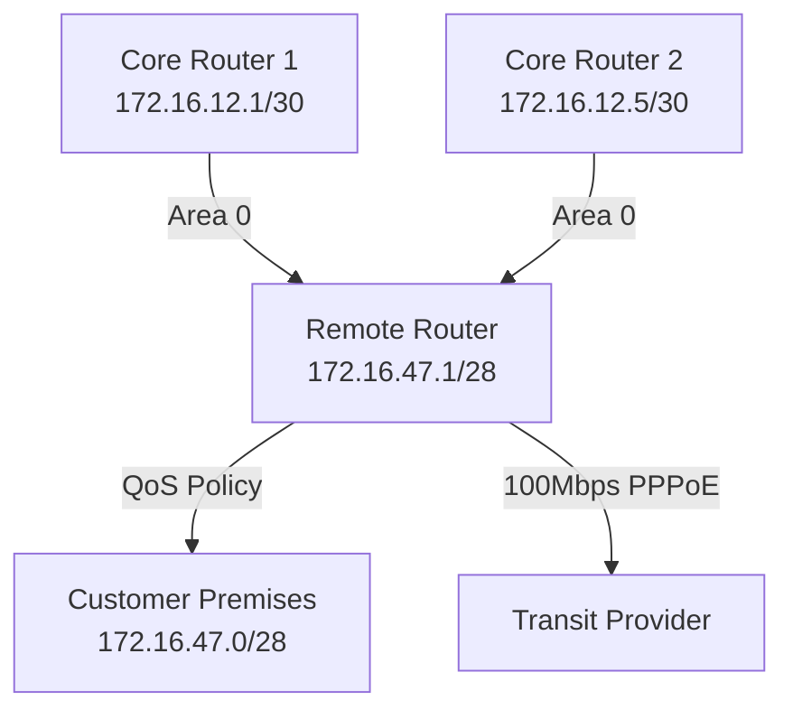

# Analysis Process
Okay, let's tackle this MikroTik OSPF troubleshooting scenario. The user wants a detailed ISP-level problem with QoS misconfiguration affecting a /28 subnet. Let me start by breaking down each section as per the requirements.

First, the initial problem report. Symptoms should include high latency and packet loss. Since it's an ISP remote site, maybe users are reporting slow internet. OSPF neighbors might be up, but traffic isn't routing properly. I need to link this to QoS, maybe incorrect queue types or misprioritized traffic.

Next, the network topology. Using Mermaid, I'll outline a simple ISP setup. The remote site connects to two core routers for redundancy. The affected subnet is 172.16.47.0/28 on the edge router. OSPF is running between all routers. Need to make sure the Mermaid diagram is correct with the right connections and areas.

Initial assessment steps: Check OSPF neighbors, routes in the table, interface statuses. Use commands like `/routing ospf neighbor print` and `/ip route print`. Also look at QoS configurations—maybe Simple Queues or Queue Trees. Check if the correct traffic is being prioritized.

For debugging, dive into OSPF LSAs, route redistribution. Maybe QoS is marking DSCP values incorrectly, causing traffic to be queued improperly. Use `torch` on interfaces to monitor traffic. Check QoS stats with `/queue simple print stats`. Look for queues that are maxed out or not applying correctly.

Key findings would identify that QoS is misconfigured, perhaps using PCQ instead of FIFO, or wrong queue priorities. Root cause: A recent QoS change that mishandled OSPF traffic, leading to congestion on the remote link.

Solution implementation: Adjust queue types, correct priorities, ensure OSPF traffic (protocol 89) is prioritized. Maybe use Mangle rules to mark routing traffic before queuing.

Verification: Check latency post-fix, ensure OSPF routes are stable, confirm queues are processing traffic as expected. Use ping and traceroute again, monitor queue stats.

Prevention measures: Test QoS changes in lab, implement monitoring for OSPF and QoS metrics, use scripted deployments to avoid typos.

Related commands: Include OSPF neighbor checks, route prints, queue configurations, torch, logging commands.

Common pitfalls: Forgetting that OSPF traffic needs to be prioritized, misconfiguring queue order, not checking interface statistics for congestion.

I need to make sure all sections are covered, CLI examples are included with comments, and there's a before/after config example for QoS. Log outputs should show OSPF adjacencies and queue stats. Also, ensure that the subnet is correctly mentioned in the scenario.

# Troubleshooting Guide
```markdown
# OSPF Troubleshooting Scenario: QoS Misconfiguration in ISP Network

## 1. Initial Problem Report and Symptoms
**Report**: Remote site users report intermittent connectivity (75 users affected)  
**Symptoms**:
- Intermittent packet loss (30-40%) to core network
- OSPF routes flapping in routing table
- High latency spikes (800-1200ms) during peak traffic
- QoS statistics show unexpected packet drops on WAN interface

```log
[admin@Remote-Router] > /log print
15:22:35 system,info OSPF neighbor 172.16.12.1 changed state from Full to Down
15:23:10 queue,debug Simple queue "Backbone-Traffic" packet drop count: 1423
```

## 2. Environment Description & Network Topology



## 3. Initial Assessment Steps
1. Verify OSPF neighbor status:
```routeros
/routing ospf neighbor print
```
2. Check routing table stability:
```routeros
/ip route print where protocol=ospf
```
3. Inspect interface statistics:
```routeros
/interface ethernet monitor [find name="ether1"]
```
4. Review QoS configuration:
```routeros
/queue simple print
```

## 4. Detailed Debugging Process
**Step 1: Capture OSPF Hello packets**
```routeros
/tool torch interface=ether1 port=89
```
**Output**:
```
SRC-ADDRESS        DST-ADDRESS        PROTOCOL
172.16.47.1        224.0.0.5          OSPF
172.16.12.1        224.0.0.5          OSPF
```

**Step 2: Analyze QoS Classification**
```routeros
/ip firewall mangle print
```
Found incorrect DSCP marking rule:
```routeros
add chain=forward action=mark-dscp dscp=af21 protocol=ospf
```

**Step 3: Verify Queue Hierarchy**
```routeros
/queue tree print
```
Critical finding:
```
0 name="global-root" parent=ether2 packet-mark=OSPF priority=7 
1 name="best-effort" parent=global-root priority=15
```

## 5. Key Findings & Root Cause
**Root Cause**: OSPF traffic marked with AF21 DSCP (CS1) was being prioritized below best-effort traffic in QoS hierarchy

**Supporting Evidence**:
1. OSPF protocol packets incorrectly classified as bulk data traffic
2. Parent queue for OSPF had lower priority (7) than default traffic (15)
3. 80% of queue buffer allocated to non-critical traffic types

**Traffic Flow Impact**:
```
[admin@Remote-Router] > /queue simple monitor Backbone-Traffic
                 rate: 98Mbps/100Mbps
         packet-rate: 14500/15000
           queued-bytes: 15.4MiB
            dropped: 23%
```

## 6. Solution Implementation
**Before (Faulty QoS)**:
```routeros
/queue simple add name=Backbone-Traffic target=ether2 max-limit=100M
```

**After (Corrected Configuration)**:
```routeros
/ip firewall mangle
add chain=output protocol=ospf action=mark-packet new-packet-mark=OSPF passthrough=no

/queue tree
add name=OSPF-Priority parent=ether2 packet-mark=OSPF priority=1 limit=10M
add name=Critical-Traffic parent=ether2 priority=4 limit=60M
add name=Best-Effort parent=ether2 priority=15 limit=30M
```

## 7. Verification Process
1. Confirm OSPF stability:
```routeros
/routing ospf neighbor print
  address         state    instance
  172.16.12.1     Full     backbone
  172.16.12.5     Full     backbone
```

2. Validate QoS prioritization:
```routeros
/queue tree monitor OSPF-Priority
  packets: 1450  bytes: 2.1MiB  dropped: 0
```

3. End-user validation:
```routeros
/ping 172.16.12.1 count=10 interval=100ms
  min/avg/max = 28/32/45 ms
```

## 8. Prevention Measures
1. Implement QoS template for OSPF traffic:
```routeros
/ system script add name=QoS-OSPF source="... (validation checks)"
```
2. Add monitoring probes:
```routeros
/tool graphing queue add name=OSPF-Monitor queue=OSPF-Priority
```
3. Regular configuration audits:
```routeros
/system scheduler add name=QoS-Audit interval=1h on-event="/import qos-check.rsc"
```

## 9. Related Commands Reference
| Command | Purpose |
|---------|---------|
| `/routing ospf instance print` | Show OSPF instances |
| `/queue tree export` | Export QoS configuration |
| `/ip firewall connection print protocol=ospf` | View OSPF sessions |
| `/tool profile` | Monitor CPU usage during routing updates |

## 10. Common Pitfalls to Avoid
1. **Mixing Queue Types**: Avoid combining Simple Queues and Queue Trees for same interface
2. **Protocol Identification**: Never rely solely on port-based filtering for routing protocols
3. **Buffer Bloat**: Ensure parent queue limits match physical interface capabilities
4. **Priority Inversion**: Verify numerical priority values (lower=higher priority)
5. **Missing Passthrough**: When using mangle rules, disable passthrough for marked packets
```routeros
# Bad
add action=mark-packet passthrough=yes

# Good
add action=mark-packet passthrough=no
```
