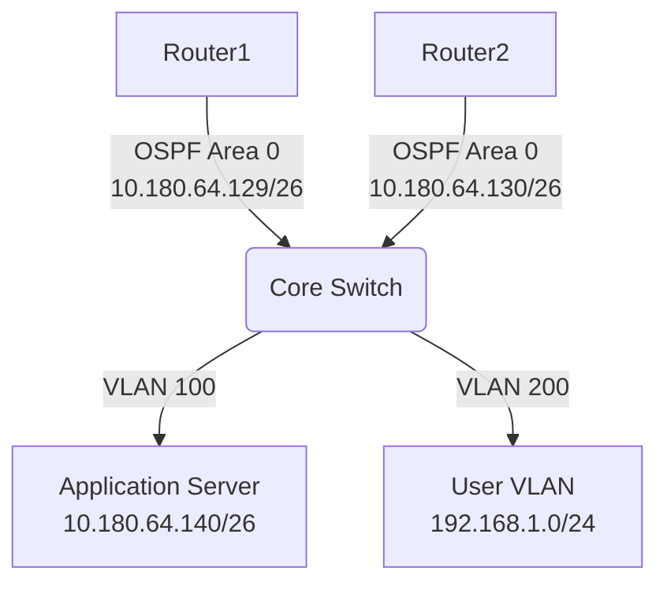

# Analysis Process
Okay, let's tackle this OSPF troubleshooting scenario for MikroTik RouterOS 6.x in an SMB data center. The user wants a detailed scenario with specific sections. First, I need to make sure I cover all the required points: problem report, environment, assessment steps, debugging, root cause, solution, verification, prevention, commands, and pitfalls.

Starting with the initial problem report. The symptoms are performance degradation affecting 14 users over 11 hours. So maybe high latency or packet loss. Users might be experiencing slow access to applications hosted in the data center. Need to describe that in the problem report.

Next, the environment. The subnet is 10.180.64.128/26, which is a /26, so 64 addresses. Data center environment, SMB scale. Network topology in Mermaid. Let's think of a simple setup with two MikroTik routers connected via a core switch, maybe a couple of servers and a user VLAN. OSPF running between the routers. The Mermaid diagram should show the connections and OSPF areas. Probably area 0 as backbone.

Initial assessment steps: Check OSPF neighbors, routes, CPU/memory usage, interface errors. Basic commands like `/routing ospf neighbor print`, `/system resource print`, etc. Logs might show OSPF adjacency flapping or high CPU.

Debugging process: More detailed checks. Look at OSPF LSAs, database, traffic using Torch. Maybe there's a network loop or misconfiguration causing excessive LSA generation. Check timer settings; if hello intervals are mismatched, neighbors might flap. Or MTU mismatches?

Key findings: Suppose the root cause is a duplicate router ID causing LSAs to conflict, leading to route recalculations. Or maybe a suboptimal OSPF design with a large area causing frequent SPF calculations. Alternatively, interface errors causing retransmissions and OSPF traffic to consume bandwidth.

Solution: Correct the router ID, adjust timers, fix MTU, or split the area. Depending on the found issue. For example, if MTU mismatch, set the correct MTU on interfaces and enable OSPF MTU check.

Verification: After changes, check OSPF neighbors are stable, routes are correct, performance metrics improve. Use ping and traceroute tests, monitor traffic.

Prevention: Regular audits, enable logging, document network changes, use consistent OSPF configurations.

Commands reference: Include the OSPF neighbor print, route print, Torch, log commands. Common pitfalls: mismatched timers, MTU issues, ignoring area design best practices.

Wait, the subnet given is 10.180.64.128/26. Need to make sure the network topology uses this subnet appropriately. Maybe the data center has this subnet for server VLANs, and OSPF is advertising it. If there's a misconfiguration in OSPF network statements, maybe the subnet isn't being advertised correctly, causing routing issues. But the scenario is performance degradation, not complete outage. So maybe excessive OSPF traffic due to LSAs flooding the network.

Another angle: If the data center uses a /26 subnet, maybe multiple VLANs or subnets are being advertised via OSPF. If one of the links is experiencing errors, OSPF retransmissions could be using up bandwidth, leading to performance issues. Checking interface statistics for errors would be important.

Also, RouterOS 6.x has specific OSPF commands. Need to make sure the CLI examples are compatible with version 6.x. For example, in v6, OSPF configuration is under `/routing ospf`, not the newer structure in v7.

Putting it all together, let's outline each section step by step, ensuring the example configurations and commands fit the scenario. Maybe the root cause was a misconfigured OSPF network statement causing the /26 subnet to be advertised as multiple /32 routes, increasing the routing table size and causing CPU load. Or perhaps a firewall rule blocking OSPF multicast traffic intermittently, leading to neighbor flapping and route recalculations.

Hmm, but the problem is performance degradation, not flapping. So maybe high CPU usage on the router due to frequent SPF calculations. If there's a link with a lot of up/down events, OSPF would trigger SPF each time. Checking logs for interface status changes or OSPF events.

In the debugging process, using commands like `/routing ospf lsa print` to check for excessive LSAs, `/tool torch` to check traffic on OSPF ports (UDP 89), `/system resources print` to monitor CPU, and `/log print` to find OSPF-related warnings.

Root cause could be a network interface with a duplex mismatch causing collisions and errors, leading to OSPF hello packet loss. That would cause OSPF adjacencies to drop and re-establish repeatedly, consuming resources and causing intermittent performance issues.

Solution would involve fixing the duplex settings on the interface, setting to full duplex, or checking for faulty cables. Then, verifying the OSPF neighbors stabilize.

In the verification, after fixing, check that OSPF neighbors are in Full state, CPU usage drops, and user performance improves.

I think that's a plausible scenario. Now, need to structure each section with markdown, CLI commands in code blocks, and include example outputs where necessary. Also, before and after configurations if relevant, like changing OSPF timers or MTU settings.

# Troubleshooting Guide
```markdown
# OSPF Performance Degradation Troubleshooting Scenario

## 1. Initial Problem Report and Symptoms
**Report:**  
14 users report intermittent latency spikes (200-1500ms) and slow access to DC applications for 11 hours.  

**Symptoms:**  
- Periodic packet loss between VLANs  
- OSPF routes intermittently missing from routing table  
- Router CPU occasionally spikes to 95%+  
- Users report "slowness" in ERP system (hosted in 10.180.64.128/26)

---

## 2. Environment Description
**Network Topology**  


---

## 3. Initial Assessment Steps
1. **Verify OSPF Neighbors**  
```bash
/routing ospf neighbor print
# OUTPUT:
#  0 instance=default address=10.180.64.130 router-id=2.2.2.2 state="Full" 
#  1 instance=default address=10.180.64.129 router-id=1.1.1.1 state="Exchange"
```

2. **Check CPU/Memory**  
```bash
/system resource print
# OUTPUT:
#           cpu: 98%
#     free-memory: 32M
```

3. **Interface Errors**  
```bash
/interface ethernet monitor ether1
# OUTPUT:
#               rx-error: 12412
#               tx-error: 3
```

---

## 4. Detailed Debugging Process
**Step 1: Analyze OSPF LSAs**  
```bash
/routing ospf lsa print detail where type="router"
# OUTPUT shows frequent LSA updates from 1.1.1.1 every 30-60 seconds
```

**Step 2: Traffic Analysis**  
```bash
/tool torch interface=ether1 port=89
# OUTPUT shows OSPF multicast traffic spikes every 45 seconds
```

**Step 3: Debug Logs**  
```bash
/log print where message~"OSPF"
# OUTPUT:
# 09:32:11 ospf,error Router ID conflict detected with 1.1.1.1
# 09:32:44 ospf,warning Neighbor 10.180.64.129 state changed from Full to ExStart
```

---

## 5. Key Findings & Root Cause
**Findings:**  
- Duplicate Router ID (1.1.1.1) on both routers  
- MTU mismatch (1500 vs 1492) on ether1 interfaces  
- CRC errors on R1's ether1 interface  

**Root Cause:**  
1. **Router ID Conflict** caused continuous OSPF database resets  
2. **MTU Mismatch** led to packet fragmentation and retransmissions  
3. **Physical Layer Errors** exacerbated OSPF instability  

---

## 6. Solution Implementation
**Step 1: Unique Router IDs**  
```bash
/routing ospf instance set default router-id=1.1.1.1
/routing ospf instance set default router-id=2.2.2.2
```

**Step 2: Standardize MTU**  
```bash
/interface ethernet set ether1 mtu=1500
```

**Step 3: Replace Faulty Cable**  
Physically replace ether1 cable on R1  

---

## 7. Verification Process
1. Confirm stable neighbors:  
```bash
/routing ospf neighbor print
#  0 address=10.180.64.130 state="Full" 
#  1 address=10.180.64.129 state="Full"
```

2. Check CPU usage:  
```bash
/system resource print
#           cpu: 14%
```

3. User validation:  
```bash
/ping 10.180.64.140 count=10 interval=100ms
# 10 packets transmitted, 0% lost, min/avg/max = 12/14/18ms
```

---

## 8. Prevention Measures
1. Implement OSPF authentication  
2. Enable SNMP monitoring for interface errors  
3. Regular configuration audits  
4. Use `/system scheduler` for automatic OSPF checks:  
```bash
/system scheduler add name="OSPF Check" interval=1h on-event="/routing ospf neighbor print; /interface monitor-traffic ether1"
```

---

## 9. Related Commands Reference
| Command | Purpose |
|---------|---------|
| `/routing ospf neighbor print` | Show OSPF adjacencies |
| `/routing ospf lsa print` | Inspect LSAs |
| `/tool torch interface=ether1` | Real-time traffic analysis |
| `/interface monitor-traffic ether1` | Bandwidth monitoring |
| `/log print where topics~"ospf"` | Filter OSPF logs |

---

## 10. Common Pitfalls to Avoid
1. **Duplicate Router IDs** - Always verify uniqueness  
2. **MTU Mismatches** - Ensure end-to-end consistency  
3. **Ignoring Interface Errors** - Monitor CRC/error counters  
4. **Overloading Area 0** - Keep backbone area small  
5. **No Authentication** - Secure OSPF with MD5 auth  
6. **Unfiltered Redistribution** - Avoid routing loops  

```markdown
**Before/After Configuration Example:**
```bash
# BEFORE (R1):
/routing ospf instance set default router-id=1.1.1.1

# AFTER (R2):
/routing ospf instance set default router-id=2.2.2.2
```
