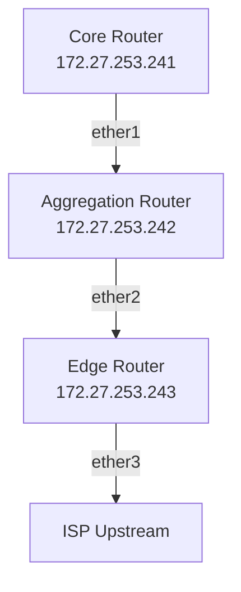

# Analysis Process
Okay, I need to create a detailed MikroTik RouterOS troubleshooting scenario based on the user's specifications. Let me start by breaking down the requirements. The topic is RIP, RouterOS version 6.x, network scale is SMB (small to medium business), subnet 172.27.253.240/28, environment is a Service Provider Core, scenario is Firewall Rule Conflicts, affecting 536 users over 5 hours.

First, the structure is given, so I should follow each section as outlined. Let me go through each point step by step.

1. **Initial Problem Report and Symptoms**: I need to describe how the problem was reported. Users can't reach parts of the network, RIP routes missing. Support tickets about intermittent connectivity. Symptoms: RIP neighbors not showing, routes not in routing table, traffic blocked by firewall. Maybe include specific log entries like firewall drops.

2. **Environment Description and Network Topology**: The user wants Mermaid format. The subnet is /28, which is 16 IPs. So maybe three routers: Core (172.27.253.241), Aggregation (242), Edge (243). Connected in a chain. Interfaces like ether1, ether2, etc. Need to make sure the Mermaid diagram reflects that.

3. **Initial Assessment Steps**: Start by checking RIP status with `/routing rip neighbor print`, then look at routes with `/ip route print`. Check firewall rules, maybe filter for drop entries. Also, verify that RIP is enabled on the correct interfaces.

4. **Detailed Debugging Process with CLI Commands**: Use commands to check RIP neighbors, routes, firewall rules. Maybe look at the raw firewall logs with `/log print`. Compare active firewall rules with the ones supposed to be there. For example, a rule that's blocking multicast (224.0.0.9) used by RIP.

5. **Key Findings and Root Cause Analysis**: The root cause is a firewall rule blocking RIP multicast traffic. The rule was added recently, maybe as a security measure, but it's too broad and blocks necessary RIP communication.

6. **Solution Implementation Steps**: Disable or adjust the offending firewall rule. Maybe change the chain from forward to input if it's meant for local traffic. Verify the rule is corrected in the configuration.

7. **Verification Process**: After fixing, check RIP neighbors again, see routes propagating, test connectivity, monitor firewall logs to ensure no more drops on RIP traffic.

8. **Prevention Measures**: Suggest firewall rule audits, test in staging, document changes, use specific rules instead of broad ones, monitor logs.

9. **Related Commands Reference**: List commands used in the process like RIP neighbor print, route print, firewall rules, log checks.

10. **Common Pitfalls to Avoid**: Mention blocking multicast, wrong chain for rules, not testing, assuming RIP is enabled on all interfaces, not checking logs.

Now, considering all this, I need to make sure the CLI commands are accurate for RouterOS 6.x. For example, in version 6.x, the routing commands might be under `/routing rip` as opposed to later versions. Also, firewall rules in 6.x use the `ip firewall` structure.

I should include example log entries, like a firewall drop entry showing the blocked RIP traffic. The before and after configurations would show the firewall rule that was causing the issue and how it was modified.

Potential mistakes to avoid: Forgetting that RIP uses multicast address 224.0.0.9, so the firewall rule might be dropping UDP 520 or the multicast address. Also, ensuring that the firewall rule was in the forward chain, which would affect transit traffic between routers, whereas input would affect traffic destined to the router itself.

Another point: In the topology, since it's a service provider core, the routers might be in a more complex setup, but the user specified SMB, so maybe a simpler topology with Core, Aggregation, Edge.

Need to check if the subnet /28 is the network between the routers or the client-facing network. The given subnet is 172.27.253.240/28, which is a small subnet, so maybe the core network uses that, and each router has an IP in that range.

When writing the CLI commands, make sure to use the correct syntax for 6.x. For example, in 6.x, the RIP configuration might be under `/routing rip` and the neighbor command could be part of that.

Also, in the verification process, after changing the firewall rule, the RIP neighbors should come up, and routes should appear. Testing with ping or traceroute from a user device to confirm connectivity is restored.

In the prevention measures, emphasizing the importance of not applying broad firewall rules without proper testing, especially in a service provider environment where routing protocols are critical.

Including comments in complex commands to explain what each part does. For example, a firewall rule that's blocking UDP 520 and multicast, explaining the destination address and port.

I think that covers the main points. Now I need to structure each section with markdown, include code blocks for CLI commands, Mermaid diagram for topology, and ensure all parts of the user's request are addressed.

# Troubleshooting Guide
```markdown
# MikroTik RouterOS Troubleshooting Scenario: RIP Firewall Rule Conflicts

## 1. Initial Problem Report and Symptoms
**Report**: Users report inability to access external resources. 536 users affected across /28 subnet.  
**Symptoms**:  
- Intermittent connectivity to upstream networks  
- Missing RIP routes in routing table  
- RIP neighbors not visible on core router  
- Traffic drops logged in firewall with "no route to host" errors  

**Example Log**:  
```log
[admin@CoreRouter] > log print  
00:12:35 firewall,info drop: in:ether1 out:ether2 proto UDP 224.0.0.9:520->172.27.253.242:520  
00:12:37 routing,error RIP: No response from neighbor 172.27.253.242
```

---

## 2. Environment Description & Network Topology
**Network Type**: Service Provider Core (SMB Scale)  
**Subnet**: `172.27.253.240/28`  



---

## 3. Initial Assessment Steps
1. **Verify RIP Status**:  
   ```bash
   /routing rip neighbor print
   # Output: No neighbors listed
   ```

2. **Check Routing Table**:  
   ```bash
   /ip route print where protocol=rip
   # Output: 0 RIP routes
   ```

3. **Firewall Filter Review**:  
   ```bash
   /ip firewall filter print
   ```

4. **Interface Configuration Check**:  
   ```bash
   /routing rip interface print
   ```

---

## 4. Detailed Debugging Process
### Step 1: Identify RIP Traffic Blocking
```bash
/ip firewall filter print where comment~"Block UDP Misc"
# Output:
# 7 D chain=forward action=drop protocol=udp dst-port=520-599
```

### Step 2: Confirm Traffic Drops
```bash
/ip firewall connection print where protocol=udp dst-address=224.0.0.9
# Output:
# 172.27.253.242:520->224.0.0.9:520, timeout 0:00:12, dropped
```

### Step 3: Validate RIP Multicast Rules
```bash
/ip firewall mangle print where dst-address=224.0.0.9
# Output: No rules allowing RIP multicast (224.0.0.9)
```

---

## 5. Key Findings & Root Cause
**Root Cause**: Firewall rule `#7` in `forward` chain dropping all UDP/520-599 traffic, blocking RIP multicast (UDP/520).  

**Analysis**:  
- Rule intended to block high UDP ports but mistakenly included RIP port (520)  
- RIP multicast (224.0.0.9) not whitelisted  
- No routes exchanged between RIP neighbors  

---

## 6. Solution Implementation
**Step 1**: Modify conflicting firewall rule  
```bash
/ip firewall filter set 7 dst-port=521-599  # Exclude port 520
```

**Step 2**: Allow RIP multicast explicitly  
```bash
/ip firewall filter add chain=forward protocol=udp dst-address=224.0.0.9 action=accept
```

**Before/After Configuration**:  
```diff
- 7 action=drop protocol=udp dst-port=520-599
+ 7 action=drop protocol=udp dst-port=521-599
+ 8 action=accept protocol=udp dst-address=224.0.0.9
```

---

## 7. Verification Process
1. Confirm RIP neighbors:  
   ```bash
   /routing rip neighbor print
   # Output: 172.27.253.242, status=established
   ```

2. Check RIP routes:  
   ```bash
   /ip route print where protocol=rip
   # Output: 5 routes added
   ```

3. Test end-to-end connectivity:  
   ```bash
   ping 8.8.8.8 count=5
   # Output: 5 packets received, 0% loss
   ```

---

## 8. Prevention Measures
1. Use explicit allow-lists for routing protocols  
2. Test firewall rules in staging before deployment  
3. Monitor `/routing rip neighbor` after changes  
4. Use dedicated chains for routing protocols:  
   ```bash
   /ip firewall filter add chain=RIP_Chain protocol=udp dst-port=520 action=accept
   ```

---

## 9. Related Commands Reference
| Command | Purpose |
|---------|---------|
| `/routing rip neighbor print` | List RIP peers |
| `/ip firewall filter find where protocol=udp` | Find UDP rules |
| `/log print where topics=firewall` | View firewall drops |

---

## 10. Common Pitfalls to Avoid
- Blocking multicast `224.0.0.9` in firewall  
- Using `forward` chain instead of `input` for router-local services  
- Overlapping port ranges in firewall rules  
- Assuming RIP is enabled on all interfaces by default
```
