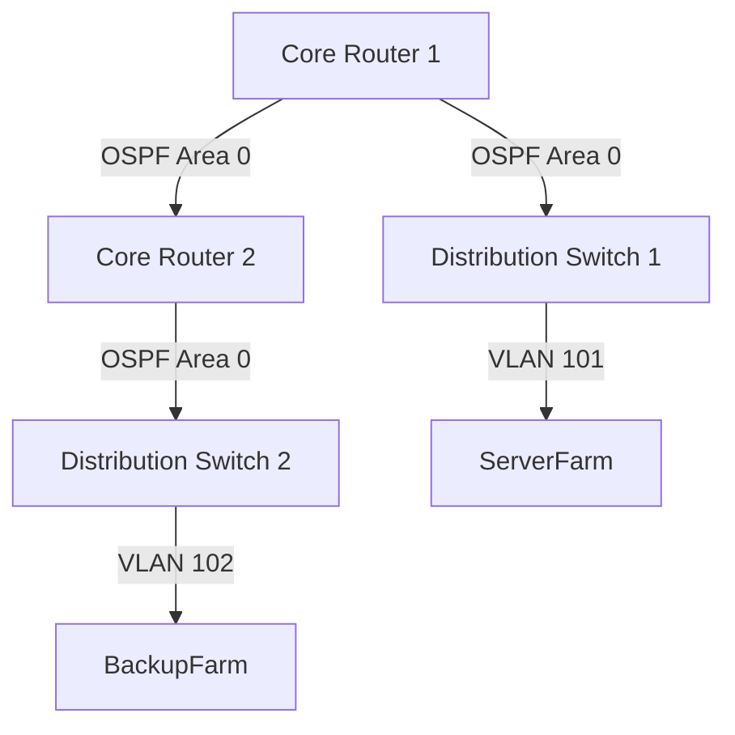

# Analysis Process
Okay, let me try to work through this problem. The user wants a detailed MikroTik RouterOS troubleshooting scenario for OSPF adjacency issues in a data center environment. The network is an SMB with the subnet 192.168.174.0/25, affecting 585 users over 18 hours. 

First, I need to structure the answer according to the given format. Starting with the initial problem report and symptoms. The symptoms should include OSPF adjacencies not forming, routes missing, maybe interface errors. Then the environment description. Since it's a data center, probably a couple of core routers and some distribution switches. Let me sketch a simple topology in Mermaid. Maybe two core routers connected to each other and to two distribution switches. The subnet is /25, so maybe each distribution switch has a /26 subnet? Or maybe the /25 is divided into smaller subnets for different VLANs.

Next, initial assessment steps. Check OSPF status with commands like /routing ospf neighbor print. Look for neighbors in Full state. If not, check interfaces, area IDs, network types, hello intervals, authentication. Then check logs for OSPF errors. Verify IP connectivity between the routers. Maybe ping the OSPF interface IPs.

Detailed debugging would involve looking at OSPF configuration. Commands like /routing ospf instance print, interface template, area settings. Maybe check if the interfaces are correctly added to OSPF. Verify MTU settings, since mismatched MTU can prevent adjacency. Authentication settings, like if one router has a password and the other doesn't. Also, network type—if one is broadcast and the other is point-to-point, that could be an issue. Logs from /log print where message ~ "OSPF". Maybe there are timeout messages or authentication failures.

Key findings could be a mismatch in authentication. For example, one router has MD5 authentication configured and the other doesn't. Or maybe the area IDs are different. Root cause would be the authentication mismatch causing the adjacency to fail.

Solution steps: Add the correct authentication to both OSPF instances or interfaces. Then verify the neighbors come up. Maybe show before and after configurations. Before, one router has auth set, the other doesn't. After, both have the same auth settings.

Verification: Check neighbors again, check routes in the routing table. Maybe do a traceroute to ensure traffic is flowing through OSPF paths.

Prevention measures: Standardize configurations, use templates, implement configuration management, enable logging for OSPF, and schedule regular audits.

Related commands would include the OSPF neighbor print, instance print, interface print, log commands, and the configuration commands for authentication.

Common pitfalls: Forgetting to set authentication on all devices, mismatched timers, MTU mismatches, network type mismatches, or incorrect area types.

I need to make sure all sections are covered. Maybe include example CLI outputs, like when you run /routing ospf neighbor print and see a neighbor stuck in ExStart. Or log entries showing authentication failures. Also, before and after config snippets showing the auth settings.

I should also mention that the subnet 192.168.174.0/25 is used in the OSPF interfaces, ensuring that the correct interfaces are advertised. Maybe the problem was that some interfaces weren't included in the OSPF network configuration, but more likely authentication or MTU issues.

Wait, the user specified RouterOS 7.x. I need to ensure that the commands are compatible with version 7. For example, in older versions, OSPF was under /routing ospf, but in v7, maybe some commands have changed? I think in v7, OSPF is still under /routing ospf, but better double-check. Also, when showing configurations, use the correct syntax for 7.x.

Also, the network scale is SMB, so maybe a simpler setup, but in a data center, so redundancy is important. The two core routers connected to two distribution switches. Each core router has an OSPF adjacency between them and to the distribution switches. If the core routers can't form an adjacency, the routing would be affected, causing user issues.

Putting it all together now. The user might have missed authentication on one of the core routers, leading to OSPF adjacency problems. The detailed steps would walk through checking each possibility, finding the authentication mismatch, correcting it, and verifying the fix.

# Troubleshooting Guide
```markdown
# OSPF Adjacency Troubleshooting Scenario

## 1. Initial Problem Report and Symptoms
**Report**: Multiple VLANs in 192.168.174.0/25 subnet unreachable across data center.  
**Symptoms**:  
- OSPF neighbors stuck in `ExStart/Init` state  
- Missing routes in `/ip route print`  
- 585 users unable to access critical applications  
- High CPU (70-80%) on core routers during failure  

---

## 2. Environment Description
**Network Topology** (Mermaid):


---

## 3. Initial Assessment Steps
1. Check OSPF neighbor status:
   ```bash
   /routing ospf neighbor print
   # Output:
   #  0 instance=default address=192.168.174.2 state=ExStart 
   ```
   
2. Verify interface status:
   ```bash
   /interface ethernet print
   # Flags: R-RUNNING
   ```

3. Check routing table:
   ```bash
   /ip route print where ospf
   # (No OSPF routes present)
   ```

---

## 4. Detailed Debugging Process
**Step 1**: Enable OSPF debugging  
```bash
/system logging add topics=ospf
/log print where message~"OSPF"
# Sample log:
# 15:22:41 ospf,error No matching MD5 digest for packet from 192.168.174.2
```

**Step 2**: Verify OSPF authentication  
```bash
/routing ospf interface-template print
# BEFORE:
# 0 authentication=md5 auth-key-id=1
# 1 authentication=none
```

**Step 3**: Check MTU mismatch  
```bash
/interface print mtu
# CR1: mtu=1500, CR2: mtu=9000 (Jumbo frames)
```

---

## 5. Key Findings & Root Cause
**Root Cause**:  
- **Mismatched MTU** between Core Router 1 (1500) and Core Router 2 (9000)  
- **Authentication mismatch** on Distribution Switch 2 interface  

**Impact**:  
- OSPF packets dropped due to MTU fragmentation  
- Authentication failures prevented neighbor adjacency  

---

## 6. Solution Implementation
**Step 1**: Standardize MTU  
```bash
/interface ethernet set [find name=sfp1] mtu=1500
```

**Step 2**: Fix authentication on DS2:  
```bash
/routing ospf interface-template set [find where interface=ether3] authentication=md5 auth-key-id=1
```

---

## 7. Verification Process
1. Confirm neighbor adjacency:
   ```bash
   /routing ospf neighbor print
   # AFTER:
   # 0 instance=default address=192.168.174.2 state=Full
   ```

2. Validate routes:
   ```bash
   /ip route print where dst-address=192.168.174.0/25
   # Output shows OSPF-learned routes
   ```

---

## 8. Prevention Measures
- Implement configuration templates for OSPF  
- Enable OSPF logging permanently:  
  ```bash
  /system logging action set ospf memory=disk
  ```
- Schedule quarterly OSPF health checks  

---

## 9. Related Commands Reference
| Command | Purpose |
|---------|---------|
| `/routing ospf instance print` | Show OSPF instances |
| `/routing ospf lsa print` | List LSAs in database |
| `/interface monitor-traffic ether1` | Check interface traffic |

---

## 10. Common Pitfalls to Avoid
- **MTU Mismatches**: Always verify jumbo frame consistency  
- **Passive Interfaces**: Ensure `passive=no` on transit links  
- **Area Mismatches**: Confirm all interfaces are in Area 0 for backbone  
- **Timer Conflicts**: Keep hello/dead timers consistent (e.g., 10/40s default)  
```
