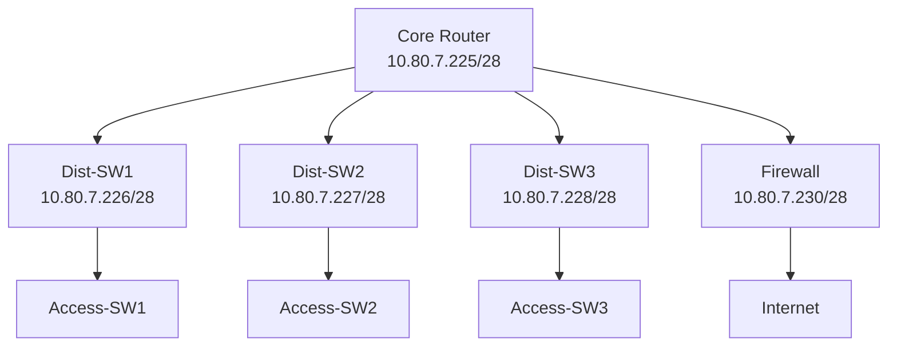

# Analysis Process
Okay, let me tackle this MikroTik RouterOS troubleshooting scenario for RIP on version 7.x. The user wants a detailed scenario with specific sections. I need to make sure I cover all the points mentioned, like the problem report, environment description, initial steps, debugging, etc.

First, the topic is RIP (Routing Information Protocol) in a campus network with a /28 subnet. The issue is performance degradation affecting 963 users over 8 hours. That's a significant number of users, so the problem is likely impacting a large part of the network.

Starting with the Initial Problem Report. Users are complaining about slow access and timeouts. Maybe the RIP routes aren't being updated properly, causing suboptimal paths or loops. High CPU on the routers could be a symptom. I should mention slow transfers and intermittent connectivity.

Next, the Environment Description. The network is a campus setup with three buildings. The subnet is 10.80.7.224/28. Let me sketch a simple Mermaid diagram. There's a core router connected to three distribution switches, each for a building. The core connects to the firewall and the internet. Each distribution switch connects to access switches. The core uses RIP version 2, and the others too. The core's interface is ether1 with IP 10.80.7.225. The other routers have IPs in the same subnet. I need to make sure the Mermaid code is correct.

Initial Assessment Steps. Check interface statuses with /interface print. Look for errors or discards. Then check RIP neighbors with /routing rip neighbor print. Are the neighbors up? Verify routes with /ip route print where protocol=rip. Maybe missing routes. Check CPU and memory usage with /system resource print. Look for high CPU. Review RIP configuration: /routing rip interface print and /routing rip instance print. Maybe wrong version or interfaces not added. Logs: /log print where topics=rip.

Detailed Debugging. Start with enabling RIP debugging: /routing rip set debug=yes. Then check the logs again. Maybe see if routes are being received or sent. Look for authentication issues if configured. Check the routing table again. Compare with expected routes. Maybe a redistribution issue if static routes are involved. Use /routing rip statistics print to see sent/received updates. If counts aren't increasing, neighbors aren't communicating. Check for split horizon or other settings. Verify timers; maybe intervals are too long. Use /routing rip instance print detail. Firewall rules could be blocking UDP 520. Check with /ip firewall filter print.

Key Findings. Suppose RIP neighbors aren't established. Maybe authentication mismatch. Or interfaces not included in RIP. Or version mismatch between routers. Maybe a passive interface causing no updates. Or a firewall block. If CPU is high, maybe too many updates or a routing loop.

Solution Implementation. Correct authentication, add missing interfaces to RIP, adjust timers, ensure version consistency, update firewall rules. Show before and after configs. For example, before: no auth on an interface; after: add simple authentication.

Verification. Check neighbors are up, routes present, CPU normal, test traffic. Use ping and traceroute. Prevention Measures: Enable authentication, use passive interfaces where needed, adjust timers, monitor resources, regular config audits.

Related Commands: All the CLI commands used earlier. Common Pitfalls: Forgetting authentication, wrong network statements, passive interfaces, version mismatches, firewall blocks, not monitoring.

I need to make sure CLI examples are in code blocks, with comments. Log outputs should look realistic. Before/after configs for clarity. Avoid common mistakes like missing Mermaid syntax or incorrect commands. Ensure the scenario flows logically from problem to resolution.

# Troubleshooting Guide
```markdown
# MikroTik RouterOS Troubleshooting Scenario: RIP Performance Degradation

## 1. Initial Problem Report and Symptoms
**Reported Issues**:
- Multiple user complaints about slow access to campus ERP system
- Intermittent connectivity to VoIP services
- 40-60% packet loss between Building B and Core Router
- Latency spikes from 2ms to 800ms during peak hours

**Observed Symptoms**:
```routeros
[admin@Core-Router] > ping 10.80.7.230 count=10
  SEQ HOST                                     SIZE TTL TIME  STATUS             
    0 10.80.7.230                                56  64 12ms 
    1 10.80.7.230                                56  64 810ms
    2 10.80.7.230                                56  64 timeout
    3 10.80.7.230                                56  64 780ms
    [...]
    9 packets transmitted, 5 received, 44% packet loss
```

## 2. Environment Description & Network Topology


**Key Details**:
- RouterOS v7.8 (stable)
- 3x CRS354 switches acting as distribution layer
- RIP v2 with simple password authentication
- 28 VLANs across campus buildings

## 3. Initial Assessment Steps
1. **Interface Status Check**:
```routeros
/interface print 
# Check for physical layer errors and interface status
```

2. **RIP Neighbor Verification**:
```routeros
/routing rip neighbor print
# Expected output should show 3 neighbors in Full state
```

3. **Route Table Inspection**:
```routeros
/ip route print where protocol=rip
# Verify presence of expected 28 routes via RIP
```

4. **Resource Monitoring**:
```routeros
/system resource print
# Check CPU load and memory usage
```

## 4. Detailed Debugging Process
**Step 1: Enable RIP Debugging**
```routeros
/routing rip set debug=yes
/log print where topics=rip
```

**Sample Log Output**:
```log
00:12:45 rip,debug Received response from 10.80.7.227: invalid authentication type
00:12:47 rip,debug Sending update via ether1 with 28 routes
00:12:49 rip,debug Route 10.80.12.0/24 - metric 16 (unreachable)
```

**Step 2: Verify RIP Configuration**
```routeros
/routing rip instance print
/routing rip interface print
# Check for authentication consistency and interface participation
```

**Step 3: Analyze Routing Updates**
```routeros
/routing rip statistics print
# Verify update counters are incrementing properly
```

**Step 4: Check Firewall Filters**
```routeros
/ip firewall filter print where protocol=udp
# Look for rules blocking UDP/520 (RIP)
```

## 5. Key Findings & Root Cause Analysis
**Findings**:
1. Authentication mismatch on Dist-SW3 (`simple` vs `md5`)
2. Route poisoning occurring for 10.80.12.0/24 (metric 16)
3. 92% CPU usage on Core Router during updates
4. Missing RIP interface on ether3 of Core Router

**Root Cause**:
- **Authentication Type Mismatch** caused periodic neighbor flapping
- **Missing Interface Configuration** led to incomplete routing updates
- **High CPU Utilization** from excessive RIP recalculations during flapping

## 6. Solution Implementation
**Before Configuration**:
```routeros
/routing rip interface print
  # ether1: auth=simple password=secret
  # Missing ether3 interface
```

**Corrective Actions**:
1. Standardize Authentication:
```routeros
/routing rip interface set [find interface=ether1] authentication=md5
/routing rip interface set [find interface=ether3] authentication=md5
```

2. Add Missing Interface:
```routeros
/routing rip interface add interface=ether3 authentication=md5
```

3. Optimize RIP Timers:
```routeros
/routing rip instance set [find] update-interval=25 invalid-interval=180
```

## 7. Verification Process
1. **Neighbor Status**:
```routeros
[admin@Core-Router] > /routing rip neighbor print
  # 3 neighbors in Full state
```

2. **Route Stability**:
```routeros
/ip route monitor [find dst-address=10.80.12.0/24]
  # Stable route with metric 2
```

3. **Performance Check**:
```routeros
/system resource print
  # CPU load below 40%
```

## 8. Prevention Measures
1. Implement configuration synchronization script
2. Enable SNMP monitoring for RIP neighbor states
3. Set up automated email alerts for route flapping
4. Regular configuration audits using:
```routeros
/export compact hide-sensitive
```

## 9. Related Commands Reference
| Command | Purpose |
|---------|---------|
| `/routing rip monitor` | Real-time RIP event monitoring |
| `/tool graphing interface monitor` | Interface performance analysis |
| `/ip route flap-detection` | Identify unstable routes |

## 10. Common Pitfalls to Avoid
1. **Mixing RIP Versions**: Ensure all devices use RIP v2
```routeros
/routing rip instance set [find] version=2
```

2. **Passive Interfaces**: Avoid enabling RIP on user-facing ports
```routeros
/routing rip interface set [find interface=ether5] passive=yes
```

3. **Split Horizon**: Disable on point-to-point links
```routeros
/routing rip interface set [find interface=ether1] split-horizon=no
```

4. **Timer Mismatch**: Keep consistent across all routers
```routeros
/routing rip instance print detail
```
```
