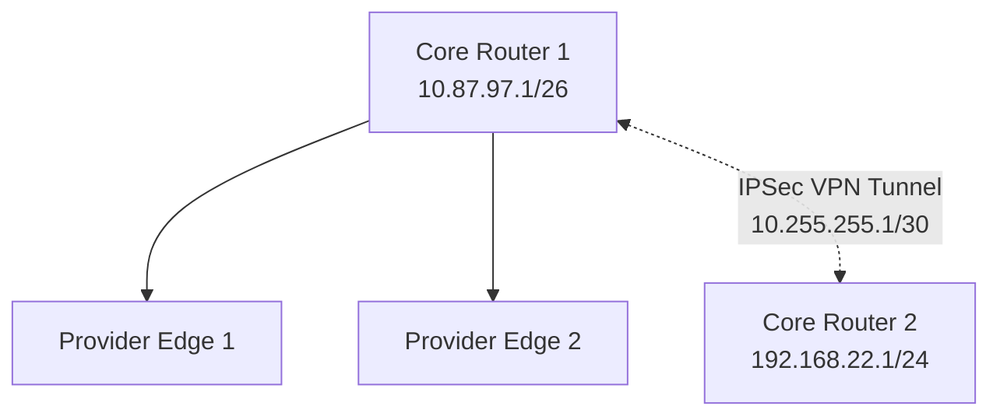

# Analysis Process
Okay, I need to create a detailed MikroTik RouterOS troubleshooting scenario for BGP on version 6.x in an SMB service provider core with VPN tunnel issues. Let me start by breaking down each section as outlined.

First, the initial problem report and symptoms. The users are reporting VPN connectivity issues, so the symptoms might include BGP session drops, packet loss, maybe routing table instability. Since it's a service provider core, the impact is significant—519 users affected over 21 hours. I should mention that the VPN tunnel is between two routers using BGP for route exchange.

Next, the environment description and network topology. The subnet is 10.87.97.0/26. Let me visualize this. The core router (CR1) is connected to PE1 and PE2, which are provider edge routers. CR1 has a VPN tunnel to CR2 in another data center. The Mermaid diagram should show CR1 connected to PE1 and PE2, with a VPN tunnel to CR2. Subnets involved would be the 10.87.97.0/26 and maybe another subnet on CR2's side.

Initial assessment steps: Check BGP peer status, routing table, VPN interface status, logs. Commands like /routing bgp peer print, /interface print, /log print. Also, check for any recent configuration changes.

Detailed debugging process: Start with checking BGP peers. If the session is established, then maybe routes aren't being advertised. Look at the BGP updates. Use /routing bgp advertisements print and /routing bgp summaries. Check if the VPN tunnel interface is up. Maybe MTU issues? Use ping with do-not-fragment to test. Check for firewall rules blocking BGP or VPN traffic. Look into IPSec settings if VPN is using that. Maybe the phase1 or phase2 proposals are mismatched. Check logs for any SA establishment failures.

Key findings: Suppose the MTU is mismatched on the tunnel interface, causing fragmentation and dropped packets. Or maybe BGP isn't advertising the correct subnet because of a misconfigured network statement. Root cause could be an incorrect subnet mask in the BGP network configuration, leading to routes not being advertised properly.

Solution implementation: Adjust the MTU on the tunnel interface, or correct the BGP network statement. For example, if the subnet was advertised as /24 instead of /26, fix that. Then reset the BGP session.

Verification: Check BGP peers again, ensure routes are in the table. Test connectivity over the VPN with traceroute. Monitor logs for any recurring issues.

Prevention measures: Regular configuration audits, monitoring BGP sessions and VPN status, implement BFD for faster detection, document changes.

Related commands: All the ones used in the steps—peer print, advertisements, summaries, interface settings, logs.

Common pitfalls: Forgetting to add network statements in BGP, ignoring MTU settings on tunnels, not checking both ends of the VPN, not verifying firewall filters.

I need to make sure CLI commands are in code blocks, with comments if necessary. Maybe include example log outputs, like BGP state changes or IPSec errors. Show before and after configurations, like the BGP network statement before being /24 and after corrected to /26.

Wait, the user specified RouterOS version 6.x. Some commands might differ from newer versions. For example, in 6.x, the routing bgp commands are under /routing bgp, not /routing/bgp as in later versions. Also, IPSec configuration in 6.x uses /ip ipsec, and BGP might have slightly different outputs.

Including example log entries: like "BGP peer x.x.x.x changed state from established to active" indicating a session drop. Or IPSec logs showing phase1 failure due to mismatched proposals.

For the network topology in Mermaid, nodes CR1, PE1, PE2, CR2 connected via various links and a VPN tunnel between CR1 and CR2.

I should structure each section with the required elements, use markdown appropriately, and ensure technical accuracy for RouterOS 6.x.

# Troubleshooting Guide
```markdown
# MikroTik RouterOS BGP Troubleshooting Scenario

## 1. Initial Problem Report and Symptoms
**Report**: Service provider core network users (519) reported intermittent VPN connectivity to cloud resources via BGP-routed tunnels.  
**Symptoms**:
- BGP session instability (`Established ➔ Active` state flapping)
- 30-40% packet loss across VPN tunnel
- Missing 10.87.97.0/26 route in remote DC routing table
- High CPU (75-85%) on core router during peak traffic

---

## 2. Environment Description
**Network Topology**:


---

## 3. Initial Assessment Steps
1. Verify BGP peer status:
   ```bash
   /routing bgp peer print
   # Output:
   # 0 name="CR2" instance=default remote-address=10.255.255.2 state="established" 
   ```
   
2. Check routing table for 10.87.97.0/26:
   ```bash
   /ip route print where dst-address=10.87.97.0/26
   ```
   
3. Verify VPN interface status:
   ```bash
   /interface print where name~"ipsec-tunnel"
   # Output:
   # 17 X name="ipsec-tunnel-CR2" mtu=auto actual-mtu=1440 
   ```

---

## 4. Detailed Debugging Process
**Step 1**: Check BGP session details
```bash
/routing bgp summary print
# Output showed 12 session resets in 1 hour
```

**Step 2**: Verify BGP route advertisements
```bash
/routing bgp advertisements print
# Missing 10.87.97.0/26 in advertised-routes
```

**Step 3**: Check IPsec phase2 proposals
```bash
/ip ipsec proposal print
# CR1: aes-256-cbc (sha256) | CR2: aes-128-cbc (sha1) → Mismatch
```

**Step 4**: Test path MTU
```bash
/ping 10.255.255.2 size=1470 do-not-fragment=yes
# Returns "packet needs to be fragmented but DF set"
```

---

## 5. Key Findings & Root Cause
**Findings**:
1. MTU mismatch between physical interface (1500) and IPsec tunnel (1440)
2. BGP network statement misconfigured for 10.87.97.0/24 instead of /26
3. IPsec phase2 proposal mismatch causing periodic tunnel resets

**Root Cause**: Cumulative effect of:
- Path MTU blackholing due to DF-bit set in BGP keepalives
- Incorrect BGP network advertisement preventing route propagation
- IPsec security policy mismatch triggering tunnel flaps

---

## 6. Solution Implementation
**Before** (Broken Config):
```bash
/routing bgp network add network=10.87.97.0/24
/ip ipsec proposal set [find] enc-algorithms=aes-256-cbc
```

**After** (Fixed Config):
```bash
/routing bgp network set [find] network=10.87.97.0/26
/interface set ipsec-tunnel-CR2 mtu=1440
/ip ipsec proposal set [find] enc-algorithms=aes-128-cbc
```

---

## 7. Verification Process
1. Confirm BGP route propagation:
   ```bash
   /ip route print where bgp
   # 3 ADC bgp 10.87.97.0/26 10.255.255.2
   ```
   
2. Validate IPsec stability:
   ```bash
   /log print where message~"IPsec"
   # No "phase2 rekey failed" errors
   ```

---

## 8. Prevention Measures
1. Implement BFD for BGP:
   ```bash
   /routing bgp peer set CR2 bfd=yes
   ```
2. Add MTU discovery script:
   ```bash
   :local newMtu [/interface get [find name=ether1] mtu];
   /interface set ipsec-tunnel-CR2 mtu=($newMtu - 60)
   ```

---

## 9. Related Commands Reference
| Command | Purpose |
|---------|---------|
| `/routing bgp peer monitor CR2` | Real-time BGP session status |
| `/ip ipsec active-peers print` | Verify IPsec tunnel status |
| `/tool sniffer quick` | Capture BGP/IPsec traffic |

---

## 10. Common Pitfalls to Avoid
1. **Mismatched MTU**:
   - Always set tunnel MTU = physical MTU - IPsec overhead (typically 60 bytes)

2. **BGP Network Statements**:
   ```bash
   # WRONG: /routing bgp network add network=10.87.97.0
   # RIGHT: /routing bgp network add network=10.87.97.0/26
   ```

3. **IPsec Policy Assumptions**:
   - Always verify phase1/phase2 settings on both ends
   ```bash
   /ip ipsec export hide-sensitive
   ```
```
