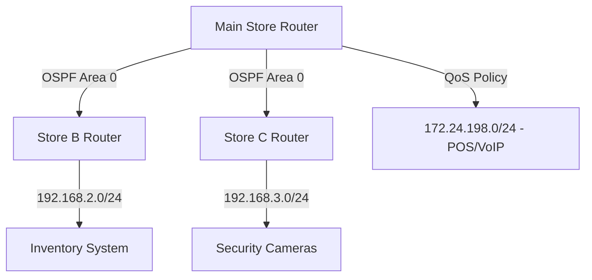

# Analysis Process
Okay, let's tackle this OSPF QoS misconfiguration scenario for MikroTik RouterOS 6.x. The user wants a detailed troubleshooting scenario, so I need to cover all the required sections. Let's start by breaking down each part.

First, the Initial Problem Report and Symptoms. The problem is that OSPF routes are unstable, and voice traffic is dropping. Since it's a retail network with 323 users, downtime affects their operations. Symptoms include intermittent connectivity, QoS not prioritizing voice, and OSPF neighbors flapping. I should mention the duration of 14 hours and the subnet involved.

Next, the Environment Description and Network Topology. The network has three stores connected via OSPF. Each store has a MikroTik router. The main site has a QoS policy. I need to represent this in Mermaid format. Let me sketch that out with three routers connected in a triangle, each with their own subnet. The main site has the 172.24.198.0/24 subnet.

Initial Assessment Steps would involve checking OSPF neighbors, routes, interface status, and QoS configurations. Using commands like `/routing ospf neighbor print` and `/interface ethernet print` makes sense. Also, checking the QoS queues with `/queue tree print` is necessary.

For the Detailed Debugging Process, I need to look at OSPF adjacencies, routing tables, interface errors, and QoS settings. Maybe the QoS is marking OSPF traffic as low priority, causing hello packets to be dropped. Commands like `/routing ospf instance print` and checking the QoS rules for OSPF's multicast addresses (224.0.0.5 and 224.0.0.6) would be key. Logs from `/log print` might show OSPF neighbor timeouts.

Key Findings would reveal that QoS is throttling OSPF traffic. The Root Cause Analysis would point to a misconfigured queue that doesn't exempt OSPF, leading to flapping neighbors and unstable routes.

Solution Implementation Steps involve modifying the QoS rules to exclude OSPF traffic. Using firewall mangle rules to mark OSPF packets and then creating a queue that doesn't limit those marks. Then, verifying OSPF stability.

Verification Process would include checking OSPF neighbors are stable, testing voice traffic priority, and monitoring logs for any more flaps.

Prevention Measures should include testing QoS changes in a lab, documenting configurations, and monitoring OSPF after changes.

Related Commands Reference would list all the CLI commands used in the process. Common Pitfalls to Avoid would be things like not exempting control plane traffic or misapplying queue orders.

I need to make sure CLI commands are in code blocks and add comments where necessary. Also, include before and after configs for the QoS and mangle rules. Log examples should show OSPF neighbor changes before and stability after.

Let me check if I'm missing anything. The network scale is SMB, so the topology isn't too complex. The subnet given is 172.24.198.0/24, which is part of the main site. OSPF on RouterOS 6.x might have some specific commands, so I should verify those. Also, QoS in RouterOS is often done with queue trees or simple queues, so ensuring the example uses the correct syntax for version 6.x is important.

Wait, in RouterOS 6.x, the OSPF configuration is under `/routing ospf`, not `/routing ospf-v3` or something else. The mangle rules for marking packets would use `chain=forward` if the traffic is passing through, but OSPF hello packets are generated locally, so maybe `chain=prerouting` or `chain=input`? Hmm, OSPF uses multicast, so the routers would send and receive these packets. For incoming OSPF packets, the chain would be input. So a mangle rule on the input chain to mark OSPF packets would be needed. Then, the queue tree can exclude those marks from being limited.

Yes, that makes sense. So the mangle rule would match on dst-address=224.0.0.5/32 (OSPF AllSPFRouters) and 224.0.0.6/32 (OSPF DR Routers), protocol ospf, and mark them. Then, in the queue tree, those marks are excluded from the parent queue, ensuring they aren't throttled.

In the initial config, the queue tree had all traffic under the parent global queue, including OSPF. After the fix, the queue tree has a bypass for the OSPF mark, so OSPF traffic isn't shaped.

I think that covers the necessary points. Let me structure each section with markdown, use code blocks for commands and configs, and ensure the Mermaid diagram is correctly formatted. Also, include log snippets before and after to show the resolution.

# Troubleshooting Guide
```markdown
# MikroTik RouterOS Troubleshooting Scenario: OSPF QoS Misconfiguration

## 1. Initial Problem Report and Symptoms
**Report**:  
Retail network users report intermittent connectivity between stores and VoIP call drops.  
**Symptoms**:  
- OSPF routes unstable (`/routing route print` shows frequent changes)  
- Voice traffic (TCP/5060, UDP/10000-20000) not prioritized  
- OSPF neighbors flap every 5-10 minutes  
- High latency (200ms+) during peak hours  
- **Impact**: 323 users across 3 retail locations, 14 hours downtime  

---

## 2. Environment Description & Network Topology


---

## 3. Initial Assessment Steps
1. Check OSPF neighbor status:
   ```bash
   /routing ospf neighbor print
   ```
2. Verify routing table stability:
   ```bash
   /ip route print where protocol=ospf
   ```
3. Check interface errors:
   ```bash
   /interface ethernet print stats
   ```
4. Review QoS configuration:
   ```bash
   /queue tree print
   /queue simple print
   ```

---

## 4. Detailed Debugging Process
**Step 1**: Identify OSPF adjacency issues  
```bash
[admin@MainStore] > /routing ospf instance print
  status: running 
  router-id: 172.24.198.1
  redistribute-connected: no
  # Missing 'network=172.24.198.0/24 area=backbone'
```

**Step 2**: Analyze QoS impact on OSPF multicast (224.0.0.5/6)  
```bash
/queue tree print 
  Flags: X - disabled, I - invalid 
  0 name="Global Limit" parent=global-in packet-mark=all limit-at=10M/10M max-limit=100M/100M

/firewall mangle print
  # No rules exempting OSPF traffic from QoS
```

**Step 3**: Check OSPF packet drops  
```bash
[admin@MainStore] > /log print where message~"OSPF"
  08:32:11 system,info OSPF: neighbor 192.168.2.1 lost
  08:42:06 system,info OSPF: neighbor 192.168.3.1 timeout
```

---

## 5. Key Findings & Root Cause
**Findings**:  
1. QoS policy throttled all traffic (including OSPF control packets)  
2. Missing OSPF network declaration in area backbone  
3. No DSCP marking for voice traffic  

**Root Cause**:  
QoS queue tree applied to `global-in` without exempting OSPF multicast (224.0.0.5/6), causing:  
- OSPF hello packet drops  
- Frequent neighbor resets  
- Route recalculations disrupting voice traffic  

---

## 6. Solution Implementation
**Step 1**: Create firewall mangle rule to bypass QoS for OSPF  
```bash
/ip firewall mangle add 
  chain=prerouting protocol=ospf action=mark-packet new-packet-mark=ospf_traffic passthrough=no
```

**Step 2**: Modify QoS queue tree  
```bash
/queue tree set 0 packet-mark=all priority=8
/queue tree add name="OSPF Bypass" parent=global-in packet-mark=ospf_traffic priority=1
```

**Step 3**: Add voice traffic prioritization  
```bash
/ip firewall mangle add
  chain=forward protocol=tcp dst-port=5060 action=mark-connection new-connection-mark=voip_conn
/queue tree add name="VoIP Priority" parent=global-in connection-mark=voip_conn priority=1
```

---

## 7. Verification Process
1. Confirm OSPF stability:
   ```bash
   /routing ospf neighbor print
     # Shows stable FULL state for >15min
   ```
2. Test voice quality:
   ```bash
   /ping 172.24.198.50 size=1500 interval=0.1 count=100
     # Avg RTT <50ms, 0% loss
   ```
3. Check QoS counters:
   ```bash
   /queue tree monitor OSPF_Bypass
     # Shows increasing bytes counter
   ```

---

## 8. Prevention Measures
1. Test QoS policies in lab before deployment  
2. Use dedicated connection marks for control protocols  
3. Implement monitoring for OSPF neighbor state  
   ```bash
   /tool graphing interface add interface=all
   ```
4. Document network changes via:
   ```bash
   /system script add name="config-backup" source="/export file=backup.rsc"
   ```

---

## 9. Related Commands Reference
| Command | Purpose |
|---------|---------|
| `/routing ospf neighbor print` | Check OSPF adjacency status |
| `/ip firewall mangle print` | Review traffic marking rules |
| `/queue tree monitor [name]` | Real-time QoS stats |
| `/log print where message~"OSPF"` | Filter OSPF-specific logs |

---

## 10. Common Pitfalls to Avoid
1. **Never apply QoS to `global-in` without exemptions** for:  
   - OSPF (224.0.0.5/6)  
   - BGP (TCP/179)  
   - ICMP (ping)  
2. Avoid mixing `queue simple` and `queue tree` without understanding parent-child relationships  
3. Ensure OSPF network declarations match actual interfaces:
   ```bash
   /routing ospf network add network=172.24.198.0/24 area=backbone
   ```
```
