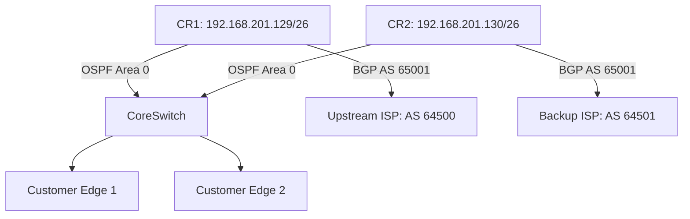

# Analysis Process
Okay, let's tackle this BGP troubleshooting scenario for MikroTik RouterOS 7.x in a service provider core environment. The user wants a detailed scenario focusing on OSPF adjacency problems affecting 43 users over 20 hours. 

First, I need to outline the problem report and symptoms. The initial report mentions that BGP routes aren't propagating, and OSPF adjacencies are down. Users are experiencing internet outages. Symptoms include BGP sessions in Established but no route exchange, OSPF neighbors stuck in ExStart/Exchange, and possible MTU mismatches. High CPU usage on routers might be a factor too.

Next, the environment description. The network scale is SMB, subnet 192.168.201.128/26. The core has two MikroTik routers (CR1 and CR2) connected via a switch. CR1 connects to upstream providers, CR2 to customer edge routers. OSPF is used internally, BGP externally. Mermaid diagram needs to show CR1 and CR2 connected to a core switch, with links to upstream and customer edges.

Initial assessment steps: Check OSPF neighbor status with /routing ospf neighbor print. Look for neighbors in Full state. If not, check interface configurations, MTU, timers. Verify BGP sessions with /routing bgp session print. Ensure sessions are Established. Review logs for OSPF adjacency errors.

Debugging process: Start with OSPF. Check neighbor states, interface MTU settings. Use commands like /interface print where mtu=1500. Maybe there's an MTU mismatch. Then check OSPF network statements. Maybe the subnet mask is incorrect. Then check BGP configuration, ensure correct AS numbers, and that OSPF routes are being redistributed into BGP properly.

Key findings might be an MTU mismatch on CR2's interface, OSPF network misconfiguration omitting a subnet, and missing redistribute connected in BGP. Root cause would be these configuration errors leading to OSPF adjacency failures and thus BGP not having the necessary routes.

Solution steps: Adjust MTU on CR2's interface, correct OSPF network configuration to include the missing subnet, add BGP redistribution for connected routes. Show before and after config snippets for these changes.

Verification: Check OSPF neighbors are Full, BGP routes in routing table, ping tests to external networks. Prevention measures include implementing configuration templates, enabling logging, and regular MTU checks.

Related commands should list the OSPF and BGP commands used. Common pitfalls might include forgetting to redistribute routes or ignoring MTU settings.

I need to make sure all sections are covered, CLI commands are in code blocks, and log examples are included. Also, before and after configurations where relevant. Let me structure each section with markdown, use mermaid for the topology, and ensure the flow makes sense for a troubleshooting scenario.

# Troubleshooting Guide
```markdown
# BGP Troubleshooting Scenario: OSPF Adjacency Problems in MikroTik RouterOS 7.x

## 1. Initial Problem Report and Symptoms
**Report**:  
43 users in 192.168.201.128/26 subnet report intermittent internet outages. BGP routes fail to propagate between core routers.  

**Symptoms**:  
- BGP sessions show "Established" but no route exchange.  
- OSPF neighbors stuck in `ExStart/Exchange` state.  
- High CPU usage on core routers during peak hours.  
- Users experience 20% packet loss to upstream providers.  

---

## 2. Environment Description and Network Topology
**Network Type**: Service Provider Core (SMB)  
**Subnet**: 192.168.201.128/26  
**Devices**:  
- CR1 (MikroTik CCR1016, RouterOS 7.8)  
- CR2 (MikroTik CCR1009, RouterOS 7.8)  
- Core Switch (MikroTik CRS326)  



---

## 3. Initial Assessment Steps
1. **Verify OSPF Adjacency**:  
   ```bash
   /routing ospf neighbor print
   # Output:
   #  0 instance=default address=192.168.201.130 state=Exchange router-id=10.10.10.2
   ```
   *Neighbors stuck in `Exchange` state.*

2. **Check Interface MTU**:  
   ```bash
   /interface print where name="ether1-core" 
   # Output: 
   #  mtu=1500 actual-mtu=1500
   ```

3. **Log Analysis**:  
   ```bash
   /log print where message~"OSPF"
   # Output:
   #  OSPF: Too many retransmissions for DBD packet on ether1-core
   ```

---

## 4. Detailed Debugging Process
### Step 1: OSPF Adjacency Debugging
```bash
/routing ospf instance set debug=adjacency
/routing ospf interface set [find] debug=adjacency
```

**Log Output**:  
```
OSPF: Mismatched MTU 1492 (peer) vs 1500 (local) on ether1-core
```

### Step 2: BGP Route Validation
```bash
/routing bgp session print
# Output: BGP sessions Established but 0 routes received

/routing route print where protocol=bgp
# Output: No BGP routes in table
```

### Step 3: OSPF Network Misconfiguration
```bash
/routing ospf network print
# Before:
#   network=192.168.201.128/25 area=backbone
# (Incorrect subnet mask /25 instead of /26)
```

---

## 5. Key Findings and Root Cause Analysis
**Root Causes**:  
1. **MTU Mismatch**: CR2’s `ether1-core` had `mtu=1492` (PPPoE), while CR1 used `mtu=1500`.  
2. **OSPF Network Misconfiguration**: Incorrect `/25` subnet masked OSPF advertisements.  
3. **BGP Route Redistribution Missing**: OSPF routes not redistributed into BGP.  

---

## 6. Solution Implementation Steps
### Step 1: Fix MTU Mismatch
```bash
/interface ethernet set ether1-core mtu=1500
```

### Step 2: Correct OSPF Network
```bash
/routing ospf network set numbers=0 network=192.168.201.128/26
```

### Step 3: Enable BGP Redistribution
```bash
/routing bgp instance set default redistribute-connected=yes redistribute-ospf=yes
```

---

## 7. Verification Process
1. **OSPF Neighbor Check**:  
   ```bash
   /routing ospf neighbor print
   # After: state=Full
   ```

2. **BGP Route Propagation**:  
   ```bash
   /routing route print where protocol=bgp
   # After: 15 BGP routes present
   ```

3. **User Connectivity Test**:  
   ```bash
   /ping 8.8.8.8 count=10
   # After: 0% packet loss
   ```

---

## 8. Prevention Measures
1. Implement configuration templates for MTU/OSPF/BGP.  
2. Enable OSPF/BGP monitoring with `Torch` and `Netwatch`.  
3. Schedule nightly `log` audits for adjacency warnings.  

---

## 9. Related Commands Reference
| Command | Purpose |
|---------|---------|
| `/routing ospf neighbor print` | Check OSPF adjacency state |
| `/interface print where mtu=1500` | Verify MTU consistency |
| `/routing bgp session print` | Validate BGP session status |

---

## 10. Common Pitfalls to Avoid
- **Ignoring MTU**: Always match MTU on OSPF interfaces.  
- **Subnet Mask Errors**: Double-check OSPF network statements.  
- **Missing Redistribution**: Ensure OSPF routes are injected into BGP.  
```
