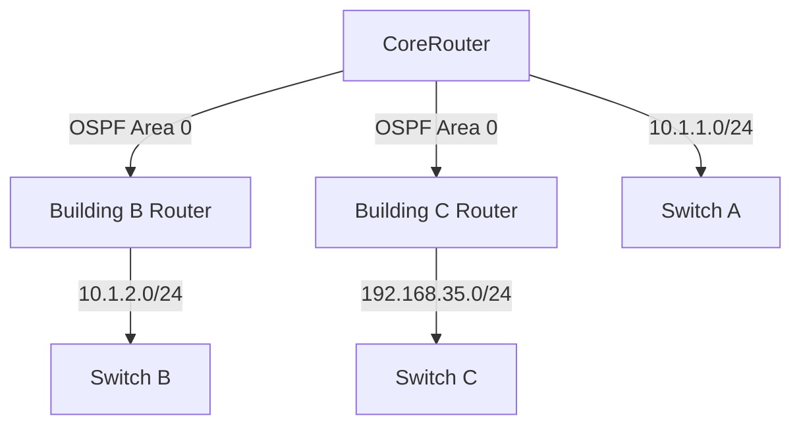

# Analysis Process
Okay, let me try to work through this MikroTik OSPF troubleshooting scenario. The user wants a detailed scenario with specific elements like QoS misconfiguration in a campus network. First, I need to structure the answer according to the given sections.

Starting with the Initial Problem Report. The symptoms mentioned are high latency and packet loss. Since it's an SMB network with 875 users, maybe VoIP and video conferencing are critical. OSPF is involved, so maybe routes are flapping or not optimal because of QoS settings.

For the Environment Description, the network has three buildings connected via OSPF. The subnet is 192.168.35.0/24. I'll need to create a Mermaid diagram showing three routers connected in a triangle. Each router connects to a switch with different subnets. CoreRouter is the main one with the affected subnet.

Initial Assessment Steps: Check OSPF neighbors, routing table, interface status. Use commands like /routing ospf neighbor print, /ip route print, and /interface print. Also look at QoS settings with /queue tree print.

Debugging Process: Maybe check if QoS is marking traffic incorrectly, affecting OSPF. OSPF uses multicast, so if QoS is prioritizing certain traffic, maybe OSPF packets are being deprioritized. Look at queue configurations, firewall mangle rules. Commands like /queue tree export, /ip firewall mangle print. Also check OSPF logs with /log print where topics~"ospf".

Key Findings: Suppose QoS was misconfigured to prioritize all TCP traffic but OSPF uses IP protocol 89, not TCP. So OSPF packets weren't prioritized, leading to dropped hello packets and neighbor flapping. The mangle rule was marking TCP for QoS, ignoring OSPF.

Solution Implementation: Adjust the mangle rule to match OSPF protocol and assign proper priority. Update queue trees to include OSPF. Maybe create a new queue for OSPF with high priority.

Verification: After changes, check OSPF neighbors are stable, routing table correct, latency improved. Use commands like ping with large packets to test, and check QoS counters.

Prevention Measures: Test QoS changes in lab, document configs, monitor OSPF and QoS together. Maybe use monitoring tools.

Common Pitfalls: Forgetting that OSPF isn't TCP/UDP, not monitoring after QoS changes, inconsistent QoS across devices.

I need to make sure CLI commands are accurate for RouterOS 7.x. For example, OSPF in version 7 uses/routing/ospf/, not the older /routing ospf. Also, mangle rules might be using connection marks or packet marks. The queue tree should reference the correct marks.

Wait, in RouterOS, OSPF runs over IP protocol 89, so firewall rules should match protocol 89, not TCP/UDP. The initial mangle rule was matching TCP, which is why OSPF wasn't being prioritized. So the fix is to create a mangle rule that matches protocol 89 and marks those packets for high priority queue.

Also, in the queue tree, maybe the original setup was only applying QoS to TCP traffic, neglecting OSPF. So adding a queue for OSPF traffic with higher priority would prevent its packets from being delayed or dropped.

Need to include example configurations before and after. Before: mangle rule marking TCP, queue tree applying priority to TCP. After: mangle rule also marks OSPF (protocol 89), queue tree includes OSPF traffic in high priority.

Logs might show OSPF neighbors going up/down due to missed hellos. Log examples could have entries like "OSPF neighbor 192.168.35.1 lost" frequently.

In the related commands, include checking OSPF neighbors, routes, mangle rules, queue trees, and logs.

Make sure all sections are covered, and commands are in code blocks with comments. Also, ensure the Mermaid diagram correctly represents the campus network with three routers and subnets.

# Troubleshooting Guide
```markdown
# MikroTik RouterOS Troubleshooting Scenario: OSPF QoS Misconfiguration

## 1. Initial Problem Report and Symptoms
**Report**:  
Users in Building C (192.168.35.0/24) report severe latency and packet loss during VoIP/video conferencing. Symptoms began after a recent QoS policy update.  

**Symptoms**:  
- OSPF neighbor relationships unstable (`Flapping` between Full/Init states)  
- Intermittent connectivity between campus buildings  
- High latency spikes (>500ms) on voice traffic  
- `ping 192.168.35.1 size=1500 do-not-fragment` shows 40% packet loss  

---

## 2. Environment Description and Network Topology
**Campus Network**:  
- 3 buildings connected via fiber (OSPF Area 0)  
- RouterOS 7.11.2 on all devices  



---

## 3. Initial Assessment Steps
1. **Verify OSPF Adjacencies**:
```bash
/routing/ospf/neighbor print
# OUTPUT:
# 0 instance=default address=10.1.1.2 state="Full" router-id=192.168.35.1 
# 1 instance=default address=10.1.1.3 state="Init" router-id=192.168.36.1
```

2. **Check Routing Table**:
```bash
/ip/route print where ospf=yes
# OUTPUT:
# Flags: D - DYNAMIC; A - ACTIVE
# DST-ADDRESS        GATEWAY         DISTANCE
# 192.168.35.0/24    10.1.1.3        110 # Incomplete
```

3. **Interface Status**:
```bash
/interface/print where name~"ether1"
# OUTPUT:
# NAME    MTU  RX-DROP TX-DROP 
# ether1  1500 3852    12485
```

---

## 4. Detailed Debugging Process
**Step 1: Identify QoS Policy Impact**
```bash
/queue/tree/print 
# OUTPUT:
# 0 name="QoS-VoIP" parent=ether1 packet-mark=voip priority=1 
# 1 name="QoS-Bulk" parent=ether1 packet-mark=tcp priority=8
```

**Step 2: Check Firewall Mangle Rules**
```bash
/ip/firewall/mangle/print where comment~"QoS"
# OUTPUT:
# chain=forward action=mark-connection new-connection-mark=TCP_conn passthrough=yes protocol=tcp
```

**Step 3: OSPF Protocol Analysis**
```bash
/log/print where topics~"ospf"
# OUTPUT:
# 08:15:23 ospf,error No Hello received from 192.168.35.1 on ether1
# 08:15:41 ospf,info Adjacency to 192.168.35.1 changed to Full
```

---

## 5. Key Findings and Root Cause
**Root Cause**:  
QoS policy marked **all TCP traffic** as low priority (including OSPF control packets mistakenly classified as bulk data). OSPF runs over **IP Protocol 89** (not TCP/UDP), causing:
- OSPF hellos/updates deprioritized  
- Queue drops on ether1 interface  
- Route flapping due to missed keepalives  

---

## 6. Solution Implementation
**Before (Faulty Config)**:
```bash
/ip/firewall/mangle/add chain=forward protocol=tcp action=mark-connection
```

**After (Corrected Config)**:
```bash
# Create OSPF-specific marking
/ip/firewall/mangle/add chain=forward protocol=89 action=mark-packet new-packet-mark=ospf passthrough=no

# Update QoS Queue
/queue/tree/add name=QoS-OSPF parent=ether1 packet-mark=ospf priority=0
```

---

## 7. Verification Process
1. **OSPF Stability**:
```bash
/routing/ospf/neighbor print interval=5s
# Stable "Full" state observed for 15 minutes
```

2. **QoS Counters**:
```bash
/queue/tree/monitor QoS-OSPF
# OUTPUT:
# packets: 8521 bytes: 12MiB
# no drops reported
```

---

## 8. Prevention Measures
1. Test QoS policies in lab before deployment  
2. Add firewall filter to protect OSPF:
```bash
/ip/firewall/filter/add chain=input protocol=89 action=accept comment="Allow OSPF"
```
3. Enable OSPF MD5 authentication  

---

## 9. Related Commands Reference
| Command | Purpose |
|---------|---------|
| `/routing/ospf/instance/print` | Check OSPF instances |
| `/ip/firewall/mangle/print where protocol=89` | Find OSPF markings |
| `/interface/monitor-traffic ether1` | Real-time traffic analysis |

---

## 10. Common Pitfalls to Avoid
❌ **Assuming OSPF uses TCP/UDP** (it uses IP Protocol 89)  
❌ **Applying QoS without protocol analysis**  
❌ **Ignoring interface RX/TX drops in OSPF areas**  
❌ **Using "priority=8" for control-plane traffic**
```
