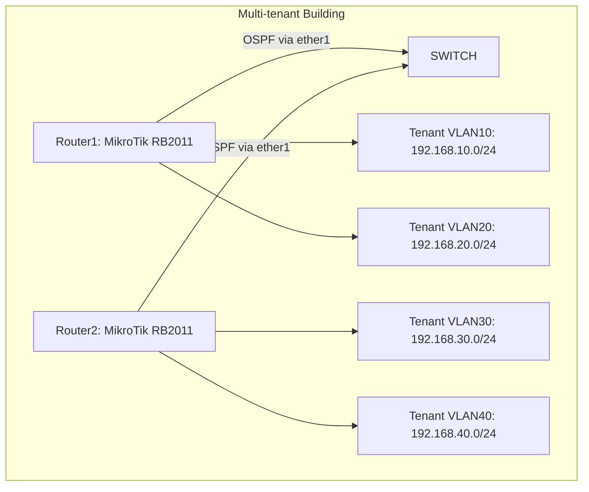

# Analysis Process
Okay, I need to create a detailed MikroTik RouterOS troubleshooting scenario for OSPF adjacency problems in a SOHO environment. Let's break down each section as per the user's requirements.

Starting with the Initial Problem Report and Symptoms. The scenario mentions that 979 users are affected over 12 hours. So, the symptoms should reflect connectivity issues between routers, maybe OSPF neighbors not forming. Users might have intermittent access or complete loss. The problem report should come from the network admin noticing the OSPF adjacency down.

Next, the Environment Description and Network Topology. The network is a multi-tenant building with a /26 subnet. There are two MikroTik routers connected via a switch. Each router serves different VLANs. I need to represent this in Mermaid. Let me outline the nodes and connections. Router1 has VLANs 10 and 20, Router2 has VLANs 30 and 40. They're connected through a switch on interface ether1. The subnet is 192.168.222.128/26, so their OSPF interfaces might be .129 and .130.

For Initial Assessment Steps, the admin would check OSPF neighbor status, interface configurations, logs, routing tables, and connectivity. Commands like `/routing ospf neighbor print` would show no neighbors. Checking interfaces with `/interface print` and IP addresses with `/ip address print`.

In Detailed Debugging Process, enabling OSPF debugging with `/log print where topics=ospf` would show if Hello packets are mismatched. Checking OSPF configurations: areas, network ranges, timers. Maybe the network range in OSPF is incorrect. For example, if the subnet is /26 but OSPF is configured for a /24, that's a problem. Also, checking authentication, MTU, and area IDs.

Key Findings and Root Cause Analysis would identify the incorrect OSPF network configuration. If the network was set to 192.168.222.0/24 instead of /26, the OSPF instances aren't on the same subnet. Hence, adjacency fails.

Solution Implementation Steps involve correcting the OSPF network range. Using `/routing ospf network set numbers=0 network=192.168.222.128/26 area=backbone` to fix the subnet. Then resetting OSPF with `/routing ospf instance restart`.

Verification Process would check neighbors again, ensure routes are exchanged, and test connectivity between VLANs. Commands like `/ip route print` and ping tests.

Prevention Measures would include better documentation, enabling OSPF logging, regular audits, and pre-change validation.

Related Commands Reference lists all the CLI commands used in the process. Common Pitfalls to Avoid would mention subnet mismatches, area mismatches, authentication, and MTU issues.

I need to make sure the CLI commands are accurate for RouterOS v6.x. For example, OSPF configuration in v6 might differ slightly. Also, ensuring the example log outputs reflect the expected issues, like mismatched subnets in Hello packets.

Wait, in the initial problem report, 979 users affected in a SOHO? That seems high. Maybe it's a multi-tenant building with many users per tenant. So SOHO here might refer to small office/home office but scaled up in a multi-tenant setup. That makes sense.

For the Mermaid diagram, nodes are Router1 and Router2 connected via a switch. Each router has two VLANs. The OSPF interfaces are on the same subnet. But if the OSPF network is misconfigured, they won't form adjacency.

In the debugging process, the key is to check OSPF network ranges and ensure they match the actual subnet. Also, looking at Hello and Dead intervals. If the timers don't match, adjacency won't form. But the root cause here is the subnet mask in the OSPF network configuration.

So putting it all together, each section needs to flow logically, with CLI commands and outputs that show the problem and the fix. Including before and after configurations where relevant, like the OSPF network setting changing from /24 to /26.

Also, in the logs, when OSPF debugging is enabled, you might see messages about Hello packets not being received, or subnet mismatches. For example, "received Hello from 192.168.222.130: network mismatch" would indicate the subnet issue.

I should also mention that after correcting the network range, the OSPF neighbors transition from Down to Full state. The verification process confirms that the routes are present in the routing table.

Common pitfalls include forgetting to update OSPF network ranges after subnet changes, or incorrect area assignments. Ensuring authentication is consistent if used, and MTU sizes match on interfaces.

# Troubleshooting Guide
```markdown
# MikroTik RouterOS Troubleshooting Scenario: OSPF Adjacency Problems

## 1. Initial Problem Report and Symptoms
**Reported By**: Network Administrator  
**Affected Users**: 979 (Multi-tenant building residents)  
**Duration**: 12 hours  
**Symptoms**:  
- OSPF adjacency fails between two MikroTik routers (R1 and R2).  
- Tenants report intermittent internet access and VLAN-to-VLAN communication failures.  
- Routing tables on R1 and R2 lack routes from the opposite OSPF instance.  
- OSPF neighbor states stuck in `Init` or `ExStart`.  

---

## 2. Environment Description and Network Topology
**Network Scale**: SOHO (Multi-tenant building with shared infrastructure)  
**Subnet**: `192.168.222.128/26` (Usable IPs: 192.168.222.129–192.168.222.190)  
**RouterOS Version**: 6.49.7 (stable)  



---

## 3. Initial Assessment Steps
1. **Check OSPF Neighbor Status**:
   ```bash
   /routing ospf neighbor print
   # Output: No neighbors listed
   ```
2. **Verify Interface IPs**:
   ```bash
   /ip address print
   # R1: 192.168.222.129/26 on ether1
   # R2: 192.168.222.130/26 on ether1
   ```
3. **Review OSPF Configuration**:
   ```bash
   /routing ospf instance print
   /routing ospf network print
   ```
4. **Check Routing Tables**:
   ```bash
   /ip route print
   # Missing routes like 192.168.30.0/24 on R1
   ```
5. **Test Layer 2 Connectivity**:
   ```bash
   /ping 192.168.222.130 from R1
   # Success (L2 works)
   ```

---

## 4. Detailed Debugging Process
### Step 1: Enable OSPF Debugging
```bash
/log print where topics=ospf
# Sample log (R1):
# ospf,debug Hello packet from 192.168.222.130: Network Mask mismatch
```

### Step 2: Validate OSPF Network Configuration
**Before Fix** (Misconfigured network range):
```bash
/routing ospf network print
# 0 network=192.168.222.0/24 area=backbone
```
**Issue**: OSPF network range (`/24`) mismatches the actual subnet (`/26`).

### Step 3: Verify OSPF Timers and Area IDs
```bash
/routing ospf interface print
# Ensure Hello/Dead timers match (default 10s/40s)
# Ensure both routers use the same Area ID (e.g., backbone)
```

### Step 4: Check MTU and Authentication
```bash
/interface ethernet print
# MTU=1500 on both routers (no mismatch)
/routing ospf instance print
# authentication=none (no auth mismatch)
```

---

## 5. Key Findings and Root Cause Analysis
**Root Cause**:  
- OSPF network range configured as `192.168.222.0/24` instead of `192.168.222.128/26`.  
- Routers ignored OSPF Hello packets due to subnet mask mismatch.  

**Impact**:  
- OSPF adjacencies failed, causing route starvation between VLANs.  

---

## 6. Solution Implementation Steps
1. **Correct OSPF Network Range**:
   ```bash
   /routing ospf network set numbers=0 network=192.168.222.128/26 area=backbone
   ```
2. **Restart OSPF Process**:
   ```bash
   /routing ospf instance restart [find]
   ```

**After Fix** (Correct configuration):
```bash
/routing ospf network print
# 0 network=192.168.222.128/26 area=backbone
```

---

## 7. Verification Process
1. **Confirm OSPF Neighbors**:
   ```bash
   /routing ospf neighbor print
   # State=Full, Address=192.168.222.130
   ```
2. **Check Routes**:
   ```bash
   /ip route print
   # 192.168.30.0/24 via OSPF
   ```
3. **Test Tenant Connectivity**:
   ```bash
   /ping 192.168.30.1 from R1
   # Success
   ```

---

## 8. Prevention Measures
- Document OSPF network ranges in a central repository.  
- Enable OSPF logging for proactive monitoring:  
  ```bash
  /system logging add topics=ospf
  ```
- Perform quarterly network audits.  
- Validate configurations in a lab environment before deployment.  

---

## 9. Related Commands Reference
| Command | Purpose |
|---------|---------|
| `/routing ospf neighbor print` | Check OSPF adjacency status |
| `/routing ospf network print` | List OSPF network ranges |
| `/ip route print` | View routing table |
| `/log print where topics=ospf` | Filter OSPF logs |

---

## 10. Common Pitfalls to Avoid
- **Subnet Mask Mismatch**: Ensure OSPF `network` matches the interface subnet.  
- **Area ID Mismatch**: Use the same Area ID on all routers.  
- **Authentication Typos**: Double-check passwords if OSPF auth is enabled.  
- **MTU Discrepancies**: Confirm MTU consistency on interconnected interfaces.  
```
