### 1. Analysis Process

#### How to Approach This Problem
The issue involves OSPF performance degradation in a SOHO environment with 639 affected users over 22 hours. Since the priority is low, the focus should be on identifying the root cause without causing further disruption. The approach should be systematic:
1. **Gather Information**: Understand the symptoms, network topology, and recent changes.
2. **Initial Assessment**: Check basic OSPF configurations, neighbor adjacencies, and routing tables.
3. **Detailed Debugging**: Use OSPF-specific tools and logs to identify anomalies.
4. **Root Cause Analysis**: Correlate findings to pinpoint the issue.
5. **Solution Implementation**: Apply fixes and verify the resolution.
6. **Prevention Measures**: Ensure the issue does not recur.

#### Potential Causes
- **Misconfigured OSPF Areas**: Incorrect area configurations can lead to suboptimal routing.
- **Network Congestion**: High traffic can cause OSPF updates to be delayed or lost.
- **Flapping Links**: Unstable links can cause frequent OSPF recalculations.
- **MTU Mismatch**: Different MTU sizes can cause OSPF adjacency issues.
- **Resource Exhaustion**: High CPU or memory usage on routers can degrade OSPF performance.
- **Incorrect Timers**: Mismatched OSPF timers can cause neighbor adjacencies to fail.

#### Why Certain Steps Make Sense
- **Initial Assessment**: Quickly identifies obvious misconfigurations or issues.
- **Detailed Debugging**: Provides deeper insights into OSPF operations and potential anomalies.
- **Root Cause Analysis**: Ensures the solution addresses the actual problem, not just symptoms.
- **Verification**: Confirms that the solution works and does not introduce new issues.

#### Configurations to Consider
- **OSPF Area Configurations**: Ensure areas are correctly defined and configured.
- **Network Statements**: Verify that OSPF is enabled on the correct interfaces.
- **Timers**: Check hello and dead intervals for consistency.
- **MTU Settings**: Ensure all interfaces have consistent MTU sizes.
- **Resource Utilization**: Monitor CPU and memory usage on routers.

#### Specific Considerations for This Scale/Environment
- **SOHO Environment**: Limited resources and simpler topologies mean issues are often configuration-related.
- **Remote Site**: Limited physical access, so remote troubleshooting tools are essential.
- **Performance Degradation**: Focus on identifying and resolving bottlenecks affecting OSPF performance.

### 2. Troubleshooting Guide

#### Initial Problem Report and Symptoms
- **Report**: Users experiencing slow network performance.
- **Symptoms**: High latency, intermittent connectivity, and slow data transfer rates.
- **Duration**: 22 hours.
- **Affected Users**: 639.

#### Environment Description and Network Topology

```mermaid
graph TD
    A[Router A] -->|OSPF Area 0| B[Router B]
    B -->|OSPF Area 1| C[Router C]
    C -->|OSPF Area 1| D[Router D]
    D -->|OSPF Area 1| E[Router E]
    E -->|OSPF Area 1| F[Router F]
    F -->|OSPF Area 1| G[Router G]
    G -->|OSPF Area 1| H[Router H]
    H -->|OSPF Area 1| I[Router I]
    I -->|OSPF Area 1| J[Router J]
    J -->|OSPF Area 1| K[Router K]
    K -->|OSPF Area 1| L[Router L]
    L -->|OSPF Area 1| M[Router M]
    M -->|OSPF Area 1| N[Router N]
    N -->|OSPF Area 1| O[Router O]
    O -->|OSPF Area 1| P[Router P]
    P -->|OSPF Area 1| Q[Router Q]
    Q -->|OSPF Area 1| R[Router R]
    R -->|OSPF Area 1| S[Router S]
    S -->|OSPF Area 1| T[Router T]
    T -->|OSPF Area 1| U[Router U]
    U -->|OSPF Area 1| V[Router V]
    V -->|OSPF Area 1| W[Router W]
    W -->|OSPF Area 1| X[Router X]
    X -->|OSPF Area 1| Y[Router Y]
    Y -->|OSPF Area 1| Z[Router Z]
```


#### Initial Assessment Steps
1. **Check OSPF Neighbor Adjacencies**:
   ```bash
   /routing ospf neighbor print
   ```
2. **Verify OSPF Routes**:
   ```bash
   /ip route print where protocol=ospf
   ```
3. **Check Interface Status**:
   ```bash
   /interface print
   ```
4. **Monitor Resource Utilization**:
   ```bash
   /system resource print
   ```

#### Detailed Debugging Process with CLI Commands
1. **Enable OSPF Logging**:
   ```bash
   /log set [find where topics=ospf] info
   ```
2. **Check OSPF LSDB**:
   ```bash
   /routing ospf lsa print
   ```
3. **Verify OSPF Timers**:
   ```bash
   /routing ospf interface print
   ```
4. **Check for Flapping Links**:
   ```bash
   /log print where topics=interface
   ```

#### Key Findings and Root Cause Analysis
- **Finding**: OSPF neighbor adjacencies are flapping.
- **Root Cause**: MTU mismatch on Router B and Router C interfaces.

#### Solution Implementation Steps
1. **Adjust MTU Settings**:
   ```bash
   /interface ethernet set [find name=ether1] mtu=1500
   ```
2. **Restart OSPF Process**:
   ```bash
   /routing ospf instance disable [find name=main]
   /routing ospf instance enable [find name=main]
   ```

#### Verification Process
1. **Check OSPF Neighbor Adjacencies**:
   ```bash
   /routing ospf neighbor print
   ```
2. **Verify Network Performance**:
   - Ping tests between routers.
   - Monitor latency and packet loss.

#### Prevention Measures
- **Regular Monitoring**: Implement continuous monitoring of OSPF adjacencies and resource utilization.
- **Configuration Audits**: Regularly review and audit OSPF configurations.
- **Documentation**: Maintain up-to-date network documentation.

#### Related Commands Reference
- **OSPF Neighbor Information**:
  ```bash
  /routing ospf neighbor print
  ```
- **OSPF Routes**:
  ```bash
  /ip route print where protocol=ospf
  ```
- **OSPF LSDB**:
  ```bash
  /routing ospf lsa print
  ```
- **Interface Status**:
  ```bash
  /interface print
  ```
- **Resource Utilization**:
  ```bash
  /system resource print
  ```

#### Common Pitfalls to Avoid
- **Ignoring Logs**: Always check logs for clues.
- **Overlooking MTU**: Ensure MTU settings are consistent across all interfaces.
- **Neglecting Timers**: Verify that OSPF timers are consistent across all routers.
- **Resource Monitoring**: Regularly monitor CPU and memory usage to prevent resource exhaustion.