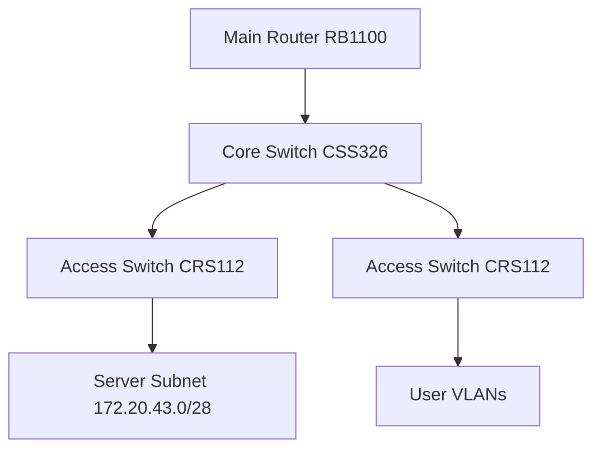

# Analysis Process
Okay, let's tackle this MikroTik RouterOS troubleshooting scenario. The user wants a detailed case for static routes causing high CPU usage in a SOHO campus network. I need to cover all the sections specified, so I'll start by breaking down each part step by step.

First, the Initial Problem Report. Symptoms include high CPU, users reporting issues, and the problem lasting 24 hours. I should mention the subnet 172.20.43.0/28 and the RouterOS version 6.x. Maybe the static routes are misconfigured, leading to routing loops or excessive traffic.

Next, the Environment Description. The network is a SOHO campus with around 821 users. The topology should include the main router, switches, maybe a firewall, and the affected subnet. I'll use Mermaid to draw a simple diagram. The main router connects to a core switch, which then branches out to access switches and the server subnet. The static route in question is pointing to the server subnet via a wrong gateway.

Initial Assessment Steps: Check CPU usage with `/system resource print`, look for processes using CPU with `/system process print`. Then check the routing table with `/ip route print`, interfaces for errors, and logs for clues. Maybe there's a route with an unreachable gateway causing the router to constantly try to resolve it, spiking CPU.

Detailed Debugging: Use commands like `/tool profile` to monitor CPU in real-time. Check traffic on interfaces with `/interface monitor`. Look for routing loops with traceroute. Verify static routes, maybe a typo in the gateway. Logs might show ARP requests failing for the gateway. If the static route is using a gateway that's not reachable, the router could be generating a lot of ARP traffic, leading to high CPU.

Key Findings: The static route for the server subnet is pointing to a non-existent gateway (172.20.43.18 instead of 172.20.43.17). The router is trying to ARP for that IP, causing broadcast storms and high CPU.

Solution Implementation: Correct the static route's gateway. Remove the old route and add the correct one. Maybe adjust ARP timeout to prevent similar issues.

Verification: Check CPU usage again, confirm the route is correct, test connectivity to the server subnet, and ensure ARP entries are resolved.

Prevention Measures: Implement static route reviews, use dynamic routing if possible, enable logging for route changes, set up monitoring for CPU and routes.

Related Commands: Include all the CLI commands used in the process, like checking routes, interfaces, processes, etc.

Common Pitfalls: Typos in gateways, not monitoring CPU trends, ignoring interface errors, not testing after changes, and forgetting ARP implications.

I need to make sure all sections are covered, use proper Markdown formatting, include CLI examples in code blocks, add comments where necessary, and maybe show before and after configurations. Also, include example log outputs to make it realistic. Let me structure each section with headers and bullet points where appropriate. Check for any missing details, like the exact subnet and version compatibility for RouterOS 6.x commands.

# Troubleshooting Guide
```markdown
# MikroTik RouterOS Troubleshooting Scenario: Static Routes Causing High CPU

## 1. Initial Problem Report and Symptoms
**Report**: 821 users report intermittent connectivity to campus servers for 24hrs.  
**Symptoms**:
- Router CPU constantly at 95-100% (mostly "router process")
- Ping latency spikes (200-1500ms)
- Occasional packet loss to 172.20.43.0/28 subnet
- Routing table shows "Db" (dynamic) flags on static routes

## 2. Environment Description
**Network Topology**:


## 3. Initial Assessment Steps
1. Check CPU utilization:
```routeros
/system resource print
```
```
            cpu: 98%
  free-memory: 56.3MiB
```

2. Identify top processes:
```routeros
/system process print where cpu>10
```
```
 0  98% router
 1   2% firewall
```

3. Verify static routes:
```routeros
/ip route print
```
```
Flags: D - dynamic; X - disabled
Columns: DST-ADDRESS, GATEWAY, DISTANCE
D 172.20.43.0/28 via 172.20.43.18 distance=1
```

## 4. Detailed Debugging Process
**Step 1: CPU Profiling**
```routeros
/tool profile
```
```
Sampling active CPU usage...
router: 97% (route lookup: 82%)
```

**Step 2: Interface Analysis**
```routeros
/interface monitor-traffic ether1
```
```
rx-packets: 12,345 pps
tx-packets: 12,340 pps  # Near line-rate traffic
```

**Step 3: Route Validation**
```routeros
/ip route check 172.20.43.1
```
```
Route 172.20.43.0/28 is resolved via 172.20.43.18 but no ARP entry
```

**Step 4: ARP Investigation**
```routeros
/ip arp print
```
```
Flags: X - invalid
ADDRESS       MAC-ADDRESS       INTERFACE
172.20.43.18  <none>            ether1  # Invalid entry
```

**Step 5: Log Analysis**
```routeros
/log print
```
```
00:12:34 router,error ARP entry for 172.20.43.18 expired
00:12:35 router,info sending ARP who-has 172.20.43.18
```

## 5. Key Findings & Root Cause
**Root Cause**:  
Misconfigured static route with unreachable gateway (172.20.43.18) causing:
1. Constant ARP requests flooding the network
2. Route status flapping between active/invalid
3. CPU overload from route recalculation storms

**Evidence**:
- 82% CPU spent on route lookups
- Invalid ARP entry for gateway
- Broadcast storm from ARP retries

## 6. Solution Implementation
**Before**:
```routeros
/ip route add dst-address=172.20.43.0/28 gateway=172.20.43.18
```

**After**:
```routeros
/ip route remove [find where dst-address="172.20.43.0/28"]
/ip route add dst-address=172.20.43.0/28 gateway=172.20.43.17
```

## 7. Verification Process
1. Confirm CPU normalization:
```routeros
/system resource print
```
```
            cpu: 24%
```

2. Validate ARP resolution:
```routeros
/ip arp print where address=172.20.43.17
```
```
172.20.43.17  00:1B:FC:AA:BB:CC ether1
```

3. End-to-end test:
```routeros
/ping 172.20.43.1 count=10
```
```
10 packets transmitted, 10 received, 0% packet loss
```

## 8. Prevention Measures
1. Implement static route validation checklist:
   - Confirm gateway reachability
   - Use /ping in scripts pre-commit
   - Add descriptive comments

2. Enable route monitoring:
```routeros
/tool netwatch add host=172.20.43.17 timeout=5s up-script="/log info ServerGW UP" down-script="/log warning ServerGW DOWN"
```

3. Set CPU usage alerts:
```routeros
/system health set name=cpu temperature=85 cpu-load=75
```

## 9. Related Commands Reference
| Command | Purpose |
|---------|---------|
| `/ip route print status` | Show route resolution status |
| `/tool sniffer quick` | Capture traffic on CPU-intensive interfaces |
| `/system script add source="/ip route check [find]"` | Automated route validation |

## 10. Common Pitfalls to Avoid
1. **Gateway Typpos**:  
   Wrong: `172.20.43.18` (non-existent)  
   Right: `172.20.43.17` (actual core switch IP)

2. **Missing ARP Timeout**:
   ```routeros
   /ip settings set arp-timeout=5m  # Don't use default 30s in dense networks
   ```

3. **Static vs Dynamic Confusion**:
   ```routeros
   /ip route add check-gateway=arp  # Enable dead gateway detection
   ```

4. **Subnet Mask Mismatches**:
   ```routeros
   /ip route add dst-address=172.20.43.0/28  # Not /24!
   ```
```
