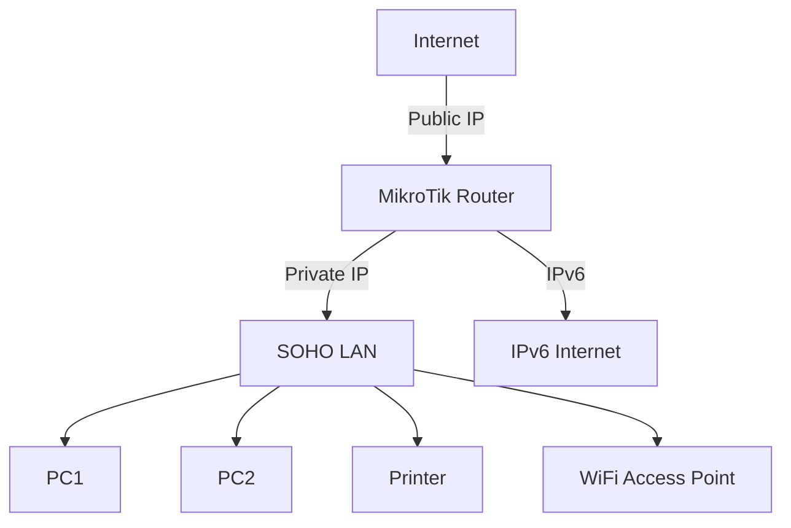

# MikroTik RouterOS Documentation: IP Addressing (IPv4 and IPv6)

## **1. Architecture Diagram Requirements**

### **Network Diagram (Mermaid Syntax)**



- **A**: Internet connection with a public IPv4/IPv6 address.
- **B**: MikroTik Router acting as the gateway.
- **C**: SOHO LAN with private IPv4 and IPv6 addressing.
- **D, E, F, G**: Devices in the SOHO network.
- **H**: IPv6 Internet connectivity.

---

## **2. CLI Configuration with Inline Comments**

### **IPv4 Configuration**

```routeros
# Set the router's identity
/system identity set name=SOHO-Router

# Configure the WAN interface with a static IP (replace with your ISP details)
/ip address add address=192.0.2.1/24 interface=ether1

# Configure the LAN interface with a private IP range
/ip address add address=192.168.88.1/24 interface=ether2

# Enable DHCP server for the LAN
/ip pool add name=dhcp_pool ranges=192.168.88.100-192.168.88.200
/ip dhcp-server add interface=ether2 address-pool=dhcp_pool disabled=no
/ip dhcp-server network add address=192.168.88.0/24 gateway=192.168.88.1 dns-server=8.8.8.8,8.8.4.4

# Add a default route for IPv4
/ip route add gateway=192.0.2.254
```

### **IPv6 Configuration**

```routeros
# Enable IPv6 on the router
/ipv6 settings set disable-ipv6=no

# Configure IPv6 on the WAN interface (replace with your ISP details)
/ipv6 address add address=2001:db8::1/64 interface=ether1 advertise=yes

# Configure IPv6 on the LAN interface
/ipv6 address add address=2001:db8:1::1/64 interface=ether2 advertise=yes

# Enable DHCPv6 server for the LAN
/ipv6 dhcp-server add interface=ether2 address-pool=dhcpv6_pool
/ipv6 pool add name=dhcpv6_pool prefix=2001:db8:1::/64 prefix-length=64

# Add a default route for IPv6
/ipv6 route add gateway=2001:db8::1
```

---

## **3. REST API Implementation (Python Code)**

### **Python Script to Configure IP Addressing**

```python
import requests
from requests.auth import HTTPBasicAuth

# Router details
router_ip = "192.168.88.1"
username = "admin"
password = "admin"

# API endpoint
base_url = f"http://{router_ip}/rest"

# Configure IPv4
def configure_ipv4():
    url = f"{base_url}/ip/address"
    data = {
        "address": "192.168.88.1/24",
        "interface": "ether2",
        "disabled": "no"
    }
    response = requests.post(url, json=data, auth=HTTPBasicAuth(username, password))
    if response.status_code == 201:
        print("IPv4 configuration successful.")
    else:
        print(f"Failed to configure IPv4: {response.text}")

# Configure IPv6
def configure_ipv6():
    url = f"{base_url}/ipv6/address"
    data = {
        "address": "2001:db8:1::1/64",
        "interface": "ether2",
        "advertise": "yes"
    }
    response = requests.post(url, json=data, auth=HTTPBasicAuth(username, password))
    if response.status_code == 201:
        print("IPv6 configuration successful.")
    else:
        print(f"Failed to configure IPv6: {response.text}")

# Main function
if __name__ == "__main__":
    configure_ipv4()
    configure_ipv6()
```

---

## **4. Common Debugging Scenarios**

### **Scenario 1: No Internet Access**
- **Check IP Addressing**: Verify that the WAN interface has the correct IP address.
  ```routeros
  /ip address print
  ```
- **Check Routes**: Ensure the default route is configured.
  ```routeros
  /ip route print
  ```

### **Scenario 2: DHCP Issues**
- **Check DHCP Server**: Ensure the DHCP server is running and has available IPs.
  ```routeros
  /ip dhcp-server print
  /ip pool print
  ```

### **Scenario 3: IPv6 Not Working**
- **Check IPv6 Settings**: Ensure IPv6 is enabled.
  ```routeros
  /ipv6 settings print
  ```
- **Check IPv6 Addresses**: Verify IPv6 addresses are assigned.
  ```routeros
  /ipv6 address print
  ```

---

## **5. Version-Specific Considerations**

- **RouterOS 6.x**: IPv6 support is stable, but some advanced features may require RouterOS 7.x.
- **RouterOS 7.x**: Improved IPv6 support and additional features like DHCPv6-PD.

---

## **6. Security Hardening Measures**

- **Disable Unused Services**: Turn off unnecessary services like Telnet.
  ```routeros
  /ip service disable telnet
  ```
- **Enable Firewall**: Configure a basic firewall to protect the router.
  ```routeros
  /ip firewall filter add chain=input action=drop protocol=tcp dst-port=23
  ```
- **Use Strong Passwords**: Always use strong, unique passwords for the router.

---

## **7. Performance Optimization Tips**

- **Limit DHCP Leases**: Avoid overloading the DHCP server by limiting the number of leases.
  ```routeros
  /ip pool set dhcp_pool ranges=192.168.88.100-192.168.88.150
  ```
- **Enable FastTrack**: Improve throughput by enabling FastTrack for IPv4.
  ```routeros
  /ip firewall filter add chain=forward action=fasttrack-connection connection-state=established,related
  ```

---

## **8. Real-World Deployment Examples**

### **Example 1: Small Office with 10 Devices**
- **IPv4**: Use a `/24` subnet for the LAN.
- **IPv6**: Use a `/64` prefix for the LAN.

### **Example 2: Home Network with IoT Devices**
- **IPv4**: Use a `/24` subnet with DHCP reservations for IoT devices.
- **IPv6**: Use SLAAC for automatic IPv6 address assignment.

---

## **9. Scalability Considerations**

- **Subnetting**: Use smaller subnets for different departments or device types.
- **VLANs**: Implement VLANs to segment traffic and improve scalability.

---

## **10. Monitoring Configurations**

- **Enable SNMP**: Monitor the router using SNMP.
  ```routeros
  /snmp set enabled=yes
  ```
- **Use Traffic Flow**: Monitor traffic with Traffic Flow.
  ```routeros
  /ip traffic-flow set enabled=yes
  ```

---

## **11. Disaster Recovery Steps**

- **Backup Configuration**: Regularly back up the router configuration.
  ```routeros
  /system backup save name=backup
  ```
- **Restore Configuration**: Restore from a backup in case of failure.
  ```routeros
  /system backup load name=backup
  ```

---

## **12. Automated Backup Scripts**

### **RouterOS Script for Automated Backups**

```routeros
/system script add name=backup_script source="/system backup save name=backup-[/system clock get date]-[/system clock get time]"
/system scheduler add name=backup_scheduler interval=1d on-event=backup_script
```

### **Python Script for Automated Backups**

```python
import requests
from requests.auth import HTTPBasicAuth

# Router details
router_ip = "192.168.88.1"
username = "admin"
password = "admin"

# API endpoint
base_url = f"http://{router_ip}/rest"

# Backup configuration
def backup_config():
    url = f"{base_url}/system/backup"
    data = {
        "name": "backup"
    }
    response = requests.post(url, json=data, auth=HTTPBasicAuth(username, password))
    if response.status_code == 201:
        print("Backup successful.")
    else:
        print(f"Failed to backup: {response.text}")

# Main function
if __name__ == "__main__":
    backup_config()
```

---

## **13. Comparative Tables**

### **IPv4 vs IPv6 Configuration**

| Feature               | IPv4 Configuration                     | IPv6 Configuration                     |
|-----------------------|----------------------------------------|----------------------------------------|
| Address Assignment    | DHCP or Static                       

## API Reference Cheat Sheet
```python
# Universal API Helper Function
def mikrotik_api_call(
    method: str,
    endpoint: str,
    data: dict = None,
    timeout: int = 10
) -> dict:
    '''
    Universal MikroTik API handler with error checking
    '''
    try:
        response = requests.request(
            method,
            f"https://{ROUTER_IP}/rest{endpoint}",
            auth=HTTPBasicAuth(API_USER, API_PASS),
            json=data,
            verify=SSL_VERIFY,
            timeout=timeout
        )
        response.raise_for_status()
        return response.json()
    except requests.exceptions.HTTPError as e:
        print(f"API Error: {e.response.status_code} - {e.response.text}")
        return {"error": str(e)}
```
