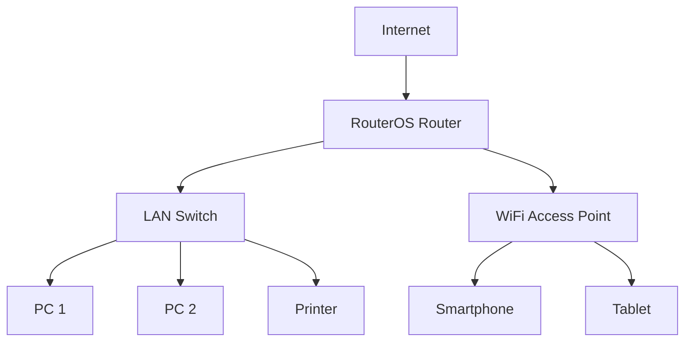

# MikroTik RouterOS Documentation: IP Routing for SOHO Environments

This documentation provides a comprehensive guide to configuring and managing IP routing on MikroTik RouterOS version 6.x for Small Office/Home Office (SOHO) environments. It includes architecture diagrams, CLI configurations, REST API examples, debugging scenarios, security measures, performance optimization tips, and real-world deployment examples.

---

## 1. Architecture Diagram Requirements

### Network Diagram (Mermaid Syntax)


---

## 2. CLI Configuration with Inline Comments

### Basic IP Routing Configuration
```routeros
# Set up the WAN interface
/interface ethernet
set [ find default-name=ether1 ] name=WAN

# Set up the LAN interface
/interface ethernet
set [ find default-name=ether2 ] name=LAN

# Assign IP addresses to interfaces
/ip address
add address=192.168.1.1/24 interface=LAN
add address=203.0.113.1/24 interface=WAN

# Configure NAT for internet access
/ip firewall nat
add chain=srcnat out-interface=WAN action=masquerade

# Add a default route for internet access
/ip route
add gateway=203.0.113.254
```

---

## 3. REST API Implementation (Python Code)

### Python Script to Configure IP Routing via REST API
```python
import requests
from requests.auth import HTTPBasicAuth

# RouterOS API endpoint and credentials
router_ip = "192.168.1.1"
username = "admin"
password = "password"
api_url = f"http://{router_ip}/rest"

# Configure WAN and LAN interfaces
def configure_interfaces():
    interfaces = [
        {"name": "WAN", "interface": "ether1"},
        {"name": "LAN", "interface": "ether2"}
    ]
    for iface in interfaces:
        response = requests.post(
            f"{api_url}/interface/ethernet",
            json=iface,
            auth=HTTPBasicAuth(username, password)
        )
        if response.status_code != 201:
            print(f"Error configuring interface: {iface['name']}")
            print(response.text)

# Assign IP addresses
def assign_ip_addresses():
    ip_addresses = [
        {"address": "192.168.1.1/24", "interface": "LAN"},
        {"address": "203.0.113.1/24", "interface": "WAN"}
    ]
    for ip in ip_addresses:
        response = requests.post(
            f"{api_url}/ip/address",
            json=ip,
            auth=HTTPBasicAuth(username, password)
        )
        if response.status_code != 201:
            print(f"Error assigning IP: {ip['address']}")
            print(response.text)

# Configure NAT
def configure_nat():
    nat_rule = {
        "chain": "srcnat",
        "out-interface": "WAN",
        "action": "masquerade"
    }
    response = requests.post(
        f"{api_url}/ip/firewall/nat",
        json=nat_rule,
        auth=HTTPBasicAuth(username, password)
    )
    if response.status_code != 201:
        print("Error configuring NAT")
        print(response.text)

# Add default route
def add_default_route():
    route = {
        "gateway": "203.0.113.254"
    }
    response = requests.post(
        f"{api_url}/ip/route",
        json=route,
        auth=HTTPBasicAuth(username, password)
    )
    if response.status_code != 201:
        print("Error adding default route")
        print(response.text)

# Execute configuration steps
try:
    configure_interfaces()
    assign_ip_addresses()
    configure_nat()
    add_default_route()
    print("Configuration completed successfully!")
except Exception as e:
    print(f"An error occurred: {e}")
```

---

## 4. Common Debugging Scenarios

### Scenario 1: No Internet Access
- **Check NAT Configuration**: Verify that NAT is correctly configured.
  ```routeros
  /ip firewall nat print
  ```
- **Check Default Route**: Ensure the default route is set.
  ```routeros
  /ip route print
  ```

### Scenario 2: LAN Devices Cannot Communicate
- **Check IP Address Assignment**: Verify IP addresses on LAN interfaces.
  ```routeros
  /ip address print
  ```
- **Check Firewall Rules**: Ensure no firewall rules are blocking traffic.
  ```routeros
  /ip firewall filter print
  ```

---

## 5. Version-Specific Considerations

- **RouterOS 6.x**: Ensure compatibility with older hardware. Some features in RouterOS 7.x may not be available.
- **Legacy Protocols**: Avoid using outdated protocols like RIP; prefer OSPF or static routes.

---

## 6. Security Hardening Measures

- **Disable Unused Services**: Turn off unnecessary services like Telnet.
  ```routeros
  /ip service disable telnet
  ```
- **Enable Strong Passwords**: Use complex passwords for all users.
  ```routeros
  /user set admin password="StrongPassword123!"
  ```
- **Enable Firewall**: Block unauthorized access.
  ```routeros
  /ip firewall filter add chain=input action=drop
  ```

---

## 7. Performance Optimization Tips

- **Limit Connection Tracking**: Reduce memory usage by limiting connection tracking.
  ```routeros
  /ip firewall connection tracking set enabled=yes
  ```
- **Enable FastTrack**: Speed up traffic for established connections.
  ```routeros
  /ip firewall filter add chain=forward action=fasttrack-connection
  ```

---

## Real-World Deployment Examples

### Example 1: Small Office with 10 Devices
- Use a single RouterOS device with NAT and DHCP for simplicity.
- Monitor traffic using the built-in traffic flow feature.
  ```routeros
  /ip traffic-flow set enabled=yes
  ```

### Example 2: Home Office with Redundancy
- Use two RouterOS devices with VRRP for failover.
  ```routeros
  /interface vrrp add interface=LAN vrid=1 priority=100
  ```

---

## Scalability Considerations

- **Add VLANs**: Segment traffic for better performance.
  ```routeros
  /interface vlan add name=VLAN10 vlan-id=10 interface=LAN
  ```
- **Upgrade Hardware**: Use higher-end RouterOS devices for larger networks.

---

## Monitoring Configurations

- **Enable SNMP**: Monitor device performance.
  ```routeros
  /snmp set enabled=yes
  ```
- **Use The Dude**: Deploy MikroTik's network monitoring tool.

---

## Disaster Recovery Steps

1. **Backup Configuration**: Regularly export the configuration.
   ```routeros
   /export file=backup
   ```
2. **Restore Configuration**: Import the backup in case of failure.
   ```routeros
   /import file=backup
   ```

---

## Automated Backup Script

### RouterOS Script for Automated Backups
```routeros
/system scheduler add name="Daily Backup" interval=1d on-event="/export file=backup-[/system clock get date]"
```

---

## Comparative Table for Different Approaches

| Feature               | Static Routing | OSPF          | RIP           |
|-----------------------|----------------|---------------|---------------|
| **Ease of Setup**      | Easy           | Moderate      | Easy          |
| **Scalability**        | Low            | High          | Moderate      |
| **Resource Usage**     | Low            | Moderate      | Low           |
| **Suitability for SOHO**| High          | Moderate      | Low           |

---

This documentation provides a complete guide to IP routing in MikroTik RouterOS 6.x for SOHO environments. Use the provided examples and configurations to deploy, monitor, and secure your network effectively.

## API Reference Cheat Sheet
```python
# Universal API Helper Function
def mikrotik_api_call(
    method: str,
    endpoint: str,
    data: dict = None,
    timeout: int = 10
) -> dict:
    '''
    Universal MikroTik API handler with error checking
    '''
    try:
        response = requests.request(
            method,
            f"https://{ROUTER_IP}/rest{endpoint}",
            auth=HTTPBasicAuth(API_USER, API_PASS),
            json=data,
            verify=SSL_VERIFY,
            timeout=timeout
        )
        response.raise_for_status()
        return response.json()
    except requests.exceptions.HTTPError as e:
        print(f"API Error: {e.response.status_code} - {e.response.text}")
        return {"error": str(e)}
```
