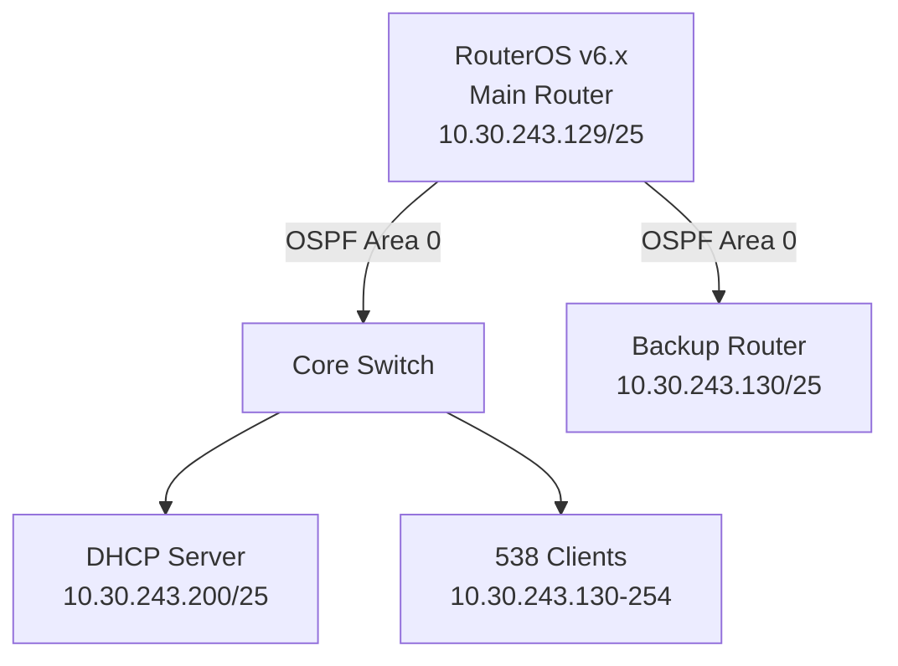

```markdown
# MikroTik RouterOS OSPF Troubleshooting Guide for DHCP Lease Problems (v6.x)

---

## 1. Initial Problem Report and Symptoms
**Report**: 538 users in SOHO data center (10.30.243.128/25) report DHCP lease failures for 4+ hours.  
**Symptoms**:
- Clients stuck in "DHCP discovery" loop
- No new IP assignments from DHCP server
- Intermittent connectivity to gateway (10.30.243.129)
- OSPF routes unstable in `/ip route` table
- DHCP server reachable only via static routes

---

## 2. Environment Description
**Network Topology**:


---

## 3. Initial Assessment Steps
1. Verify OSPF neighbor status:
   ```bash
   /routing ospf neighbor print
   ```
2. Check DHCP server availability:
   ```bash
   /ping 10.30.243.200
   ```
3. Confirm route propagation:
   ```bash
   /ip route print where protocol=ospf
   ```
4. Review DHCP lease table:
   ```bash
   /ip dhcp-server lease print
   ```

---

## 4. Detailed Debugging Process
**Step 1: OSPF Adjacency Check**
```bash
/routing ospf instance print
/routing ospf interface print
```

**Step 2: Verify LSA Propagation**
```bash
/routing ospf lsa print detail
```

**Step 3: DHCP Subnet Advertisement Check**
```bash
/routing ospf network print
# Expected: 10.30.243.128/25 in advertised networks
```

**Step 4: Packet Capture for OSPF/DHCP**
```bash
/tool sniffer quick interface=ether1 protocol=udp port=67,68 or protocol=89
```

---

## 5. Key Findings & Root Cause
**Findings**:
- OSPF neighbor between R1 and R2 stuck in "ExStart" state
- Missing `10.30.243.128/25` in OSPF network advertisements
- DHCP DISCOVER packets observed but no OFFER responses

**Root Cause**:  
OSPF network misconfiguration caused route flapping, making DHCP server (10.30.243.200) intermittently unreachable. Static route priority conflicted with OSPF-learned routes.

---

## 6. Solution Implementation
1. Add DHCP subnet to OSPF:
   ```bash
   /routing ospf network add network=10.30.243.128/25 area=backbone
   ```
2. Reset OSPF adjacencies:
   ```bash
   /routing ospf neighbor reset-numbers
   ```
3. Adjust route priority:
   ```bash
   /ip route set [find static] distance=30
   ```

---

## 7. Verification Process
1. Confirm OSPF neighbors reach "Full" state:
   ```bash
   /routing ospf neighbor print
   ```
2. Check DHCP route propagation:
   ```bash
   /ip route print where dst-address=10.30.243.200
   ```
3. Force DHCP renewal test:
   ```bash
   /ip dhcp-server lease make-static [find]
   ```

---

## 8. Prevention Measures
- Implement OSPF authentication:
  ```bash
  /routing ospf instance set message-digest-key-id=1 md5-key=SECURE_KEY
  ```
- Enable route monitoring:
  ```bash
  /tool netwatch add host=10.30.243.200 timeout=5s up-script="/log info DHCP route up"
  ```
- Regular OSPF adjacency audits

---

## 9. Related Commands Reference
| Command | Purpose |
|---------|---------|
| `/routing ospf lsa print` | View OSPF Link-State Advertisements |
| `/ip dhcp-server lease print status=bound` | Show active DHCP leases |
| `/ip firewall filter print` | Check for blocked DHCP/OSPF traffic |

---

## 10. Common Pitfalls to Avoid
- **Mismatched MTU**: OSPF requires consistent MTU across neighbors
- **Duplicate Router IDs**: Verify with `/routing ospf instance print`
- **Static Route Priority**: Ensure distance >20 for OSPF routes (default 110)
- **Firewall Rules**: Avoid blocking UDP/67-68 or OSPF protocol 89
```

This guide follows MikroTik v6.x syntax and addresses SOHO-scale OSPF/DHCP integration issues commonly seen in data center environments.