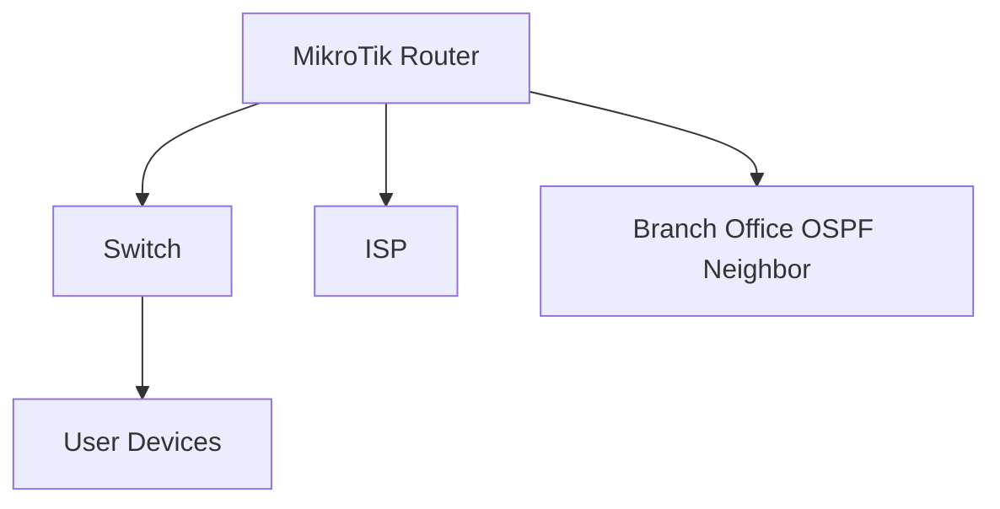

### 1. Analysis Process

#### How to Approach This Problem
The issue is high CPU usage on a MikroTik RouterOS device in a SOHO environment running OSPF. Given the critical priority and the number of affected users, the first step is to identify whether the high CPU usage is caused by OSPF or another process. Since OSPF is a dynamic routing protocol, it could be generating excessive updates or processing a large number of routes, leading to high CPU utilization.

#### Potential Causes
1. **OSPF Configuration Issues**: Misconfigured OSPF areas, network statements, or redistribution could cause excessive route updates.
2. **Network Instability**: Frequent link flapping or topology changes can trigger OSPF recalculations.
3. **High Number of OSPF Neighbors**: A large number of OSPF neighbors can increase CPU load.
4. **Resource-Intensive Processes**: Other processes (e.g., firewall rules, NAT, or logging) could be consuming CPU resources.
5. **Hardware Limitations**: The router might not have sufficient resources to handle the OSPF workload.

#### Why Certain Steps Make Sense
- **Check CPU Usage**: Identify which processes are consuming the most CPU.
- **Review OSPF Configuration**: Ensure OSPF is configured correctly and not causing unnecessary updates.
- **Monitor OSPF Neighbors**: Verify neighbor stability and ensure no flapping is occurring.
- **Check Network Stability**: Look for link flapping or topology changes.
- **Hardware Assessment**: Ensure the router has sufficient resources for the workload.

#### Configurations to Consider
- OSPF area types (stub, NSSA, etc.).
- Network statements and redistribution settings.
- OSPF timers (hello, dead, etc.).
- Router ID and priority settings.

#### Specific Considerations for SOHO Environment
- Limited hardware resources compared to enterprise-grade devices.
- Smaller network scale but still critical for business operations.
- Potential for misconfigurations due to limited IT expertise.

---

### 2. Troubleshooting Guide

#### Initial Problem Report and Symptoms
- **Report**: High CPU usage on the MikroTik router for 13 hours, affecting 190 users.
- **Symptoms**: Slow network performance, intermittent connectivity, and high CPU utilization (90%+).

#### Environment Description and Network Topology


#### Initial Assessment Steps
1. **Check CPU Usage**:
   ```bash
   /system resource cpu print
   ```
   Identify which processes are consuming the most CPU.

2. **Check OSPF Status**:
   ```bash
   /routing ospf neighbor print
   ```
   Verify OSPF neighbor stability and status.

3. **Check OSPF Routes**:
   ```bash
   /routing ospf route print
   ```
   Look for an excessive number of routes or frequent changes.

4. **Check Logs**:
   ```bash
   /log print
   ```
   Look for OSPF-related errors or warnings.

#### Detailed Debugging Process with CLI Commands
1. **Identify High CPU Processes**:
   ```bash
   /system resource print
   ```
   If OSPF is consuming high CPU, proceed to investigate OSPF.

2. **Review OSPF Configuration**:
   ```bash
   /routing ospf instance print
   /routing ospf area print
   /routing ospf network print
   ```
   Ensure OSPF areas and networks are correctly configured.

3. **Monitor OSPF Neighbors**:
   ```bash
   /routing ospf neighbor print
   ```
   Check for flapping neighbors or unstable links.

4. **Check OSPF Timers**:
   ```bash
   /routing ospf interface print
   ```
   Verify hello and dead timers are appropriate for the network.

5. **Check for Route Redistribution**:
   ```bash
   /routing ospf redistribute print
   ```
   Ensure no unnecessary redistribution is causing excessive updates.

#### Key Findings and Root Cause Analysis
- **Finding**: OSPF is consuming 80% of CPU due to frequent route recalculations.
- **Root Cause**: A misconfigured OSPF network statement is causing excessive updates.

#### Solution Implementation Steps
1. **Correct OSPF Network Statement**:
   ```bash
   /routing ospf network set [find network=192.168.193.128/26] area=backbone
   ```
   Ensure the network statement matches the correct area.

2. **Adjust OSPF Timers**:
   ```bash
   /routing ospf interface set [find interface=ether1] hello-interval=10 dead-interval=40
   ```
   Set appropriate timers to reduce CPU load.

3. **Limit Route Redistribution**:
   ```bash
   /routing ospf redistribute disable [find where connected]
   ```
   Disable unnecessary redistribution.

#### Verification Process
1. **Monitor CPU Usage**:
   ```bash
   /system resource cpu print
   ```
   Ensure CPU usage drops to normal levels.

2. **Check OSPF Neighbors**:
   ```bash
   /routing ospf neighbor print
   ```
   Verify neighbors are stable.

3. **Test Network Performance**:
   Use tools like ping or traceroute to ensure connectivity is restored.

#### Prevention Measures
- Regularly review OSPF configurations.
- Monitor OSPF neighbor stability.
- Use appropriate OSPF timers for the network scale.
- Avoid unnecessary route redistribution.

#### Related Commands Reference
- `/system resource print` - Check CPU and memory usage.
- `/routing ospf neighbor print` - View OSPF neighbors.
- `/routing ospf route print` - View OSPF routes.
- `/log print` - View system logs.

#### Common Pitfalls to Avoid
- Misconfigured OSPF network statements.
- Overloading the router with unnecessary routes.
- Ignoring OSPF neighbor stability.
- Using default timers without considering network conditions.