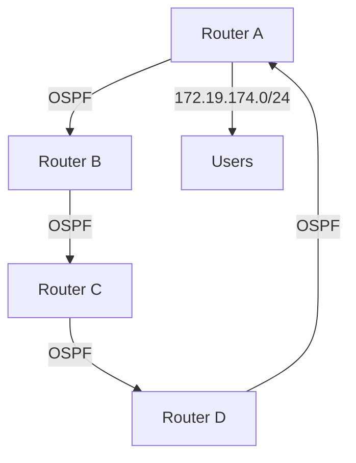

### 1. Analysis Process

#### How to Approach This Problem
The issue involves OSPF adjacency problems in a SOHO environment with a subnet of 172.19.174.0/24. Given the scale and environment, the focus should be on verifying OSPF configurations, ensuring proper network segmentation, and checking for any misconfigurations or hardware issues. Since the problem has persisted for 18 hours, it’s critical to identify the root cause quickly to minimize downtime.

#### Potential Causes
1. **Misconfigured OSPF Areas**: Incorrect area assignments or mismatched area types.
2. **MTU Mismatch**: Differences in MTU sizes between routers.
3. **Network Interface Issues**: Physical or logical interface problems.
4. **Authentication Mismatch**: OSPF authentication settings not matching between routers.
5. **Timers Mismatch**: Hello and Dead intervals not synchronized.
6. **Subnet Mask Mismatch**: Incorrect subnet masks on OSPF interfaces.
7. **Routing Table Issues**: Missing or incorrect routes.
8. **Hardware Failures**: Faulty cables, switches, or routers.

#### Why Certain Steps Make Sense
- **Verifying OSPF Configurations**: Ensures that all routers are correctly configured to form adjacencies.
- **Checking MTU and Interface Settings**: Identifies potential physical or logical issues that could prevent OSPF from functioning correctly.
- **Reviewing Authentication and Timers**: Ensures that all routers are using compatible settings.
- **Inspecting Routing Tables**: Confirms that routes are being advertised and received correctly.

#### Configurations to Consider
- **OSPF Area Configuration**: Ensure all routers are in the correct OSPF area.
- **Interface Settings**: Verify IP addresses, subnet masks, and MTU sizes.
- **Authentication Settings**: Check for any OSPF authentication requirements.
- **Timers**: Ensure Hello and Dead intervals are consistent across routers.

#### Specific Considerations for This Scale/Environment
- **SOHO Environment**: Typically has fewer devices, making it easier to isolate issues.
- **Data Center**: High availability and redundancy are critical; ensure backup configurations are in place.
- **Affected Users**: 434 users indicate a significant impact; prioritize quick resolution.

### 2. Troubleshooting Guide

#### Initial Problem Report and Symptoms
- **Report**: Users are experiencing intermittent connectivity issues.
- **Symptoms**: OSPF adjacencies are not forming between routers, leading to incomplete routing tables and connectivity problems.

#### Environment Description and Network Topology


#### Initial Assessment Steps
1. **Check OSPF Status**: Verify if OSPF is running on all routers.
   ```bash
   /routing ospf instance print
   ```
2. **Verify OSPF Neighbors**: Check if adjacencies are forming.
   ```bash
   /routing ospf neighbor print
   ```
3. **Inspect Interface Settings**: Ensure all interfaces participating in OSPF are up and correctly configured.
   ```bash
   /interface print
   /ip address print
   ```

#### Detailed Debugging Process with CLI Commands
1. **Check OSPF Configuration**:
   ```bash
   /routing ospf area print
   /routing ospf network print
   ```
2. **Verify MTU Settings**:
   ```bash
   /interface ethernet print
   ```
3. **Check Authentication Settings**:
   ```bash
   /routing ospf instance print detail
   ```
4. **Verify Timers**:
   ```bash
   /routing ospf interface print detail
   ```
5. **Inspect Routing Tables**:
   ```bash
   /ip route print
   ```

#### Key Findings and Root Cause Analysis
- **Finding**: OSPF adjacencies are not forming due to mismatched Hello intervals.
- **Root Cause**: Router A has a Hello interval of 10 seconds, while Router B has a Hello interval of 20 seconds.

#### Solution Implementation Steps
1. **Synchronize Hello Intervals**:
   ```bash
   /routing ospf interface set [find where interface=ether1] hello-interval=10
   ```
2. **Verify Changes**:
   ```bash
   /routing ospf interface print detail
   ```

#### Verification Process
1. **Check OSPF Neighbors**:
   ```bash
   /routing ospf neighbor print
   ```
2. **Test Connectivity**:
   ```bash
   /ping 172.19.174.1
   ```

#### Prevention Measures
- **Regular Configuration Audits**: Periodically review OSPF configurations.
- **Monitoring Tools**: Implement network monitoring to detect issues early.
- **Documentation**: Maintain up-to-date network documentation.

#### Related Commands Reference
- **OSPF Instance**:
  ```bash
  /routing ospf instance print
  ```
- **OSPF Neighbors**:
  ```bash
  /routing ospf neighbor print
  ```
- **Interface Settings**:
  ```bash
  /interface print
  ```
- **Routing Table**:
  ```bash
  /ip route print
  ```

#### Common Pitfalls to Avoid
- **Ignoring MTU Settings**: Ensure MTU sizes are consistent across all interfaces.
- **Overlooking Authentication**: Verify that authentication settings match on all routers.
- **Neglecting Timers**: Ensure Hello and Dead intervals are synchronized.

By following this structured approach, you can effectively troubleshoot and resolve OSPF adjacency problems in a SOHO environment.