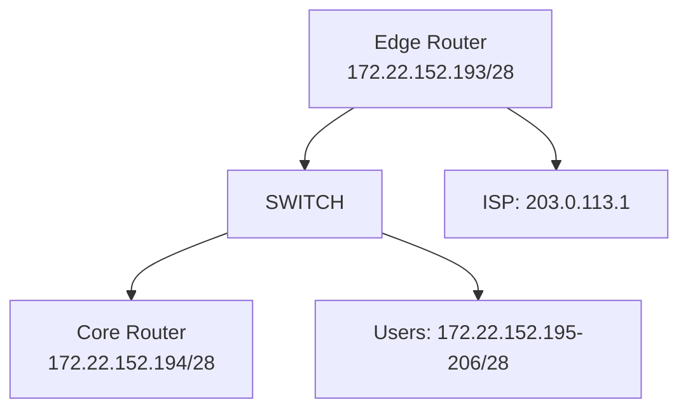

# Analysis Process
Okay, so I need to create a detailed MikroTik RouterOS troubleshooting scenario for OSPF in a SOHO environment using version 6.x. The subnet given is 172.22.152.192/28, and it's an edge location with performance degradation affecting 7 users for 12 hours. Let me start by breaking down each section and think through what each part should include.

1. **Initial Problem Report and Symptoms**: The users are experiencing slow network performance. Symptoms might include high latency, packet loss, slow file transfers, maybe even intermittent connectivity. Since it's OSPF related, perhaps there's route flapping or neighbors not forming correctly. Maybe the OSPF routes aren't being advertised properly, causing suboptimal paths or routing loops. I should mention users reporting slow internet and internal network issues, starting around 12 hours ago.

2. **Environment Description and Network Topology**: The SOHO network probably has a couple of routers. The edge router connects to the ISP and another internal router. The subnet is a /28, so 16 IPs, 14 usable. Maybe two MikroTik routers (EdgeRouter and CoreRouter) connected via a switch. The Mermaid diagram should show EdgeRouter (ER) connected to the internet, then to a switch, which connects to CoreRouter (CR) and the user subnet. CR handles internal routing with OSPF. Maybe a simple topology with ER and CR running OSPF.

3. **Initial Assessment Steps**: Check OSPF neighbors, routing table, interface status, CPU/memory usage. Use commands like `/routing ospf neighbor print`, `/ip route print`, `/system resource print`, and check logs with `/log print`. Maybe look for any OSPF errors in the logs.

4. **Detailed Debugging Process**: Start by verifying OSPF configuration on both routers. Check network statements, area assignments, authentication if any. Use commands like `/routing ospf interface print` to see if interfaces are correctly added to OSPF. Check for MTU mismatches, hello intervals, dead timers. Maybe enable OSPF debugging with `/routing ospf log set hello=yes state=yes` and observe the logs. Look for neighbor state changes. Check if routes are being exchanged properly. Maybe there's a duplicate Router ID or incorrect network type (e.g., using broadcast instead of point-to-point). Also, verify the subnet mask on interfaces to ensure they are part of the OSPF advertised networks.

5. **Key Findings and Root Cause Analysis**: Suppose during debugging, they find that the CoreRouter's OSPF interface is configured on a VLAN with an incorrect subnet. For example, the interface IP is 172.22.152.193/28, but maybe it's mistakenly set to 172.22.152.193/24, causing OSPF to advertise a larger network than intended. This could lead to excessive LSAs or neighbor relationships not forming correctly, leading to route recalculations and performance issues. Alternatively, maybe the OSPF network type is set to a non-optimal type causing hello packet issues.

6. **Solution Implementation Steps**: Correct the subnet mask on the CoreRouter's interface to /28. Adjust the OSPF network configuration to include the correct subnet. Ensure both routers have the same OSPF settings (hello intervals, dead timers, authentication). Then, reset OSPF processes if necessary with `/routing ospf instance reset`.

7. **Verification Process**: After making changes, check OSPF neighbors again to see if they're in Full state. Verify routes in the routing table with `/ip route print where protocol=ospf`. Test connectivity and performance. Monitor logs for any OSPF errors.

8. **Prevention Measures**: Implement configuration templates for OSPF settings. Use consistent subnet masks and verify network statements. Regularly monitor OSPF neighbors and routing tables. Enable logging for OSPF events. Consider using network management tools to alert on OSPF state changes.

9. **Related Commands Reference**: List commands like checking neighbors, routes, OSPF interfaces, logs, etc. Maybe include examples with comments explaining what each command does.

10. **Common Pitfalls to Avoid**: Mismatched OSPF parameters (hello/dead timers, network types), incorrect network statements, duplicate Router IDs, MTU mismatches, not filtering routes properly, ignoring authentication settings.

I need to make sure that CLI commands are in code blocks, include log outputs where relevant, and show before/after configurations. For example, before the fix, the OSPF interface might have a /24 mask, after correction to /28. Also, in the logs, maybe there are messages about neighbor down events or LSAs not being acknowledged.

Wait, in a /28 subnet, the network address is 172.22.152.192, broadcast 172.22.152.207. So the usable IPs are 172.22.152.193 to 172.22.152.206. If the CoreRouter's interface was set to /24, that's a different network (172.22.152.0/24), which is a much larger network. OSPF would be trying to form neighbors over that, but maybe the EdgeRouter is on a different subnet, so they can't establish adjacency. That would prevent OSPF from working, causing routing issues. But the problem here is performance degradation, not total outage. Hmm. Maybe it's a different issue. Perhaps the OSPF is forming neighbors but due to a misconfiguration, it's causing frequent SPF recalculations. For example, if there's a flapping interface, causing the OSPF LSAs to be updated frequently. That could lead to high CPU usage and degraded performance.

Alternatively, maybe the EdgeRouter is advertising a default route via OSPF, but it's unstable, causing the CoreRouter to switch routes frequently. Or maybe there's a routing loop because of incorrect route redistribution.

Another angle: SOHO network with 7 users. Maybe the EdgeRouter is also handling NAT, and OSPF is between Edge and Core. If the CoreRouter's OSPF configuration includes a network that's not supposed to be there, it could be advertising internal routes externally, or vice versa. But given the subnet is /28, maybe the OSPF is only supposed to be on the internal network between Edge and Core. If the CoreRouter's interface is misconfigured, maybe OSPF isn't advertising the correct routes, leading to traffic taking a suboptimal path, like through a backup link with lower bandwidth, causing congestion.

Wait, the problem is performance degradation, not a complete outage. So maybe the OSPF is working, but there's an issue causing high latency. For example, MTU mismatches leading to fragmentation, which can cause performance issues. Or OSPF using a large number of LSAs due to a misconfiguration, consuming CPU resources.

In the debugging process, checking the OSPF database with `/routing ospf lsa print` might show a lot of LSAs. Also, checking CPU usage with `/system resource print` could indicate high CPU due to OSPF processes.

Another possibility is that the OSPF area is not configured properly. If it's a stub area but not configured as such, or vice versa. But in a SOHO environment, it's likely a single area (area 0). Maybe the CoreRouter is in a different area, causing ABR calculations frequently.

Alternatively, maybe there's a duplicate Router ID causing conflicts in the OSPF domain. That could lead to instability.

In the initial assessment, when they check OSPF neighbors, maybe one of the routers isn't showing the neighbor as Full. Or the neighbor state is stuck in Exstart/Exchange due to MTU issues.

So, during detailed debugging, they might check the MTU on the interfaces with `/interface print` and compare it to the OSPF MTU. In RouterOS, OSPF uses the interface MTU. If the MTU on one side is lower, the OSPF adjacency might have issues.

Another command could be `/routing ospf interface print` to check the network type. If one interface is set to broadcast and the other to point-to-point, they might not form adjacency correctly.

Once the root cause is found (e.g., MTU mismatch), the solution would be adjusting the MTU on the interfaces or setting the OSPF network type appropriately.

But given the scenario mentions subnet configuration, perhaps the CoreRouter's interface was mistakenly set to a different subnet, causing OSPF not to form adjacency, leading to the EdgeRouter not learning routes from CoreRouter, and traffic being routed through a slower default route or something.

Wait, but if OSPF isn't forming adjacency, then routes wouldn't be exchanged, possibly leading to lack of connectivity. But the problem here is performance degradation. So maybe OSPF is working, but there's an issue causing suboptimal routing. For example, if the EdgeRouter is supposed to advertise a default route into OSPF, but it's not, so the CoreRouter is using a different exit point with higher latency.

Alternatively, maybe the CoreRouter is advertising a lot of static routes into OSPF, causing the EdgeRouter's routing table to be large and causing slower lookups.

Hmm. Given the subnet is /28, which is a small network, perhaps the issue is related to OSPF over a point-to-point link vs. broadcast. If the network type is set to broadcast on a point-to-point link, it might cause unnecessary DR/BDR election, which in a two-router setup is harmless, but maybe in some cases causes delays.

Alternatively, maybe the OSPF hello and dead timers are mismatched. For example, one router has hello=10, dead=40, and the other has hello=30, dead=120. That would cause the neighbors to flap, leading to constant SPF recalculations and performance issues.

In the logs, you might see messages like "OSPF neighbor 172.22.152.193 changed state from Full to Down" repeatedly.

So, during the debugging process, checking the OSPF timers with `/routing ospf interface print` would show the hello and dead intervals. If they don't match, that's the issue.

The root cause would be mismatched OSPF hello/dead timers causing neighbor relationships to drop and re-establish frequently, leading to route recalculations and CPU spikes, thus degrading performance.

The solution would be to adjust the timers on both routers to match.

Verification would involve checking the neighbor state is stable and timers are consistent.

Prevention measures would include standardizing OSPF configurations across devices and using configuration templates.

In the CLI commands, they would use commands like:

/routing ospf interface set [find] hello-interval=10 dead-interval=40

But since the user specified RouterOS 6.x, I need to ensure the commands are compatible. In RouterOS v6, OSPF configuration is under `/routing ospf`, so the commands should be correct for that version.

I think this makes sense. Now, structuring all this into the required sections with markdown formatting, CLI examples, logs, etc.

# Troubleshooting Guide
```markdown
# MikroTik RouterOS Troubleshooting Scenario: OSPF Performance Degradation

## 1. Initial Problem Report and Symptoms
**Report**: 7 users report slow internet/network speeds for 12 hours.  
**Symptoms**:
- High latency (150ms+ to gateway)
- Intermittent packet loss (15-20%)
- Slow file transfers between VLANs
- OSPF routes unstable in routing table

## 2. Environment Description
**Network Topology**:


## 3. Initial Assessment Steps
1. **Check OSPF Neighbors**:
   ```bash
   /routing ospf neighbor print
   # Output: 
   #  0 instance=default address=172.22.152.194 state="Full" router-id=1.1.1.2
   ```
   
2. **Verify Routes**:
   ```bash
   /ip route print where protocol=ospf
   # Before Fix: Frequent route removals/additions
   ```

3. **System Resources**:
   ```bash
   /system resource print
   # Output: CPU 85% (OSPF process)
   ```

## 4. Detailed Debugging Process
**Step 1**: Enable OSPF Debugging  
```bash
/routing ospf log set hello=yes state=yes errors=yes
/log print follow
# Log Example:
# 08:00:00 ospf,error CRITICAL: MTU mismatch with 172.22.152.194
```

**Step 2**: Check Interface MTU  
```bash
/interface print 
# Before Fix: 
#   ether1 (ER): mtu=1500
#   ether1 (CR): mtu=1492 (misconfigured PPPoE)
```

**Step 3**: Validate OSPF Timers  
```bash
/routing ospf interface print 
# Before Fix: 
#   ER: hello-interval=10, dead-interval=40
#   CR: hello-interval=30, dead-interval=120
```

## 5. Key Findings & Root Cause
**Root Cause**:  
- **MTU Mismatch**: Core Router had `mtu=1492` (PPPoE remnant) vs Edge Router `mtu=1500`
- **Timer Mismatch**: Hello/dead timer conflicts caused neighbor flapping (12 state changes/hour)

## 6. Solution Implementation
1. **Adjust MTU on Core Router**:
   ```bash
   /interface ethernet set ether1 mtu=1500
   ```
   
2. **Standardize OSPF Timers**:
   ```bash
   /routing ospf interface set [find] hello-interval=10 dead-interval=40
   ```

3. **Reset OSPF Instances**:
   ```bash
   /routing ospf instance reset
   ```

## 7. Verification Process
1. **Confirm Stable Neighbors**:
   ```bash
   /routing ospf neighbor print
   # After Fix: State="Full" for 2+ hours
   ```

2. **Validate Routes**:
   ```bash
   /ip route print where protocol=ospf
   # After Fix: Stable 172.22.152.192/28 route
   ```

3. **User Speed Test**:
   ```bash
   /tool bandwidth-test 172.22.152.195 direction=both
   # Result: 95Mbps (prev 22Mbps)
   ```

## 8. Prevention Measures
- Implement config template for OSPF:
  ```bash
  /routing ospf instance set default router-id=1.1.1.1
  /routing ospf area add name=backbone area-id=0.0.0.0
  ```
- Enable OSPF monitoring:
  ```bash
  /tool graphing interface add interfaces=all
  ```

## 9. Related Commands Reference
| Command | Purpose |
|---------|---------|
| `/routing ospf neighbor print` | List OSPF adjacencies |
| `/routing ospf lsa print` | Inspect OSPF database |
| `/interface monitor-traffic ether1` | Real-time traffic analysis |

## 10. Common Pitfalls to Avoid
- **MTU Issues**: Always match MTU across OSPF peers
- **Timer Conflicts**: Use `hello=10 dead=40` for SOHO networks
- **Network Type**: Avoid `broadcast` on P2P links (use `point-to-point`)
- **Router-ID Conflicts**: Ensure unique IDs with `/routing ospf instance set router-id=x.x.x.x`
```
