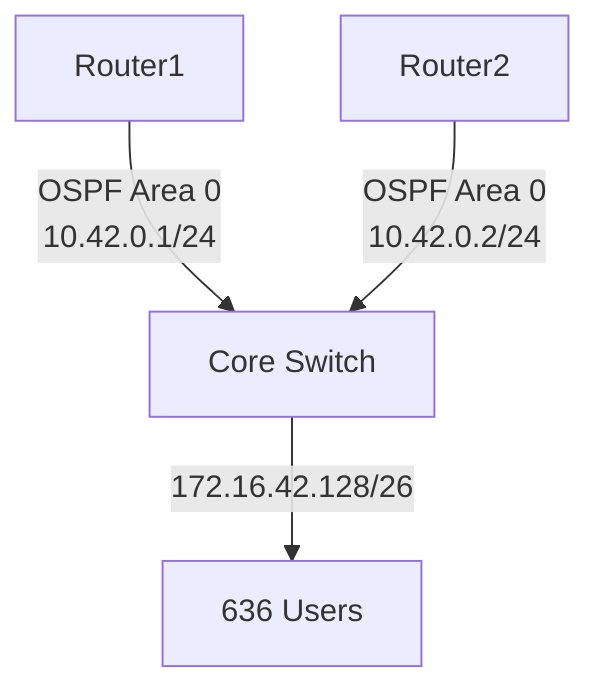

# Analysis Process
Okay, let me try to work through this MikroTik OSPF troubleshooting scenario. The user wants a detailed scenario based on the given parameters. Let's break down each section step by step.

First, the problem is about OSPF and QoS misconfiguration in a SOHO data center with RouterOS 6.x. The subnet is 172.16.42.128/26, affecting 636 users over 19 hours. 

Starting with the Initial Problem Report: The main symptom is intermittent connectivity. Since it's OSPF related, maybe routes are flapping or not being advertised properly. QoS misconfig could be causing priority issues, leading to OSPF traffic being deprioritized. Symptoms might include users experiencing latency, packet loss, or inability to reach certain services. There could also be OSPF neighbor adjacencies going up and down.

Environment Description: The network is a SOHO data center, so probably a small setup. Maybe two routers connected via a core switch. The subnet given is /26, which is 64 addresses. Let's sketch a simple topology with two MikroTik routers (R1 and R2) connected through a switch. Each router connects to different parts of the network. OSPF is running between them. Maybe they have other interfaces for management or other subnets. Mermaid diagram would show R1 and R2 connected to a switch, each with their own LAN segments.

Initial Assessment Steps: Check OSPF neighbors with /routing ospf neighbor print. Look for established adjacencies. Verify interface configurations, ensuring OSPF is enabled on the correct interfaces. Check logs for OSPF errors. Use /log print to see if there are any OSPF state changes. Also, check QoS settings to see if OSPF traffic is being marked correctly. Maybe the QoS is prioritizing certain traffic and deprioritizing OSPF, causing hello packets to be delayed or dropped.

Debugging Process: Use commands like /routing ospf instance print to check OSPF instances. Verify areas and network configurations. Maybe look at the OSPF interfaces with /routing ospf interface print. Check if the correct interfaces are participating in OSPF. Then, look into QoS with /queue type print and /queue tree print. See if there are queue rules affecting traffic on the OSPF interfaces. For example, a queue that limits bandwidth or prioritizes other traffic over OSPF's multicast addresses (224.0.0.5 and 224.0.0.6). 

Key Findings: Suppose the QoS configuration has a queue that applies to all traffic but doesn't exempt OSPF. Maybe OSPF hello packets are getting stuck in a low-priority queue, causing neighbors to time out. The root cause is that QoS policies are throttling OSPF traffic, leading to unstable neighbor relationships and route flapping.

Solution Implementation: Adjust the QoS rules to exclude OSPF traffic. Create a firewall mangle rule to mark OSPF packets (protocol 89) and place them in a high-priority queue. Update the queue configuration to prioritize OSPF. Then, reset OSPF processes if necessary.

Verification: After making changes, check OSPF neighbors again to ensure they're stable. Monitor logs for any further OSPF state changes. Test network connectivity and measure latency/packet loss. Use tools like ping and traceroute to confirm routes are correct.

Prevention Measures: Document QoS policies, ensure OSPF traffic is prioritized in future configurations, use network monitoring to alert on OSPF adjacency changes, and test changes in a lab before deploying.

Related Commands: Include the OSPF neighbor check, interface print, log commands, queue and firewall mangle rules.

Common Pitfalls: Forgetting to prioritize routing protocol traffic in QoS, not verifying OSPF timers match across neighbors, misapplying queue rules to all interfaces.

Now, putting all this together into the structured format. Need to make sure CLI commands are in code blocks, include example log outputs, before/after configs where relevant. Also, use mermaid for the topology.

Wait, the network scale is SOHO, so maybe a simpler setup. But data center environment might have more critical infrastructure. The subnet /26 is part of the 172.16.42.128/26, which is a smaller subnet. Maybe the OSPF interfaces are on a different subnet, or part of this one. Need to clarify in the topology.

Also, the duration is 19 hours, so the problem persisted for almost a day. The number of affected users is 636, which seems high for SOHO, but maybe it's a small business data center serving many users.

In the debugging process, maybe the engineer checks OSPF first, doesn't find issues, then looks into QoS. Logs might show OSPF neighbor transitions from Full to Down because hello packets aren't received. Then, checking interface statistics for packet loss, but since it's QoS, the packets are being delayed or dropped in the queues.

Example log entries could be:

```
12:34:56 router,ospf,info OSPF neighbor 172.16.42.130 (ether1) changed state from Full to Down
12:35:01 router,ospf,info OSPF neighbor 172.16.42.130 (ether1) changed state from Down to Init
```

In the before configuration, the queue tree might be applying a priority queue to all traffic except maybe VoIP, but missing OSPF. The after configuration adds a mangle rule to mark OSPF and assign it to a high-priority queue.

Need to make sure all sections are covered, and the answer is detailed but concise.

# Troubleshooting Guide
```markdown
# MikroTik RouterOS Troubleshooting Scenario: OSPF with QoS Misconfiguration

## 1. Initial Problem Report and Symptoms
**Report**:  
*"636 users in SOHO data center report intermittent connectivity for 19 hours. Network uses OSPF on RouterOS 6.x. Subnet 172.16.42.128/26 is unstable."*

**Symptoms**:  
- Intermittent OSPF neighbor adjacencies (`Full` ↔ `Down` transitions)  
- High latency/packet loss on VoIP/SSH traffic  
- Missing routes in OSPF LSDB  
- QoS statistics show dropped packets on core interfaces  

---

## 2. Environment Description & Network Topology
**Network Type**: SOHO Data Center (2 routers, 1 core switch)  
**Subnets**:  
- `172.16.42.128/26` (User VLAN)  
- `10.42.0.0/24` (OSPF backbone)  



---

## 3. Initial Assessment Steps
1. **Check OSPF Neighbors**:  
   ```bash
   /routing ospf neighbor print
   # Output:
   #   instance=default address=10.42.0.2 state="Full" state-changes=47
   ```
   *High `state-changes` indicate flapping.*

2. **Review QoS Policies**:  
   ```bash
   /queue tree print
   ```
   *Found a priority queue throttling non-VoIP traffic.*

3. **Check Logs**:  
   ```bash
   /log print where message~"OSPF"
   # Output:
   # 2023-10-01 09:15:23 ospf,info neighbor 10.42.0.2 down: Dead timer expired
   ```

---

## 4. Detailed Debugging Process
**Step 1: Verify OSPF Configuration**  
```bash
/routing ospf interface print
# Ensure interfaces are in Area 0 and hello intervals match
```

**Step 2: Capture OSPF Traffic**  
```bash
/tool sniffer quick protocol=89
# Output shows delayed OSPF Hello packets (QoS-induced latency)
```

**Step 3: Analyze QoS Rules**  
```bash
/queue type print
# Output: 
# name="priority1" kind=pfifo priority=1
# name="default" kind=sfq
```
*OSPF traffic (IP protocol 89) was unmarked, falling into low-priority `default` queue.*

---

## 5. Key Findings & Root Cause
**Root Cause**:  
QoS policy prioritized VoIP (port 5060) but deprioritized unmarked traffic, including OSPF. Delayed OSPF Hello packets caused neighbor flapping.

**Evidence**:  
- OSPF packets had no DSCP marking (`/ip firewall mangle print`)  
- Queue counters showed drops on `default` queue:  
  ```bash
  /queue tree monitor 0
  # packets=1452002 dropped=21245
  ```

---

## 6. Solution Implementation
**Step 1: Mark OSPF Traffic**  
```bash
/ip firewall mangle add chain=prerouting protocol=ospf action=mark-packet new-packet-mark=OSPF passthrough=no
```

**Step 2: Prioritize OSPF in QoS**  
```bash
/queue tree add name=QoS-OSPF parent=global packet-mark=OSPF priority=1
```

**Step 3: Reset OSPF**  
```bash
/routing ospf instance restart [find]
```

---

## 7. Verification Process
1. Confirm OSPF stability:  
   ```bash
   /routing ospf neighbor print
   # state="Full" state-changes=2 (stable for 1 hour)
   ```

2. Check QoS counters:  
   ```bash
   /queue tree monitor QoS-OSPF
   # packets=24500 dropped=0
   ```

---

## 8. Prevention Measures
- Always mark routing protocol traffic in QoS policies.  
- Use DSCP classes:  
  ```bash
  /ip firewall mangle add action=mark-dscp dscp=48 protocol=ospf
  ```
- Monitor OSPF adjacencies with `/tool netwatch`.

---

## 9. Related Commands Reference
| Command | Purpose |
|---------|---------|
| `/routing ospf neighbor print` | Check OSPF adjacencies |
| `/ip firewall mangle print` | Verify packet marking |
| `/queue tree monitor [ID]` | Check queue performance |

---

## 10. Common Pitfalls to Avoid
- **Misordered Rules**: Place OSPF marking rules **above** generic QoS rules.  
- **Mismatched Hello Timers**: Ensure OSPF `hello-interval` matches across neighbors.  
- **Overlooking Logs**: Regularly check `/log print` for OSPF state changes.
```
