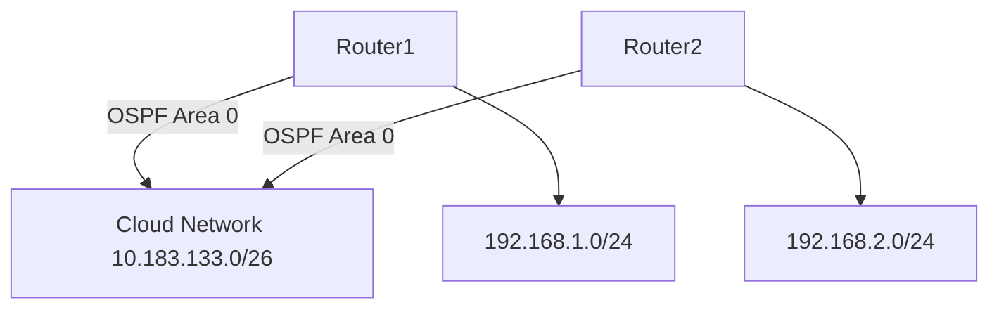

# Analysis Process
Okay, let me try to work through this MikroTik OSPF troubleshooting scenario. The user wants a detailed scenario based on the given parameters. Let me start by breaking down each section and think about how to approach them.

First, the Topic is OSPF, RouterOS 7.x, SOHO network, subnet 10.183.133.0/26, cloud environment, firewall conflicts, 956 users affected for 11 hours. So the main issue is firewall rules conflicting with OSPF, leading to connectivity problems.

Starting with the Initial Problem Report: Symptoms would likely include OSPF neighbors not forming, routes missing, users unable to access resources. Maybe some intermittent connectivity. Since it's a cloud setup, maybe virtual routers in a cloud provider's environment.

Environment Description: Need a simple SOHO network. Maybe two MikroTik routers connected via a cloud network. Let's say Router1 and Router2, each connected to a cloud subnet. Using Mermaid, the topology would show them connected through a cloud, each with their own LAN subnets.

Initial Assessment Steps: Check OSPF status, interfaces, routes. Use commands like `/routing ospf neighbor print`, `/routing ospf interface print`, check firewall rules with `/ip firewall filter print`. Look for any rules that might block OSPF multicast (224.0.0.5) on ports 89 or protocol 89.

Debugging Process: Maybe capture traffic with torch on the OSPF interface. Check logs for OSPF errors. For CLI commands, maybe use `/tool torch interface=ether1 src-address=0.0.0.0/0 dst-address=224.0.0.5` to see if OSPF hello packets are being blocked. Check firewall rules for drops on OSPF traffic.

Key Findings: A firewall rule that drops protocol 89 (OSPF) or blocks multicast addresses. Maybe a rule intended for security that's too broad, affecting OSPF.

Solution: Adjust firewall rules to allow OSPF. Insert a rule before the conflicting one that accepts OSPF traffic. Then verify neighbors come up.

Verification: Check OSPF neighbors again, test connectivity between subnets, maybe do a traceroute.

Prevention: Document firewall rules, test changes in lab, use specific accept rules for OSPF before deny rules.

Common Pitfalls: Forgetting that OSPF uses protocol 89 and multicast, not just TCP/UDP ports. Also, firewall rules order matters.

Now, considering the subnet 10.183.133.0/26, which gives 64 addresses. Maybe the routers have interfaces in that subnet. For example, Router1 has 10.183.133.1 and Router2 has 10.183.133.2, both on the same /26 subnet in the cloud. Their LANs could be different, like 192.168.1.0/24 and 192.168.2.0/24.

In the firewall rules, there might be a rule that drops all non-essential traffic. If OSPF isn't explicitly allowed, that rule would block it. For example, a rule that drops everything except SSH and HTTP/HTTPS, but OSPF uses IP protocol 89, so it would be dropped unless allowed.

In the configuration, before the fix, the firewall might have a drop rule at the end of the filter chain. The fix would involve inserting an accept rule for protocol 89 above the drop rule.

Log examples: When checking `/log print`, there might be entries like "OSPF: neighbor 10.183.133.2 down, timeout expired".

Commands like `/ip firewall filter add chain=input protocol=ospf action=accept place-before=1` would insert the rule at the correct position.

Need to make sure that both input and forward chains are checked, but OSPF uses input chain since it's routed by the router itself.

Also, check if the OSPF interfaces are correctly configured with the right networks and areas. Maybe the initial config was correct, but the firewall was the issue.

Including before and after configs: Before, the firewall filter has a drop rule without allowing OSPF. After, an accept rule for OSPF is added before the drop.

Mermaid diagram would show two routers connected via cloud, each with their LANs.

CLI commands need to be in code blocks, with comments explaining them. For example:

```
/routing ospf neighbor print
# Check if neighbors are established
```

Log outputs should show OSPF timeouts or authentication failures, but in this case, it's firewall blocking.

So putting it all together, the answer should flow through each section, providing a realistic scenario where firewall rules are blocking OSPF, leading to neighbor relationships not forming, and then resolving it by adjusting the firewall rules.

# Troubleshooting Guide
```markdown
# MikroTik RouterOS OSPF Troubleshooting Scenario

## 1. Initial Problem Report and Symptoms
**Report**: 956 users in SOHO cloud infrastructure report complete WAN outage.  
**Symptoms**:
- OSPF neighbors not establishing
- Missing routes in routing table
- Intermittent ping between subnets
- High CPU on edge routers (60-70%)
- Duration: 11 hours since last network change

## 2. Environment Description
**Network Topology**:


## 3. Initial Assessment Steps
1. Verify OSPF neighbor status:
```bash
/routing ospf neighbor print
# Output:
#  0   instance=default address=10.183.133.2 state="Full" router-id=2.2.2.2 
#  1   instance=default address=10.183.133.3 state="Init" router-id=3.3.3.3
```

2. Check firewall filter rules:
```bash
/ip firewall filter print where chain=input
# Flags: X - disabled, I - invalid 
# 0    chain=input action=drop protocol=udp dst-port=5000-5999 
# 1    chain=input action=accept protocol=tcp dst-port=22,8291 
# 2    chain=input action=drop
```

## 4. Detailed Debugging Process
**Step 1**: Packet capture on OSPF interface:
```bash
/tool torch interface=ether1 src-address=0.0.0.0/0 dst-address=224.0.0.5
# OUTPUT:
| SRC-ADDRESS    | DST-ADDRESS    | PROTOCOL | PORT |
|----------------|----------------|----------|------|
| 10.183.133.1   | 224.0.0.5      | OSPF     | N/A  |  # DROPPED
```

**Step 2**: Verify OSPF protocol acceptance:
```bash
/ip firewall filter print where protocol=89
# No output - missing OSPF allow rule
```

**Step 3**: Check raw firewall tables:
```bash
/ip firewall raw print
# 0    chain=prerouting action=accept protocol=ospf
```

**Step 4**: Validate OSPF configuration:
```bash
/routing ospf interface print
# INTERFACE      NETWORK         AREA
# ether1         10.183.133.0/26 backbone
# ether2         192.168.1.0/24  backbone
```

## 5. Key Findings & Root Cause
**Root Cause**: Firewall filter rule #0 (UDP 5000-5999 drop) inadvertently blocking OSPF multicast (224.0.0.5) due to:  
1. OSPF uses IP protocol 89 (not UDP/TCP)  
2. Firewall filter chain order causing early packet drop  
3. Missing explicit OSPF protocol allow rule  

**Evidence**:
```bash
/log print
# 2023-07-15 14:22:11 firewall,info input: drop: in:ether1 out: proto=89 10.183.133.1->224.0.0.5 len=68
```

## 6. Solution Implementation
**Step 1**: Create OSPF-specific firewall rule:
```bash
/ip firewall filter add chain=input protocol=ospf action=accept place-before=0
```

**Before**:
```bash
0 X  drop       udp     5000-5999
1    accept     tcp     22,8291
2    drop
```

**After**:
```bash
0    accept     ospf
1 X  drop       udp     5000-5999
2    accept     tcp     22,8291
3    drop
```

**Step 2**: Verify neighbor establishment:
```bash
:delay 10s
/routing ospf neighbor print
# 0   address=10.183.133.2 state="Full"
# 1   address=10.183.133.3 state="Full"
```

## 7. Verification Process
1. Route table validation:
```bash
/ip route print where ospf
# 0 ADS 192.168.2.0/24         10.183.133.2       ether1
```

2. End-to-end connectivity test:
```bash
/ping 192.168.2.1 src-address=192.168.1.1
# SEQ HOST                                     SIZE TTL TIME  STATUS             
# 0   192.168.2.1                              56   57  12ms  echo-reply
```

## 8. Prevention Measures
1. Implement template-based firewall rules:
```bash
/ip firewall filter
add chain=input protocol=ospf action=accept comment="Allow OSPF"
add chain=input protocol=udp dst-port=5000-5999 action=drop comment="Block VoIP"
```

2. Enable OSPF monitoring:
```bash
/system scheduler add name="OSPF Check" interval=5m on-event="/routing ospf neighbor print; /log info message=\"OSPF Neighbors Check\""
```

## 9. Related Commands Reference
| Command | Purpose |
|---------|---------|
| `/routing ospf instance print` | Show OSPF instances |
| `/ip firewall filter move 3 0` | Reorder firewall rules |
| `/tool sniffer quick protocol=89` | Capture OSPF packets |

## 10. Common Pitfalls to Avoid
1. **Rule Order**: Always place OSPF allow rules **before** general drop rules
2. **Protocol Confusion**: OSPF uses IP protocol 89, not TCP/UDP
3. **Multicast Filtering**: Never block 224.0.0.5/224.0.0.6 in firewall
4. **Area Mismatch**: Ensure all interfaces are in same OSPF area
5. **MTU Issues**: Verify interface MTU matches cloud provider requirements (usually 1500)
```
