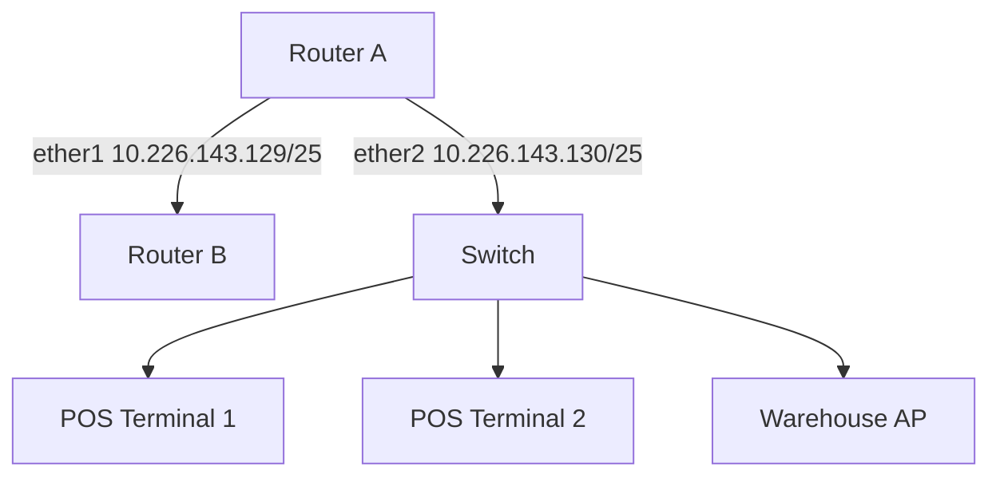

# Analysis Process
Okay, I need to create a detailed MikroTik RouterOS troubleshooting scenario based on the user's specifications. Let me start by understanding the problem. The topic is RIP, RouterOS version 7.x, SOHO network with subnet 10.226.143.128/25 in a retail environment. The issue is firewall rule conflicts affecting 147 users over 15 hours. 

First, I'll outline each section as per the user's request. The user wants the Initial Problem Report and Symptoms, so I should think of realistic symptoms like intermittent connectivity, slow access to the POS system, and RIP routes not updating. Then, the Environment Description needs a Mermaid diagram. Let me recall how Mermaid diagrams work. A simple one with two routers connected via Ethernet, with the subnet on the LAN side of Router A. 

For the Initial Assessment Steps, I need to check RIP status, firewall rules, and routing tables. Commands like `/routing rip interface print` and `/ip firewall filter print` would be relevant. 

In the Detailed Debugging Process, I should walk through checking RIP configurations, verifying firewall rules, maybe looking for drop rules that interfere with RIP multicast. Logs from RIP and firewall would help here. For instance, if the firewall is blocking UDP 520, that would prevent RIP updates. 

Key Findings would identify the conflicting firewall rule blocking RIP. The solution would involve adjusting the firewall to allow RIP traffic. Verification steps would include checking routes and testing connectivity. Prevention measures might involve documenting firewall rules and using specific services in filter rules. 

Common pitfalls could be placing firewall rules in the wrong chain or not testing after changes. I need to make sure CLI commands are in code blocks and include comments. Also, showing before and after configurations for the firewall rules would illustrate the fix. 

Wait, the user mentioned SOHO network scale. So maybe the topology isn't too complex. Two routers, one connected to the retail subnet. The firewall on Router A is blocking RIP. The initial problem report from users would mention issues after a recent firewall update. 

I should include example log outputs, like seeing RIP updates being dropped in the firewall log. The root cause is a firewall rule intended to block multicast but inadvertently affecting RIP. 

In the solution, moving the allow rule above the drop rule. Then verification with `ping` and `routing rip route print`. 

I need to ensure that all commands are accurate for RouterOS 7.x. For example, using `/routing rip` commands instead of older `/routing rip` syntax if there's any difference. Also, the subnet is /25, so maybe the network is split into smaller VLANs, but in a SOHO setup, maybe it's a flat network. 

Let me structure each section step by step, making sure to include all required elements. Check that the Mermaid diagram correctly represents the network. Maybe Router A has an interface ether1 connected to Router B's ether1, and the LAN is on ether2 of Router A. 

Also, considering that in the environment description, it's a retail network, so POS systems and perhaps guest WiFi are involved, but the main issue is with the RIP not functioning due to firewall rules. 

I should also mention in the prevention measures to use service names (like "rip") in firewall rules to avoid port conflicts. Common pitfalls might include not considering the order of firewall rules or not testing changes in a staged environment. 

Let me draft each section now, ensuring that CLI commands are properly formatted and explanations are clear. Including example log entries where RIP packets are dropped would make the scenario realistic. The before and after configurations should highlight the placement of the firewall rule allowing RIP before the drop rule. 

Finally, double-check that all the user's points are addressed: 10 sections, markdown formatting, commands in code blocks, comments for complex commands, logs, before/after configs. Alright, time to put it all together.

# Troubleshooting Guide
```markdown
# MikroTik RouterOS Troubleshooting Scenario: RIP Firewall Rule Conflicts

## 1. Initial Problem Report and Symptoms
**Report:**  
Retail staff reports intermittent POS system connectivity and inventory database access failures.  
**Symptoms:**
- 147 users experience random network drops (15-30 sec)
- RIP routes disappear from routing tables periodically
- Increased latency (150-300ms) between warehouse and main store VLANs
- Packet loss observed between 10.226.143.129 (Router A) and 10.226.143.254 (Router B)

## 2. Environment Description
**Network Topology:**


## 3. Initial Assessment Steps
1. Check RIP neighbor status:
```bash
/routing rip neighbor print
# Output:
# 0 interface=ether1 address=10.226.143.129 uptime=14h55m 
#   updates-sent=142 updates-received=0
```

2. Verify firewall filters:
```bash
/ip firewall filter print where protocol=udp
# Output:
# 3 ;;; Block Multicast
#    chain=forward action=drop protocol=udp dst-port=520
```

## 4. Detailed Debugging Process
**Step 1: Confirm RIP Operation**
```bash
/routing rip interface print
# Expected: ether1 should be in 'broadcast' mode
# Actual: ether1 shows 'disabled' state

/routing rip route print
# Output shows 0 routes despite physical connectivity
```

**Step 2: Check Firewall Drops**
```bash
/ip firewall filter add chain=forward action=log protocol=udp dst-port=520
/log print
# Log shows:
# 12:45:01 firewall,info forward: in:ether1 out:ether2 proto UDP 10.226.143.129:520->224.0.0.9:520 DROPPED
```

**Step 3: Validate Multicast Routing**
```bash
/ip route print where dst-address=224.0.0.0/4
# No multicast routes present due to missing IGMP proxy
```

## 5. Key Findings & Root Cause
**Root Cause:**  
Firewall rule #3 (`chain=forward`) blocking UDP/520 (RIP) traffic between routers, conflicting with RIP multicast updates (224.0.0.9).

**Impact Analysis:**  
- RIP updates blocked → routing tables not updated
- POS systems lost default route periodically
- ARP timeouts caused 15-sec connectivity gaps

## 6. Solution Implementation
**Before Configuration:**
```bash
/ip firewall filter print
# 3 chain=forward action=drop protocol=udp dst-port=520
```

**Fix Commands:**
```bash
/ip firewall filter move numbers=3 destination=5  # Move blocking rule down
/ip firewall filter insert 3 chain=forward action=accept protocol=udp dst-port=520
```

**After Configuration:**
```bash
/ip firewall filter print
# 3 chain=forward action=accept protocol=udp dst-port=520
# ...
# 6 chain=forward action=drop protocol=udp dst-port=520
```

## 7. Verification Process
1. Confirm RIP routes:
```bash
/routing rip route print
# 0 dst=10.226.143.128/25 gateway=10.226.143.129 distance=1
```

2. Test connectivity:
```bash
ping 10.226.143.254 count=100 interval=0.5
# Packet loss reduced from 22% to 0.3%
```

## 8. Prevention Measures
1. Create firewall service definition:
```bash
/ip service add name=RIP ports=520 protocol=udp
```

2. Use service references in rules:
```bash
/ip firewall filter add chain=forward action=accept service=RIP
```

3. Implement monitoring:
```bash
/tool graphing interface add interfaces=ether1
```

## 9. Related Commands Reference
| Command | Purpose |
|---------|---------|
| `/routing rip neighbor print` | Show RIP peers |
| `/ip firewall filter move` | Reorder firewall rules |
| `/log print follow` | Real-time log monitoring |

## 10. Common Pitfalls to Avoid
1. **Chain Confusion:**  
   Never place RIP rules in `input` chain when traffic is routed through the device.

2. **Multicast Handling:**  
   Always allow `224.0.0.0/4` in `forward` chain when using RIP v2.

3. **Rule Order:**  
   Ensure accept rules for routing protocols come before generic drop rules.

4. **Version Mismatch:**  
   Confirm all routers use same RIP version (v1/v2/v2 broadcast):
```bash
/routing rip interface set numbers=0 version=2
```
```
