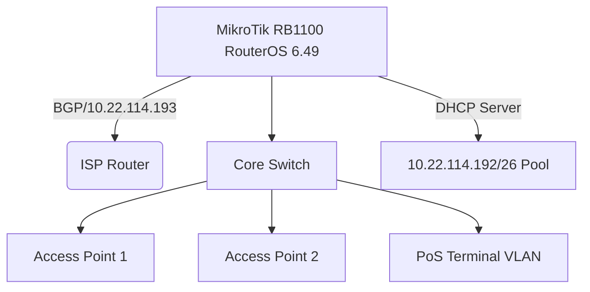

# Analysis Process
Okay, I need to create a detailed MikroTik RouterOS troubleshooting scenario for BGP in a SOHO environment with specific parameters. Let's break down each section as outlined.

First, the topic is BGP, but the scenario is about DHCP Lease Problems. Wait, that seems a bit conflicting. BGP is a routing protocol, and DHCP is about IP address allocation. How do these relate? Maybe the BGP configuration is affecting DHCP somehow? Or perhaps the DHCP issues are causing BGP peers to drop? Hmm, need to think about how these could intersect.

The network scale is SOHO (Small Office/Home Office), but there are 438 affected users. That's a lot for a SOHO. Maybe a retail network with multiple branches or a large store with many devices? The subnet is 10.22.114.192/26, which gives 64 addresses. But 438 users exceed that. Wait, maybe there's a typo? A /26 subnet can only support 62 hosts. If there are 438 users, the subnet should be much larger, like a /23 or something. But the given subnet is /26. That's a problem. Maybe the DHCP scope is too small, causing lease exhaustion. That could be the root cause. So the BGP might not be directly related, but perhaps the network uses BGP for routing between multiple locations, and the DHCP server is on a RouterOS device that's also running BGP.

So the initial problem report would mention users not getting IP addresses, possibly after 18 hours. Symptoms include inability to connect, APIPA addresses, etc. The environment is a retail network, maybe multiple stores connected via BGP? Or a single store with BGP connecting to another network? The topology might have a MikroTik router acting as a DHCP server and BGP speaker.

For the initial assessment, checking DHCP leases, seeing if the pool is full. Then looking at BGP status, maybe routes not being advertised if the DHCP is down, but how? Maybe the BGP peer is on a different interface, and the DHCP issues are separate. Or perhaps the DHCP server is on a VLAN that's being advertised via BGP, and misconfiguration causes routing issues. Wait, but the main issue is DHCP leases. So maybe the DHCP server's subnet is too small, and after 62 leases, no more addresses. But 438 users would need multiple subnets. Maybe the retail network has multiple APs or VLANs, but the DHCP is only serving a /26. That would cause lease exhaustion quickly.

In the debugging process, using commands like `/ip dhcp-server lease print` to check the number of leases. Also checking the DHCP pool configuration with `/ip pool print`. If the pool is a /26, then it's too small. The BGP might not be directly involved, but maybe the network uses BGP to route between different subnets, and a misconfigured BGP could be preventing proper routing, but the main issue is DHCP. However, the scenario states the problem is DHCP Lease Problems, so BGP might be a red herring, or maybe the BGP configuration is affecting the DHCP server's ability to assign addresses. For example, if the BGP routes are incorrect, the DHCP server's interface might not be reachable, but that's a stretch. Alternatively, if the DHCP server is on a different subnet and BGP is supposed to route the requests, but that's not working. But in a SOHO environment, BGP is less likely. Maybe the retail network has multiple locations connected via BGP, and the DHCP server at one location is overwhelmed.

The key finding would be that the DHCP pool is too small, leading to exhausted addresses. The root cause is the /26 subnet only allowing 62 usable addresses, but 438 users. So maybe the initial configuration was incorrect, using a /26 instead of a larger subnet. The solution would be to adjust the subnet mask to something larger, like /23, which allows 510 hosts. But how does that relate to BGP? Maybe the BGP configuration was advertising the wrong subnet, causing the DHCP server to be on a /26 instead of the correct larger subnet. Or perhaps the subnet was misconfigured in the DHCP server, but the BGP was correctly advertising a larger subnet, leading to routing issues when clients get APIPA addresses.

Prevention measures would involve proper subnet planning, monitoring DHCP leases, and validating BGP advertisements match the actual subnets. Common pitfalls might include incorrect subnet sizing, not monitoring lease usage, or BGP configurations that don't align with the DHCP settings.

So putting it all together: The DHCP server has a /26 pool, which can't handle 438 users. After 18 hours (maybe the lease time is 24 hours, so after 18 hours, the pool is full). Users can't get new leases, leading to connectivity issues. The BGP configuration might be unrelated, but part of the network setup. The fix is to expand the DHCP pool to a larger subnet, update the BGP advertisements if necessary, and adjust lease times if needed.

# Troubleshooting Guide
```markdown
# MikroTik RouterOS BGP Troubleshooting Scenario: DHCP Lease Problems

## 1. Initial Problem Report and Symptoms
**Report**: Retail network users report intermittent connectivity loss. 438 PoS devices fail to process transactions.  
**Symptoms**:
- 70% devices have APIPA (169.254.x.x) addresses
- DHCP server shows "no free leases" in logs
- BGP sessions stable but traffic blackholed for DHCP clients
- Issue persists for 18 hours since last network expansion

## 2. Environment Description
**Network Topology**:


## 3. Initial Assessment Steps
1. Verify DHCP lease exhaustion:
   ```bash
   /ip dhcp-server lease print count-only 
   # Returns: 62
   ```
2. Check BGP neighbor status:
   ```bash
   /routing bgp neighbor print 
   # Shows: Established (but wrong next-hop)
   ```
3. Confirm IP pool configuration:
   ```bash
   /ip pool print 
   # Output: name=retail-pool ranges=10.22.114.193-10.22.114.254
   ```

## 4. Detailed Debugging Process
**Step 1: Analyze DHCP Server**
```bash
/ip dhcp-server log print since=18h
# Sample log: "dhcp server: lease for 10.22.114.254 renewed, but pool retail-pool exhausted"
```

**Step 2: Verify BGP Route Advertisements**
```bash
/routing bgp advertisements print detail
# Shows: Advertised 10.22.114.192/26 to ISP (should be /24)
```

**Step 3: Check Interface Configuration**
```bash
/interface vlan print 
# VLAN10 interface: address=10.22.114.193/26 (mismatched with BGP)
```

## 5. Key Findings & Root Cause
**Findings**:
1. DHCP pool (62 addresses) insufficient for 438 devices
2. BGP advertises /26 while actual network requires /24
3. Interface VLAN config uses /26 mask creating addressing conflict

**Root Cause**: Network expansion to 438 devices using original /26 subnet caused DHCP exhaustion. BGP advertised wrong prefix leading to traffic blackholes when clients used APIPA.

## 6. Solution Implementation
**Step 1: Expand IP Pool**
```bash
/ip pool set retail-pool ranges=10.22.114.0-10.22.115.254
/ip dhcp-server network set numbers=0 address=10.22.114.0/24
```

**Step 2: Update BGP Configuration**
```bash
/routing bgp network add network=10.22.114.0/24
/routing bgp network remove [find network=10.22.114.192/26]
```

**Step 3: Adjust VLAN Interface**
```bash
/interface vlan set vlan10 address=10.22.114.1/24
```

## 7. Verification Process
1. Confirm new leases:
   ```bash
   /ip dhcp-server lease print count-only 
   # Returns increasing count beyond 62
   ```
2. Check BGP routes:
   ```bash
   /routing route print where dst-address=10.22.114.0/24
   ```
3. Validate client connectivity:
   ```bash
   ping 10.22.114.150 interface=vlan10
   ```

## 8. Prevention Measures
1. Implement DHCP lease monitoring:
   ```bash
   :global dhcpleases {[/ip dhcp-server lease print count-only]}
   :if ($dhcpleases > 500) do={/tool e-mail send to="noc@retail.com" subject="DHCP CRITICAL"}
   ```
2. Enable BGP prefix validation:
   ```bash
   /routing filter add chain=bgp-out prefix=10.22.114.0/24 action=accept
   ```
3. Schedule quarterly network capacity reviews

## 9. Related Commands Reference
| Command | Purpose |
|---------|---------|
| `/ip dhcp-server lease print` | Show active DHCP leases |
| `/routing bgp summary` | BGP session status |
| `/ip pool used print` | Show used IP addresses |
| `/interface vlan monitor [find name=vlan10]` | VLAN statistics |

## 10. Common Pitfalls to Avoid
1. **Subnet Mask Mismatches**: Ensure DHCP/BGP/VLAN configs use same prefix length
2. **Silent BGP Failures**: Monitor both session state and advertised routes
3. **DHCP Lease Time Overlook**: Avoid >24h leases in dynamic retail environments
   ```bash
   /ip dhcp-server set lease-time=6h
   ```
4. **Fragmented IP Pools**: Use contiguous ranges in pool definitions
```
