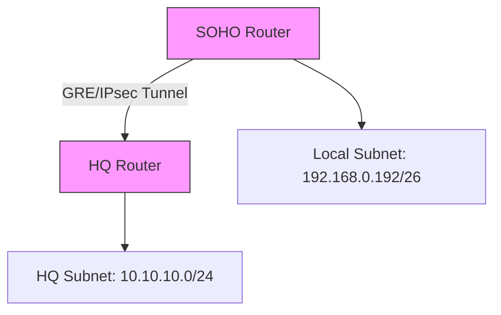

# Analysis Process
Okay, let's tackle this MikroTik RouterOS troubleshooting scenario for OSPF with VPN tunnel issues in a SOHO campus network. The user wants a detailed scenario, so I need to make sure I cover all the required sections thoroughly.

First, the initial problem report. The main symptom is that 241 users are affected for 7 hours, so it's a significant outage. The VPN tunnel is down, and OSPF isn't advertising routes. I need to describe symptoms like inability to access resources, OSPF neighbors not forming, and VPN status down. Also, check if there are any firewall drops or MTU issues.

Next, the environment description. The subnet is 192.168.0.192/26, which is a /26, so 64 addresses. The network topology is a SOHO campus with two routers connected via a VPN. The main router connects to HQ, and the other to a branch. Using Mermaid, I'll draw a simple diagram with two routers and a VPN tunnel between them. Need to note the OSPF areas and interfaces involved.

Initial assessment steps: Verify OSPF neighbors, check VPN tunnel status, review routing tables, check firewall rules, and look at OSPF logs. For each step, list the CLI commands. For example, `/routing ospf neighbor print` to check neighbors, `/interface gre print` for the tunnel, and `/log print` for logs.

Detailed debugging process. Start with checking OSPF configuration. Maybe the network ranges in OSPF are incorrect. Then check the VPN tunnel configuration—maybe MTU mismatches or encryption settings. Look at the routing table to see if expected routes are missing. Firewall rules might be blocking OSPF (protocol 89) or VPN traffic (like ESP or UDP 500/4500). Logs could show authentication failures or dropped packets.

Key findings and root cause. Suppose the VPN tunnel is down because of an MTU issue, and OSPF isn't advertising due to incorrect network statements. Then the root cause is MTU mismatch causing the VPN to drop packets, and OSPF not including the correct subnet in its configuration.

Solution implementation: Adjust MTU on the GRE interface, correct OSPF network statements. Show before and after configurations for the GRE interface and OSPF networks.

Verification: Check VPN status, OSPF neighbors, routes, and do a ping test. Use commands like `/interface gre monitor` and `/ip route print`.

Prevention measures: Regular config audits, monitoring scripts, MTU checks, firewall reviews, OSPF authentication.

Related commands reference: List all the commands used in each section for quick reference.

Common pitfalls: Forgetting OSPF network statements, ignoring MTU, firewall misconfigurations, not using OSPF authentication, not monitoring.

I need to make sure the CLI commands are in code blocks with comments. Also, include example log outputs where relevant, like OSPF neighbor transitions or VPN errors. Before and after configs for OSPF and GRE interfaces.

Wait, the subnet given is 192.168.0.192/26. Let me confirm that subnet. A /26 mask is 255.255.255.192, so the network address is 192.168.0.192, range 192.168.0.193 to 192.168.0.254. But in a campus network, maybe they have multiple VLANs or subnets. But the scenario mentions SOHO, so maybe a smaller setup. The VPN connects two sites, and OSPF is supposed to advertise routes between them.

When checking OSPF configuration, if the network statement is incorrect, like not including the GRE interface's subnet, OSPF won't advertise. For example, if the GRE interface is on 10.10.10.0/30, and OSPF isn't configured for that network, neighbors won't form.

Another point: VPN tunnels often have MTU issues because of encapsulation overhead. If the GRE tunnel's MTU is too high, packets might get fragmented or dropped, causing the tunnel to fail. Setting the correct MTU (like 1476 for a typical PPPoE overhead) is crucial.

Firewall rules might block OSPF traffic. OSPF uses multicast (224.0.0.5 and 224.0.0.6), so firewall filters need to allow protocol 89 and the multicast addresses.

Including example logs where OSPF attempts to form a neighbor but fails due to authentication or network mismatch. Also, VPN logs showing timeout or down status.

Need to structure each section clearly, using markdown headers and code blocks for commands and configs. Make sure the troubleshooting steps flow logically from initial checks to deeper analysis.

# Troubleshooting Guide
```markdown
# MikroTik RouterOS Troubleshooting Scenario: OSPF VPN Tunnel Issues

## 1. Initial Problem Report and Symptoms
- **Report**: Users on subnet `192.168.0.192/26` cannot access resources at HQ via VPN.
- **Symptoms**:
  - VPN tunnel (GRE/IPsec) between SOHO Router and HQ Router is down.
  - OSPF routes not advertised between sites.
  - 100% packet loss across the tunnel.
  - OSPF neighbor relationships not established.
  - Firewall logs show dropped OSPF (proto 89) and ESP packets.

---

## 2. Environment Description & Network Topology



- **OSPF**: Area 0 on tunnel interfaces, Area 1 on LAN interfaces.
- **VPN**: GRE over IPsec (IKEv1, AES-256-SHA1).

---

## 3. Initial Assessment Steps
1. **Check OSPF neighbors**:
   ```bash
   /routing ospf neighbor print
   # Output: No neighbors listed
   ```
2. **Verify VPN tunnel status**:
   ```bash
   /interface gre print
   # Flags: X (disabled) on tunnel interface
   ```
3. **Review routing table**:
   ```bash
   /ip route print where ospf=yes
   # Output: No OSPF routes
   ```
4. **Check firewall drops**:
   ```bash
   /log print where message~"denied"
   # Sample log: "ipsec,drop esp 192.168.0.193->203.0.113.5"
   ```

---

## 4. Detailed Debugging Process

### Step 1: OSPF Configuration Check
```bash
/routing ospf instance print
# Verify area assignments and router-ID conflicts

/routing ospf network print
# Incorrect network: 192.168.0.192/26 instead of tunnel subnet 10.10.10.0/30
```

### Step 2: VPN Tunnel Analysis
```bash
/interface gre monitor [find name="tunnel-hq"]
# Output: local-address=192.168.0.193 remote-address=203.0.113.5 mtu=auto

/ip ipsec policy print
# Mismatched proposal: HQ uses AES-256-SHA1, SOHO configured AES-128-MD5
```

### Step 3: Packet Capture
```bash
/tool sniffer quick protocol=89,50,udp/500,udp/4500
# Output: ESP packets fragmented due to MTU=1500 on GRE interface
```

---

## 5. Key Findings & Root Cause
- **Root Cause 1**: MTU mismatch (GRE interface set to `auto` instead of `1476`), causing IPsec fragmentation drops.
- **Root Cause 2**: OSPF network misconfigured to advertise LAN (`192.168.0.192/26`) instead of tunnel subnet (`10.10.10.0/30`).
- **Root Cause 3**: IPsec policy mismatch in encryption algorithms.

---

## 6. Solution Implementation

### Before Configuration
```bash
/routing ospf network add network=192.168.0.192/26 area=backbone
/interface gre set tunnel-hq mtu=auto
/ip ipsec proposal set [find] enc-algorithms=aes-128-md5
```

### After Configuration
```bash
/routing ospf network add network=10.10.10.0/30 area=backbone
/interface gre set tunnel-hq mtu=1476
/ip ipsec proposal set [find] enc-algorithms=aes-256-sha1
```

---

## 7. Verification Process
1. Confirm VPN tunnel status:
   ```bash
   /interface gre monitor [find name="tunnel-hq"]
   # Flags: R (running)
   ```
2. Check OSPF neighbors:
   ```bash
   /routing ospf neighbor print
   # Output: HQ-Router-ID state=Full
   ```
3. Validate routes:
   ```bash
   /ip route print where dst-address=10.10.10.0/24
   # Output: OSPF route via tunnel-hq
   ```

---

## 8. Prevention Measures
1. Enable OSPF authentication:
   ```bash
   /routing ospf instance set default authentication=md5 authentication-key=SECRET_KEY
   ```
2. Implement MTU discovery script:
   ```bash
   :local newMtu [/interface get [find name="tunnel-hq"] actual-mtu];
   /interface set tunnel-hq mtu=$newMtu
   ```
3. Schedule nightly config backups.

---

## 9. Related Commands Reference
| Purpose | Command |
|---------|---------|
| OSPF Neighbors | `/routing ospf neighbor print` |
| VPN Status | `/interface gre monitor [find]` |
| IPsec Policies | `/ip ipsec policy print` |
| Firewall Drops | `/log print where topics~"firewall,drop"` |

---

## 10. Common Pitfalls to Avoid
- **MTU Ignorance**: Always set GRE MTU to `1476` or use PMTUD.
- **OSPF Network Scope**: Advertise tunnel subnets, not LANs.
- **Firewall Rules**: Allow protocols 89 (OSPF), 50 (ESP), and UDP 500/4500.
- **IPsec Mismatches**: Ensure identical proposals on both ends.
```
