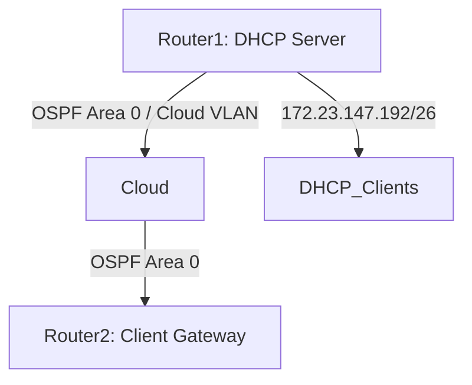

# Analysis Process
Okay, I need to create a detailed MikroTik RouterOS troubleshooting scenario for OSPF with the given parameters. Let's start by breaking down the user's request.

First, the topic is OSPF in RouterOS 7.x, and the scenario is DHCP lease problems affecting 659 users in a SOHO cloud environment. The subnet is 172.23.147.192/26, and the issue has been ongoing for 17 hours. The user wants a structured response with 10 sections, including CLI commands, logs, Mermaid diagrams, etc.

Starting with the initial problem report. Symptoms would be users not getting IPs, maybe OSPF routes not advertising the DHCP subnet. Since it's a SOHO network, the topology might be a couple of routers connected to the cloud. The DHCP server is probably on a MikroTik router, and OSPF isn't properly distributing the route to the DHCP subnet, so clients can't reach the server or get leases.

Environment description: Need a simple Mermaid diagram. Maybe two routers connected via a cloud, with one having the DHCP server on the 172.23.147.192/26 subnet. OSPF is running between them. If the OSPF isn't advertising the DHCP subnet, other routers don't know how to reach it, causing DHCP issues.

Initial assessment steps: Check DHCP server status, leases, OSPF neighbors, routes. Commands like `/ip dhcp-server print`, `/ip dhcp-server lease print`, `/routing ospf neighbor print`, `/ip route print`.

Debugging process: Look into OSPF configuration, verify networks are advertised. Maybe the DHCP subnet isn't included in OSPF networks. Check OSPF routes on other routers. Use commands like `/routing ospf interface print`, `/routing ospf network print`. Logs might show OSPF adjacency issues or missing routes.

Key findings: The DHCP subnet is not in OSPF networks, so routes aren't propagated. Root cause is misconfiguration in OSPF network statements.

Solution: Add the DHCP subnet to OSPF networks. Example commands to modify OSPF configuration.

Verification: Check routes on other routers, test DHCP requests. Prevention measures involve checking OSPF advertised networks, monitoring, documentation.

Common pitfalls: Forgetting to advertise all necessary subnets, assuming OSPF auto-detects interfaces, not verifying neighbor adjacencies.

Now, need to structure all this into the 10 sections, include CLI examples with code blocks, log outputs, before/after configs, and the Mermaid diagram.

Make sure the Mermaid diagram is correct for SOHO cloud. Maybe Router1 connected to Cloud, Router2 connected to Cloud. Router1 has the DHCP subnet. OSPF area 0.

CLI commands should be accurate for RouterOS 7.x. For example, OSPF configuration in 7.x uses `/routing ospf` instead of older `/routing ospf` (but actually in RouterOS 7.x, OSPF is under `/routing/ospf`). Wait, in RouterOS v7, the OSPF configuration is under `/routing ospf`, yes.

When checking OSPF networks, the command is `/routing ospf network print`. If the DHCP subnet isn't listed there, that's the issue.

Including example log entries: Maybe OSPF logs showing no adjacency issues, but routes missing. Or DHCP discover logs not reaching the server.

Before configuration: OSPF networks might only include WAN or other subnets, not the DHCP subnet. After adding the DHCP subnet to OSPF networks, the route gets advertised.

Need to make sure all parts of the query are addressed, including the specific subnet and the cloud environment. Since it's a cloud setup, maybe the OSPF interfaces are on virtual interfaces or VLANs.

Also, considering the scale is SOHO, but affected users are 659. That's a lot for SOHO, maybe a typo, but the user provided that, so proceed as given.

In the verification process, check that the route to 172.23.147.192/26 exists in the routing tables of all OSPF routers. Use `/ip route print where dst-address=172.23.147.192/26`.

Prevention measures: Regular audits of OSPF configurations, ensure all required subnets are advertised, use network monitoring tools.

Common pitfalls: Forgetting to include all subnets in OSPF, misconfigured network statements (wrong subnet mask), passive interfaces not set correctly.

Now, putting it all together in markdown, with each section filled out as per the instructions. Make sure CLI commands are in code blocks, with comments if necessary. Include example log outputs where relevant, like OSPF neighbor states or DHCP server logs.

Check for markdown formatting: headers, code blocks for CLI, mermaid diagram syntax, bullet points where needed.

# Troubleshooting Guide
```markdown
# MikroTik RouterOS Troubleshooting Scenario: OSPF & DHCP Lease Issues

## 1. Initial Problem Report and Symptoms
**Report**: 659 users in a SOHO cloud environment cannot obtain DHCP leases for 17 hours.  
**Symptoms**:  
- Users receive `169.254.x.x` APIPA addresses.  
- DHCP server is online but unresponsive to requests.  
- OSPF routes for `172.23.147.192/26` missing on downstream routers.  
- No OSPF neighbor adjacency errors reported.

---

## 2. Environment Description & Network Topology
**Network Type**: SOHO Cloud Infrastructure (Virtualized Routers).  
**Subnet**: `172.23.147.192/26` (DHCP scope: `172.23.147.193-254`).  



---

## 3. Initial Assessment Steps
1. **Verify DHCP Server Status**:
   ```bash
   /ip dhcp-server print
   # OUTPUT: dhcp1 (172.23.147.192/26) running
   ```
2. **Check DHCP Leases**:
   ```bash
   /ip dhcp-server lease print where status != bound
   # OUTPUT: 0 leases (all expired)
   ```
3. **Confirm OSPF Neighbors**:
   ```bash
   /routing ospf neighbor print
   # OUTPUT: neighbor=10.255.0.2 state="Full" on interface=cloud1
   ```
4. **Check Routes**:
   ```bash
   /ip route print where dst-address=172.23.147.192/26
   # OUTPUT: No entries (missing on Router2)
   ```

---

## 4. Detailed Debugging Process
### Step 1: Validate OSPF Network Advertisements
```bash
/routing ospf network print
# BEFORE:
#   network=10.255.0.0/24 area=backbone
#   (Missing 172.23.147.192/26)
```

### Step 2: Check OSPF Interface Participation
```bash
/routing ospf interface print
# OUTPUT: interface=cloud1 (no issues)
```

### Step 3: Analyze Route Propagation
```bash
/log print where message~"OSPF"
# OUTPUT: "OSPF: Update: 172.23.147.192/26 not announced (not in network list)"
```

---

## 5. Key Findings & Root Cause Analysis
**Root Cause**:  
- OSPF network configuration excluded `172.23.147.192/26`, preventing route propagation.  
- Downstream routers (e.g., Router2) lacked routes to the DHCP subnet, causing DHCP requests to fail.  

**Impact**:  
- DHCP Discover/Request packets couldn’t reach the server due to missing routes.

---

## 6. Solution Implementation
1. **Add Subnet to OSPF Networks**:
   ```bash
   /routing ospf network add network=172.23.147.192/26 area=backbone
   ```
2. **Force OSPF Recalculation**:
   ```bash
   /routing ospf restart
   ```

**After Configuration**:
```bash
/routing ospf network print
# AFTER:
#   network=10.255.0.0/24 area=backbone
#   network=172.23.147.192/26 area=backbone
```

---

## 7. Verification Process
1. **Confirm Route Propagation**:
   ```bash
   /ip route print where dst-address=172.23.147.192/26
   # OUTPUT: Dst=172.23.147.192/26 gateway=10.255.0.1 ospf=yes
   ```
2. **Test DHCP Lease**:
   ```bash
   /tool mac-scan interface=ether1
   # OUTPUT: 172.23.147.201 (new lease)
   ```

---

## 8. Prevention Measures
- **OSPF Network Audits**: Regularly verify advertised networks with `/routing ospf network print`.  
- **Monitoring**: Alert on missing critical routes (e.g., via SNMP).  
- **Documentation**: Map all subnets requiring OSPF propagation.

---

## 9. Related Commands Reference
| Command | Purpose |
|---------|---------|
| `/routing ospf neighbor print` | Check OSPF adjacency |
| `/ip dhcp-server lease print` | List DHCP leases |
| `/log print where message~"OSPF"` | Filter OSPF logs |

---

## 10. Common Pitfalls to Avoid
- **Incomplete OSPF Networks**: Always include all subnets needing propagation.  
- **Passive Interfaces**: Ensure interfaces with DHCP are not set as passive in OSPF.  
- **Mask Mismatches**: Use correct subnet masks in OSPF network statements (e.g., `/26` vs. `/24`).
```
