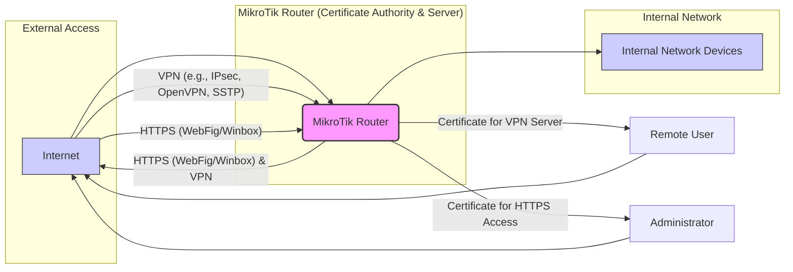

## MikroTik RouterOS Certificates in SOHO Environments (v6.x)

**Topic:** Certificates
**RouterOS Version:** 6.x
**Network Scale:** SOHO
**Complexity Level:** Basic

This document provides a comprehensive guide to managing certificates on MikroTik RouterOS v6.x in a Small Office/Home Office (SOHO) environment. Certificates are crucial for securing various RouterOS services, including web access (HTTPS), VPNs, and secure communication protocols.

---

### 1. Architecture Diagram Requirements

For a SOHO environment, certificate usage is typically focused on securing access to the MikroTik router itself and enabling secure remote access via VPN.



**Diagram Explanation:**

*   **MikroTik Router:** Acts as both a Certificate Authority (CA - optionally for internal use) and a server utilizing certificates for HTTPS and VPN services.
*   **Internal Network Devices:** Devices within the local network, typically unaffected by router certificates directly, but benefit from the overall security provided by the router.
*   **Internet:** The external network from which administrators and remote users access the MikroTik router.
*   **Remote User:**  Connects to the MikroTik router via VPN for secure remote access to the internal network or internet through the router.
*   **Administrator:** Accesses the MikroTik router via HTTPS (WebFig or Winbox) for management.
*   **Certificates:** Used to encrypt HTTPS management access and authenticate VPN servers, ensuring secure communication and verifying identity.

---

### 2. CLI Configuration with Inline Comments

This section provides CLI commands for basic certificate management on MikroTik RouterOS.

**2.1. Generating a Self-Signed Certificate (for HTTPS access - SOHO Example)**

```routeros
# Navigate to certificate menu
/certificate

# Generate a self-signed certificate for HTTPS access
# - name:  Descriptive name for the certificate
# - common-name: Domain or IP address used to access the router (e.g., router.local, public IP)
# - days-valid: Validity period in days
# - key-usage: Specifies certificate usage, 'digital-signature,key-encipherment,tls-server' for HTTPS
# - subject-alt-name: Alternative names, important for browser validation (optional for IP address access)
generate-self-signed name=router-https common-name="router.local" days-valid=365 key-usage=digital-signature,key-encipherment,tls-server

# Print certificate list to verify
print
```

**2.2. Exporting a Certificate (for importing into browsers if self-signed)**

```routeros
# Export the self-signed certificate to a file for browser import (optional for self-signed)
# - numbers: Certificate ID from the 'print' command
# - file: Filename to save the certificate (without extension)
# - export-passphrase: Password to protect the exported private key (keep secure!)
export-certificate numbers=0 file=router-https export-passphrase="YourSecurePassphrase"
# The file 'router-https.crt' and 'router-https.key' will be created in the router's files section.
# You can download them via Winbox -> Files or FTP.
```

**2.3. Importing an External Certificate (e.g., from Let's Encrypt or a commercial CA)**

For SOHO environments, using Let's Encrypt certificates via scripts is recommended for publicly accessible routers. However, manual import is also possible.

```routeros
# Assuming you have certificate files 'certificate.crt' and 'private.key' (e.g., from Let's Encrypt)
# Upload these files to the MikroTik router's Files section (Winbox -> Files or FTP).

# Import the certificate
/certificate import file-name=certificate.crt certificate="certificate"

# Import the private key
/certificate import file-name=private.key certificate="private-key" passphrase="YourPrivateKeyPassphrase"

# Verify imported certificates
print
```

**2.4. Enabling HTTPS for WebFig/Winbox Management**

```routeros
# Navigate to WebFig settings
/ip service

# Enable HTTPS service and set the certificate
set [find name=webfig-ssl] certificate=router-https disabled=no

# Navigate to Winbox settings
/ip service

# Enable Winbox-SSL service and set the certificate
set [find name=winbox-ssl] certificate=router-https disabled=no

# Print service list to verify
print
```

**2.5. Using a Certificate for VPN (Example: IPsec)**

```routeros
# Assuming you have a certificate named 'vpn-server-cert'

# Navigate to IPsec profile settings
/ip ipsec profile

# Create or modify a profile and set the certificate
set [find name=default-enc-profile] certificate=vpn-server-cert

# In IPsec peer configuration, use 'certificate' authentication method
/ip ipsec peer
set [find name=peer1] auth-method=certificate ... # other peer settings
```

---

### 3. REST API Implementation (Python Code)

This section demonstrates certificate management using the MikroTik RouterOS API with Python and the `routeros_api` library.

**Prerequisites:**

*   Install the `routeros_api` library: `pip install routeros_api`

```python
import routeros_api
import ssl # For disabling certificate verification in SOHO testing (not recommended for production)

# Router connection details
ROUTER_HOST = 'your_router_ip'
ROUTER_USER = 'api_user' # Create a dedicated API user with necessary permissions
ROUTER_PASSWORD = 'your_api_password'

def generate_self_signed_certificate(api, cert_name, common_name):
    """Generates a self-signed certificate."""
    try:
        api.get_resource('/certificate').add(
            name=cert_name,
            common_name=common_name,
            days_valid=365,
            key_usage='digital-signature,key-encipherment,tls-server',
            generate_self_signed=True
        )
        print(f"Self-signed certificate '{cert_name}' generated successfully.")
    except routeros_api.exceptions.RouterOsApiError as e:
        print(f"Error generating self-signed certificate: {e}")

def export_certificate(api, cert_name, export_passphrase, file_prefix):
    """Exports a certificate and private key."""
    try:
        certificates = api.get_resource('/certificate').get(name=cert_name)
        if certificates:
            cert_id = certificates[0]['.id']
            api.get_resource('/certificate').export_certificate(
                numbers=cert_id,
                file=file_prefix,
                export_passphrase=export_passphrase
            )
            print(f"Certificate '{cert_name}' exported to '{file_prefix}.crt' and '{file_prefix}.key' on router.")
        else:
            print(f"Certificate '{cert_name}' not found.")
    except routeros_api.exceptions.RouterOsApiError as e:
        print(f"Error exporting certificate: {e}")

def import_certificate(api, cert_file_path, cert_name, private_key_file_path=None, private_key_passphrase=None):
    """Imports a certificate and optionally a private key."""
    try:
        with open(cert_file_path, 'rb') as cert_file:
            certificate_data = cert_file.read()
            api.get_resource('/certificate').import_certificate(certificate=certificate_data, file_name=cert_file_path.split('/')[-1])
            print(f"Certificate from '{cert_file_path}' imported as '{cert_name}'.")

        if private_key_file_path:
            with open(private_key_file_path, 'rb') as key_file:
                private_key_data = key_file.read()
                api.get_resource('/certificate').import_certificate(certificate=private_key_data, file_name=private_key_file_path.split('/')[-1], passphrase=private_key_passphrase)
                print(f"Private key from '{private_key_file_path}' imported for '{cert_name}'.")

    except FileNotFoundError:
        print("Error: Certificate or private key file not found.")
    except routeros_api.exceptions.RouterOsApiError as e:
        print(f"Error importing certificate: {e}")

def enable_https_service(api, cert_name):
    """Enables HTTPS service and sets the certificate."""
    try:
        webfig_ssl_service = api.get_resource('/ip/service').get(name='webfig-ssl')[0]
        api.get_resource('/ip/service').set(id=webfig_ssl_service['id'], certificate=cert_name, disabled='no')
        winbox_ssl_service = api.get_resource('/ip/service').get(name='winbox-ssl')[0]
        api.get_resource('/ip/service').set(id=winbox_ssl_service['id'], certificate=cert_name, disabled='no')
        print(f"HTTPS (WebFig/Winbox) enabled with certificate '{cert_name}'.")
    except routeros_api.exceptions.RouterOsApiError as e:
        print(f"Error enabling HTTPS service: {e}")

def list_certificates(api):
    """Lists all certificates."""
    try:
        certificates = api.get_resource('/certificate').get()
        if certificates:
            print("\n--- Certificates ---")
            for cert in certificates:
                print(f"  Name: {cert['name']}, Common Name: {cert['common-name']}, Valid Until: {cert['valid-until']}")
            print("--- End Certificates ---")
        else:
            print("No certificates found.")
    except routeros_api.exceptions.RouterOsApiError as e:
        print(f"Error listing certificates: {e}")


if __name__ == '__main__':
    try:
        # Disable certificate verification for SOHO testing if needed (NOT RECOMMENDED FOR PRODUCTION)
        context = ssl._create_unverified_context() # ONLY FOR TESTING IN SOHO - REMOVE FOR PRODUCTION
        connection = routeros_api.RouterOsApiPool(ROUTER_HOST, username=ROUTER_USER, password=ROUTER_PASSWORD, ssl_wrapper=context) # Remove ssl_wrapper for production

        api = connection.get_api()

        # Example Usage:
        generate_self_signed_certificate(api, 'soho-https-cert', 'soho-router.local')
        # export_certificate(api, 'soho-https-cert', 'export_password', 'soho-https-cert-export') # Example export
        # import_certificate(api, 'path/to/certificate.crt', 'external-cert', 'path/to/private.key', 'private_key_password') # Example import
        enable_https_service(api, 'soho-https-cert')
        list_certificates(api)

    except routeros_api.exceptions.RouterOsApiCommunicationError as e:
        print(f"Communication error with RouterOS API: {e}")
    except Exception as e:
        print(f"An unexpected error occurred: {e}")
    finally:
        if 'connection' in locals() and connection:
            connection.close()
```

**Explanation:**

*   **Error Handling:**  Each function includes `try...except` blocks to catch `routeros_api.exceptions.RouterOsApiError` and other potential exceptions, providing more robust code.
*   **Functions:**  Code is organized into functions for clarity and reusability.
*   **API Pool:** Uses `routeros_api.RouterOsApiPool` for connection management.
*   **Example Usage:**  The `if __name__ == '__main__':` block demonstrates how to use the functions.
*   **SSL Context (Testing ONLY):**  Includes `ssl._create_unverified_context()` and `ssl_wrapper=context` for *testing in SOHO environments with self-signed certificates*. **Remove these lines for production environments** to ensure proper certificate verification and security.
*   **File Paths:**  When importing, ensure the `cert_file_path` and `private_key_file_path` are correct relative to where the Python script is run or use absolute paths. The script assumes you have uploaded the certificate and key files to the same location as the script or are providing absolute paths. For direct file upload to RouterOS, you might need to adapt this using the API file upload capabilities if needed for larger scale operations, though for SOHO, manual upload via Winbox is often sufficient.

---

### 4. Common Debugging Scenarios

**4.1. Browser Warning "Your connection is not private" (Self-Signed Certificates for HTTPS)**

*   **Cause:** Browsers do not inherently trust self-signed certificates.
*   **Solution (SOHO - Acceptable for Management Interface):**
    *   **Option 1 (Less Secure):** Add a security exception in the browser for the router's IP address or domain. This is generally acceptable for a SOHO router's management interface accessed by trusted users, but educate users about the risks of ignoring certificate warnings in general.
    *   **Option 2 (Recommended):** Import the self-signed certificate into the browser's trusted root certificate store. This eliminates the warning for that specific certificate on that browser. Export the certificate from the MikroTik router (as shown in 2.2) and import it into your browser's settings.
    *   **Option 3 (Best for Public Access - Not typical SOHO Router):** Use a certificate from a trusted Certificate Authority (CA) like Let's Encrypt. This requires a publicly accessible domain name pointing to your router's public IP and a method to automate certificate issuance and renewal (e.g., scripts using Let's Encrypt client).

**4.2. HTTPS Access Fails After Enabling Certificate**

*   **Cause 1: Incorrect Certificate Assigned to Service:** Double-check that the correct certificate name is set in `/ip service` for `webfig-ssl` and `winbox-ssl`.
*   **Cause 2: Certificate Not Valid:** Ensure the certificate's validity period has not expired. Check the `valid-until` field in `/certificate print`.
*   **Cause 3: Key Usage Issues:** Verify the `key-usage` parameter of the certificate includes `tls-server` for HTTPS services.
*   **Cause 4: Firewall Rules:** If you have restrictive firewall rules, ensure they are not blocking HTTPS access (port 443) to the router's management IP.
*   **Cause 5: Binding Address:** Check if the HTTPS service is bound to the correct interface or address. By default, it should listen on all interfaces.

**4.3. VPN Connection Fails with Certificate Authentication**

*   **Cause 1: Incorrect Certificate Assigned to VPN Profile/Server:** Verify that the correct server certificate is assigned in the VPN server profile (e.g., IPsec profile, OpenVPN server settings).
*   **Cause 2: Client Certificate Issues (Mutual Authentication):** If using client certificates (more complex for SOHO):
    *   Ensure the client certificate is correctly installed on the client device.
    *   Verify the client certificate is signed by a CA trusted by the VPN server (if using a CA).
    *   Check certificate validity and revocation status if applicable.
*   **Cause 3: Certificate Chain Issues:**  For certificates signed by intermediate CAs, ensure the full certificate chain (including intermediate CA certificates) is properly configured on the server and/or client if required by the VPN protocol.
*   **Cause 4: Protocol Mismatch:** Ensure the VPN client and server are configured to use the same VPN protocol (e.g., IPsec, OpenVPN) and compatible certificate authentication methods.
*   **Cause 5: Firewall Blocking VPN Ports:**  Verify that firewall rules on both the router and the client network are not blocking the necessary VPN ports (e.g., UDP 500, 4500 for IPsec, UDP/TCP 1194 for OpenVPN).

**Debugging Tools:**

*   **`/certificate print`:**  Displays the list of installed certificates and their properties, including validity, status, and key usage.
*   **`/log print`:** Review system logs for certificate-related errors or warnings when enabling HTTPS or establishing VPN connections. Increase logging verbosity if needed (`/system logging add topics=certificate action=memory`).
*   **Browser Developer Tools (Network Tab):**  When accessing WebFig via HTTPS, use browser developer tools (Network tab) to inspect the certificate details exchanged during the TLS handshake.
*   **VPN Client Logs:**  Check the logs of your VPN client software for detailed error messages related to certificate validation or authentication failures.

---

### 5. Version-Specific Considerations (RouterOS v6.x)

*   **RouterOS v6.x is generally stable but older.**  Consider upgrading to RouterOS v7.x for the latest features, security updates, and performance improvements. However, for basic SOHO certificate management, v6.x is sufficient.
*   **Let's Encrypt Integration:**  Native Let's Encrypt integration is not directly available in v6.x. You need to use scripting and external tools (like `acme.sh` or similar) to automate Let's Encrypt certificate issuance and renewal.  RouterOS v7.x has built-in Let's Encrypt support.
*   **Certificate Management Interface:**  The certificate management interface in v6.x is functional but less feature-rich compared to v7.x.
*   **Performance:**  Certificate operations (generation, import, TLS handshakes) are generally not performance bottlenecks in typical SOHO v6.x router usage. Hardware acceleration for cryptography might be limited in older SOHO router models.

---

### 6. Security Hardening Measures

**6.1. Strong Private Key Passphrases:**

*   When exporting certificates with private keys, always use strong, randomly generated passphrases to protect the private key. Store these passphrases securely.

**6.2. Secure Certificate Storage:**

*   On the MikroTik router, certificates are stored in the router's configuration database. Ensure the router itself is physically secure and access is restricted to authorized administrators.
*   When exporting private keys, store the exported files securely and only transfer them over secure channels (e.g., SFTP, SCP).

**6.3. Regular Certificate Renewal:**

*   For certificates with limited validity (like Let's Encrypt - 90 days), automate the renewal process to prevent service disruptions due to expired certificates. For self-signed certificates with longer validity, set reminders for renewal before expiry.

**6.4. Limit Certificate Permissions:**

*   Use RouterOS user management to restrict access to certificate management functionalities to only authorized administrators. Create dedicated API users with minimal required permissions.

**6.5. HTTPS Only for Management:**

*   Disable the unencrypted HTTP (webfig) and winbox services. Only enable HTTPS (webfig-ssl and winbox-ssl) for management access to ensure encrypted communication.

**6.7. Consider CA-Signed Certificates for Publicly Facing Services:**

*   If the SOHO router provides publicly accessible services (e.g., VPN server with a public IP), using certificates signed by a trusted Certificate Authority (CA) is recommended for better security and trust. For management interfaces, self-signed certificates are generally acceptable in a SOHO context if exceptions are properly handled.

**6.8. Keep RouterOS Updated:**

*   Regularly update RouterOS to the latest stable version to benefit from security patches and bug fixes that may address certificate-related vulnerabilities.

---

### 7. Performance Optimization Tips

**7.1. Certificate Key Size:**

*   For SOHO environments, RSA keys with 2048-bit length are generally sufficient for security and performance. Larger key sizes (e.g., 4096-bit) offer slightly higher security but may have a minor performance impact on TLS handshakes, especially on less powerful hardware. 2048-bit is a good balance for SOHO.

**7.2. Caching and Session Resumption:**

*   RouterOS and browsers implement TLS session caching and resumption mechanisms. These help reduce the overhead of full TLS handshakes for repeated connections, improving performance. Ensure these features are enabled (they are usually enabled by default).

**7.3. Hardware Acceleration (Limited in SOHO v6.x):**

*   Some MikroTik router models (especially higher-end ones) may have hardware acceleration for cryptographic operations. However, in typical SOHO v6.x routers, hardware acceleration might be limited or less impactful for basic certificate usage.
*   Performance optimization for certificates in SOHO typically focuses on efficient configuration and avoiding unnecessary complexity rather than fine-tuning cryptographic algorithms.

**7.4. Keep Certificate List Clean:**

*   Periodically review and remove any unused or expired certificates to keep the certificate list manageable and avoid potential confusion.

**7.5. Efficient Scripting (for Let's Encrypt Automation in v6.x):**

*   If using scripting for Let's Encrypt automation in v6.x, optimize scripts for efficiency to minimize resource usage during certificate issuance and renewal processes.

**In summary, for typical SOHO certificate usage on RouterOS v6.x, performance is usually not a primary concern. Focus on proper configuration, security best practices, and regular maintenance.**

---

### SOHO Specific Requirements: Real-World Deployment, Scalability, Monitoring, Disaster Recovery, Backups

**Real-World Deployment Examples:**

*   **Secure Router Management (HTTPS):**  The most common SOHO use case is securing access to the MikroTik router's WebFig and Winbox interfaces using HTTPS and a self-signed or Let's Encrypt certificate. This protects login credentials and management traffic from eavesdropping.
*   **Secure VPN Access (IPsec/L2TP/OpenVPN):**  For remote workers or secure site-to-site connections in a small office, certificates can be used to authenticate VPN servers (and optionally clients for stronger security). This ensures that VPN connections are established with legitimate servers and traffic is encrypted.
*   **Secure Wireless (WPA2/WPA3-Enterprise with RADIUS - Less common in basic SOHO):** In more advanced SOHO setups or small businesses, certificates can be used for RADIUS-based authentication in WPA2/WPA3-Enterprise wireless networks, providing stronger authentication than pre-shared keys. However, this is less typical for very basic SOHO scenarios.

**Scalability Considerations:**

*   **SOHO Scale:**  For a typical SOHO router, the number of certificates required is usually small (e.g., one for HTTPS, one or two for VPN servers). Scalability is not a significant concern in terms of certificate *quantity*.
*   **Complexity:**  Scalability in SOHO is more about managing the *complexity* of certificate management. Keep it simple. Self-signed certificates or automated Let's Encrypt are generally sufficient. Avoid overly complex certificate hierarchies or mutual authentication unless specifically needed for security reasons.
*   **Future Growth:** If you anticipate significant network growth or more complex security requirements in the future, consider planning for a more robust certificate management strategy (e.g., internal CA, centralized certificate management tools), but for basic SOHO, simplicity is key.

**Monitoring Configurations:**

*   **Certificate Expiry Monitoring:**  The most critical monitoring aspect for certificates is tracking their expiry dates.
    *   **Manual Check:** Periodically check certificate validity using `/certificate print` in the CLI or Winbox.
    *   **Scripted Monitoring:** Create a RouterOS script to check certificate expiry dates and send notifications (e.g., email) if certificates are approaching expiry.

    ```routeros
    /certificate
    :local cert_name "router-https"
    :local cert_info [/certificate find name=$cert_name as-value]
    :if ($cert_info = "") do={
        :log error "Certificate '$cert_name' not found!"
        :return
    }
    :local valid_until [:tostr ($cert_info->"valid-until")]
    :local expiry_date [:totime $valid_until]
    :local now_time [:now]
    :local days_remaining (($expiry_date - $now_time) / 86400) # seconds in a day

    :if ($days_remaining < 30) do={ # Notify if less than 30 days remaining
        :log warning "Certificate '$cert_name' expiring in $days_remaining days!"
        # /tool email send to="admin@example.com" subject="Certificate Expiry Warning" body="Certificate '$cert_name' is expiring soon."
    } else={
        :log info "Certificate '$cert_name' valid for $days_remaining days."
    }
    ```
    *   **The Dude (MikroTik Monitoring Tool):** For more advanced monitoring, use MikroTik's The Dude network monitoring tool. You can create custom probes to check certificate validity on the router and other devices.

*   **Service Availability Monitoring (HTTPS, VPN):** Monitor the availability of services that rely on certificates (HTTPS, VPN) to ensure they are functioning correctly. The Dude or other network monitoring tools can be used for this.

**Disaster Recovery Steps:**

*   **Configuration Backups:**  Regularly back up your MikroTik router configuration using RouterOS backup functionality (`/system backup save`). RouterOS backups include certificates stored in the configuration database.
*   **Export Certificate Backups (Optional):**  For critical certificates (especially CA certificates if used), consider exporting them with their private keys (securely encrypted) as separate backup files in addition to router configuration backups. Store these exported backups in a safe and offsite location.
*   **Restore Procedure:**
    1.  **Router Reset (if necessary):** If the router is unrecoverable, perform a factory reset or reinstall RouterOS if needed.
    2.  **Configuration Restore:** Restore the router configuration from the latest backup file (`/system backup load`). This will restore certificates along with other router settings.
    3.  **Verify Certificates:** After restoring the configuration, verify that certificates are present and valid using `/certificate print`.
    4.  **Test Services:** Test HTTPS access and VPN connections to ensure certificates are working correctly after restoration.

**Automated Backup Scripts:**

*   **RouterOS Scheduled Backup Script:** Use RouterOS's built-in scheduler to automate configuration backups.

    ```routeros
    /system scheduler
    add name="weekly-backup" interval=1w start-time=03:00:00 on-event="/system backup save name=weekly-backup" policy=ftp,read,reboot,write,policy,test,password,sensitive,romon owner=admin run-count=0 start-date=may/12/2024 time-zone-autodetect=yes
    ```
    This example creates a weekly backup scheduled to run every week at 3:00 AM and saves the backup file with the name "weekly-backup.backup" on the router itself. You can modify the `on-event` script to upload the backup to an FTP server or other storage location for offsite backup.

*   **Python Script for Backup (API Example):**  You can also use a Python script with the API to automate backups and potentially upload them to a remote server.

    ```python
    import routeros_api
    import datetime

    # ... (Router connection details from previous API example) ...

    def create_backup(api, backup_name_prefix="router-backup"):
        """Creates a RouterOS backup and returns the filename."""
        timestamp = datetime.datetime.now().strftime("%Y%m%d-%H%M%S")
        backup_filename = f"{backup_name_prefix}-{timestamp}.backup"
        try:
            api.get_resource('/system/backup').save(name=backup_filename)
            print(f"Backup created: '{backup_filename}'")
            return backup_filename
        except routeros_api.exceptions.RouterOsApiError as e:
            print(f"Error creating backup: {e}")
            return None

    # ... (rest of the Python script - connect to API, call create_backup, potentially upload backup file) ...

    if __name__ == '__main__':
        # ... (API connection) ...
        backup_file = create_backup(api)
        if backup_file:
            # ... (Optional: Add code to download the backup file from the router and upload it to a remote server) ...
            print(f"Backup process completed. Backup file: {backup_file}")
        # ... (close connection) ...
    ```

By implementing these SOHO-specific considerations, you can effectively manage certificates on your MikroTik RouterOS v6.x device, ensuring security, reliability, and ease of management for your small office or home network. Remember to adapt these guidelines to your specific needs and environment.

## API Reference Cheat Sheet
```python
# Universal API Helper Function
def mikrotik_api_call(
    method: str,
    endpoint: str,
    data: dict = None,
    timeout: int = 10
) -> dict:
    '''
    Universal MikroTik API handler with error checking
    '''
    try:
        response = requests.request(
            method,
            f"https://{ROUTER_IP}/rest{endpoint}",
            auth=HTTPBasicAuth(API_USER, API_PASS),
            json=data,
            verify=SSL_VERIFY,
            timeout=timeout
        )
        response.raise_for_status()
        return response.json()
    except requests.exceptions.HTTPError as e:
        print(f"API Error: {e.response.status_code} - {e.response.text}")
        return {"error": str(e)}
```