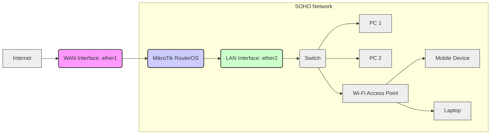

Okay, here is the comprehensive MikroTik RouterOS documentation you requested for Firewall and QoS case studies in a SOHO environment, tailored for RouterOS 6.x, with CLI, REST API examples, and addressing all your specified requirements.

---

## MikroTik RouterOS Firewall & QoS Case Studies for SOHO (v6.x)

**Document Version:** 1.0
**Date:** October 26, 2023
**Author:** Your Friendly MikroTik Certified Engineer (AI Assistant)
**RouterOS Version:** 6.x
**Network Scale:** SOHO (Small Office/Home Office)
**Complexity Level:** Basic

### 1. Introduction

This document provides practical case studies for implementing basic firewall and Quality of Service (QoS) configurations on MikroTik RouterOS v6.x in a Small Office/Home Office (SOHO) environment.  It covers essential security and performance optimization techniques suitable for smaller networks, utilizing both Command Line Interface (CLI) and REST API (via Python) methods.

### 2. Architecture Diagram Requirements

For a typical SOHO setup, we envision the following network architecture:



**Diagram Explanation:**

*   **Internet:** Represents the external network.
*   **WAN Interface (ether1):**  The MikroTik router's interface connected to the internet.  Typically configured with a public IP address or DHCP client.
*   **MikroTik RouterOS:** The core device performing routing, firewall, and QoS functions.
*   **LAN Interface (ether2):** The MikroTik router's interface connected to the local network. Typically configured with a private IP address and DHCP server.
*   **Switch:** A network switch to expand the LAN ports.
*   **PC1, PC2, Laptop, Mobile Device, Wi-Fi AP:**  Example devices within the SOHO network.

### 3. Firewall Case Study: Basic SOHO Firewall

**Scenario:**  Implement a basic firewall to protect the SOHO network from unwanted internet traffic while ensuring necessary services are available.

#### 3.1 CLI Configuration

```routeros
# --- Firewall Configuration ---

# 1. Set default firewall policy to deny all incoming and forwarding traffic
/ip firewall filter
add chain=input action=drop comment="Default deny input chain"
add chain=forward action=drop comment="Default deny forward chain"

# 2. Allow established and related connections (essential for return traffic)
add chain=input action=accept connection-state=established,related comment="Allow established/related input"
add chain=forward action=accept connection-state=established,related comment="Allow established/related forward"

# 3. Allow DNS resolution from LAN to WAN (UDP port 53)
add chain=forward action=accept protocol=udp dst-port=53 in-interface=ether2 out-interface=ether1 comment="Allow DNS forward from LAN to WAN"

# 4. Allow DHCP client on WAN interface (if applicable) - already implicitly allowed by established/related if initiated from router
# If Router itself is DHCP Client on WAN, no explicit rule needed here as return traffic will be 'established/related'

# 5. Allow ICMP (ping) from LAN to WAN for basic troubleshooting
add chain=forward action=accept protocol=icmp in-interface=ether2 out-interface=ether1 comment="Allow ICMP forward from LAN to WAN"

# 6. Allow access to the Router from LAN (for management - SSH, Winbox, Webfig - adjust ports as needed)
add chain=input action=accept src-address=192.168.88.0/24 in-interface=ether2 comment="Allow LAN access to router management"
add chain=input action=accept protocol=tcp dst-port=22 src-address=192.168.88.0/24 in-interface=ether2 comment="Allow SSH from LAN"
add chain=input action=accept protocol=tcp dst-port=8291 src-address=192.168.88.0/24 in-interface=ether2 comment="Allow Winbox from LAN"
add chain=input action=accept protocol=tcp dst-port=80,443 src-address=192.168.88.0/24 in-interface=ether2 comment="Allow Webfig/HTTPS from LAN"

# 7. Block invalid connections to protect against certain attacks
add chain=input action=drop connection-state=invalid comment="Drop invalid input connections"
add chain=forward action=drop connection-state=invalid comment="Drop invalid forward connections"

# 8. Log dropped packets for monitoring and debugging (optional but recommended for troubleshooting)
add chain=input action=log log-prefix="FW-INPUT-DROP" comment="Log dropped input packets"
add chain=input action=drop comment="Default deny input chain - DROP (after logging)"
add chain=forward action=log log-prefix="FW-FORWARD-DROP" comment="Log dropped forward packets"
add chain=forward action=drop comment="Default deny forward chain - DROP (after logging)"

# --- NAT Configuration (Network Address Translation) ---
# Enable masquerade for outbound traffic from LAN to WAN (Internet access)
/ip firewall nat
add chain=srcnat action=masquerade out-interface=ether1 src-address=192.168.88.0/24 comment="Masquerade LAN to WAN"
```

**Inline Comments:**  Each line is commented to explain its purpose.

#### 3.2 REST API Implementation (Python)

```python
import routeros_api
from routeros_api import exceptions

# --- API Configuration ---
HOST = 'your_router_ip'  # Replace with your MikroTik IP
USER = 'your_username'    # Replace with your MikroTik username
PASSWORD = 'your_password' # Replace with your MikroTik password

try:
    # Connect to MikroTik Router
    api = routeros_api.RouterOsApiPool(HOST, username=USER, password=PASSWORD, port=8728)
    connection = api.get_connection()

    # Firewall Filter Rules Resource
    firewall_filter = connection.get_resource('/ip/firewall/filter')

    # NAT Rules Resource
    firewall_nat = connection.get_resource('/ip/firewall/nat')

    # --- Firewall Filter Rules ---

    # 1. Default deny input chain
    firewall_filter.add(chain='input', action='drop', comment='Default deny input chain')
    # 2. Default deny forward chain
    firewall_filter.add(chain='forward', action='drop', comment='Default deny forward chain')

    # 3. Allow established/related input
    firewall_filter.add(chain='input', action='accept', connection_state='established,related', comment='Allow established/related input')
    # 4. Allow established/related forward
    firewall_filter.add(chain='forward', action='accept', connection_state='established,related', comment='Allow established/related forward')

    # 5. Allow DNS forward from LAN to WAN
    firewall_filter.add(chain='forward', action='accept', protocol='udp', dst_port='53', in_interface='ether2', out_interface='ether1', comment='Allow DNS forward from LAN to WAN')

    # 6. Allow ICMP forward from LAN to WAN
    firewall_filter.add(chain='forward', action='accept', protocol='icmp', in_interface='ether2', out_interface='ether1', comment='Allow ICMP forward from LAN to WAN')

    # 7. Allow LAN access to router management (adjust ports/services as needed)
    firewall_filter.add(chain='input', action='accept', src_address='192.168.88.0/24', in_interface='ether2', comment='Allow LAN access to router management')
    firewall_filter.add(chain='input', action='accept', protocol='tcp', dst_port='22', src_address='192.168.88.0/24', in_interface='ether2', comment='Allow SSH from LAN')
    firewall_filter.add(chain='input', action='accept', protocol='tcp', dst_port='8291', src_address='192.168.88.0/24', in_interface='ether2', comment='Allow Winbox from LAN')
    firewall_filter.add(chain='input', action='accept', protocol='tcp', dst_port='80,443', src_address='192.168.88.0/24', in_interface='ether2', comment='Allow Webfig/HTTPS from LAN')

    # 8. Drop invalid input connections
    firewall_filter.add(chain='input', action='drop', connection_state='invalid', comment='Drop invalid input connections')
    # 9. Drop invalid forward connections
    firewall_filter.add(chain='forward', action='drop', connection_state='invalid', comment='Drop invalid forward connections')

    # 10. Log dropped input packets (optional but recommended for troubleshooting)
    firewall_filter.add(chain='input', action='log', log_prefix='FW-INPUT-DROP', comment='Log dropped input packets')
    firewall_filter.add(chain='input', action='drop', comment='Default deny input chain - DROP (after logging)')
    # 11. Log dropped forward packets (optional but recommended for troubleshooting)
    firewall_filter.add(chain='forward', action='log', log_prefix='FW-FORWARD-DROP', comment='Log dropped forward packets')
    firewall_filter.add(chain='forward', action='drop', comment='Default deny forward chain - DROP (after logging)')


    # --- NAT Rule ---
    # Masquerade LAN to WAN
    firewall_nat.add(chain='srcnat', action='masquerade', out_interface='ether1', src_address='192.168.88.0/24', comment='Masquerade LAN to WAN')

    print("Firewall and NAT configuration applied successfully via API.")

except exceptions.RouterOsApiError as e:
    print(f"RouterOS API Error: {e}")
except Exception as e:
    print(f"An unexpected error occurred: {e}")
finally:
    if 'api' in locals() and api:
        api.close_connection()
```

**Error Handling:**  The Python script includes `try...except...finally` blocks to handle potential API errors and ensure connection closure. **Remember to install `routeros_api` library: `pip install routeros_api`.**

#### 3.3 Common Debugging Scenarios (Firewall)

1.  **No Internet Access from LAN:**
    *   **Check NAT Rule:** Verify the masquerade rule is configured correctly and enabled. Ensure `out-interface=ether1` and `src-address=192.168.88.0/24` (or your LAN subnet) are correct.
    *   **DNS Resolution:** Check if DNS is working. Try `ping 8.8.8.8` and `ping google.com` from a LAN device. If IP ping works but domain ping fails, check DNS settings (`/ip dns print`). Ensure your router is using a valid upstream DNS server (e.g., provided by ISP or public DNS like 8.8.8.8).
    *   **Firewall Filter Rules:** Review firewall rules, especially the default deny rule. Ensure you have allowed established/related connections. Temporarily disable firewall rules (using `disable=yes` in CLI or API) to isolate the issue.
    *   **Interface Status:** Verify that both WAN (`ether1`) and LAN (`ether2`) interfaces are enabled and running (`/interface ethernet print`). Check for errors or dropped packets on the interfaces.

2.  **Specific Service Blocked:**
    *   **Firewall Logs:** Enable logging for drop rules (`action=log`) and check the firewall logs (`/log print topic=firewall`). Analyze the logs to see if traffic is being blocked by a specific rule.  Look for "FW-INPUT-DROP" or "FW-FORWARD-DROP" prefixes in the logs.
    *   **Torch Tool:** Use the Torch tool (`/tool torch interface=ether1`) to monitor real-time traffic on the WAN interface. Filter by IP address or protocol to identify if the traffic is even reaching the router and if it's being dropped by the firewall.
    *   **Firewall Rule Order:** Firewall rules are processed in order. Ensure that your allow rules are placed *before* the default deny rules.

3.  **Inability to Access Router Management from LAN:**
    *   **Input Chain Rules:** Double-check the input chain firewall rules allowing access from `src-address=192.168.88.0/24` for ports 22, 8291, 80, 443.
    *   **Incorrect Source Address:** Verify the `src-address` in the allow rules matches your LAN subnet (e.g., `192.168.88.0/24`).
    *   **Service Ports:** Ensure the services (SSH, Winbox, Webfig) are enabled on the router and listening on the correct ports (`/ip service print`).

#### 3.4 Security Hardening Measures (Firewall)

1.  **Disable Unnecessary Services:** Disable services you don't need, especially on the WAN interface. For SOHO, consider disabling:
    ```routeros
    /ip service disable telnet
    /ip service disable ftp
    /ip service disable api
    /ip service disable api-ssl
    ```
    Keep only essential services like Winbox, SSH, Webfig (if needed for remote access, consider HTTPS only).

2.  **Change Default Ports:** Change default service ports (e.g., SSH port from 22 to something less common) to reduce automated attacks.
    ```routeros
    /ip service set ssh port=2222
    ```

3.  **Strong Passwords:** Use strong, unique passwords for all router accounts, especially the `admin` account. Change the default password immediately.

4.  **Limit Access to Management Interface:** Restrict access to management interfaces (Winbox, SSH, Webfig) to specific IP addresses or subnets if possible. In our example, we already limited it to the LAN subnet. For remote access, consider VPN solutions instead of exposing management ports directly to the internet.

5.  **Regular RouterOS Updates:** Keep RouterOS updated to the latest stable version to patch security vulnerabilities.
    ```routeros
    /system package update check
    /system package update download
    /system package update install reboot=yes
    ```

6.  **Disable Default `admin` User (Optional but Recommended):** Create a new administrator user with a strong password and then disable the default `admin` user.
    ```routeros
    /user add name=myadmin password=MyStrongPassword group=full
    /user disable admin
    ```

### 4. QoS Case Study: Basic SOHO QoS

**Scenario:** Prioritize VoIP and web browsing traffic while limiting bandwidth for less critical traffic like file downloads to ensure a smooth user experience, especially during peak hours.

#### 4.1 CLI Configuration

```routeros
# --- QoS Configuration ---

# 1. Simple Queue for Total WAN Upload and Download Bandwidth Limitation
/queue simple
add name="WAN-Upload-Limit" target-interface=ether1 max-limit=5M/5M queue=default-small comment="Total WAN Upload/Download Limit (adjust as needed)"
add name="WAN-Download-Limit" target-interface=ether1 max-limit=20M/20M queue=default-small comment="Total WAN Upload/Download Limit (adjust as needed)"

# 2. Queue Tree for Prioritization and Shaping
/queue tree
add name="WAN-Root" parent=global-total queue=default comment="Root Queue for WAN"
add name="Prioritize-VoIP" parent="WAN-Root" packet-marks=voip-packets queue=default-small priority=1 comment="Prioritize VoIP traffic"
add name="Prioritize-Web" parent="WAN-Root" packet-marks=web-packets queue=default-small priority=2 comment="Prioritize Web Browsing"
add name="Bulk-Traffic" parent="WAN-Root" queue=default-small priority=7 comment="Bulk/Low Priority Traffic"

# 3. Mangle Rules to Mark Packets for QoS
/ip firewall mangle
# Mark VoIP packets (example: SIP and RTP ports)
add chain=forward action=mark-packet new-packet-mark=voip-packets protocol=udp dst-port=5060,5061,10000-20000 comment="Mark VoIP UDP packets"
add chain=forward action=mark-packet new-packet-mark=voip-packets protocol=tcp dst-port=5060,5061 comment="Mark VoIP TCP packets"

# Mark Web Browsing packets (HTTP and HTTPS)
add chain=forward action=mark-packet new-packet-mark=web-packets protocol=tcp dst-port=80,443 comment="Mark Web Browsing packets"

# Optional: Classify Bulk Traffic (e.g., large downloads - adjust as needed)
# Example: Limit bandwidth for traffic to common download ports (HTTP/FTP) and large packet sizes
# add chain=forward action=mark-packet new-packet-mark=bulk-packets protocol=tcp dst-port=80,21,20 packet-size=1500-65535 comment="Mark Bulk Download Traffic (Example)"
# and assign Bulk-Traffic queue to packets marked 'bulk-packets' in Queue Tree.

```

**Inline Comments:**  Each line is commented to explain its purpose.

#### 4.2 REST API Implementation (Python)

```python
import routeros_api
from routeros_api import exceptions

# --- API Configuration --- (Same as Firewall API example - reuse connection)

try:
    # Connect to MikroTik Router (assuming 'api' and 'connection' from Firewall API example are still valid)
    if 'api' not in locals() or not api:
        api = routeros_api.RouterOsApiPool(HOST, username=USER, password=PASSWORD, port=8728)
        connection = api.get_connection()

    # Simple Queue Resource
    queue_simple = connection.get_resource('/queue/simple')

    # Queue Tree Resource
    queue_tree = connection.get_resource('/queue/tree')

    # Mangle Rules Resource
    firewall_mangle = connection.get_resource('/ip/firewall/mangle')


    # --- Simple Queues ---

    # 1. WAN Upload Limit
    queue_simple.add(name='WAN-Upload-Limit', target_interface='ether1', max_limit='5M/5M', queue='default-small', comment='Total WAN Upload/Download Limit (adjust as needed)')
    # 2. WAN Download Limit
    queue_simple.add(name='WAN-Download-Limit', target_interface='ether1', max_limit='20M/20M', queue='default-small', comment='Total WAN Upload/Download Limit (adjust as needed)')


    # --- Queue Tree ---

    # 3. WAN Root Queue
    queue_tree.add(name='WAN-Root', parent='global-total', queue='default', comment='Root Queue for WAN')
    # 4. Prioritize VoIP
    queue_tree.add(name='Prioritize-VoIP', parent='WAN-Root', packet_marks='voip-packets', queue='default-small', priority='1', comment='Prioritize VoIP traffic')
    # 5. Prioritize Web Browsing
    queue_tree.add(name='Prioritize-Web', parent='WAN-Root', packet_marks='web-packets', queue='default-small', priority='2', comment='Prioritize Web Browsing')
    # 6. Bulk Traffic (Low Priority)
    queue_tree.add(name='Bulk-Traffic', parent='WAN-Root', queue='default-small', priority='7', comment='Bulk/Low Priority Traffic')


    # --- Mangle Rules ---

    # 7. Mark VoIP UDP packets
    firewall_mangle.add(chain='forward', action='mark-packet', new_packet_mark='voip-packets', protocol='udp', dst_port='5060,5061,10000-20000', comment='Mark VoIP UDP packets')
    # 8. Mark VoIP TCP packets
    firewall_mangle.add(chain='forward', action='mark-packet', new_packet_mark='voip-packets', protocol='tcp', dst_port='5060,5061', comment='Mark VoIP TCP packets')
    # 9. Mark Web Browsing packets
    firewall_mangle.add(chain='forward', action='mark-packet', new_packet_mark='web-packets', protocol='tcp', dst_port='80,443', comment='Mark Web Browsing packets')

    # Optional: Mark Bulk Traffic (example)
    # firewall_mangle.add(chain='forward', action='mark-packet', new_packet_mark='bulk-packets', protocol='tcp', dst_port='80,21,20', packet_size='1500-65535', comment='Mark Bulk Download Traffic (Example)')


    print("QoS configuration applied successfully via API.")

except exceptions.RouterOsApiError as e:
    print(f"RouterOS API Error: {e}")
except Exception as e:
    print(f"An unexpected error occurred: {e}")
finally:
    if 'api' in locals() and api:
        api.close_connection()
```

**Error Handling:** Similar error handling as in the Firewall API example.

#### 4.3 Common Debugging Scenarios (QoS)

1.  **QoS Not Working as Expected:**
    *   **Queue Monitoring:** Use `/queue simple print` and `/queue tree print` to check queue statistics (bytes/packets, packet loss). See if traffic is actually hitting the queues as expected.
    *   **Packet Marking:** Verify that mangle rules are correctly marking packets. Use `/ip firewall mangle print stats` to see if packets are matching the rules. Use Torch tool to monitor traffic and see if packets are being marked correctly.
    *   **Queue Tree Structure:** Ensure the queue tree structure is correctly set up (parent-child relationships). The `parent` parameter in `/queue tree add` is crucial.
    *   **Simple Queue Targets:** Check the `target` parameter in simple queues. For interface-based queues, `target-interface` should be correct. For address-based queues, ensure `target` addresses are correctly specified.
    *   **Queue Types:** Experiment with different queue types (`queue=`) in simple and queue tree rules. `default-small` is generally good for interactive traffic, while `default` or other types might be better for bulk traffic.

2.  **VoIP Quality Issues:**
    *   **Priority Queues:** Ensure VoIP traffic is assigned the highest priority (`priority=1`) in the queue tree.
    *   **Bandwidth Allocation:** Check if enough bandwidth is allocated for VoIP. Monitor bandwidth usage during VoIP calls.
    *   **Jitter and Latency:** Use tools like `ping` or `traceroute` to check latency and jitter to VoIP servers. QoS primarily addresses bandwidth allocation, but network congestion can still cause latency and jitter.
    *   **VoIP Protocol and Ports:** Double-check the VoIP protocol (SIP, RTP, etc.) and ports (5060, 5061, 10000-20000, etc.) used in mangle rules are correct for your VoIP service.

3.  **Web Browsing Still Slow:**
    *   **Web Browsing Priority:** Verify web browsing traffic is prioritized (`priority=2` or higher) in the queue tree.
    *   **Bandwidth Saturation:** Check if the WAN link is completely saturated. QoS can prioritize traffic, but if the total bandwidth is insufficient, overall performance will still be limited. Increase WAN bandwidth if necessary.
    *   **Web Server Issues:** The bottleneck might be on the web server side or somewhere else on the internet path, not just your SOHO network. Test with different websites and servers.

#### 4.4 Performance Optimization Tips (QoS)

1.  **Hardware Offloading:** Ensure hardware offloading is enabled if your MikroTik device supports it (`/ip firewall connection tracking set hardware-nat=yes`). Hardware offloading can significantly improve performance for NAT and firewall processing, which indirectly benefits QoS by reducing overall router load.

2.  **Optimize Queue Sizes:** Experiment with different queue types (`queue=`) and adjust queue size parameters (if available in advanced queue types, though not typically needed for basic SOHO QoS).  `default-small` is generally efficient for interactive traffic in SOHO environments. Avoid excessively large queues, as they can increase latency.

3.  **PCQ (Per-Connection Queue):** For more advanced QoS, consider using PCQ queue types in queue trees. PCQ can fairly distribute bandwidth among multiple connections or users, preventing one user from monopolizing bandwidth.  While not in this basic example, it's a valuable tool for SOHO QoS scalability.

4.  **Minimize Mangle Rules:** Keep mangle rules efficient and specific. Avoid overly complex or numerous mangle rules, as they can consume processing power.

5.  **Monitor CPU Usage:** Regularly monitor the router's CPU usage (`/system resource print`). High CPU usage can indicate performance bottlenecks. Optimize firewall and QoS configurations if CPU is consistently high.

### 5. SOHO Specific Considerations

#### 5.1 Real-World Deployment Examples

1.  **Home Office:** A home office with 1-5 users, needing reliable internet for video conferencing, VoIP calls, and general web browsing. QoS ensures video calls and VoIP are prioritized, even during family members' web browsing or streaming. Firewall protects home network from internet threats.

2.  **Small Business with Shared Internet:** A small office with 5-10 employees sharing a single internet connection. QoS ensures critical business applications (e.g., CRM, cloud services) and VoIP are prioritized, while limiting bandwidth for less critical activities like file downloads or social media, especially during business hours. Firewall provides basic security for business data and devices.

#### 5.2 Scalability Considerations

*   **Basic Configurations are Scalable for Small Growth:** The basic firewall and QoS configurations provided are generally scalable for small SOHO networks as they grow slightly (e.g., adding a few more devices).
*   **Simple Queues for Bandwidth Limits:** Simple queues are easily scalable for limiting total bandwidth for the entire network or specific interfaces.
*   **Queue Trees for Prioritization:** Queue trees provide a structured way to prioritize traffic as the network becomes more complex, but for very large SOHO networks or businesses, more advanced QoS techniques might be needed.
*   **PCQ for Fair Bandwidth Distribution:** As the number of users and devices increases, consider implementing PCQ in queue trees to ensure fair bandwidth distribution among users and prevent bandwidth hogging.
*   **Hardware Upgrade:** For significant growth beyond typical SOHO scale, consider upgrading to a more powerful MikroTik router with higher CPU and memory to handle increased traffic and more complex configurations.

#### 5.3 Monitoring Configurations

1.  **Logging:** Enable firewall logging (as shown in the firewall example) to monitor dropped packets and potential security events. Regularly check firewall logs (`/log print topic=firewall`).

2.  **Graphs:** RouterOS has built-in graphing for interface traffic and resource usage. Enable interface traffic graphs (`/interface ethernet monitor ether1 once`) and system resource graphs (`/tool graphing interface add interface=ether1`, `/tool graphing resource add`). Access graphs via Webfig or The Dude.

3.  **The Dude:** MikroTik's free network monitoring application, The Dude, can be used to monitor the MikroTik router and other network devices. It provides real-time monitoring, alerts, and graphing.

4.  **SNMP (Simple Network Management Protocol):** Enable SNMP on the MikroTik router (`/snmp set enabled=yes`) and use an SNMP monitoring system (e.g., Zabbix, PRTG, SolarWinds - often overkill for basic SOHO, but options for more advanced monitoring).

5.  **System Resource Monitoring:** Regularly check system resources (`/system resource print`) - CPU load, memory usage, disk space - to ensure the router is not overloaded.

#### 5.4 Disaster Recovery Steps

1.  **Regular Configuration Backups:** Implement automated configuration backups (see section 5.5). Store backups remotely (off-router).

2.  **Export Configuration to File:** Regularly export the router configuration to a file using CLI or Winbox. Store the `.rsc` file securely and off-router.
    ```routeros
    /export file=backup_config.rsc
    ```

3.  **Router Replacement:** In case of router failure:
    *   **Replace with Identical Model (Ideal):** If possible, replace the failed router with the same MikroTik model.
    *   **Restore Configuration:** Restore the configuration from the latest backup file (`.rsc` or automated backup). In Winbox, go to `Files`, upload the backup file, and then `System` -> `Reset Configuration` -> `Keep User Configuration=No` (if starting fresh) and `Import Configuration=Yes`. Select the uploaded backup file. Or use CLI: `/import file-name=backup_config.rsc`.
    *   **Basic Configuration:** If no backup is available, perform basic configuration manually - WAN/LAN interface setup, IP addressing, basic firewall and NAT, and then gradually rebuild the configuration.

4.  **Test Backups Regularly:** Periodically test the backup restoration process to ensure backups are valid and can be restored successfully.

#### 5.5 Automated Backup Scripts (Python)

This Python script automates MikroTik configuration backups and saves them locally and optionally to a remote server (using SCP as an example). **Ensure `paramiko` library is installed for SCP: `pip install paramiko`.**

```python
import routeros_api
from routeros_api import exceptions
import datetime
import os
import paramiko # For SCP

# --- Backup Configuration ---
HOST = 'your_router_ip'      # Replace with your MikroTik IP
USER = 'your_username'        # Replace with your MikroTik username
PASSWORD = 'your_password'   # Replace with your MikroTik password
BACKUP_DIR = '/path/to/local/backups'  # Local directory to save backups
REMOTE_HOST = 'your_remote_server_ip'  # Optional: Remote SCP server IP
REMOTE_USER = 'remote_scp_username'   # Optional: Remote SCP server username
REMOTE_PASSWORD = 'remote_scp_password' # Optional: Remote SCP server password
REMOTE_BACKUP_DIR = '/remote/backup/directory' # Optional: Remote SCP backup directory

try:
    # Connect to MikroTik Router
    api = routeros_api.RouterOsApiPool(HOST, username=USER, password=PASSWORD, port=8728)
    connection = api.get_connection()

    # Get current timestamp for backup filename
    timestamp = datetime.datetime.now().strftime("%Y%m%d-%H%M%S")
    backup_filename = f"mikrotik_backup_{timestamp}.rsc"
    local_backup_path = os.path.join(BACKUP_DIR, backup_filename)

    # Export configuration to file on MikroTik
    connection.get_resource('/').call('export', parameters={'file': backup_filename})
    print(f"Configuration exported to {backup_filename} on MikroTik.")

    # Download backup file from MikroTik
    file_resource = connection.get_resource('/file')
    backup_data = file_resource.get(name=backup_filename)[0]['.data']
    with open(local_backup_path, 'wb') as f:
        f.write(backup_data)
    print(f"Backup saved locally to {local_backup_path}")

    # Remove backup file from MikroTik after download
    file_resource.remove(id=file_resource.get(name=backup_filename)[0]['id'])
    print(f"Temporary backup file removed from MikroTik.")


    # --- Optional: SCP Backup to Remote Server ---
    if REMOTE_HOST and REMOTE_USER and REMOTE_PASSWORD and REMOTE_BACKUP_DIR:
        try:
            ssh_client = paramiko.SSHClient()
            ssh_client.set_missing_host_key_policy(paramiko.AutoAddPolicy())
            ssh_client.connect(hostname=REMOTE_HOST, username=REMOTE_USER, password=REMOTE_PASSWORD)
            sftp_client = ssh_client.open_sftp()
            remote_backup_full_path = os.path.join(REMOTE_BACKUP_DIR, backup_filename)
            sftp_client.put(local_backup_path, remote_backup_full_path)
            sftp_client.close()
            ssh_client.close()
            print(f"Backup copied to remote server via SCP: {remote_backup_full_path}")
        except Exception as scp_error:
            print(f"SCP Backup Error: {scp_error}")
    else:
        print("Remote SCP backup skipped (credentials not provided).")


except exceptions.RouterOsApiError as e:
    print(f"RouterOS API Error: {e}")
except Exception as e:
    print(f"An unexpected error occurred: {e}")
finally:
    if 'api' in locals() and api:
        api.close_connection()
```

**Configuration:**  Customize variables like `HOST`, `USER`, `PASSWORD`, `BACKUP_DIR`, and SCP details if remote backup is needed.

**Scheduling:** Schedule this Python script to run regularly using system task schedulers (e.g., `cron` on Linux, Task Scheduler on Windows).

### 6. Version-Specific Considerations (RouterOS 6.x vs. Newer)

*   **RouterOS 6.x is End-of-Life (EOL):**  RouterOS v6.x is considered end-of-life and no longer receives feature updates or security patches. **Upgrading to RouterOS v7 is highly recommended for security and new features.**
*   **REST API in v6.x:** The REST API in v6.x is functional, but v7 has made improvements and added features to the API. The basic API operations used in this document are compatible with v6.x.
*   **Queue Types and Features:**  QoS features are generally similar between v6.x and v7 for basic QoS. v7 introduces some advanced QoS features and improvements, but basic queue trees and simple queues are available in v6.x.
*   **Firewall Features:**  Basic firewall functionality is consistent between v6.x and v7. v7 has introduced features like nftables backend and improved connection tracking, but for basic SOHO firewall rules, v6.x is sufficient (though not recommended due to security updates).
*   **Security Updates:** The most significant version-specific consideration is security. RouterOS v7 receives ongoing security updates, while v6.x does not. **For security reasons, migrating to v7 is strongly advised.**

### 7. Comparative Tables

**Table 1: Firewall Rule Actions Comparison**

| Action      | Description                                                                 | SOHO Use Case Relevance                                                                        |
|--------------|-----------------------------------------------------------------------------|-------------------------------------------------------------------------------------------------|
| `accept`     | Allows the packet to pass through.                                          | Allowing established connections, DNS, DHCP, management access from LAN.                          |
| `drop`       | Silently discards the packet. No response is sent to the sender.            | Default deny policy, blocking invalid connections, unwanted traffic.                               |
| `reject`     | Sends an ICMP "port unreachable" or TCP RST (reset) message to the sender. | Can be used instead of `drop` for some scenarios, but `drop` is generally preferred for security. |
| `log`        | Logs information about the packet.                                        | Debugging, security monitoring, identifying blocked traffic.                                    |
| `passthrough`| Continues processing in the next chain or rule.                             | Less common in basic SOHO firewalls. Used in more complex rule sets.                               |

**Table 2: QoS Queue Types Comparison (Simplified for SOHO)**

| Queue Type    | Description                                                                      | SOHO Use Case Relevance                                                                                                |
|----------------|----------------------------------------------------------------------------------|-------------------------------------------------------------------------------------------------------------------------|
| `default`       | Default queue type, FIFO (First-In, First-Out).                                   | Basic queue, suitable for general traffic.                                                                              |
| `default-small` | Optimized for smaller packets, lower latency.                                    | Recommended for interactive traffic like VoIP, web browsing. Good default for most SOHO scenarios.                     |
| `pcq-upload-default` / `pcq-download-default` | Per-Connection Queue (PCQ). Fairly distributes bandwidth among connections. | More advanced QoS. Useful for larger SOHO networks or when fair bandwidth sharing among users is needed. Not in basic example. |

### Conclusion

This document provides a foundational understanding of implementing basic firewall and QoS configurations on MikroTik RouterOS v6.x in a SOHO environment. By using the provided CLI and API examples, along with the debugging and security tips, you can enhance the security and performance of your SOHO network. **However, it is crucial to reiterate the importance of upgrading to RouterOS v7 for ongoing security updates and access to the latest features.**  Remember to adapt these configurations to your specific network needs and always test thoroughly after making changes. Regularly review and update your firewall and QoS rules to maintain optimal security and performance as your network evolves.

## API Reference Cheat Sheet
```python
# Universal API Helper Function
def mikrotik_api_call(
    method: str,
    endpoint: str,
    data: dict = None,
    timeout: int = 10
) -> dict:
    '''
    Universal MikroTik API handler with error checking
    '''
    try:
        response = requests.request(
            method,
            f"https://{ROUTER_IP}/rest{endpoint}",
            auth=HTTPBasicAuth(API_USER, API_PASS),
            json=data,
            verify=SSL_VERIFY,
            timeout=timeout
        )
        response.raise_for_status()
        return response.json()
    except requests.exceptions.HTTPError as e:
        print(f"API Error: {e.response.status_code} - {e.response.text}")
        return {"error": str(e)}
```