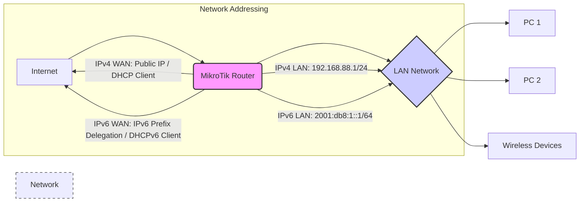

# MikroTik RouterOS IP Addressing (IPv4 & IPv6) Documentation for SOHO (v6.x)

**RouterOS Version:** 6.x
**Network Scale:** SOHO (Small Office/Home Office)
**Complexity Level:** Basic

This document provides a comprehensive guide to configuring IP addressing (IPv4 and IPv6) on MikroTik RouterOS v6.x for Small Office/Home Office (SOHO) environments. It covers basic setup, CLI and API examples, debugging, security, performance, and SOHO-specific considerations.

## 1. Architecture Diagram Requirements

For a typical SOHO environment, the network architecture is relatively simple. The MikroTik router acts as the gateway, connecting the local network to the Internet.



**Diagram Explanation:**

*   **Internet:** Represents the external network provided by your ISP.
*   **MikroTik Router:** The central device managing network traffic and IP addressing.
*   **LAN Network:** Your local network, typically using a private IP address range.
*   **PC 1, PC 2, Wireless Devices:** End-user devices within the SOHO network.
*   **Network Addressing Subgraph:** Highlights the IP addressing schemes used for WAN and LAN interfaces in both IPv4 and IPv6.

## 2. CLI Configuration with Inline Comments

This section provides CLI commands for basic IPv4 and IPv6 configuration.

### 2.1. IPv4 Configuration

```routeros
# --- IPv4 Configuration ---

# 1. Configure WAN Interface (assuming ether1 is WAN)
/interface ethernet set ether1 name=wan comment="WAN Interface"

# 2a. Dynamic IPv4 Address from ISP (DHCP Client - Common for SOHO)
/ip dhcp-client add interface=wan disabled=no comment="DHCP Client for WAN IPv4"

# --- OR ---

# 2b. Static IPv4 Address from ISP (Less common for SOHO, but possible)
# /ip address add address=203.0.113.5/24 interface=wan comment="Static WAN IPv4 Address"
# /ip route add dst-address=0.0.0.0/0 gateway=203.0.113.1 comment="Default IPv4 Route"
# Replace 203.0.113.5/24 and 203.0.113.1 with your ISP provided details

# 3. Configure LAN Interface (assuming ether2 is LAN)
/interface ethernet set ether2 name=lan comment="LAN Interface"
/ip address add address=192.168.88.1/24 interface=lan network=192.168.88.0 comment="LAN IPv4 Address"
# 192.168.88.1/24 is a common private IPv4 range for SOHO. You can choose others like 192.168.1.1/24 or 10.0.0.1/24

# 4. Configure DHCP Server for LAN (to automatically assign IPv4 addresses to LAN devices)
/ip pool add name=dhcp_pool_lan ranges=192.168.88.10-192.168.88.254 comment="DHCP Pool for LAN IPv4"
/ip dhcp-server add name=dhcp_server_lan interface=lan address-pool=dhcp_pool_lan lease-time=10m comment="DHCP Server for LAN IPv4" # Lease time can be adjusted
/ip network add address=192.168.88.0/24 gateway=192.168.88.1 dns-servers=8.8.8.8,8.8.4.4 dhcp-server=dhcp_server_lan comment="LAN IPv4 Network Settings"
# Using Google Public DNS (8.8.8.8, 8.8.4.4). You can use your ISP's DNS or other public DNS servers.

# 5. Enable NAT (Network Address Translation) for Internet access from LAN
/ip firewall nat add chain=srcnat action=masquerade out-interface=wan comment="NAT for LAN to WAN IPv4"
```

### 2.2. IPv6 Configuration

```routeros
# --- IPv6 Configuration ---

# 1. Enable IPv6 Package (if not already enabled)
/system package enable ipv6

# 2. Configure WAN Interface for IPv6 (assuming ether1 is WAN)
/interface ethernet set ether1 name=wan comment="WAN Interface"

# 3a. Dynamic IPv6 Address and Prefix Delegation from ISP (DHCPv6 Client - Common for SOHO IPv6)
/ipv6 dhcp-client add interface=wan request=prefix pool-name=ipv6_pool_lan pool-length=64 comment="DHCPv6 Client for WAN IPv6 with Prefix Delegation"
# pool-length=64 is typical for SOHO LAN prefixes. The ISP will delegate a /64 prefix.
# pool-name=ipv6_pool_lan will be used to assign IPv6 addresses to the LAN interface

# --- OR ---

# 3b. Static IPv6 Address from ISP (Less common for SOHO IPv6)
# /ipv6 address add address=2001:db8:1::2/64 interface=wan comment="Static WAN IPv6 Address"
# /ipv6 route add dst-address=::/0 gateway=2001:db8:1::1 comment="Default IPv6 Route"
# Replace 2001:db8:1::2/64 and 2001:db8:1::1 with your ISP provided details

# 4. Configure LAN Interface (assuming ether2 is LAN) to use delegated prefix
/interface ethernet set ether2 name=lan comment="LAN Interface"
/ipv6 address add from-pool=ipv6_pool_lan interface=lan eui-64=yes comment="LAN IPv6 Address from Delegated Prefix (EUI-64)"
# eui-64=yes will generate an IPv6 address in the LAN subnet based on the MAC address of the LAN interface.
# Alternatively, you can set a static IPv6 address within the delegated prefix if desired.
# /ipv6 address add address=2001:db8:2::1/64 interface=lan comment="Static LAN IPv6 Address" # Assuming 2001:db8:2::/64 is within the delegated prefix

# 5. Configure IPv6 Router Advertisement (RA) for LAN (to automatically configure IPv6 addresses on LAN devices)
/ipv6 nd add interface=lan ra-interval=10s managed-address-configuration=no other-configuration=no comment="IPv6 Router Advertisement for LAN"
# ra-interval=10s: Router Advertisement interval (adjust as needed).
# managed-address-configuration=no: Devices will use SLAAC (Stateless Address Autoconfiguration) based on RA.
# other-configuration=no: Devices will not request other configuration (like DNS) via DHCPv6 (Stateless DHCPv6).
# For Stateless DHCPv6 for DNS, set other-configuration=yes and configure DHCPv6 server (optional for basic SOHO).

# 6. (Optional) Configure IPv6 Firewall to allow LAN to WAN traffic (similar to IPv4 NAT, but for IPv6 forwarding)
/ipv6 firewall filter add chain=forward action=accept connection-state=established,related comment="Allow Established/Related IPv6 Forward"
/ipv6 firewall filter add chain=forward action=accept src-address=2001:db8:2::/64 out-interface=wan comment="Allow LAN -> WAN IPv6 Forward" # Assuming 2001:db8:2::/64 is your delegated prefix - adjust accordingly
/ipv6 firewall filter add chain=forward action=drop in-interface=wan comment="Drop all other WAN -> LAN IPv6 Forward" # Default deny for incoming WAN IPv6
```

## 3. REST API Implementation (Python code)

This section provides Python code examples using the MikroTik RouterOS REST API to configure IP addressing. Ensure the API service is enabled on your MikroTik router (`/ip service enable api`).

**Prerequisites:**

*   Python 3.x
*   `requests` library (`pip install requests`)

```python
import requests
import json

ROUTER_IP = "192.168.88.1" # Replace with your router's IP
USERNAME = "admin"       # Replace with your router's username
PASSWORD = ""           # Replace with your router's password

def send_command(command, params=None):
    url = f"http://{USERNAME}:{PASSWORD}@{ROUTER_IP}/rest"
    headers = {'Content-Type': 'application/json'}
    data = {'command': command, 'params': params}
    try:
        response = requests.post(url, headers=headers, data=json.dumps(data), timeout=10)
        response.raise_for_status() # Raise HTTPError for bad responses (4xx or 5xx)
        return response.json()
    except requests.exceptions.RequestException as e:
        print(f"API Request Error: {e}")
        return None

# --- IPv4 Configuration via API ---

# 1. Configure WAN Interface Name
response = send_command("/interface/ethernet/set", {".id": "ether1", "name": "wan", "comment": "WAN Interface"})
print(f"WAN Interface Name Configured: {response}")

# 2a. Configure DHCP Client for WAN IPv4
response = send_command("/ip/dhcp-client/add", {"interface": "wan", "disabled": "no", "comment": "DHCP Client for WAN IPv4"})
print(f"DHCP Client Configured: {response}")

# --- OR ---

# 2b. Configure Static IPv4 Address (Example - uncomment and adjust if needed)
# response = send_command("/ip/address/add", {"address": "203.0.113.5/24", "interface": "wan", "comment": "Static WAN IPv4 Address"})
# print(f"Static WAN IPv4 Address Configured: {response}")
# response = send_command("/ip/route/add", {"dst-address": "0.0.0.0/0", "gateway": "203.0.113.1", "comment": "Default IPv4 Route"})
# print(f"Default IPv4 Route Configured: {response}")

# 3. Configure LAN Interface Name and IPv4 Address
response = send_command("/interface/ethernet/set", {".id": "ether2", "name": "lan", "comment": "LAN Interface"})
print(f"LAN Interface Name Configured: {response}")
response = send_command("/ip/address/add", {"address": "192.168.88.1/24", "interface": "lan", "network": "192.168.88.0", "comment": "LAN IPv4 Address"})
print(f"LAN IPv4 Address Configured: {response}")

# 4. Configure DHCP Server for LAN IPv4
response = send_command("/ip/pool/add", {"name": "dhcp_pool_lan", "ranges": "192.168.88.10-192.168.88.254", "comment": "DHCP Pool for LAN IPv4"})
print(f"DHCP Pool Configured: {response}")
response = send_command("/ip/dhcp-server/add", {"name": "dhcp_server_lan", "interface": "lan", "address-pool": "dhcp_pool_lan", "lease-time": "10m", "comment": "DHCP Server for LAN IPv4"})
print(f"DHCP Server Configured: {response}")
response = send_command("/ip/network/add", {"address": "192.168.88.0/24", "gateway": "192.168.88.1", "dns-servers": "8.8.8.8,8.8.4.4", "dhcp-server": "dhcp_server_lan", "comment": "LAN IPv4 Network Settings"})
print(f"LAN IPv4 Network Configured: {response}")

# 5. Enable NAT for LAN to WAN IPv4
response = send_command("/ip/firewall/nat/add", {"chain": "srcnat", "action": "masquerade", "out-interface": "wan", "comment": "NAT for LAN to WAN IPv4"})
print(f"NAT Rule Configured: {response}")


# --- IPv6 Configuration via API ---

# 1. Enable IPv6 Package (Check if already enabled - can skip if already enabled)
# response = send_command("/system/package/enable", {"name": "ipv6"}) # Uncomment if needed
# print(f"IPv6 Package Enabled: {response}")

# 2. Configure WAN Interface Name (Already done above, can skip if not re-running)
# response = send_command("/interface/ethernet/set", {".id": "ether1", "name": "wan", "comment": "WAN Interface"})
# print(f"WAN Interface Name Configured: {response}")

# 3a. Configure DHCPv6 Client for WAN IPv6 with Prefix Delegation
response = send_command("/ipv6/dhcp-client/add", {"interface": "wan", "request": "prefix", "pool-name": "ipv6_pool_lan", "pool-length": "64", "comment": "DHCPv6 Client for WAN IPv6"})
print(f"DHCPv6 Client Configured: {response}")

# --- OR ---

# 3b. Configure Static IPv6 Address (Example - uncomment and adjust if needed)
# response = send_command("/ipv6/address/add", {"address": "2001:db8:1::2/64", "interface": "wan", "comment": "Static WAN IPv6 Address"})
# print(f"Static WAN IPv6 Address Configured: {response}")
# response = send_command("/ipv6/route/add", {"dst-address": "::/0", "gateway": "2001:db8:1::1", "comment": "Default IPv6 Route"})
# print(f"Default IPv6 Route Configured: {response}")

# 4. Configure LAN Interface Name and IPv6 Address from Delegated Prefix
# response = send_command("/interface/ethernet/set", {".id": "ether2", "name": "lan", "comment": "LAN Interface"}) # Already done above, can skip
# print(f"LAN Interface Name Configured: {response}")
response = send_command("/ipv6/address/add", {"from-pool": "ipv6_pool_lan", "interface": "lan", "eui-64": "yes", "comment": "LAN IPv6 Address from Delegated Prefix"})
print(f"LAN IPv6 Address Configured: {response}")

# 5. Configure IPv6 Router Advertisement
response = send_command("/ipv6/nd/add", {"interface": "lan", "ra-interval": "10s", "managed-address-configuration": "no", "other-configuration": "no", "comment": "IPv6 Router Advertisement for LAN"})
print(f"IPv6 Router Advertisement Configured: {response}")

# 6. (Optional) Configure IPv6 Firewall (Example - uncomment and adjust if needed)
# response = send_command("/ipv6/firewall/filter/add", {"chain": "forward", "action": "accept", "connection-state": "established,related", "comment": "Allow Established/Related IPv6 Forward"})
# print(f"IPv6 Firewall Rule (Established/Related) Configured: {response}")
# response = send_command("/ipv6/firewall/filter/add", {"chain": "forward", "action": "accept", "src-address": "2001:db8:2::/64", "out-interface": "wan", "comment": "Allow LAN -> WAN IPv6 Forward"}) # Adjust prefix
# print(f"IPv6 Firewall Rule (LAN->WAN) Configured: {response}")
# response = send_command("/ipv6/firewall/filter/add", {"chain": "forward", "action": "drop", "in-interface": "wan", "comment": "Drop all other WAN -> LAN IPv6 Forward"})
# print(f"IPv6 Firewall Rule (Default Drop WAN->LAN) Configured: {response}")

print("IP Addressing configuration via API completed (check output for errors).")
```

**API Python Code Explanation:**

*   **`send_command(command, params)` function:**
    *   Takes a RouterOS command path and parameters as input.
    *   Constructs the REST API URL with authentication.
    *   Sends a POST request with JSON data.
    *   Handles potential network errors using `try...except`.
    *   Returns the JSON response from the API or `None` on error.
*   **Configuration steps:**
    *   Each configuration step from the CLI section is translated into API calls using `send_command()`.
    *   `.id` is used to reference existing interfaces (e.g., `ether1`, `ether2`). You can use `/interface/ethernet/print` via API to get interface IDs if needed.
    *   Error handling is basic, printing error messages if API requests fail.

## 4. Common Debugging Scenarios

Here are common IP addressing issues in SOHO environments and how to debug them using RouterOS CLI.

| Scenario                                  | Possible Cause(s)                                          | Debugging Steps (CLI)                                                                                                                                                                                                                                                          |
| :---------------------------------------- | :--------------------------------------------------------- | :--------------------------------------------------------------------------------------------------------------------------------------------------------------------------------------------------------------------------------------------------------------------------------- |
| **No Internet Connectivity (IPv4)**       | - WAN interface not getting IP from ISP (DHCP).           | 1.  `/interface print` - Check if WAN interface is enabled and running.<br> 2.  `/ip dhcp-client print` - Check DHCP client status (status should be "bound").<br> 3.  `/ip address print` - Verify WAN interface has an IP address.<br> 4.  `/ip route print` - Check for default route.<br> 5.  `ping 8.8.8.8` - Ping a public IPv4 address to test connectivity. |
|                                           | - Firewall blocking outbound traffic (NAT issue).          | 1.  `/ip firewall nat print` - Verify NAT masquerade rule is present and enabled.<br> 2.  `/ip firewall filter print` - Check for any blocking firewall rules in the `forward` chain that might be interfering with LAN to WAN traffic.                                  |
|                                           | - DNS resolution issue.                                   | 1.  `/ip dns print` - Check configured DNS servers (should be valid public DNS or ISP's DNS).<br> 2.  `ping google.com` - Ping by hostname to test DNS resolution. If IPv4 ping to IP works but hostname ping fails, DNS is likely the issue.                               |
| **No Internet Connectivity (IPv6)**       | - WAN interface not getting IPv6 prefix (DHCPv6-PD).      | 1.  `/ipv6 interface print` - Check if WAN interface is enabled and running with IPv6 enabled.<br> 2.  `/ipv6 dhcp-client print` - Check DHCPv6 client status (status should be "bound").<br> 3.  `/ipv6 address print` - Verify WAN interface and LAN interface have IPv6 addresses.<br> 4.  `/ipv6 route print` - Check for default IPv6 route.<br> 5.  `ping6 ipv6.google.com` - Ping a public IPv6 address. |
|                                           | - IPv6 Firewall blocking outbound traffic.                  | 1.  `/ipv6 firewall filter print` - Check IPv6 firewall rules, especially in the `forward` chain. Ensure rules allow established/related connections and LAN to WAN IPv6 traffic.                                                                                       |
|                                           | - Router Advertisement (RA) not working correctly.         | 1.  `/ipv6 nd print` - Check RA configuration for LAN interface.<br> 2.  On a LAN device, check IPv6 address configuration (should be SLAAC if RA is configured). You may need to renew DHCP lease or reboot device to get IPv6 configuration if RA was just enabled. |
| **LAN Devices not getting IP addresses** | - DHCP server not running or misconfigured.               | 1.  `/ip dhcp-server print` - Check DHCP server status (should be "running").<br> 2.  `/ip pool print` - Verify DHCP pool range is correctly defined.<br> 3.  `/ip network print` - Ensure DHCP server is associated with the correct LAN network and gateway is set.<br> 4.  Check DHCP client logs on the LAN device itself.                                  |
|                                           | - IP address conflict (static IP on device clashes with DHCP pool). | 1.  `/ip address print` - Check for overlapping IP address ranges if using static IPs and DHCP.<br> 2.  On the device with the conflict, ensure it's set to DHCP or has a unique static IP outside the DHCP pool range.                                                |

**General Debugging Tools (CLI):**

*   **`/ping [destination]`:** Test network reachability (IPv4 or IPv6).
*   **`/traceroute [destination]`:** Trace the network path to a destination.
*   **`/interface monitor-traffic [interface]`:** Real-time traffic monitoring on an interface.
*   **`/log print`:** View system logs for errors and events related to IP addressing and services.

## 5. Version-Specific Considerations (v6.x)

RouterOS v6.x is a stable and mature version, well-suited for basic SOHO IP addressing. However, consider these points compared to newer versions (v7+):

*   **IPv6 Feature Set:** While v6.x supports basic IPv6 (DHCPv6-PD, RA, Firewall), newer versions might have enhanced features like more advanced IPv6 firewalling, routing protocols, and management capabilities. For basic SOHO needs, v6.x IPv6 features are generally sufficient.
*   **API:** The REST API in v6.x is functional for basic configurations. Newer versions may have API enhancements and broader coverage of RouterOS features.
*   **Security Updates:** RouterOS v6.x might receive fewer security updates compared to the actively developed v7+ branch. For security-sensitive environments, consider upgrading to a supported version if possible (while understanding potential compatibility changes).
*   **Performance Optimizations:** Newer RouterOS versions might include performance improvements and optimizations, although for basic SOHO IP addressing, v6.x performance is usually adequate.
*   **Package Management:** Package management in v6.x is different from v7+. Ensure IPv6 package is enabled in v6.x explicitly if needed using `/system package enable ipv6`.

**Recommendation for SOHO (v6.x):**

For basic SOHO IP addressing needs, RouterOS v6.x is a viable option, especially if you are familiar with it or have hardware optimized for v6.x. However, if you are setting up a new network and want the latest features, security updates, and potential future scalability, consider deploying a newer RouterOS version on compatible hardware.

## 6. Security Hardening Measures

Securing IP addressing in a SOHO RouterOS environment is crucial.

*   **Firewall for Management Access:**
    *   **Restrict access to management interfaces (Winbox, SSH, WebFig, API) from WAN.**  By default, MikroTik routers allow management access from all interfaces. Limit access to only the LAN interface or specific trusted IPs for remote management (if needed).
    *   Example CLI rules in `/ip firewall filter` (Input chain):
        ```routeros
        /ip firewall filter
        add chain=input protocol=tcp dst-port=8291,22,80,443 in-interface=wan action=drop comment="Drop WAN Management Access"
        # Allow management from LAN (example - adjust src-address if needed)
        add chain=input protocol=tcp dst-port=8291,22,80,443 src-address=192.168.88.0/24 in-interface=lan action=accept comment="Allow LAN Management Access"
        # Allow established/related connections (already should be in place - refer to basic firewall guide)
        ```
*   **Disable Unnecessary Services on WAN:**
    *   Disable services like Telnet, FTP, and unused API services on the WAN interface. Check `/ip service print` and disable services on the `wan` interface if possible or bind them to the `lan` interface only.
*   **Strong Passwords and Usernames:**
    *   Use strong, unique passwords for the `admin` user and create additional users with limited privileges for specific tasks (if needed). Change default username if possible.
*   **Keep RouterOS Updated:**
    *   Regularly check for and apply RouterOS updates (within the v6.x branch if you are staying on v6.x) to patch security vulnerabilities.
*   **Disable IP Services on WAN Interface (if possible):**
    *   For services like `winbox`, `ssh`, `www`, `api`, you can often specify the `address` to bind to. Ensure they are bound only to the LAN IP or a specific management IP, not `0.0.0.0` which listens on all interfaces including WAN. Example `/ip service set winbox address=192.168.88.1/32`.

## 7. Performance Optimization Tips

For basic SOHO IP addressing, performance is usually not a major bottleneck, but these tips can help:

*   **Keep Firewall Rules Efficient:** For basic SOHO firewalls, the number of rules is typically small, so performance impact is minimal. However, as rule sets grow, optimize rule order and use connection tracking efficiently.
*   **Hardware Resources:** Ensure your MikroTik router hardware (CPU, RAM) is adequate for your SOHO network size and expected traffic. For very basic SOHO setups, even entry-level MikroTik routers are often sufficient.
*   **Disable Unused Features and Interfaces:** Disable any RouterOS features or interfaces that are not actively used. This reduces resource consumption. For example, if you are not using wireless, disable the wireless interface.
*   **FastTrack (IPv4):** RouterOS FastTrack can significantly improve IPv4 forwarding performance by bypassing connection tracking and firewall processing for established connections. It is enabled by default in basic configurations. Ensure it's not disabled if you need maximum IPv4 throughput. Check `/ip firewall filter print` for `chain=forward action=fasttrack-connection` rules.
*   **IPv6 Performance:** IPv6 forwarding performance on some older hardware might be slightly lower than IPv4. For basic SOHO, this is usually not a concern. For very high bandwidth IPv6 connections, consider using more powerful MikroTik hardware.
*   **DHCP Lease Time:** For SOHO environments with many devices, consider using a shorter DHCP lease time (e.g., 10 minutes as shown in examples) to reclaim unused IP addresses more quickly, especially if devices are frequently connecting and disconnecting.

## 8. Special Requirements for SOHO Environments

### 8.1. Real-World Deployment Examples

**Example 1: Home Office**

*   **Scenario:** A home office with a few computers, laptops, smartphones, and smart home devices.
*   **IP Addressing:**
    *   **WAN:** Dynamic IPv4 (DHCP client), IPv6 Prefix Delegation (DHCPv6 client).
    *   **LAN:** IPv4 `192.168.88.0/24`, IPv6 `2001:db8:2::/64` (delegated prefix).
    *   DHCP server for IPv4, Router Advertisement for IPv6.
    *   Basic NAT for IPv4, IPv6 firewall (optional but recommended).
*   **MikroTik Router:** hAP lite, hAP mini, hAP ac lite.

**Example 2: Small Cafe**

*   **Scenario:** A small cafe offering Wi-Fi to customers, with a point-of-sale system and staff computers.
*   **IP Addressing:**
    *   **WAN:** Dynamic IPv4 (DHCP client) or Static IPv4 (if required for services), IPv6 Prefix Delegation (if available).
    *   **LAN (Private Network):** IPv4 `192.168.88.0/24`, IPv6 `2001:db8:2::/64`. Used for staff computers and POS system.
    *   **Guest Wi-Fi Network (Separate VLAN or SSID):** IPv4 `192.168.99.0/24`, IPv6 `2001:db8:3::/64`. Isolated from the private LAN, with internet access only. Could use a Hotspot for guest access management.
    *   DHCP server for both LAN and Guest networks, Router Advertisement for IPv6 on both.
    *   NAT for IPv4, IPv6 firewall (essential to isolate Guest network).
*   **MikroTik Router:** hAP ac<sup>2</sup>, hAP ac<sup>3</sup>, RB450Gx4.

### 8.2. Scalability Considerations

For basic SOHO, the provided IP addressing schemes are scalable to a reasonable extent (up to ~250 devices in a `/24` IPv4 subnet, and vast scalability with IPv6).

*   **IPv4 Subnet Size:** If you anticipate exceeding ~250 devices in the future, consider using a larger IPv4 subnet (e.g., `/23` or `/22`) for the LAN.
*   **VLANs for Segmentation:** For larger SOHO environments or cafes with guest Wi-Fi, VLANs are essential for network segmentation and security. Separate VLANs for different device types (staff, guests, IoT devices).
*   **IPv6 Scalability:** IPv6 inherently provides massive scalability due to its vast address space. Prefix Delegation allows for easy subnetting within your network.
*   **Router Hardware Upgrade:** As your network grows, you might need to upgrade to more powerful MikroTik routers with higher CPU, RAM, and more interface options to handle increased traffic and features.

### 8.3. Monitoring Configurations

Basic monitoring can be achieved using built-in RouterOS tools:

*   **`/interface monitor-traffic [interface=wan]`:** Real-time traffic monitoring on the WAN interface to check bandwidth usage.
*   **`/tool torch [interface=wan]`:** Packet sniffer to analyze traffic on the WAN interface (for troubleshooting, not continuous monitoring).
*   **`/log print`:** Regularly check system logs for errors and warnings related to IP addressing, DHCP, etc.
*   **`/interface print stats`:** Check interface statistics (packets, errors, drops) for WAN and LAN interfaces.
*   **Simple Network Management Protocol (SNMP):** For more advanced monitoring, enable SNMP on your MikroTik router (`/snmp set enabled=yes`). You can then use SNMP monitoring tools (like Zabbix, PRTG, The Dude) to collect data on interface traffic, CPU load, memory usage, etc.

### 8.4. Disaster Recovery Steps

*   **Regular Backups:** The most crucial step is to perform regular backups of your RouterOS configuration.
    *   **Manual Backup (CLI):** `/export file=backup_config` (creates `backup_config.rsc` file). Download this file to a safe location.
    *   **Scheduled Backup (CLI Script):** Create a script to automate backups (see example below).
*   **Configuration Export:**  In addition to backups, export your configuration in text format (`.rsc`) regularly as it's human-readable and easier to review or partially restore if needed.
*   **Document IP Addressing Scheme:** Keep a record of your IP addressing plan (subnets, VLANs, static IPs) in a separate document.
*   **Router Replacement:** In case of router failure, you can restore the configuration from the backup file onto a replacement MikroTik router (preferably the same model or a compatible one).
    *   **Restore from Backup (CLI):** After resetting the replacement router to default configuration, upload the `backup_config.rsc` file and use `/import file=backup_config.rsc`.

### 8.5. Automated Backup Scripts

**Example RouterOS Script for Automated Backup (Scheduled daily):**

```routeros
/system script
add name=daily_backup owner=admin policy=ftp,reboot,read,write,policy,test,password,sniff,sensitive,romon source="# Script to perform daily RouterOS configuration backup\r\
    \n# Set backup filename with date\r\
    \n:local backupFileName (\"backup_\" . [/system clock get date format=yyyy-MM-dd])\r\
    \n\r\
    \n# Export configuration to file\r\
    \n/export file=\$backupFileName\r\
    \n\r\
    \n# Optional: Upload backup file to FTP server (replace with your FTP details)\r\
    \n#:local ftpServer \"your_ftp_server_ip\"\r\
    \n#:local ftpUser \"your_ftp_username\"\r\
    \n#:local ftpPassword \"your_ftp_password\"\r\
    \n#:local ftpRemoteDir \"/mikrotik_backups/\"\r\
    \n\r\
    \n#:tool fetch url=\"ftp://\$ftpUser:\$ftpPassword@\$ftpServer\$ftpRemoteDir\$backupFileName.rsc\" mode=ftp upload=yes\r\
    \n\r\
    \n:log info \"Daily RouterOS backup completed: \$backupFileName.rsc\"\r\
    \n"

/system scheduler
add name=daily_backup_scheduler on-event=daily_backup policy=ftp,reboot,read,write,policy,test,password,sniff,sensitive,romon start-time=03:00:00 interval=1d
```

**Script Explanation:**

*   **`/system script add ...`:** Creates a new script named `daily_backup`.
*   **`source="..."`:** Contains the script code:
    *   `:local backupFileName ...`: Generates a filename with the current date (e.g., `backup_2023-10-27`).
    *   `/export file=\$backupFileName`: Exports the RouterOS configuration to a file with the generated filename.
    *   **Optional FTP Upload (commented out):** Includes example code to upload the backup file to an FTP server. You need to uncomment and configure the FTP server details (`ftpServer`, `ftpUser`, `ftpPassword`, `ftpRemoteDir`).
    *   `:log info ...`: Logs a message to the system log indicating backup completion.
*   **`/system scheduler add ...`:** Creates a scheduler to run the `daily_backup` script:
    *   `start-time=03:00:00`: Runs the script at 3:00 AM daily.
    *   `interval=1d`: Runs every day (1-day interval).

**To use this script:**

1.  Copy the entire script block into the MikroTik RouterOS terminal.
2.  **If you want FTP upload:** Uncomment and configure the FTP server variables in the script source.
3.  The script will run daily at the scheduled time and create a backup file in the router's files section and optionally upload it to your FTP server.

This documentation provides a solid foundation for IP addressing in MikroTik RouterOS v6.x for SOHO environments. Remember to adapt these configurations and scripts to your specific network requirements and always prioritize security best practices.

## API Reference Cheat Sheet
```python
# Universal API Helper Function
def mikrotik_api_call(
    method: str,
    endpoint: str,
    data: dict = None,
    timeout: int = 10
) -> dict:
    '''
    Universal MikroTik API handler with error checking
    '''
    try:
        response = requests.request(
            method,
            f"https://{ROUTER_IP}/rest{endpoint}",
            auth=HTTPBasicAuth(API_USER, API_PASS),
            json=data,
            verify=SSL_VERIFY,
            timeout=timeout
        )
        response.raise_for_status()
        return response.json()
    except requests.exceptions.HTTPError as e:
        print(f"API Error: {e.response.status_code} - {e.response.text}")
        return {"error": str(e)}
```