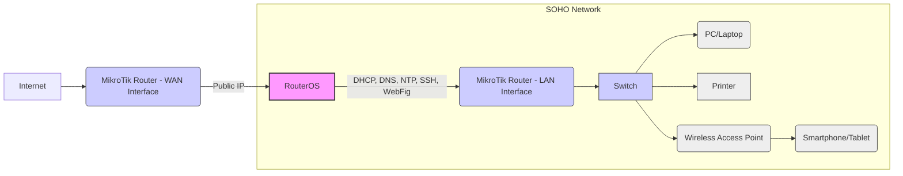

Okay, here is the comprehensive MikroTik RouterOS documentation for IP Services tailored for a SOHO environment, running RouterOS version 6.x, and focusing on basic complexity.

## MikroTik RouterOS IP Services in SOHO Environments (v6.x)

This document details the configuration and management of essential IP services on a MikroTik RouterOS device within a Small Office/Home Office (SOHO) network environment. It covers basic services crucial for network functionality, providing both Command Line Interface (CLI) and REST API (via Python) examples, along with best practices and troubleshooting for RouterOS version 6.x.

### 1. Architecture Diagram Requirements

**Network Topology:** A typical SOHO network consists of a MikroTik router acting as the gateway, connecting the local network to the internet.  IP services run on this router to manage local network resources and internet access.

**Mermaid Diagram:**



**Explanation:**

*   **Internet:** Represents the external network connection.
*   **MikroTik Router (WAN Interface):**  Connects to the internet, typically via Ethernet port configured as WAN. Receives a public IP address from the ISP.
*   **MikroTik Router (LAN Interface):** Connects to the local network, typically via Ethernet port configured as LAN.  Provides IP services to the LAN.
*   **Switch:**  Extends the wired network connectivity.
*   **PC/Laptop, Printer, WiFi AP, Mobile:**  Represent devices on the SOHO network that rely on the IP services provided by the MikroTik router.

### 2. CLI Configuration with Inline Comments

We will configure the following essential IP services:

*   **DHCP Server:** Dynamically assigns IP addresses to devices on the LAN.
*   **DNS Server:** Resolves domain names to IP addresses for LAN devices.
*   **NTP Client:** Synchronizes the router's time with an NTP server.
*   **SSH:** Enables secure remote access to the router.
*   **Winbox/WebFig:**  Web and GUI management interfaces.
*   **UPnP (Caution):**  For specific SOHO applications (with security considerations).

#### 2.1. DHCP Server Configuration

```routeros
# Navigate to DHCP Server configuration menu
/ip dhcp-server

# Add a DHCP server configuration
add name=dhcp-lan interface=LAN address-pool=default authoritative=yes disabled=no

# Configure the DHCP network - IP range for assignment, gateway, and DNS
/ip dhcp-server network
add address=192.168.88.0/24 gateway=192.168.88.1 dns-server=192.168.88.1,8.8.8.8 domain=soho.local
#   address: Network address and subnet mask for the DHCP scope (e.g., 192.168.88.0/24)
#   gateway: Default gateway for DHCP clients (usually the router's LAN IP)
#   dns-server: DNS servers to be provided to DHCP clients (router's IP and a public DNS)
#   domain: Optional domain name for the DHCP clients

# Create an IP address pool for DHCP - if 'default' pool doesn't exist or you want a specific range
/ip pool
add name=dhcp_pool ranges=192.168.88.10-192.168.88.254
#   name: Name of the IP pool
#   ranges: IP address range to be used for DHCP assignment

# Modify the DHCP server to use the newly created pool (if needed, otherwise 'default' is usually sufficient)
/ip dhcp-server set dhcp-lan address-pool=dhcp_pool
```

#### 2.2. DNS Server Configuration

```routeros
# Navigate to DNS settings
/ip dns

# Enable DNS server and set upstream DNS servers
set allow-remote-requests=yes servers=8.8.8.8,8.8.4.4
#   allow-remote-requests: Allows LAN clients to use the router as a DNS resolver
#   servers: Upstream DNS servers the router will use to resolve queries (Google Public DNS used here)

# Optionally, set a static DNS entry for local devices (e.g., for a local server)
/ip dns static
add name=localserver.soho.local address=192.168.88.100 comment="Local Server"
#   name: Hostname to resolve
#   address: IP address of the hostname
#   comment: Optional description
```

#### 2.3. NTP Client Configuration

```routeros
# Navigate to System NTP Client settings
/system ntp client

# Enable NTP client and set NTP server(s)
set enabled=yes server-primary=pool.ntp.org server-secondary=time.google.com mode=unicast
#   enabled: Enable NTP client
#   server-primary: Primary NTP server (pool.ntp.org is a good general pool)
#   server-secondary: Secondary NTP server for redundancy (Google Time Server)
#   mode: Unicast is typical for client mode
```

#### 2.4. SSH Service Configuration

```routeros
# Navigate to IP Services menu
/ip service

# Enable and configure SSH service
set ssh port=22 address=192.168.88.0/24, <YourPublicIP>/32
#   ssh: Select the SSH service
#   port: Default SSH port is 22 (can be changed for security, but standard port is usually fine for SOHO with other security measures)
#   address:  Restrict SSH access to the LAN network and optionally your specific public IP for remote admin (replace <YourPublicIP>).
#             Consider removing public IP access after initial setup for better security in SOHO.
```

#### 2.5. Winbox and WebFig (WebFig) Services Configuration

```routeros
# Navigate to IP Services menu
/ip service

# Configure Winbox service (default port 8291)
set winbox port=8291 address=192.168.88.0/24
#   winbox: Select the Winbox service
#   port: Default Winbox port (can be changed, but standard is usually fine for SOHO with access restrictions)
#   address: Restrict Winbox access to the LAN network.

# Configure WebFig service (default port 80)
set webfig port=80 address=192.168.88.0/24 http-redirect=yes
#   webfig: Select the WebFig service
#   port: Default WebFig port (port 80 is standard, consider HTTPS for production)
#   address: Restrict WebFig access to the LAN network.
#   http-redirect: Redirect HTTP to HTTPS if HTTPS is configured (recommended for security but requires certificate setup - beyond basic SOHO scope for this doc).

# To disable Telnet (highly recommended for security)
set telnet disabled=yes
```

#### 2.6. UPnP Service Configuration (With Caution)

**UPnP is generally discouraged due to security risks.**  However, for basic SOHO environments, it might be desired for ease of use with certain applications (e.g., gaming consoles, media servers). Use with caution and understand the security implications.

```routeros
# Navigate to IP UPnP settings
/ip upnp

# Enable UPnP service on the internal interface (LAN)
set enabled=yes interface=LAN allow-disable-external-interface=no show-dummy-rule=no
#   enabled: Enable UPnP service
#   interface: Interface to enable UPnP on (usually LAN)
#   allow-disable-external-interface: Prevents disabling the external interface for UPnP (security best practice)
#   show-dummy-rule:  Hide dummy rules in firewall (cosmetic)

# Enable UPnP interface configuration for the LAN interface
/ip upnp interfaces
add interface=LAN type=internal
add interface=WAN type=external
#   interface: Interface to configure for UPnP
#   type: 'internal' for LAN, 'external' for WAN
```

**Security Warning for UPnP:**  UPnP can create firewall exceptions automatically, potentially exposing your network to security vulnerabilities if not carefully managed and if applications have vulnerabilities. Consider disabling UPnP if not absolutely necessary.

### 3. REST API Implementation (Python code)

**Prerequisites:**

*   Enable the REST API service on your MikroTik router.
    ```routeros
    /ip service set api-ssl disabled=no
    ```
    (API-SSL is recommended for security. For basic SOHO testing, you might use `api` without SSL, but for production, use `api-ssl`).
*   Install the `requests` Python library: `pip install requests`

**Python Script Example (Partial - DHCP Server and DNS Server):**

```python
import requests
import json

router_ip = "your_router_ip"  # Replace with your Router's IP address
username = "api_user"        # Replace with your API username
password = "api_password"    # Replace with your API password

def api_request(path, data=None, method='POST'):
    url = f"https://{router_ip}/rest/{path}" # Use HTTPS (api-ssl)
    headers = {'Content-Type': 'application/json'}
    try:
        if method == 'POST':
            response = requests.post(url, auth=(username, password), headers=headers, data=json.dumps(data), verify=False) # verify=False for self-signed cert in basic SOHO setup
        elif method == 'GET':
            response = requests.get(url, auth=(username, password), headers=headers, verify=False)
        response.raise_for_status() # Raise an exception for HTTP errors
        return response.json()
    except requests.exceptions.RequestException as e:
        print(f"API request failed: {e}")
        return None

# --- DHCP Server Configuration via API ---
dhcp_server_config = {
    "name": "dhcp-lan-api",
    "interface": "LAN",
    "address-pool": "default",
    "authoritative": "yes",
    "disabled": "false"
}
response = api_request("ip/dhcp-server", dhcp_server_config)
if response:
    print("DHCP Server configured successfully via API")

dhcp_network_config = {
    "address": "192.168.88.0/24",
    "gateway": "192.168.88.1",
    "dns-server": "192.168.88.1,8.8.8.8",
    "domain": "soho.local"
}
response = api_request("ip/dhcp-server/network", dhcp_network_config)
if response:
    print("DHCP Network configured successfully via API")


# --- DNS Server Configuration via API ---
dns_config = {
    "allow-remote-requests": "true",
    "servers": "8.8.8.8,8.8.4.4"
}
response = api_request("ip/dns", dns_config)
if response:
    print("DNS Server configured successfully via API")

dns_static_entry = {
    "name": "localserver.soho.local",
    "address": "192.168.88.100",
    "comment": "Local Server via API"
}
response = api_request("ip/dns/static", dns_static_entry)
if response:
    print("Static DNS entry configured successfully via API")
```

**Explanation of Python Script:**

*   **`api_request(path, data=None, method='POST')` function:**
    *   Handles API requests to the MikroTik router.
    *   Constructs the URL using the router IP and the provided `path`.
    *   Sets headers for JSON content.
    *   Uses `requests.post` for POST requests (for creating/modifying configurations) and `requests.get` for GET requests (not shown in this example but used for retrieving data).
    *   Includes basic error handling using `try...except` and `response.raise_for_status()`.
    *   Returns the JSON response or `None` if there's an error.
    *   `verify=False` is used for simplicity in a SOHO setup, as self-signed certificates are common. **In a more secure environment, you should handle certificate verification properly.**
*   **Configuration Dictionaries:**  Dictionaries like `dhcp_server_config`, `dhcp_network_config`, `dns_config`, and `dns_static_entry` hold the parameters for each service.
*   **API Calls:**  `api_request()` is called with the relevant path (e.g., "ip/dhcp-server", "ip/dns") and configuration data to configure each service.
*   **Error Handling:** Basic error checking is included, printing a message if the API request fails.

**To configure other services (NTP, SSH, Winbox, WebFig, UPnP) via API, you would follow a similar pattern:**

1.  Identify the correct API path for the service (refer to MikroTik API documentation for v6.x).
2.  Create a Python dictionary with the configuration parameters.
3.  Use the `api_request()` function to send a POST request to the API path with the configuration data.

### 4. Common Debugging Scenarios

Here are common debugging scenarios for IP services in a SOHO environment:

| Service        | Scenario                                     | Debugging Steps (CLI)                                                                                                                                                                                                                                                            |
| -------------- | -------------------------------------------- | -------------------------------------------------------------------------------------------------------------------------------------------------------------------------------------------------------------------------------------------------------------------------------- |
| **DHCP Server** | Clients not getting IP addresses           | 1.  `/ip dhcp-server print` - Verify DHCP server is enabled and running on the correct interface (LAN).                                                                                                                                                                           |
|                |                                              | 2.  `/ip dhcp-server lease print` - Check if leases are being issued. Look for errors or exhaustion of the IP pool.                                                                                                                                                              |
|                |                                              | 3.  `/interface print` - Ensure the LAN interface is `running` and `connected`.                                                                                                                                                                                                 |
|                |                                              | 4.  Client-side: Check client device's DHCP settings, try releasing/renewing IP address.                                                                                                                                                                                          |
| **DNS Server**  | Clients cannot resolve domain names         | 1.  `/ip dns print` - Verify `allow-remote-requests=yes` and correct `servers` are configured.                                                                                                                                                                                |
|                |                                              | 2.  `ping 8.8.8.8` from router CLI - Test internet connectivity and reachability of public DNS servers.                                                                                                                                                                         |
|                |                                              | 3.  `ping google.com` from router CLI - Test DNS resolution from the router itself.                                                                                                                                                                                             |
|                |                                              | 4.  `nslookup google.com <router_lan_ip>` from a client PC - Test DNS resolution using the router as DNS server.                                                                                                                                                                 |
| **NTP Client** | Router time is incorrect                    | 1.  `/system ntp client print` - Verify `enabled=yes` and correct `server-primary/secondary` are set. Check `status`. Status should be `synchronizing` or `synchronized`.                                                                                                       |
|                |                                              | 2.  `ping pool.ntp.org` from router CLI - Test network connectivity to NTP servers.                                                                                                                                                                                                |
|                |                                              | 3.  `/system clock print` - Check the current system time and date.                                                                                                                                                                                                                 |
| **SSH**         | Cannot connect to router via SSH          | 1.  `/ip service print` - Verify `ssh` service is enabled and running on port 22 (or configured port) and `address` restrictions are not blocking your access.                                                                                                               |
|                |                                              | 2.  Firewall - Ensure firewall rules are not blocking SSH traffic from your source IP.                                                                                                                                                                                            |
|                |                                              | 3.  Client-side: Check SSH client settings (port, IP address, username, password). Try connecting from a different machine to isolate client-side issues.                                                                                                                     |
| **Winbox/WebFig**| Cannot access management interfaces       | 1.  `/ip service print` - Verify `winbox` and `webfig` services are enabled and running on their respective ports and `address` restrictions are not blocking your access.                                                                                                      |
|                |                                              | 2.  Firewall - Ensure firewall rules are not blocking Winbox/WebFig traffic (TCP ports 8291 and 80/443) from your source IP.                                                                                                                                                    |
|                |                                              | 3.  Client-side: Clear browser cache (for WebFig), ensure you are using the correct IP address and port in your browser/Winbox application. Try accessing from a different machine to isolate client-side issues.                                                               |
| **UPnP**        | Applications fail to open ports via UPnP   | 1.  `/ip upnp print` - Verify UPnP service is enabled and running on the correct interfaces.                                                                                                                                                                                        |
|                |                                              | 2.  `/ip firewall filter print` - Check for dynamically created UPnP firewall rules. Look for any blocking rules that might interfere.                                                                                                                                           |
|                |                                              | 3.  Application-side: Verify the application is correctly configured to use UPnP. Check application logs for UPnP errors. Some applications may have unreliable UPnP implementations. Consider manual port forwarding as a more reliable alternative if UPnP is problematic. |

### 5. Version-Specific Considerations (v6.x)

*   **API:** RouterOS v6.x primarily uses the older API interface (XML-based).  While REST API exists in v6.x, it is less feature-rich and may have limitations compared to later versions.  The provided Python example uses the REST API.
*   **Security Updates:** RouterOS v6.x is older. Ensure you are running the latest stable version within the v6.x branch to benefit from the latest security patches available for v6.x. However, consider upgrading to a newer RouterOS version (v7.x) for long-term security and feature updates if hardware compatibility allows.
*   **Feature Set:**  Some newer features and improvements related to IP services available in RouterOS v7.x and later might not be present or as refined in v6.x.
*   **Documentation:** Official MikroTik documentation might be more focused on the latest versions. Refer to v6.x specific documentation if available for very specific details or nuances.

### 6. Security Hardening Measures

For SOHO environments, basic security hardening for IP Services is crucial:

*   **Strong Passwords:**  Set strong, unique passwords for the `admin` user and any other user accounts. Change the default password immediately after setup.
    ```routeros
    /password
    ```
*   **Disable Default User (Optional):** If possible, disable the default `admin` user and create a new administrator user with a different username.
    ```routeros
    /user disable admin
    /user add name=your_admin_name password=your_strong_password group=full
    ```
*   **Restrict Service Access:** Use the `address` parameter in `/ip service` settings to limit access to management interfaces (SSH, Winbox, WebFig) to your LAN network only or specific trusted IP addresses. Avoid exposing these services to the public internet unless absolutely necessary, and if so, use strong authentication and consider VPN access instead.
*   **Disable Unnecessary Services:** Disable Telnet (`/ip service set telnet disabled=yes`). Disable UPnP if not actively used due to security risks.
*   **Firewall:** Implement basic firewall rules to protect your network. At a minimum, ensure that:
    *   Input chain: Drop unwanted incoming connections from the WAN interface.
    *   Forward chain: Implement NAT masquerade for outbound traffic but consider more restrictive forward rules for enhanced security if needed.
    *   Filter access to management ports even from LAN if possible using firewall rules.
*   **Regular Updates:**  Keep RouterOS updated to the latest stable version within the v6.x branch to patch security vulnerabilities. Monitor MikroTik security advisories.
*   **API Security:** If using API, use API-SSL (HTTPS) and strong API credentials. Restrict API access via firewall rules if possible.

### 7. Performance Optimization Tips

For basic SOHO environments, IP services usually do not require extensive performance optimization. However, consider these points:

*   **Resource Monitoring:** Use `/system resource print` to monitor CPU, memory, and disk usage. Ensure the router is not overloaded.
*   **Efficient DNS:** Using public DNS servers (like Google DNS, Cloudflare DNS) is generally efficient for SOHO. If you run a local DNS cache (not covered in basic SOHO setup), ensure it is configured correctly.
*   **DHCP Lease Time:**  Default DHCP lease times are usually adequate for SOHO. Short lease times might increase DHCP traffic slightly.
*   **NTP Server Selection:** `pool.ntp.org` is a good general pool. If you have a local NTP server, using it can slightly reduce external NTP traffic.
*   **Minimize UPnP Usage:**  UPnP can introduce overhead. Disable it if not needed.
*   **Regular Router Reboots (Scheduled):** For very basic SOHO setups, a scheduled reboot (e.g., weekly) can sometimes help clear temporary issues and maintain stability, although proper configuration and updates are more important for long-term stability. Use `/system scheduler` to schedule reboots if needed, but investigate root causes of instability instead of relying on reboots as a primary solution.

### Special Requirements for SOHO Environments

#### Real-world Deployment Examples

*   **Home Internet Sharing:**  The most common SOHO scenario. MikroTik router connects to a broadband modem, provides DHCP for home devices (PCs, laptops, smartphones, smart TVs), DNS resolution, and NAT for internet access sharing.
*   **Small Office Network:**  Similar to home use, but may involve more users, printers, and potentially a small server. DHCP server manages IP addresses for office workstations, DNS resolves internal and external names, NTP keeps devices synchronized for time-sensitive applications.
*   **Home Lab/Learning:**  For users learning networking or setting up home labs. IP services are fundamental for creating a functional network environment for experimentation and learning RouterOS features.

#### Scalability Considerations

*   **SOHO Scale Limitations:** The basic IP service configurations outlined here are suitable for small SOHO networks (tens of devices). For larger networks, consider:
    *   **Router Hardware:** Ensure the MikroTik router hardware (CPU, RAM) is sufficient for the number of devices and traffic load. SOHO-grade routers have limitations.
    *   **DHCP Scope:**  Adjust DHCP address pool size if you expect to connect more devices.
    *   **DNS Performance:** For very large networks, consider dedicated DNS servers or caching DNS resolvers for better performance.
    *   **Centralized Management:** For larger deployments, consider MikroTik's centralized management solutions (e.g., The Dude, Cloud Hosted Router in RouterOS v7 for cloud management).

#### Monitoring Configurations

**CLI Monitoring Examples:**

*   **DHCP Leases:** `/ip dhcp-server lease print` - Monitor active DHCP leases.
*   **System Resources:** `/system resource print` - Monitor CPU, memory, disk usage.
*   **Interface Status:** `/interface print` - Monitor interface status (running, connected, traffic).
*   **NTP Status:** `/system ntp client print` - Monitor NTP synchronization status.
*   **Logs:** `/log print` - Check system logs for errors or warnings related to IP services.

**API Monitoring Example (Python - System Resource):**

```python
# --- Get System Resource Information via API ---
resource_info = api_request("system/resource", method='GET')
if resource_info:
    print("System Resource Information:")
    print(json.dumps(resource_info, indent=4))
```

You can extend this to monitor other aspects via API by querying relevant paths (e.g., `/ip/dhcp-server/lease` for DHCP leases).

#### Disaster Recovery Steps

*   **Configuration Backup:** Regularly backup your MikroTik RouterOS configuration.
    *   **CLI:** `/export file=config_backup.rsc` - Creates a configuration script backup file.
    *   **Winbox/WebFig:** Use the "Backup" option in the "Files" menu.
    *   **API (Automated Backup Script - see next section):**  Can be integrated into automated scripts.
*   **Backup Storage:** Store backups securely and off-router (e.g., on a local PC, network share, cloud storage).
*   **Restoration:** In case of router failure or configuration corruption:
    *   **CLI:** `/import file=config_backup.rsc` - Imports a configuration script to restore.
    *   **Netinstall:** For more severe issues or if the router is not booting, use Netinstall to reinstall RouterOS and then restore the configuration.
*   **Document Configuration:** Keep documentation of your network setup, IP addressing scheme, and critical configurations.

#### Automated Backup Scripts

**Python Script Example for Automated Backup via API:**

```python
import requests
import datetime
import os

router_ip = "your_router_ip"
username = "api_user"
password = "api_password"
backup_directory = "/path/to/your/backup/directory" # Replace with your desired backup directory

def api_request(path, data=None, method='POST'):
    # ... (same api_request function as before) ...

def create_backup():
    now = datetime.datetime.now().strftime("%Y%m%d_%H%M%S")
    backup_filename = f"mikrotik_backup_{now}.rsc"
    backup_filepath = os.path.join(backup_directory, backup_filename)

    export_command = { "command": "/export file=api_backup" } # Command to export config
    response = api_request("tool/fetch", export_command) # Using tool/fetch to trigger command remotely (for v6.x API, might need adjustments for direct command execution depending on API capabilities)

    if response:
        print(f"Backup initiated on router. Downloading backup file...")
        download_url = f"https://{router_ip}/rest/file/api_backup.rsc" # Assuming file is created in root - check actual path
        try:
            download_response = requests.get(download_url, auth=(username, password), verify=False)
            download_response.raise_for_status()

            with open(backup_filepath, 'wb') as f:
                f.write(download_response.content)
            print(f"Backup saved to: {backup_filepath}")
        except requests.exceptions.RequestException as e:
            print(f"Error downloading backup file: {e}")
    else:
        print("Failed to initiate backup on router.")

if __name__ == "__main__":
    create_backup()
```

**Explanation of Backup Script:**

*   **`create_backup()` function:**
    *   Generates a timestamped backup filename.
    *   Constructs the backup file path.
    *   Uses `api_request` to trigger the `/export file=api_backup` command on the MikroTik router. This command creates a configuration export file named `api_backup.rsc` on the router's storage.
    *   Downloads the `api_backup.rsc` file from the router using a GET request to the API file endpoint.
    *   Saves the downloaded backup file to the specified `backup_directory` on the local machine.
    *   Includes basic error handling for API requests and file download.
*   **Scheduling:**  Use operating system's task scheduler (e.g., cron on Linux/macOS, Task Scheduler on Windows) to run this Python script regularly (e.g., daily or weekly) to automate backups.

**Note:** This backup script is a basic example for v6.x API and might require adjustments based on the exact API capabilities of your specific v6.x RouterOS version.  For more robust backups, consider using MikroTik's built-in scheduling and backup features if they meet your needs, or explore more advanced API interactions for more granular control.

This documentation provides a comprehensive guide to configuring essential IP services on a MikroTik RouterOS device in a SOHO environment running version 6.x. Remember to adapt the configurations and scripts to your specific network requirements and always prioritize security best practices.

## API Reference Cheat Sheet
```python
# Universal API Helper Function
def mikrotik_api_call(
    method: str,
    endpoint: str,
    data: dict = None,
    timeout: int = 10
) -> dict:
    '''
    Universal MikroTik API handler with error checking
    '''
    try:
        response = requests.request(
            method,
            f"https://{ROUTER_IP}/rest{endpoint}",
            auth=HTTPBasicAuth(API_USER, API_PASS),
            json=data,
            verify=SSL_VERIFY,
            timeout=timeout
        )
        response.raise_for_status()
        return response.json()
    except requests.exceptions.HTTPError as e:
        print(f"API Error: {e.response.status_code} - {e.response.text}")
        return {"error": str(e)}
```