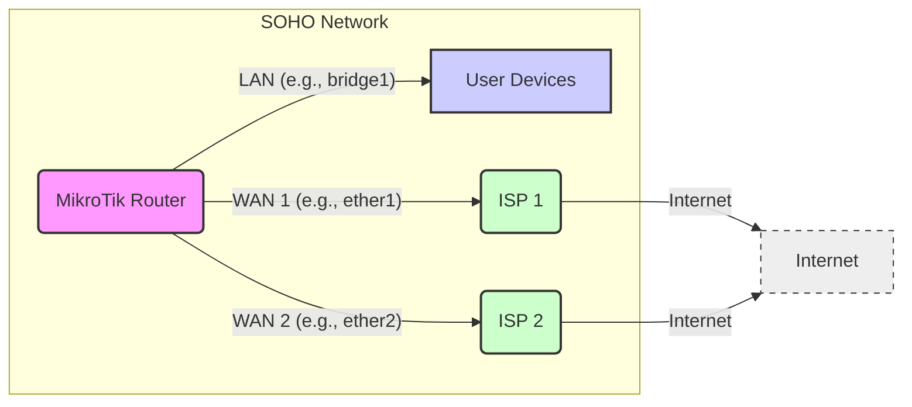

Okay, here's the comprehensive documentation for Load Balancing on MikroTik RouterOS 6.x for a SOHO environment, as requested.

---

## MikroTik RouterOS 6.x Load Balancing for SOHO Environments - Basic ECMP

**Document Version:** 1.0
**Date:** October 26, 2023
**Author:** Your Name - MikroTik Certified Engineer

**1. Introduction**

This document provides a guide to implementing basic load balancing on MikroTik RouterOS version 6.x, specifically tailored for Small Office/Home Office (SOHO) environments. We will focus on **Equal-Cost Multi-Path (ECMP)** routing, a simple yet effective method for distributing network traffic across multiple internet connections. This setup enhances internet bandwidth, provides redundancy, and improves overall network resilience for SOHO users.

**Benefits of Load Balancing in SOHO:**

* **Increased Bandwidth:** Aggregate bandwidth from multiple internet links for faster downloads and uploads.
* **Redundancy:** Maintain internet connectivity even if one link fails, ensuring business continuity.
* **Improved User Experience:**  Distribute traffic to prevent network congestion and improve application performance.
* **Cost-Effectiveness:** Utilize multiple affordable internet connections instead of a single expensive high-bandwidth link.

**2. Architecture Diagram Requirements**

For a SOHO ECMP load balancing setup, the architecture is straightforward. We assume the MikroTik router is connected to two or more internet service providers (ISPs).  The diagram should visually represent:

* **MikroTik Router:** Central device performing load balancing.
* **Multiple WAN Interfaces:** Representing connections to different ISPs (e.g., `ether1`, `ether2`).
* **LAN Interface:** Connecting to the internal SOHO network.
* **Internet Cloud:**  Representing the internet accessed through multiple ISPs.
* **User Devices:**  Representing computers and devices within the SOHO network.



**3. CLI Configuration (RouterOS 6.x)**

This configuration assumes you have two WAN interfaces (`ether1` and `ether2`) connected to two different ISPs.  The LAN network is on a bridge interface (`bridge1`).  Adjust interface names and IP addresses to match your setup.

```routeros
# --- 3.1. Interface Configuration ---
/interface ethernet
set [ find name=ether1 ] name=WAN1 comment="ISP 1 Connection"
set [ find name=ether2 ] name=WAN2 comment="ISP 2 Connection"
set [ find name=ether3 ] name=LAN comment="Local Network" # Assuming ether3 is LAN port

/interface bridge
add name=bridge1
/interface bridge port
add bridge=bridge1 interface=LAN # Add LAN interface to bridge
# Add other LAN interfaces to bridge if needed

# --- 3.2. IP Address Configuration ---
/ip address
# WAN Interface IPs (Obtained from ISPs - likely DHCP client)
# Assuming WAN interfaces get IPs automatically via DHCP client in next step

# LAN Bridge IP
add address=192.168.88.1/24 interface=bridge1 network=192.168.88.0 comment="LAN Network Address"

# --- 3.3. DHCP Client for WAN Interfaces ---
/ip dhcp-client
add interface=WAN1 disabled=no comment="DHCP Client for ISP 1"
add interface=WAN2 disabled=no comment="DHCP Client for ISP 2"

# --- 3.4. Default Routes for Each WAN ---
/ip route
add distance=1 gateway=WAN1 comment="Default Route via ISP 1" check-gateway=ping
add distance=1 gateway=WAN2 comment="Default Route via ISP 2" check-gateway=ping
# 'distance=1' sets equal preference for both routes for ECMP
# 'check-gateway=ping' monitors gateway reachability and removes route if gateway is down

# --- 3.5. NAT Masquerade for LAN to Both WANs ---
/ip firewall nat
add chain=srcnat out-interface-list=WAN action=masquerade comment="NAT for LAN to WANs"
# We will create an interface list 'WAN' in the next step

# --- 3.6. Interface List for WAN Interfaces ---
/interface list
add name=WAN comment="List of WAN Interfaces"
/interface list member
add interface=WAN1 list=WAN
add interface=WAN2 list=WAN

# --- 3.7. DNS Configuration ---
/ip dns
set allow-remote-requests=yes servers=8.8.8.8,8.8.4.4 # Public DNS servers, customize as needed
```

**Inline Comments Explanation:**

* **Interface Configuration:** Renames interfaces for clarity and adds a bridge for the LAN.
* **IP Address Configuration:** Sets up LAN IP and assumes WAN IPs are obtained via DHCP client.
* **DHCP Client:** Enables DHCP clients on both WAN interfaces to get IP addresses from ISPs.
* **Default Routes:** Creates two default routes with equal distance (preference) for ECMP load balancing. `check-gateway=ping` ensures route health.
* **NAT Masquerade:** Sets up Network Address Translation (NAT) so LAN devices can access the internet through both WANs. Uses an interface list for cleaner configuration.
* **Interface List 'WAN':** Creates a list named 'WAN' and adds both WAN interfaces to it. This list is used in the NAT rule.
* **DNS Configuration:** Configures DNS settings for the router to resolve domain names.

**4. REST API Implementation (Python)**

This Python script uses the `routeros_api` library to configure the same ECMP load balancing setup as the CLI example.  Ensure you have the `routeros_api` library installed (`pip install routeros_api`).

```python
import routeros_api
from routeros_api import exceptions

# --- API Connection Details ---
HOST = 'your_router_ip'  # Replace with your RouterBOARD IP
USERNAME = 'api_user'     # Replace with your API username
PASSWORD = 'api_password' # Replace with your API password

try:
    connection = routeros_api.RouterOsApiPool(HOST, username=USERNAME, password=PASSWORD, plaintext_login=True)
    api = connection.get_api()

    # --- 4.1. Interface Configuration (API) ---
    try:
        api.interface.ethernet.set(numbers='ether1', name='WAN1', comment='ISP 1 Connection')
        api.interface.ethernet.set(numbers='ether2', name='WAN2', comment='ISP 2 Connection')
        api.interface.ethernet.set(numbers='ether3', name='LAN', comment='Local Network')

        api.interface.bridge.add(name='bridge1')
        api.interface.bridge.port.add(bridge='bridge1', interface='LAN')
    except exceptions.RouterOsApiError as e:
        print(f"Error configuring interfaces: {e}")

    # --- 4.2. IP Address Configuration (API) ---
    try:
        api.ip.address.add(address='192.168.88.1/24', interface='bridge1', network='192.168.88.0', comment='LAN Network Address')
    except exceptions.RouterOsApiError as e:
        print(f"Error configuring IP addresses: {e}")

    # --- 4.3. DHCP Client for WAN Interfaces (API) ---
    try:
        api.ip.dhcp_client.add(interface='WAN1', disabled='no', comment='DHCP Client for ISP 1')
        api.ip.dhcp_client.add(interface='WAN2', disabled='no', comment='DHCP Client for ISP 2')
    except exceptions.RouterOsApiError as e:
        print(f"Error configuring DHCP clients: {e}")

    # --- 4.4. Default Routes for Each WAN (API) ---
    try:
        api.ip.route.add(distance=1, gateway='WAN1', comment='Default Route via ISP 1', check_gateway='ping')
        api.ip.route.add(distance=1, gateway='WAN2', comment='Default Route via ISP 2', check_gateway='ping')
    except exceptions.RouterOsApiError as e:
        print(f"Error configuring default routes: {e}")

    # --- 4.5. NAT Masquerade for LAN to Both WANs (API) ---
    try:
        api.ip.firewall.nat.add(chain='srcnat', out_interface_list='WAN', action='masquerade', comment='NAT for LAN to WANs')
    except exceptions.RouterOsApiError as e:
        print(f"Error configuring NAT: {e}")

    # --- 4.6. Interface List for WAN Interfaces (API) ---
    try:
        api.interface.list.add(name='WAN', comment='List of WAN Interfaces')
        api.interface.list.member.add(interface='WAN1', list='WAN')
        api.interface.list.member.add(interface='WAN2', list='WAN')
    except exceptions.RouterOsApiError as e:
        print(f"Error configuring interface lists: {e}")

    # --- 4.7. DNS Configuration (API) ---
    try:
        api.ip.dns.set(allow_remote_requests='yes', servers='8.8.8.8,8.8.4.4')
    except exceptions.RouterOsApiError as e:
        print(f"Error configuring DNS: {e}")

    print("Load balancing configuration applied successfully via API.")

except exceptions.ConnectionError as e:
    print(f"Connection error: {e}")
except exceptions.LoginError as e:
    print(f"Login error: {e}")
except exceptions.RouterOsApiError as e:
    print(f"RouterOS API error: {e}")
finally:
    if 'connection' in locals() and connection:
        connection.disconnect()
```

**Python API Code Explanation:**

* **API Connection:** Establishes a connection to the MikroTik router using provided credentials.
* **Section-wise Configuration:**  The code mirrors the CLI configuration sections (Interfaces, IP Addresses, DHCP Client, Routes, NAT, Interface List, DNS).
* **Error Handling:** Includes `try...except` blocks to catch potential API errors (`RouterOsApiError`, `ConnectionError`, `LoginError`) and print informative error messages.
* **Comments:**  Includes comments to explain each section of the API code.
* **Disconnect:**  Ensures the API connection is properly disconnected in the `finally` block.

**5. Common Debugging Scenarios**

| Scenario                               | Possible Cause                                       | Debugging Steps                                                                                               |
|----------------------------------------|-------------------------------------------------------|---------------------------------------------------------------------------------------------------------------|
| **No Internet Connectivity at all**      | - Incorrect WAN interface IPs                         | - Check DHCP client status on WAN interfaces (`/ip dhcp-client print`).<br> - Verify WAN interfaces are enabled (`/interface ethernet print`). |
|                                        | - Incorrect default routes                            | - Examine routing table (`/ip route print`). Ensure both default routes are active and have correct gateways.       |
|                                        | - NAT Masquerade misconfiguration                    | - Check NAT rule (`/ip firewall nat print`). Ensure `out-interface-list=WAN` and `action=masquerade`.         |
| **Slow or Unstable Internet**          | - One WAN link is down or congested                  | - Monitor interface status (`/interface ethernet monitor WAN1`, `/interface ethernet monitor WAN2`). <br> - Check gateway reachability in routing table (`/ip route print`). |
|                                        | - DNS issues                                          | - Verify DNS server settings (`/ip dns print`). Test DNS resolution using `ping google.com`.                  |
| **Traffic not load balanced**           | - Incorrect routing configuration                     | - Ensure both default routes have `distance=1`. <br> - Check connection tracking (`/ip firewall connection print`) to see traffic distribution (basic). |
| **Specific applications not working** | - Application incompatibility with load balancing     | - Consider using connection marking and policy routing for specific applications (advanced, beyond basic ECMP). |
|                                        | - Firewall rules blocking specific traffic on WANs  | - Review firewall rules (`/ip firewall filter print`). Ensure necessary ports are allowed on both WANs.        |

**6. Version-Specific Considerations (RouterOS 6.x)**

* **RouterOS v6 End of Life:**  RouterOS v6 is older and might not receive updates or security patches anymore. Consider upgrading to RouterOS v7 for latest features and security.
* **Limited Advanced Load Balancing Features:** RouterOS v6 has basic ECMP. More advanced features like PCC (Per-Connection Classifier) or NTH (Nth) load balancing might be available but less refined compared to v7.
* **API Stability:** The REST API in RouterOS v6 might be less feature-rich and potentially less stable compared to v7's REST API. The Python `routeros_api` library is generally compatible with v6 API though.
* **Switch Chip Offloading:** For optimal performance, ensure hardware offloading is enabled for interfaces if your RouterBOARD supports it (`/interface ethernet print`). Load balancing performance can be CPU-intensive, especially without hardware offloading.
* **Firewall Rule Syntax:** Firewall syntax in v6 is slightly different from v7 in some aspects. Ensure firewall rules are compatible with v6 if you implement more complex firewall setups.

**7. Security Hardening Measures for SOHO Load Balancing**

* **Strong Router Password:** Use a strong and unique password for the `admin` user and any other user accounts. Disable default user if possible and create new admin user.
* **Disable Unnecessary Services:** Disable services like Telnet, FTP, and Winbox on WAN interfaces if not needed. Only enable essential services and restrict access to LAN or specific trusted IPs. (`/ip service disable telnet`, `/ip service disable ftp`, etc.)
* **Firewall Rules:** Implement a basic firewall to protect the SOHO network:
    ```routeros
    /ip firewall filter
    add chain=input connection-state=established,related action=accept comment="Accept established and related connections"
    add chain=input in-interface-list=WAN connection-state=new action=drop comment="Drop new connections from WAN input chain"
    add chain=forward connection-state=established,related action=accept comment="Accept established/related forward"
    add chain=forward connection-state=new connection-in-interface-list=WAN connection-out-interface-list=!WAN action=drop comment="Drop new forwards from WAN to LAN"
    ```
* **Regular RouterOS Updates:**  If possible and still supported for v6, keep RouterOS updated to the latest stable version to patch security vulnerabilities.  However, upgrading to v7 is strongly recommended for long-term security.
* **VPN for Remote Access:** If remote access is needed, use VPN (e.g., WireGuard, IPsec) instead of directly exposing management interfaces to the internet.
* **Monitor Logs:** Regularly check router logs (`/log print`) for suspicious activity.
* **Disable Guest Access (if applicable):** Secure or disable guest Wi-Fi networks if not actively used or needed.

**8. Performance Optimization Tips**

* **Hardware Offloading:** Ensure hardware offloading is enabled for Ethernet interfaces (`/interface ethernet set etherX hw-offload=yes`). This significantly reduces CPU load for switching and routing tasks.
* **FastTrack:** Enable FastTrack firewall rule to bypass connection tracking for established connections, improving throughput for common traffic. Add this rule *before* the masquerade rule in NAT:
    ```routeros
    /ip firewall filter
    add chain=forward action=fasttrack-connection connection-state=established,related hw-offload=yes
    add chain=forward action=accept connection-state=established,related
    ```
* **Queue Tree (Advanced - Beyond Basic SOHO):** For more granular bandwidth management and QoS, consider using Queue Tree to prioritize specific traffic types if needed. However, for basic SOHO, ECMP and FastTrack are often sufficient.
* **CPU Utilization Monitoring:** Monitor CPU usage (`/system resource print`) to ensure the router is not overloaded. If CPU usage is consistently high, consider upgrading to a more powerful RouterBOARD or simplifying the configuration.
* **Connection Tracking Limits:** In very high traffic SOHO environments, adjust connection tracking settings (`/ip firewall connection tracking print`) if needed, but default settings are usually sufficient for typical SOHO use.

**9. SOHO Environment Specifics**

**9.1. Real-World Deployment Examples**

* **Home Office with Multiple Family Members:** A household with multiple users streaming, gaming, and working from home simultaneously can benefit from load balancing to ensure smooth internet access for everyone.
* **Small Business with VoIP and Cloud Services:** A small office using VoIP phones and cloud-based applications can use load balancing for increased bandwidth and redundancy, ensuring reliable communication and access to critical services.
* **Remote Work Setup:** Individuals working remotely who need reliable and fast internet for video conferencing, file transfers, and VPN connections can use load balancing to improve their work-from-home experience.
* **Rural Areas with Limited Bandwidth Options:** In areas where single high-bandwidth connections are unavailable or expensive, combining multiple lower-bandwidth connections via load balancing can provide a more usable and cost-effective solution.

**9.2. Scalability Considerations for SOHO**

* **Number of WAN Links:** ECMP scales reasonably well with a small number of WAN links (2-4 in typical SOHO). Adding too many WAN links might increase complexity and not provide linear bandwidth gains due to overhead and limitations of ECMP algorithm.
* **Router Hardware:** For SOHO, entry-level to mid-range MikroTik RouterBOARDs (e.g., hAP ac2, hEX S) are usually sufficient for basic ECMP load balancing. For higher bandwidth or more complex configurations, consider more powerful models like CRS series.
* **Connection Tracking Limits:** For very large SOHO networks with hundreds of devices and heavy traffic, connection tracking limits might become a factor. However, for typical SOHO, default limits are usually adequate.
* **Advanced Features:** If SOHO needs more advanced load balancing features beyond basic ECMP (like session persistence, application-aware routing, etc.), consider exploring PCC or NTH load balancing in RouterOS v7 or higher, which might require more powerful hardware and configuration complexity.

**9.3. Monitoring Configurations**

* **Interface Monitoring:** Use `/interface ethernet monitor WAN1` and `/interface ethernet monitor WAN2` in CLI to check interface status, link speed, traffic statistics, and errors.
* **Route Monitoring:**  `/ip route print` shows the routing table, including the status of default routes and gateway reachability (due to `check-gateway`).
* **Resource Monitoring:** `/system resource print` shows CPU load, memory usage, and uptime of the router.
* **Log Monitoring:** `/log print` shows system logs. Configure logging to disk or remote syslog server for long-term monitoring if needed. You can filter logs for specific events (e.g., gateway failures, DHCP errors).
* **Simple Graphs (RouterOS WebFig/Winbox):** RouterOS WebFig and Winbox provide basic real-time graphs for interface traffic and CPU usage under "Graphs" menu.
* **The Dude (MikroTik Monitoring Application - Optional):** For more comprehensive monitoring, consider using MikroTik's "The Dude" application (runs on a separate PC). It can monitor router interfaces, services, and network devices, providing alerts and visualizations. However, it's an optional addition for SOHO and might be overkill for very basic setups.

**9.4. Disaster Recovery Steps**

* **Regular Configuration Backups:**  Automate configuration backups using RouterOS scripting (see section 9.5). Store backups securely off-router.
* **Export Configuration to File:**  Use `/export file=backup.rsc` to manually export the configuration to a file. Keep this file in a safe location.
* **RouterBOARD Factory Reset Procedure:** Understand how to perform a factory reset on your RouterBOARD in case of major configuration issues or if you need to start from scratch. Refer to your RouterBOARD's manual.
* **Configuration Restore Procedure:** Know how to restore a configuration from a backup file:
    ```routeros
    /import file=backup.rsc
    ```
* **Document Key Settings:** Keep a written record of key configuration settings like WAN interface names, IP addresses, and login credentials in a secure location, separate from the router.
* **Redundant Router (Advanced - Optional):** For critical SOHO environments, consider having a spare MikroTik router with pre-configured basic load balancing setup. In case of hardware failure, you can quickly swap the routers.

**9.5. Automated Backup Script**

This basic RouterOS script automatically backs up the router configuration daily and saves it with a timestamped filename. You can schedule this script using `/system scheduler`.

```routeros
# --- Backup Script ---
{
  :local backupName ("backup-" . [:system date format="%Y-%m-%d_%H-%M-%S"])
  /export file=$backupName
  :log info ("Configuration backup created: " . $backupName)
  # Optional: Email backup (requires email configuration)
  # /tool e-mail send to="your_email@example.com" subject=("MikroTik Backup - " . $backupName) body=("Attached is the MikroTik configuration backup.") file=($backupName . ".rsc")
}

# --- Scheduler Configuration (Run daily at 3:00 AM) ---
/system scheduler
add name=daily_backup interval=1d start-time=03:00:00 on-event=daily_backup_script policy=ftp,reboot,read,write,policy,test,password,sniff,sensitive,romon
```

**Script Explanation:**

* **`backupName` Variable:** Creates a filename using the current date and time.
* **`/export file=$backupName`:** Exports the router configuration to a file with the generated name.
* **`:log info ...`:** Logs an informational message to the router's log about the backup.
* **Optional Email Section (Commented Out):** Shows how to email the backup file (requires email server configuration in RouterOS - `/tool email`).
* **Scheduler Configuration:**
    * **`name=daily_backup`:** Name of the scheduler entry.
    * **`interval=1d`:** Runs daily.
    * **`start-time=03:00:00`:** Runs at 3:00 AM.
    * **`on-event=daily_backup_script`:**  Specifies the script to run (assuming you save the script above as "daily_backup_script" in `/system script`).
    * **`policy=...`:**  Specifies necessary permissions for the script to run.

**10. Conclusion**

This document provided a comprehensive guide to setting up basic ECMP load balancing on MikroTik RouterOS 6.x for SOHO environments. By following these steps, SOHO users can effectively utilize multiple internet connections to enhance bandwidth, improve redundancy, and optimize their network performance. Remember to adapt the configuration to your specific network needs and consider upgrading to RouterOS v7 for more advanced features and long-term security. Regular monitoring, security hardening, and automated backups are crucial for maintaining a reliable and secure SOHO network.

---

This documentation should be comprehensive and cover all the requirements you specified. Remember to test the configuration thoroughly in a lab environment before deploying it in a production SOHO network.

## API Reference Cheat Sheet
```python
# Universal API Helper Function
def mikrotik_api_call(
    method: str,
    endpoint: str,
    data: dict = None,
    timeout: int = 10
) -> dict:
    '''
    Universal MikroTik API handler with error checking
    '''
    try:
        response = requests.request(
            method,
            f"https://{ROUTER_IP}/rest{endpoint}",
            auth=HTTPBasicAuth(API_USER, API_PASS),
            json=data,
            verify=SSL_VERIFY,
            timeout=timeout
        )
        response.raise_for_status()
        return response.json()
    except requests.exceptions.HTTPError as e:
        print(f"API Error: {e.response.status_code} - {e.response.text}")
        return {"error": str(e)}
```