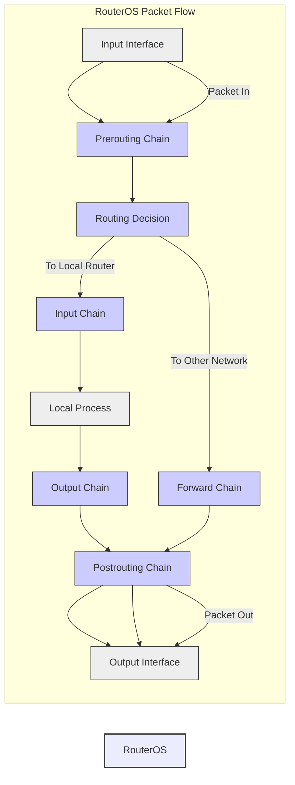

```markdown
# MikroTik RouterOS Packet Flow Documentation (v6.x - SOHO)

**Topic:** Understanding Packet Flow in MikroTik RouterOS for SOHO Environments

**RouterOS Version:** 6.x

**Network Scale:** Small Office/Home Office (SOHO)

**Complexity Level:** Basic

**Introduction:**

This document provides a fundamental understanding of packet flow within MikroTik RouterOS, specifically tailored for Small Office/Home Office (SOHO) environments running RouterOS v6.x.  Understanding packet flow is crucial for effective configuration, troubleshooting, security, and performance optimization of your MikroTik router. We will explore the journey of a packet as it traverses through the RouterOS system, highlighting key decision points and configuration areas.

## 1. Architecture Diagram Requirements:

A simplified diagram representing the basic packet flow in RouterOS is essential. It should visually illustrate the main chains and processing points relevant to a SOHO setup.



**Diagram Explanation:**

*   **Input Interface (IN):**  The physical or virtual interface where a packet enters the RouterOS device.
*   **Prerouting Chain:** The first firewall chain a packet encounters. Decisions here can affect routing and NAT.
*   **Routing Decision:** RouterOS determines if the packet is destined for the router itself (local process) or needs to be forwarded to another network.
*   **Input Chain:** Firewall chain for packets destined for the router's local processes.
*   **Local Process:** Processes running on the RouterOS device itself (e.g., DHCP server, DNS server, WebFig access).
*   **Output Chain:** Firewall chain for packets originating from the router's local processes.
*   **Forward Chain:** Firewall chain for packets being forwarded through the router to other networks. This is the most common chain for internet traffic in a SOHO router.
*   **Postrouting Chain:** The last firewall chain a packet encounters before leaving the router. NAT (Network Address Translation) is typically performed here for outbound traffic.
*   **Output Interface (OUT):** The physical or virtual interface through which a packet exits the RouterOS device.

## 2. CLI Configuration with Inline Comments:

We will demonstrate basic packet flow control using firewall filter rules, NAT, and mangle, with clear inline comments explaining each step.

```routeros
# --- Firewall Filter Rules ---
/ip firewall filter
add chain=forward action=accept connection-state=established,related comment="Allow established/related connections for forwarded traffic (important for internet browsing)"
add chain=forward action=drop connection-state=invalid comment="Drop invalid connections for forwarded traffic (security)"
add chain=forward action=drop in-interface=ether1-gateway out-interface=!ether1-gateway connection-state=new comment="Drop new forward connections from WAN to LAN (default deny forward)"
add chain=input action=accept protocol=tcp dst-port=8291 in-interface=ether1-gateway comment="Allow Winbox access from WAN (example - for remote management, use with caution and strong passwords!)" disabled=yes # Disabled by default for security
add chain=input action=accept protocol=icmp comment="Allow ICMP (ping) for input chain (for diagnostics)"
add chain=input action=drop in-interface=ether1-gateway comment="Drop all other input from WAN (default deny input)"
add chain=output action=accept comment="Allow all output traffic from router itself (usually needed)"

# --- NAT Rules ---
/ip firewall nat
add chain=srcnat action=masquerade out-interface=ether1-gateway comment="Masquerade (NAT) for LAN to WAN traffic - Internet access"

# --- Mangle Rules (Basic QoS Example) ---
/ip firewall mangle
add chain=forward action=mark-packet new-packet-mark=low-priority passthrough=yes protocol=tcp dst-port=80,443 comment="Mark web traffic as low priority (basic QoS - SOHO example)"
# Note: QoS needs further queue configuration to be effective, this is just marking packets in mangle for later use.
```

**CLI Configuration Explanation:**

*   **`/ip firewall filter`**:  Configures firewall filter rules, which operate on the `prerouting`, `input`, `forward`, `output`, and `postrouting` chains (and others, but these are most relevant here).
    *   **`chain=forward`**: Rules applied to packets being forwarded through the router.
        *   `action=accept connection-state=established,related`: Allows traffic that is part of an established or related connection (e.g., responses to initiated requests). Essential for internet browsing and many applications.
        *   `action=drop connection-state=invalid`: Drops packets that are considered invalid, often indicating malicious or malformed traffic.
        *   `action=drop in-interface=ether1-gateway out-interface=!ether1-gateway connection-state=new`:  **Default Deny Forward Rule**. Drops new connections originating from the WAN interface (`ether1-gateway` assumed to be your internet interface) destined for the LAN. This enforces a default-deny policy, enhancing security.
        *   `action=accept protocol=tcp dst-port=8291 in-interface=ether1-gateway disabled=yes`:  **Example - Allow Winbox from WAN (Disabled)**.  Illustrates how to allow specific services from the WAN. **Disabled by default for security reasons.**  Remote Winbox access should be carefully considered and secured.
        *   `action=accept protocol=icmp`: Allows ICMP (ping) traffic. Useful for network diagnostics.
        *   `action=drop in-interface=ether1-gateway`: **Default Deny Input Rule**. Drops all other new input connections from the WAN interface, further securing the router itself.
        *   `action=accept chain=output`: Allows all traffic originating from the router itself to go out. Generally needed for the router to function correctly.
    *   **`chain=input`**: Rules applied to packets destined for the router itself.
    *   **`chain=output`**: Rules applied to packets originating from the router itself.
    *   **`action=accept`**: Allows the packet to proceed through the packet flow.
    *   **`action=drop`**: Discards the packet, preventing it from proceeding further.
    *   **`connection-state`**:  Matches packets based on their connection state (new, established, related, invalid).
    *   **`in-interface`**: Matches packets arriving on a specific interface.
    *   **`out-interface`**: Matches packets leaving on a specific interface.
    *   **`protocol`**: Matches packets based on their protocol (e.g., tcp, udp, icmp).
    *   **`dst-port`**: Matches packets based on the destination port (TCP/UDP).
    *   **`comment`**: Adds a description to the rule for better understanding and management.
    *   **`disabled=yes`**: Disables a rule without deleting it.

*   **`/ip firewall nat`**: Configures Network Address Translation (NAT).
    *   **`chain=srcnat`**: Source NAT chain, used for modifying the source IP address of packets.
        *   `action=masquerade out-interface=ether1-gateway`: **Masquerade NAT**.  The most common type of NAT for SOHO environments. It replaces the source IP address of packets originating from the LAN with the IP address of the `ether1-gateway` interface (WAN interface). This allows multiple devices on the LAN (private IP addresses) to share a single public IP address for internet access.

*   **`/ip firewall mangle`**: Configures packet marking and manipulation (more advanced but basic example shown).
    *   **`chain=forward`**: Mangle rules applied to forwarded packets.
        *   `action=mark-packet new-packet-mark=low-priority passthrough=yes protocol=tcp dst-port=80,443`: **Packet Marking for QoS**. Marks TCP packets destined for ports 80 and 443 (HTTP/HTTPS - web traffic) with the packet mark `low-priority`. `passthrough=yes` ensures the packet continues through the mangle chain and packet flow after marking.  This marking can be used later in queue configurations to prioritize or de-prioritize traffic based on these marks (QoS).  **Note:** This is a basic example and requires queue configuration (not shown here for simplicity) to actually implement QoS.

## 3. REST API Implementation (Python Code):

This Python script demonstrates how to use the MikroTik REST API to retrieve firewall filter rule counts, providing basic monitoring of packet flow activity.

```python
import requests
import json

ROUTER_IP = "your_router_ip"  # Replace with your RouterOS IP address
ROUTER_USERNAME = "your_username" # Replace with your RouterOS username
ROUTER_PASSWORD = "your_password" # Replace with your RouterOS password

API_URL = f"https://{ROUTER_IP}/rest"
AUTH = (ROUTER_USERNAME, ROUTER_PASSWORD)
HEADERS = {'Content-Type': 'application/json'}
VERIFY_SSL = False # Set to True for production and install RouterOS SSL certificate

def get_firewall_rule_counts():
    """Retrieves the 'packet-count' and 'byte-count' for each firewall filter rule."""
    try:
        response = requests.get(f"{API_URL}/ip/firewall/filter", auth=AUTH, headers=HEADERS, verify=VERIFY_SSL)
        response.raise_for_status() # Raise HTTPError for bad responses (4xx or 5xx)
        rules = response.json()
        print("Firewall Filter Rule Counts:")
        for rule in rules:
            if 'comment' in rule:
                comment = f" ({rule['comment']})"
            else:
                comment = ""
            print(f"  Rule #{rule['.id']}{comment}: Packets={rule.get('packet-count', 0)}, Bytes={rule.get('byte-count', 0)}")
    except requests.exceptions.RequestException as e:
        print(f"Error fetching firewall rule counts: {e}")

if __name__ == "__main__":
    get_firewall_rule_counts()
```

**Python API Code Explanation:**

*   **`import requests`, `import json`**: Imports necessary libraries for making HTTP requests and handling JSON data.
*   **`ROUTER_IP`, `ROUTER_USERNAME`, `ROUTER_PASSWORD`**:  Variables to store your RouterOS router's IP address and credentials. **Replace placeholders with your actual values.**
*   **`API_URL`, `AUTH`, `HEADERS`, `VERIFY_SSL`**:  Defines API endpoint URL, authentication credentials (basic authentication), request headers (JSON content type), and SSL verification setting (set `VERIFY_SSL = True` for production and ensure RouterOS SSL certificate is correctly configured and trusted).
*   **`get_firewall_rule_counts()` function**:
    *   Sends a `GET` request to the `/ip/firewall/filter` API endpoint to retrieve firewall filter rule data.
    *   `response.raise_for_status()`: Checks if the HTTP request was successful (status code 2xx). If not, it raises an exception.
    *   `response.json()`: Parses the JSON response from the API into a Python list of dictionaries.
    *   Iterates through each firewall rule in the `rules` list.
    *   Prints the rule ID, comment (if present), packet count, and byte count.  `rule.get('packet-count', 0)` and `rule.get('byte-count', 0)` safely access the counters, returning 0 if the keys are not present.
    *   Error handling using `try...except` block to catch potential `requests.exceptions.RequestException` (e.g., connection errors, HTTP errors) and print an error message.
*   **`if __name__ == "__main__":`**: Ensures the `get_firewall_rule_counts()` function is called when the script is executed.

**To run this script:**

1.  **Install `requests` library:** `pip install requests`
2.  **Enable RouterOS API:** Ensure the RouterOS REST API service is enabled (`/ip service print`).
3.  **Configure API user:** Create a user with API permissions on your RouterOS router.
4.  **Run the Python script:** `python your_script_name.py`

This script provides a basic example of API monitoring. You can extend it to retrieve other packet flow related data like interface traffic statistics, queue statistics, etc.

## 4. Common Debugging Scenarios:

Understanding packet flow helps in diagnosing common network issues in SOHO environments.

**Scenario 1: No Internet Access from LAN Devices:**

*   **Possible Cause:** Incorrect NAT configuration, firewall blocking forwarded traffic.
*   **Debugging Steps:**
    1.  **Check NAT rule:** Verify the masquerade NAT rule is correctly configured with the correct `out-interface` (WAN interface).  `/ip firewall nat print`
    2.  **Examine Forward Firewall Rules:** Ensure the default deny forward rule is in place but established/related connections are allowed.  `/ip firewall filter print where chain=forward`
    3.  **Ping WAN interface from Router:** Check if the router itself can reach the internet by pinging its WAN gateway or a public IP address. `/ping <WAN_GATEWAY_IP>` or `/ping 8.8.8.8`
    4.  **Torch Tool:** Use `/tool torch <interface=LAN_INTERFACE>` on a LAN interface to see if traffic from LAN devices is even reaching the router.
    5.  **Packet Sniffer:** Use `/tool packet sniffer start interfaces=<WAN_INTERFACE>,<LAN_INTERFACE> file-name=packet_capture` to capture packets on both WAN and LAN interfaces. Analyze the capture in Wireshark to see where the packets are being dropped or if NAT is happening correctly.

**Scenario 2: Slow Internet Speed:**

*   **Possible Cause:**  Bandwidth congestion, QoS misconfiguration (if any), hardware limitations of the router.
*   **Debugging Steps:**
    1.  **System Resource Monitoring:** Check CPU and memory usage on the router. High utilization can indicate performance bottlenecks. `/system resource print`
    2.  **Simple Queues:** If you have simple queues configured, check if they are limiting bandwidth too aggressively. `/queue simple print`
    3.  **FastTrack:** Ensure FastTrack is enabled in firewall filter rules for forwarded traffic. FastTrack bypasses connection tracking for established connections, improving performance. `/ip firewall filter print where chain=forward and fasttrack`
    4.  **Interface Traffic Monitoring:** Monitor interface traffic using Winbox Graphs or CLI `/interface monitor-traffic <interface=WAN_INTERFACE>`. Check for interface saturation.
    5.  **Run Speed Test:** Perform internet speed tests from a LAN device to measure actual throughput. Compare with your ISP plan.

**Scenario 3: Specific Application/Port Not Working:**

*   **Possible Cause:** Firewall rule blocking the specific port/protocol, incorrect port forwarding (if needed), application configuration issue.
*   **Debugging Steps:**
    1.  **Firewall Filter Rules:** Carefully examine forward and input firewall rules to ensure no rule is blocking the required port/protocol. `/ip firewall filter print`
    2.  **Port Forwarding (DST-NAT):** If you need to access a service running on a LAN device from the internet, verify DST-NAT (port forwarding) rules are correctly configured in `/ip firewall nat`.
    3.  **Torch Tool:** Use `/tool torch <interface=WAN_INTERFACE> filter="dst-port=<application_port>"` to see if traffic for the specific port is reaching the router and being forwarded correctly.
    4.  **Application Logs:** Check logs of the application itself on the LAN device to see if it's receiving connections and if there are any application-level errors.

## 5. Version-Specific Considerations (RouterOS v6.x):

While packet flow principles are generally consistent across RouterOS versions, there are some considerations specific to v6.x in a SOHO context:

*   **Feature Set:** RouterOS v6.x has a slightly older feature set compared to v7.  Some newer features and optimizations related to packet processing in v7 might not be available in v6.x. However, for basic SOHO packet flow understanding, v6.x is sufficient.
*   **API Stability:** The REST API in v6.x is generally stable but might have minor differences compared to later versions. The Python API examples provided should work with v6.x.
*   **Security Updates:** Ensure your RouterOS v6.x is updated to the latest stable release within the v6.x branch to benefit from the latest security patches available for that version. However, note that v6.x is reaching end-of-life and upgrading to v7 is recommended for long-term security and feature updates.
*   **FastTrack Implementation:** FastTrack in v6.x is effective for improving forwarded traffic performance. Ensure you understand and utilize it correctly in your firewall filter rules.

**Recommendation:** For new deployments and long-term use, consider migrating to RouterOS v7 as it offers performance improvements, new features, and ongoing security updates. However, understanding packet flow in v6.x provides a solid foundation for managing any RouterOS based network.

## 6. Security Hardening Measures (Packet Flow Related):

Securing packet flow is paramount in a SOHO environment to protect against unauthorized access and threats.

*   **Default Deny Firewall:** Implement a default deny policy for both forward and input chains as demonstrated in the CLI configuration. Only allow necessary traffic.
*   **Strong Passwords:** Use strong and unique passwords for RouterOS administrative accounts.
*   **Disable Unnecessary Services:** Disable RouterOS services that are not required, especially on the WAN interface. `/ip service disable winbox,telnet,ftp` (example - disable Winbox, Telnet, FTP if not needed from WAN).
*   **Limit Input Access:** Restrict access to the router's management interfaces (Winbox, WebFig, SSH) from the WAN. If remote access is needed, use strong passwords, consider using a VPN, and implement firewall rules to limit access to specific IP addresses or networks.
*   **Regular Updates:** Keep RouterOS updated to the latest stable version within your chosen branch (preferably v7 or latest v6.x if staying on v6) to patch security vulnerabilities.
*   **Monitor Logs:** Regularly review RouterOS logs (`/log print`) for suspicious activity and security events. Consider setting up remote logging to a central syslog server for better monitoring.
*   **Disable IP Services on WAN Interfaces:**  For interfaces directly connected to the internet (WAN), disable unnecessary IP services like DHCP server, DNS server (unless specifically needed on WAN for certain configurations).

## 7. Performance Optimization Tips (Packet Flow):

Optimizing packet flow can improve network speed and responsiveness in a SOHO setup.

*   **Enable FastTrack:** Utilize FastTrack in firewall filter rules for forwarded traffic (established/related connections) to bypass connection tracking and significantly improve throughput for common internet traffic.
*   **Simple Firewall Rules:** Keep firewall filter rules as simple and efficient as possible. Avoid overly complex rules that require extensive packet inspection if not necessary. Order rules efficiently, with more frequently matched rules placed higher in the rule list.
*   **Hardware Acceleration:** If your RouterBOARD supports hardware offloading (e.g., for bridging, VLANs, IPsec), ensure it is enabled. Check RouterBOARD documentation for specific hardware offloading capabilities.
*   **Queue Management (Simple Queues):** Use Simple Queues for basic bandwidth management and traffic shaping if needed. However, avoid over-complicating queues in basic SOHO setups. Ensure queues are configured to prioritize important traffic (e.g., VoIP, online gaming) if necessary.
*   **Regular Router Reboot:** Periodically reboot your RouterOS device to clear memory and ensure optimal performance, especially for SOHO routers which might run for extended periods.
*   **Consider Router Hardware:** For demanding SOHO environments or if you experience performance bottlenecks, consider upgrading to a more powerful MikroTik RouterBOARD with better CPU and memory resources.

## Special Requirements for SOHO Environments:

### Real-World Deployment Examples:

**Example 1: Basic Internet Sharing with Firewall:**

*   **Scenario:** Typical home or small office setup with a single internet connection and multiple devices sharing it.
*   **Packet Flow Configuration:**
    *   Masquerade NAT rule for LAN to WAN.
    *   Default deny forward firewall rule with allow established/related.
    *   Basic input firewall rules to protect the router itself.
    *   (Optional) Simple queues for basic bandwidth management if needed.

**Example 2: Guest Wi-Fi Network:**

*   **Scenario:** Providing a separate Wi-Fi network for guests with limited access to the main LAN.
*   **Packet Flow Configuration:**
    *   Create a separate bridge interface for the guest network.
    *   Assign a different IP subnet to the guest network.
    *   Configure a separate Wi-Fi interface bridged to the guest network bridge.
    *   Firewall rules to isolate the guest network from the main LAN.  Forward chain rules to prevent traffic from guest network to main LAN network.
    *   Masquerade NAT rule for the guest network bridge to provide internet access.

**Example 3: Simple VPN Access (Road Warrior):**

*   **Scenario:**  Allowing remote users to securely connect to the SOHO network from outside.
*   **Packet Flow Configuration:**
    *   Configure a VPN server (e.g., PPTP, L2TP/IPsec, SSTP - consider security implications of each protocol. WireGuard is recommended for newer setups but might be more complex for basic SOHO).
    *   Input firewall rules to allow VPN traffic (e.g., PPTP port 1723, IPsec UDP ports 500, 4500, etc.) on the WAN interface.
    *   Source NAT exception (or policy routing) to ensure VPN clients can access resources on the LAN network.
    *   (Optional) Firewall rules to control traffic flow from VPN clients to specific LAN resources.

### Scalability Considerations:

*   **SOHO Hardware Limitations:** SOHO MikroTik routers are typically designed for smaller networks and might have limitations in terms of CPU, memory, and interface capacity. For larger networks or high-bandwidth requirements, consider enterprise-grade RouterBOARDs.
*   **Rule Complexity:** As your network grows and you add more firewall rules, NAT rules, and queues, the processing overhead on the router increases. Keep configurations as simple as possible and regularly review and optimize rules.
*   **Traffic Volume:**  Increased network traffic volume can impact router performance. Monitor resource utilization and consider hardware upgrades if needed to handle higher throughput.
*   **Future Expansion:** When setting up a SOHO network, consider potential future expansion. Choose a RouterBOARD with sufficient ports and processing power to accommodate anticipated growth. Modular RouterBOARDs offer better scalability as you can add interfaces and modules as needed.

### Monitoring Configurations:

*   **Resource Monitoring (Winbox/WebFig):**  Use Winbox or WebFig to monitor CPU, memory, interface traffic graphs in real-time. Navigate to `System -> Resources` and `Interfaces -> Interface -> Graphs`.
*   **CLI Resource Monitoring:** Use `/system resource print` in the CLI to get resource utilization information.
*   **Interface Traffic Monitor (CLI):** Use `/interface monitor-traffic <interface=INTERFACE_NAME>` to monitor real-time traffic on a specific interface.
*   **Log Monitoring (CLI/Winbox):** Review logs using `/log print` in CLI or `Log` menu in Winbox/WebFig. Configure logging actions and topics to capture relevant events.
*   **SNMP Monitoring (Optional):** For more advanced monitoring, configure SNMP (Simple Network Management Protocol) on RouterOS and use an SNMP monitoring tool (e.g., Zabbix, PRTG) to collect performance data and alerts.  However, SNMP might be overkill for basic SOHO monitoring.

### Disaster Recovery Steps:

*   **Regular Configuration Backups:**  The most crucial disaster recovery step is to perform regular backups of your RouterOS configuration.
    *   **Manual Backup (CLI/Winbox):** Use `/export file=backup_config.rsc` in CLI or `Files -> Backup` in Winbox to create a backup file (`.rsc` - RouterOS Script file). Download this file and store it securely offsite.
    *   **Scheduled Backup (Script + Scheduler):** Automate backups using RouterOS scripting and scheduler (see Automated Backup Scripts section below).
*   **Safe Place to Store Backups:** Store backup files in a secure offsite location (e.g., cloud storage, USB drive kept separate from the router).
*   **RouterOS Netinstall:** In case of a major router failure or configuration corruption, be familiar with the Netinstall process for reinstalling RouterOS on your RouterBOARD. Download the Netinstall tool and RouterOS `.npk` packages for your RouterBOARD model.
*   **Configuration Restore:** To restore a backup, use `/import file=backup_config.rsc` in CLI or `Files -> Restore` in Winbox.
*   **Document Configuration:** Keep a written or digital record of your network configuration, including IP addressing scheme, VLANs (if used), firewall rules overview, etc. This helps in faster recovery and troubleshooting.

### Automated Backup Scripts:

Here's an example of a basic automated backup script using RouterOS scripting and scheduler to create daily backups and save them to the router's file system.  For offsite backups, you would need to add commands to transfer the backup file using `scp`, `ftp`, or other methods (not included in this basic SOHO example for simplicity, but mentioned in comments).

```routeros
# --- Automated Backup Script ---
/system script add name=daily_config_backup source={
    :local backup_filename ("backup-" . [:system clock get date format=yyyy-MM-dd] . ".rsc")
    /export file=\$backup_filename
    :log info ("Configuration backup created: " . \$backup_filename)

    # --- Optional: Offsite Backup (Example using SCP - requires SSH keys setup for passwordless login) ---
    # :local remote_server "your_backup_server_ip"  # Replace with your backup server IP
    # :local remote_user "backup_user"             # Replace with your backup server username
    # :local remote_path "/remote/backup/path/"     # Replace with the remote backup path
    # /tool fetch url=("scp://" . \$remote_user . "@" . \$remote_server . ":" . \$remote_path . \$backup_filename) upload=yes user=\$remote_user password="your_scp_password_if_no_keys" # Replace password if not using SSH keys.  Better to use SSH keys.
    # :log info ("Configuration backup copied to remote server: " . \$remote_server)
}

# --- Scheduler to run the backup script daily ---
/system scheduler add name=daily_backup_scheduler interval=1d start-time=03:00:00 on-event=daily_config_backup policy=write,policy,read,reboot,sensitive,sniff,test,winbox,password management
```

**Automated Backup Script Explanation:**

*   **`/system script add name=daily_config_backup source={ ... }`**: Creates a new script named `daily_config_backup`.
    *   `:local backup_filename ...`: Creates a local variable `backup_filename` dynamically generating a filename with the current date (`backup-YYYY-MM-DD.rsc`).
    *   `/export file=\$backup_filename`: Exports the RouterOS configuration to a file with the generated filename in the router's file system.
    *   `:log info ...`: Logs an informational message indicating the backup file creation.
    *   **Commented-out Offsite Backup Example:** Provides an example of how to add SCP-based offsite backup using `/tool fetch`. **This is commented out for basic SOHO example and requires proper SSH key setup for passwordless SCP or secure password management.**  **For SOHO, simpler manual backups downloaded regularly might be sufficient, or consider cloud backup solutions if available and suitable for your RouterBOARD.**
*   **`/system scheduler add name=daily_backup_scheduler ...`**: Creates a scheduler entry named `daily_backup_scheduler`.
    *   `interval=1d`: Runs the scheduled task every day.
    *   `start-time=03:00:00`: Sets the start time to 3:00 AM (adjust as needed for low traffic hours).
    *   `on-event=daily_config_backup`: Specifies the script to run (`daily_config_backup`).
    *   `policy=...`:  Assigns necessary policies for the script to execute (write, read, etc. - ensure appropriate policies are set for your script operations).

**To implement automated backups:**

1.  Copy and paste the script and scheduler commands into your RouterOS terminal.
2.  Adjust the `start-time` in the scheduler to your preferred backup time.
3.  **(Optional - for offsite backup):** Uncomment and configure the SCP section in the script, ensuring you have SSH keys set up for passwordless authentication to your backup server or securely manage the SCP password.
4.  Regularly check the `/log print` output to verify backups are being created successfully.
5.  Download backup files from the RouterOS `/files` menu and store them in a secure offsite location.

This comprehensive documentation provides a solid foundation for understanding packet flow in MikroTik RouterOS v6.x for SOHO environments, along with practical configuration examples, debugging tips, security measures, performance optimizations, and SOHO-specific considerations. Remember to adapt these examples and configurations to your specific network requirements and always test thoroughly after making changes.
```

## API Reference Cheat Sheet
```python
# Universal API Helper Function
def mikrotik_api_call(
    method: str,
    endpoint: str,
    data: dict = None,
    timeout: int = 10
) -> dict:
    '''
    Universal MikroTik API handler with error checking
    '''
    try:
        response = requests.request(
            method,
            f"https://{ROUTER_IP}/rest{endpoint}",
            auth=HTTPBasicAuth(API_USER, API_PASS),
            json=data,
            verify=SSL_VERIFY,
            timeout=timeout
        )
        response.raise_for_status()
        return response.json()
    except requests.exceptions.HTTPError as e:
        print(f"API Error: {e.response.status_code} - {e.response.text}")
        return {"error": str(e)}
```