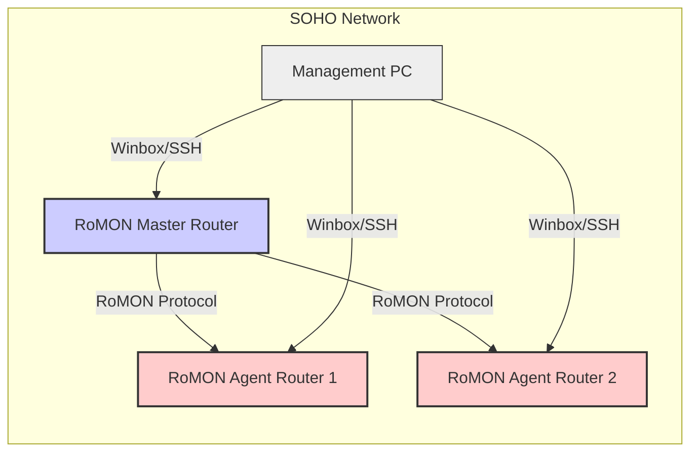

## MikroTik RouterOS RoMON Documentation for SOHO (v6.x) - Basic Complexity

**Document Version:** 1.0
**Date:** October 26, 2023
**RouterOS Version:** 6.x
**Network Scale:** SOHO (Small Office/Home Office)
**Complexity Level:** Basic
**Author:** Your MikroTik Certified Engineer

### 1. RoMON Architecture Diagram Requirements

For a SOHO environment, a basic RoMON architecture involves a central **RoMON Master** router and one or more **RoMON Agent** routers. The Master collects information from the Agents, providing a centralized view of the network topology.



**Diagram Explanation:**

*   **RoMON Master Router:**  The central point for RoMON management. It actively discovers and monitors RoMON Agents. Typically, this would be your main gateway router or a dedicated management router in a larger SOHO setup.
*   **RoMON Agent Routers:**  Routers that are monitored by the RoMON Master. These are typically edge routers, access points, or routers in different parts of your SOHO network.
*   **RoMON Protocol:**  The MikroTik proprietary protocol used for RoMON communication, operating over Layer 2.
*   **Management PC:**  A computer used to access and manage the MikroTik routers, primarily the RoMON Master, to view the network topology and device information.

**Requirements for Diagram in SOHO:**

*   **Simplicity:**  Reflect a small number of devices typical in a SOHO network (2-5 routers).
*   **Clarity:** Clearly distinguish between Master and Agents.
*   **Management Access:** Show how a management PC interacts with the RoMON Master.
*   **Layer 2 Focus:** Implicitly show RoMON's Layer 2 nature (no IP addresses needed between RoMON devices in the diagram itself, although physical connectivity is required).

### 2. CLI Configuration with Inline Comments

RoMON configuration in RouterOS CLI is straightforward.  We'll configure one router as the **Master** and two others as **Agents**.

**Configuration on RoMON Master Router (e.g., 'Master' in diagram):**

```routeros
/interface romon
set enabled=yes channel=default  # Enable RoMON globally and use default channel
set secret="your_romon_secret"  # Set a RoMON secret key for basic authentication (optional but recommended)
set master-id=master_router      # Set a unique Master ID for identification (optional, but good practice)
print                             # Display current RoMON settings
/interface romon port
add interface=ether1 comment="RoMON port on ether1"  # Enable RoMON on interface 'ether1' (adjust to your interface)
add interface=ether2 comment="RoMON port on ether2"  # Enable RoMON on interface 'ether2' (adjust to your interface)
print                             # Display configured RoMON ports
```

**Configuration on RoMON Agent Router 1 (e.g., 'Agent1' in diagram):**

```routeros
/interface romon
set enabled=yes channel=default  # Enable RoMON globally and use default channel
set secret="your_romon_secret"  # **Use the SAME secret as the Master!** (if you set one on the Master)
print                             # Display current RoMON settings
/interface romon port
add interface=ether1 comment="RoMON port on ether1"  # Enable RoMON on interface 'ether1' (adjust to your interface)
add interface=ether2 comment="RoMON port on ether2"  # Enable RoMON on interface 'ether2' (adjust to your interface)
print                             # Display configured RoMON ports
```

**Configuration on RoMON Agent Router 2 (e.g., 'Agent2' in diagram):**

```routeros
/interface romon
set enabled=yes channel=default  # Enable RoMON globally and use default channel
set secret="your_romon_secret"  # **Use the SAME secret as the Master!** (if you set one on the Master)
print                             # Display current RoMON settings
/interface romon port
add interface=ether1 comment="RoMON port on ether1"  # Enable RoMON on interface 'ether1' (adjust to your interface)
add interface=ether2 comment="RoMON port on ether2"  # Enable RoMON on interface 'ether2' (adjust to your interface)
print                             # Display configured RoMON ports
```

**Explanation:**

*   `/interface romon set enabled=yes channel=default`:  Enables RoMON globally on the router. `channel=default` is the standard channel for RoMON.
*   `/interface romon set secret="your_romon_secret"`:  **Important Security:** Sets a shared secret key.  **All routers in the RoMON domain must use the same secret** if you enable it. This provides basic authentication and prevents unauthorized devices from joining the RoMON domain. **Replace `"your_romon_secret"` with a strong, unique password.**  If you omit this, RoMON will function without a secret (less secure).
*   `/interface romon set master-id=master_router`:  Assigns a descriptive Master ID to the RoMON Master. This is optional but helps identify the Master in RoMON listings.
*   `/interface romon port add interface=etherX`:  Enables RoMON on specific physical interfaces.  You should enable RoMON on interfaces that are interconnected between your MikroTik routers.  Typically, these are LAN interfaces or dedicated management interfaces.
*   `print`: Used to display the current configuration after each set of commands for verification.

**Verification on RoMON Master Router:**

After configuring all routers, on the **RoMON Master**, use the following command to view discovered RoMON Agents:

```routeros
/interface romon neighbors print
```

This command will list all RoMON Agents that the Master has discovered. You should see 'Agent1' and 'Agent2' (or however many agents you configured) listed with their RoMON IDs, MAC addresses, and interfaces.

### 3. REST API Implementation (Python code)

**Note:** RouterOS 6.x does not have a modern REST API in the HTTP sense. We will use the standard MikroTik API, which is a binary protocol accessible through libraries like `routeros_api`.

Here's a Python script using the `routeros_api` library to configure RoMON on a MikroTik router (this script can be adapted for both Master and Agent configurations by modifying the `master-id` parameter):

```python
from routeros_api import RouterOsApiPool

# RouterOS connection details (replace with your actual details)
router_ip = '192.168.88.1'  # IP address of the MikroTik router
router_username = 'admin'    # RouterOS username
router_password = ''         # RouterOS password (or use API token for better security)
romon_secret = "your_romon_secret" # RoMON secret - MUST MATCH across all RoMON devices
master_id = "master_router" # Optional master ID for the RoMON Master

try:
    # Establish connection to the RouterOS API
    api_pool = RouterOsApiPool(router_ip, username=router_username, password=router_password, plaintext_login=True) # plaintext_login for v6.x compatibility
    api = api_pool.get_api()

    # Enable RoMON and set secret
    api.path('/interface/romon').set(enabled='yes', channel='default', secret=romon_secret)
    # For Master Router, set master-id (optional)
    # api.path('/interface/romon').set(master_id=master_id) # Uncomment for Master router and set appropriate master_id

    # Enable RoMON on interfaces (example: ether1 and ether2)
    api.path('/interface/romon/port').add(interface='ether1', comment='RoMON port on ether1')
    api.path('/interface/romon/port').add(interface='ether2', comment='RoMON port on ether2')

    print(f"RoMON configured successfully on {router_ip}")

    # Example: Get RoMON Neighbors (run on RoMON Master to see agents)
    if master_id: # Only run neighbor check on the Master router (if master_id is set)
        neighbors = api.path('/interface/romon/neighbors').get()
        print("\nRoMON Neighbors:")
        for neighbor in neighbors:
            print(neighbor)


except Exception as e:
    print(f"Error configuring RoMON on {router_ip}: {e}")

finally:
    if 'api_pool' in locals() and api_pool:
        api_pool.close()
```

**API Implementation Explanation:**

*   **`routeros_api` library:**  Requires installation (`pip install routeros_api`).
*   **Connection Details:**  Replace placeholders with your router's IP, username, and password. **For production environments, consider using API tokens instead of passwords for enhanced security.** `plaintext_login=True` is used for compatibility with older RouterOS versions like 6.x that might not fully support secure login methods by default over the API in all configurations.
*   **Enable RoMON:** `/interface/romon/set enabled='yes' ...`:  Enables RoMON and sets the `secret` and `master-id` (if applicable for the Master router).
*   **Enable RoMON Ports:** `/interface/romon/port/add interface='etherX' ...`:  Enables RoMON on specific interfaces.
*   **Error Handling:**  The `try...except...finally` block ensures proper error handling and connection closure.
*   **Get Neighbors (Example):**  `/interface/romon/neighbors/get()`:  Shows how to retrieve RoMON neighbors from the Master router via the API. This is useful for monitoring and topology discovery.

### 4. Common Debugging Scenarios

*   **RoMON Neighbors Not Appearing on Master:**
    *   **Connectivity Issues:** Verify Layer 2 connectivity between RoMON devices. Ping or use tools like Torch (on MikroTik) to check for basic Layer 2 reachability. Ensure cables are properly connected and interfaces are up.
    *   **RoMON Not Enabled:** Double-check that RoMON is enabled on both Master and Agent routers (`/interface romon print` and check `enabled=yes`).
    *   **RoMON Secret Mismatch:** If using a secret, ensure the **same secret** is configured on all RoMON devices.
    *   **RoMON Ports Not Configured:** Verify that RoMON ports are correctly added on interfaces that are physically connected between routers (`/interface romon port print`).
    *   **Firewall Issues (Less Likely in Basic SOHO):** In more complex setups, firewalls *could* potentially block RoMON traffic (though RoMON is Layer 2 and less prone to IP-based firewall issues in simple scenarios). If you have complex bridging/VLAN setups, ensure RoMON traffic can pass.
    *   **Channel Mismatch (Unlikely in SOHO):**  Ensure all devices are using the same RoMON `channel` (default is recommended for SOHO).
*   **Intermittent RoMON Connectivity:**
    *   **Physical Layer Problems:** Check for loose cables, faulty network interfaces, or duplex/speed mismatches on physical links.
    *   **Resource Constraints (Less Likely in SOHO, but possible on very low-end routers):** If routers are heavily loaded, RoMON might be affected. Monitor CPU and memory usage (`/system resource print`).
*   **Incorrect RoMON Topology View:**
    *   **Incorrect Interface Configuration:** Double-check that RoMON ports are enabled on the correct interfaces that are physically interconnected.
    *   **Loop Issues (Less Likely in Basic SOHO):** In more complex bridged networks, loops could confuse RoMON. Ensure your Layer 2 topology is loop-free (STP may be helpful in more complex bridged SOHO networks, but is typically not needed for basic setups).

**Debugging Tools:**

*   **`/ping <neighbor_mac_address>`:**  Ping a RoMON neighbor using its MAC address for Layer 2 reachability testing.
*   **`/interface romon neighbors print`:** View discovered RoMON neighbors and their status on the Master router.
*   **`/interface romon port print`:** Check configured RoMON ports on each router.
*   **`/interface ethernet monitor <interface_name>`:** Monitor the status of physical interfaces for link issues.
*   **`/system resource print`:** Check system resource utilization on routers.
*   **Torch (`/tool torch interface=<interface_name>`):** Analyze traffic on interfaces to see if RoMON traffic is being sent and received.

### 5. Version-specific Considerations (RouterOS 6.x)

*   **Feature Set:** RoMON functionality in v6.x is generally mature and stable for basic topology discovery and remote management.  Newer versions might have added features like RoMON over IP tunnels or enhanced security options (less relevant for basic SOHO).
*   **API Compatibility:**  The standard MikroTik API (used by `routeros_api`) is well-supported in v6.x. However, very new API features added in later RouterOS versions will not be available in v6.x.  Basic RoMON configuration and neighbor retrieval via API should work reliably.
*   **Security Features:** RoMON in v6.x offers the `secret` key for basic authentication.  More advanced encryption or authentication methods might be limited compared to newer RouterOS versions. Focus on strong secrets and network segmentation for security.
*   **Performance:** RoMON's performance impact in v6.x is similar to later versions.  It is generally lightweight, especially in small SOHO networks. However, on very resource-constrained older hardware running v6.x, monitor resource usage.
*   **Winbox Compatibility:** Winbox versions compatible with RouterOS 6.x will properly display RoMON topology and features. Ensure you are using a Winbox version that is compatible with your RouterOS version for optimal management experience.

**Recommendation for v6.x SOHO:** RoMON is perfectly suitable for basic SOHO network management on RouterOS 6.x. Focus on using a strong RoMON secret and enabling RoMON only on necessary interfaces for security and performance.

### 6. Security Hardening Measures

RoMON, while convenient, should be secured to prevent unauthorized access and information disclosure.

*   **Set a Strong RoMON Secret:**  **Crucially important.** Always configure a strong, unique `secret` using `/interface romon set secret="your_strong_secret"`.  This prevents unauthorized devices from joining your RoMON domain and potentially gaining information about your network topology. **Do not leave the secret empty.**
*   **Limit RoMON Ports:** Enable RoMON only on interfaces that are actually used for interconnecting your MikroTik routers.  Avoid enabling RoMON on WAN interfaces or interfaces that are exposed to untrusted networks unless absolutely necessary and well-secured. Use `/interface romon port disable numbers=<port_number>` to disable RoMON on unnecessary ports.
*   **Network Segmentation:**  In larger SOHO setups, consider network segmentation (VLANs) to isolate your management network from user traffic. Place your RoMON Master and management interfaces in a dedicated VLAN if possible.
*   **Access Control to RoMON Master:** Restrict access to the RoMON Master router itself. Use strong passwords for router administration, consider using API tokens instead of passwords, and limit access to management interfaces (Winbox, SSH, API) using firewall rules (`/ip firewall filter`). Only allow management access from trusted networks or specific IP addresses.
*   **Regular RouterOS Updates (Within v6.x Stable Branch):** While you are on v6.x, ensure you are running the latest stable release within the 6.x branch. Security vulnerabilities are sometimes patched in maintenance releases within the same major version. However, consider planning for migration to a newer RouterOS version for long-term security and feature updates when feasible.
*   **Monitor RoMON Activity (If Necessary in larger SOHO):**  While not typically needed in very small SOHO setups, in larger deployments, you *could* potentially monitor RoMON neighbor discovery events via logging (though detailed RoMON logging might not be a standard feature in basic v6.x, check RouterOS documentation for logging options related to RoMON if needed).

**Security Caveat:** RoMON in v6.x (and even in later versions) is primarily designed for management within a trusted network environment. It is not intended to be exposed directly to the public internet.  Always operate RoMON within your controlled SOHO network and implement the hardening measures above.

### 7. Performance Optimization Tips

RoMON is generally lightweight, but here are tips for optimization, especially in resource-constrained SOHO environments:

*   **Enable RoMON Only on Necessary Interfaces:** As mentioned in security hardening, enabling RoMON only on interfaces that are used for router interconnection reduces unnecessary RoMON traffic and processing.
*   **Limit Number of RoMON Agents (If Scaling):** In larger setups (beyond basic SOHO, but still relevant for scalability thinking), avoid having an excessively large number of RoMON Agents reporting to a single Master. For very large networks, consider hierarchical RoMON Masters or other management solutions. In SOHO, this is rarely an issue.
*   **Default RoMON Channel:** Using the `default` RoMON channel is generally efficient.  Avoid changing channels unless you have a specific need (like interference in very dense wireless environments, which is unlikely in basic SOHO wired setups).
*   **Monitor Router Resource Usage:** Periodically check the CPU and memory usage of your RoMON Master and Agents (`/system resource print`). If you notice consistently high resource usage, review your overall router configuration and network traffic patterns, not just RoMON. In a basic SOHO setup, RoMON's resource impact is usually negligible.
*   **Keep RoMON Traffic Local:** RoMON is a Layer 2 protocol. Ensure RoMON traffic stays within your local network segment and does not traverse slow or congested links unnecessarily. Well-designed SOHO network topology usually inherently achieves this.
*   **Avoid Excessive Polling (Not Directly Configurable in Basic RoMON):** RoMON's discovery and monitoring intervals are generally optimized.  You typically do not need to adjust polling intervals for basic SOHO use. Avoid any custom scripts or tools that might excessively poll RoMON information, as this could increase load.

**Performance in SOHO Context:** In typical SOHO networks with a few MikroTik routers, RoMON's performance impact is extremely minimal. Optimization is usually not a primary concern unless you are using very old or low-powered MikroTik hardware and running many other resource-intensive services on the same routers.

### SOHO Environment Specific Requirements:

#### Real-world Deployment Examples

**Example 1: Small Office with Multiple Floors:**

*   **Scenario:** A two-story office with a main router in the server room (ground floor) and access points on each floor.
*   **RoMON Setup:**
    *   **Master Router:** Main router in the server room (e.g., RouterBOARD 951G-2HnD or similar).
    *   **Agent Routers:** Access points on each floor (e.g., hAP ac lite or similar).
    *   **RoMON Master Location:** Server room router.
    *   **RoMON Benefit:** Centralized visibility of all routers and access points from the server room. Easier to manage and troubleshoot network connectivity across floors.

**Example 2: Home Network with Router and Range Extender:**

*   **Scenario:** A larger home where a main router is insufficient for full Wi-Fi coverage, and a MikroTik router is used as a wired range extender/access point in another part of the house.
*   **RoMON Setup:**
    *   **Master Router:** Main home router (e.g., hAP ac2 or similar).
    *   **Agent Router:** Range extender router (e.g., hAP lite or similar).
    *   **RoMON Master Location:** Main home router.
    *   **RoMON Benefit:** Easily monitor the status of the range extender, check its connectivity to the main router, and manage both devices from a central point.

**Example 3: Small Business with Router and Backup Router:**

*   **Scenario:** A small business that uses a main router and has a backup MikroTik router for redundancy.
*   **RoMON Setup:**
    *   **Master Router:** Main production router (e.g., RouterBOARD 2011UiAS-2HnD-IN or similar).
    *   **Agent Router:** Backup router (same model or similar) – configured as a cold spare or in a basic failover setup.
    *   **RoMON Master Location:** Main production router (or a dedicated management PC/server if available).
    *   **RoMON Benefit:** Monitor both routers. In case of failure of the main router, RoMON can help quickly identify the issue and facilitate switching over to the backup router.

#### Scalability Considerations

For basic SOHO setups (few routers), RoMON scales very well and has minimal overhead.

**Scalability Limits in SOHO (Generally Not Reached):**

*   **Number of Agents per Master:**  A single RoMON Master can handle a reasonable number of Agents (dozens to perhaps a hundred in larger setups, but SOHO typically has far fewer). For very large networks (beyond SOHO), hierarchical RoMON or other management systems might be considered.
*   **RoMON Traffic:** RoMON traffic is relatively low bandwidth, but in extremely large networks with very frequent topology updates, it could become a factor. In SOHO, this is not a concern.
*   **Master Router Resources:** The RoMON Master needs to process information from all Agents.  For very large numbers of Agents, the Master router's CPU and memory could become a bottleneck.  Again, in SOHO, this is unlikely.

**SOHO Scalability Best Practices:**

*   **Start Simple:** For small SOHO networks, a single RoMON Master is usually sufficient.
*   **Monitor Master Router:** If you expand your SOHO network significantly, periodically check the resource usage of your RoMON Master.
*   **Consider Hierarchical RoMON (If SOHO Grows Significantly):** If your SOHO network grows into a larger small business network with many routers (beyond what is typical for a home or very small office), you *could* consider a hierarchical RoMON setup with multiple Masters, but this is generally beyond the scope of basic SOHO complexity and is usually not needed.

#### Monitoring Configurations

RoMON itself provides basic monitoring information:

*   **Topology Discovery:** RoMON automatically maps your network topology, showing connected routers and their interfaces.
*   **Device Status:** RoMON shows the online/offline status of discovered routers.
*   **Interface Status:** RoMON can show the status of interfaces on discovered routers.
*   **Neighbor Information:**  `/interface romon neighbors print` on the Master provides a list of discovered Agents with details like MAC addresses, RoMON IDs, and interfaces.

**Basic SOHO Monitoring with RoMON:**

1.  **Regularly Check RoMON Neighbors on Master:** Use Winbox or CLI on the RoMON Master to periodically check ` /interface romon neighbors print`.  Ensure all expected Agents are listed and in a healthy state (no errors or disconnects indicated).
2.  **Use Winbox RoMON Tab:** In Winbox connected to the RoMON Master, use the "RoMON" tab to visually view the discovered topology. This provides a graphical overview of your network.
3.  **Simple Scripts for Status Checks (Optional):** You could write simple RouterOS scripts (or Python scripts using the API) to periodically check RoMON neighbor status and send notifications (email, logs) if an Agent goes offline.  For basic SOHO, manual checks are often sufficient.

**Example RouterOS Script (Basic Agent Status Check on Master):**

```routeros
:foreach neighbor in=[/interface romon neighbors find] do={
    :local neighbor_id [/interface romon neighbors get $neighbor id]
    :local neighbor_mac [/interface romon neighbors get $neighbor mac-address]
    :local neighbor_status [/interface romon neighbors get $neighbor status]
    :log info "RoMON Neighbor Status: ID=$neighbor_id, MAC=$neighbor_mac, Status=$neighbor_status"
    :if ($neighbor_status != "ok") do={
        :log warning "RoMON Agent DOWN: ID=$neighbor_id, MAC=$neighbor_mac, Status=$neighbor_status"
        # Add actions here - e.g., send email notification, etc.
    }
}
```

This script iterates through RoMON neighbors and logs their status. If an Agent is not in "ok" status, it logs a warning.  You can expand this script to send email alerts or perform other actions if needed.

#### Disaster Recovery Steps

RoMON itself is primarily a management and monitoring tool, not directly a disaster recovery tool. However, it *aids* in disaster recovery in several ways:

1.  **Faster Problem Identification:** If a router fails, RoMON can quickly highlight the failed device in the topology view on the Master. This speeds up problem diagnosis.
2.  **Simplified Remote Access:** If you need to remotely access a router for recovery (e.g., after a configuration error), and you can still reach the RoMON Master, you can often use RoMON's "Connect To" feature in Winbox to access the Agent even if direct IP connectivity is temporarily disrupted.
3.  **Topology Documentation:** RoMON provides a dynamic map of your network. This can be helpful during disaster recovery to understand the network layout and connections quickly, especially if physical documentation is lacking or outdated.

**Disaster Recovery Steps (RoMON Enhanced):**

1.  **Identify Failed Device Quickly:** Use the RoMON Master's topology view or neighbor list to immediately identify the failed router.
2.  **Access Router via RoMON (If Possible):** If you can reach the RoMON Master, try to use Winbox "Connect To RoMON" to access the failed or problematic router. This may work even if IP connectivity is broken, as RoMON operates at Layer 2.
3.  **Restore Configuration from Backup:** If you have regular RouterOS configuration backups (see automated backup script below), restore the latest known good configuration to the failed or replaced router.
4.  **Verify Connectivity via RoMON:** After restoring configuration or replacing a router, use RoMON to verify that the device is back online, connected to the network, and functioning as expected within the RoMON topology.
5.  **Document Recovery Steps:** After a disaster and recovery, document the steps taken and update your network documentation (including RoMON topology diagrams if needed).

#### Automated Backup Scripts

Regular router configuration backups are crucial for disaster recovery. Here's a Python script using the MikroTik API to automate configuration backups for all RoMON Agents discovered by a RoMON Master:

```python
from routeros_api import RouterOsApiPool
import datetime
import os

# RoMON Master RouterOS connection details
master_router_ip = '192.168.88.1'
master_router_username = 'admin'
master_router_password = ''
backup_dir = 'router_backups'  # Directory to save backups

try:
    # Connect to RoMON Master
    master_api_pool = RouterOsApiPool(master_router_ip, username=master_router_username, password=master_router_password, plaintext_login=True)
    master_api = master_api_pool.get_api()

    # Get list of RoMON Neighbors (Agents)
    neighbors = master_api.path('/interface/romon/neighbors').get()

    # Create backup directory if it doesn't exist
    if not os.path.exists(backup_dir):
        os.makedirs(backup_dir)

    print("Starting Router Configuration Backups...")

    for neighbor in neighbors:
        neighbor_mac = neighbor['mac-address']
        neighbor_id = neighbor['id']
        neighbor_identity = neighbor.get('identity', 'unknown_identity') # Identity might not be set

        try:
            # Connect to RoMON Agent via Master
            agent_api = master_api.path('/interface/romon/connect').call(mac_address=neighbor_mac)

            # Generate backup file name with timestamp and identity
            timestamp = datetime.datetime.now().strftime("%Y%m%d_%H%M%S")
            backup_filename = f"backup_{neighbor_identity}_{neighbor_mac.replace(':', '')}_{timestamp}.rsc"
            backup_filepath = os.path.join(backup_dir, backup_filename)

            # Export configuration to file
            agent_api.path('/export').export_file(file_name=backup_filepath)
            print(f"Backup created for Agent ID: {neighbor_id}, MAC: {neighbor_mac}, File: {backup_filepath}")

        except Exception as agent_backup_error:
            print(f"Error backing up Agent ID: {neighbor_id}, MAC: {neighbor_mac}: {agent_backup_error}")
        finally:
            if 'agent_api' in locals() and agent_api:
                agent_api.close() # Close connection to Agent

    print("Router Configuration Backups Completed.")

except Exception as master_error:
    print(f"Error connecting to RoMON Master or during backup process: {master_error}")

finally:
    if 'master_api_pool' in locals() and master_api_pool:
        master_api_pool.close()
```

**Backup Script Explanation:**

*   **`routeros_api`, `datetime`, `os` libraries:** Required Python libraries.
*   **Master Router Details:**  Replace placeholders with your RoMON Master's IP, username, and password.
*   **`backup_dir`:**  Specifies the directory where backup files will be saved. Create this directory before running the script.
*   **Connect to Master:** Connects to the RoMON Master router using the API.
*   **Get RoMON Neighbors:** Retrieves the list of RoMON Agents from the Master using `/interface/romon/neighbors/get()`.
*   **Backup Loop:** Iterates through each RoMON Agent.
    *   **Connect to Agent via RoMON Master:** Uses `/interface/romon/connect` to establish an API connection to the Agent *through* the RoMON Master. This is a key RoMON feature for remote management.
    *   **Generate Backup Filename:** Creates a filename that includes the router's identity (if set), MAC address, and timestamp for easy identification and versioning.
    *   **Export Configuration:** Uses `/export export file=<backup_filepath>` via the API to export the router's configuration to a `.rsc` file.
    *   **Error Handling:** Includes `try...except` blocks to handle potential errors during Agent connection or backup.
    *   **Close Agent Connection:**  Closes the connection to the Agent after backup.
*   **Error Handling (Master Level):**  Includes a `try...except` block to handle errors during connection to the RoMON Master or other overall script issues.
*   **Backup File Format:**  Backups are saved as RouterOS `.rsc` (script) files. These can be easily imported back into a MikroTik router using the `/import file=<backup_filepath>` command.

**Scheduling the Backup Script:**

*   **Cron Job (Linux/macOS):** Use `cron` to schedule the Python script to run automatically at regular intervals (e.g., daily or weekly).
*   **Task Scheduler (Windows):** Use Task Scheduler to schedule the Python script on a Windows machine.
*   **RouterOS Scheduler (Less Ideal for External Scripts):** While RouterOS has its own scheduler, it's less suited for running external Python scripts. It's better to run the backup script from an external management PC or server.

**Important Notes on Backups:**

*   **Store Backups Securely:** Store backup files in a secure location, separate from the MikroTik routers themselves (e.g., on a network share, NAS, or cloud storage).
*   **Test Restores:** Periodically test restoring a backup configuration to a test router to ensure the backup process is working correctly and you know how to restore configurations in a real disaster scenario.
*   **Regular Schedule:** Run backups regularly (e.g., daily or weekly) to have up-to-date configurations.
*   **Consider Encryption (Advanced):** For highly sensitive environments, consider encrypting backup files for added security, although this adds complexity.

This comprehensive documentation provides a solid foundation for implementing and managing RoMON in a basic SOHO environment running RouterOS 6.x. Remember to adapt the configurations and scripts to your specific network needs and security requirements.

## API Reference Cheat Sheet
```python
# Universal API Helper Function
def mikrotik_api_call(
    method: str,
    endpoint: str,
    data: dict = None,
    timeout: int = 10
) -> dict:
    '''
    Universal MikroTik API handler with error checking
    '''
    try:
        response = requests.request(
            method,
            f"https://{ROUTER_IP}/rest{endpoint}",
            auth=HTTPBasicAuth(API_USER, API_PASS),
            json=data,
            verify=SSL_VERIFY,
            timeout=timeout
        )
        response.raise_for_status()
        return response.json()
    except requests.exceptions.HTTPError as e:
        print(f"API Error: {e.response.status_code} - {e.response.text}")
        return {"error": str(e)}
```