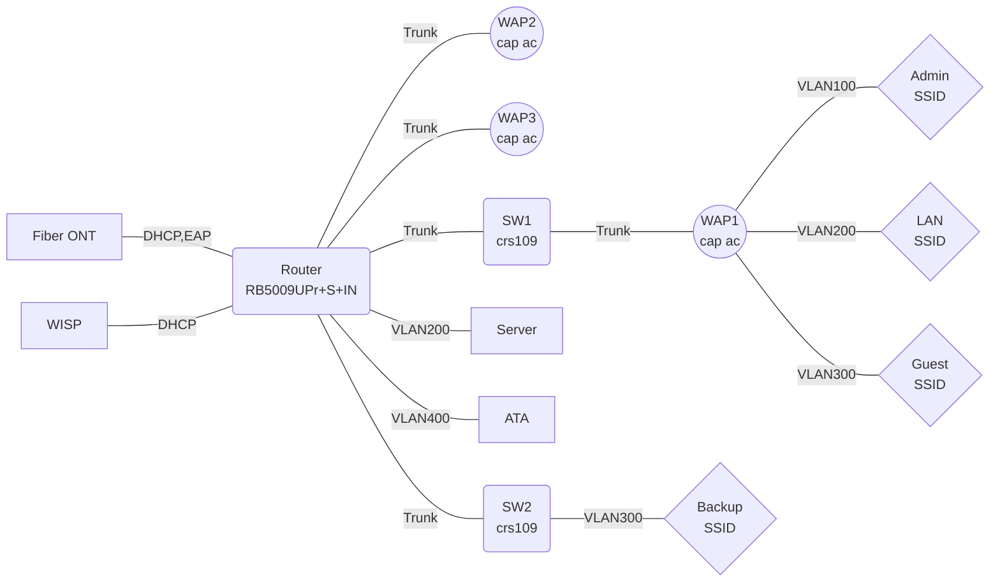

# Repository Information
Name: mikrotik_maxslug

# Directory Structure
Directory structure:
└── github_repos/mikrotik_maxslug/
    │   ├── config
    │   ├── description
    │   ├── HEAD
    │   ├── hooks/
    │   │   ├── applypatch-msg.sample
    │   │   ├── commit-msg.sample
    │   │   ├── fsmonitor-watchman.sample
    │   │   ├── post-update.sample
    │   │   ├── pre-applypatch.sample
    │   │   ├── pre-commit.sample
    │   │   ├── pre-merge-commit.sample
    │   │   ├── pre-push.sample
    │   │   ├── pre-rebase.sample
    │   │   ├── pre-receive.sample
    │   │   ├── prepare-commit-msg.sample
    │   │   ├── push-to-checkout.sample
    │   │   └── update.sample
    │   ├── index
    │   ├── info/
    │   │   └── exclude
    │   ├── logs/
    │   │   ├── HEAD
    │   │   └── refs/
    │   │       ├── heads/
    │   │       │   └── master
    │   │       └── remotes/
    │   │           └── origin/
    │   │               └── HEAD
    │   ├── objects/
    │   │   ├── info/
    │   │   └── pack/
    │   │       ├── pack-cc233f5de6955fad0fa9834831f3930077d61691.idx
    │   │       └── pack-cc233f5de6955fad0fa9834831f3930077d61691.pack
    │   ├── packed-refs
    │   └── refs/
    │       ├── heads/
    │       │   └── master
    │       ├── remotes/
    │       │   └── origin/
    │       │       └── HEAD
    │       └── tags/
    ├── doc/
    │   └── network.mermaid
    ├── LICENSE
    ├── mikro1.rsc
    ├── README.md
    ├── router-os-6/
    │   ├── mikro1.rsc
    │   ├── README.md
    │   ├── sw1.rsc
    │   ├── sw2.rsc
    │   └── wap1.rsc
    ├── sw1.rsc
    ├── sw2.rsc
    ├── wap1.rsc
    ├── wap2.rsc
    └── wap3.rsc


# Content
File: /.git\config
[core]
	repositoryformatversion = 0
	filemode = false
	bare = false
	logallrefupdates = true
	symlinks = false
	ignorecase = true
[remote "origin"]
	url = https://github.com/maxslug/mikrotik_maxslug.git
	fetch = +refs/heads/*:refs/remotes/origin/*
[branch "master"]
	remote = origin
	merge = refs/heads/master


File: /.git\description
Unnamed repository; edit this file 'description' to name the repository.


File: /.git\HEAD
ref: refs/heads/master


File: /.git\hooks\applypatch-msg.sample
#!/bin/sh
#
# An example hook script to check the commit log message taken by
# applypatch from an e-mail message.
#
# The hook should exit with non-zero status after issuing an
# appropriate message if it wants to stop the commit.  The hook is
# allowed to edit the commit message file.
#
# To enable this hook, rename this file to "applypatch-msg".

. git-sh-setup
commitmsg="$(git rev-parse --git-path hooks/commit-msg)"
test -x "$commitmsg" && exec "$commitmsg" ${1+"$@"}
:


File: /.git\hooks\commit-msg.sample
#!/bin/sh
#
# An example hook script to check the commit log message.
# Called by "git commit" with one argument, the name of the file
# that has the commit message.  The hook should exit with non-zero
# status after issuing an appropriate message if it wants to stop the
# commit.  The hook is allowed to edit the commit message file.
#
# To enable this hook, rename this file to "commit-msg".

# Uncomment the below to add a Signed-off-by line to the message.
# Doing this in a hook is a bad idea in general, but the prepare-commit-msg
# hook is more suited to it.
#
# SOB=$(git var GIT_AUTHOR_IDENT | sed -n 's/^\(.*>\).*$/Signed-off-by: \1/p')
# grep -qs "^$SOB" "$1" || echo "$SOB" >> "$1"

# This example catches duplicate Signed-off-by lines.

test "" = "$(grep '^Signed-off-by: ' "$1" |
	 sort | uniq -c | sed -e '/^[ 	]*1[ 	]/d')" || {
	echo >&2 Duplicate Signed-off-by lines.
	exit 1
}


File: /.git\hooks\fsmonitor-watchman.sample
#!/usr/bin/perl

use strict;
use warnings;
use IPC::Open2;

# An example hook script to integrate Watchman
# (https://facebook.github.io/watchman/) with git to speed up detecting
# new and modified files.
#
# The hook is passed a version (currently 2) and last update token
# formatted as a string and outputs to stdout a new update token and
# all files that have been modified since the update token. Paths must
# be relative to the root of the working tree and separated by a single NUL.
#
# To enable this hook, rename this file to "query-watchman" and set
File: /.git\hooks\post-update.sample
#!/bin/sh
#
# An example hook script to prepare a packed repository for use over
# dumb transports.
#
# To enable this hook, rename this file to "post-update".

exec git update-server-info


File: /.git\hooks\pre-applypatch.sample
#!/bin/sh
#
# An example hook script to verify what is about to be committed
# by applypatch from an e-mail message.
#
# The hook should exit with non-zero status after issuing an
# appropriate message if it wants to stop the commit.
#
# To enable this hook, rename this file to "pre-applypatch".

. git-sh-setup
precommit="$(git rev-parse --git-path hooks/pre-commit)"
test -x "$precommit" && exec "$precommit" ${1+"$@"}
:


File: /.git\hooks\pre-commit.sample
#!/bin/sh
#
# An example hook script to verify what is about to be committed.
# Called by "git commit" with no arguments.  The hook should
# exit with non-zero status after issuing an appropriate message if
# it wants to stop the commit.
#
# To enable this hook, rename this file to "pre-commit".

if git rev-parse --verify HEAD >/dev/null 2>&1
then
	against=HEAD
else
	# Initial commit: diff against an empty tree object
	against=$(git hash-object -t tree /dev/null)
fi

# If you want to allow non-ASCII filenames set this variable to true.
allownonascii=$(git config --type=bool hooks.allownonascii)

# Redirect output to stderr.
exec 1>&2

# Cross platform projects tend to avoid non-ASCII filenames; prevent
# them from being added to the repository. We exploit the fact that the
# printable range starts at the space character and ends with tilde.
if [ "$allownonascii" != "true" ] &&
	# Note that the use of brackets around a tr range is ok here, (it's
	# even required, for portability to Solaris 10's /usr/bin/tr), since
	# the square bracket bytes happen to fall in the designated range.
	test $(git diff --cached --name-only --diff-filter=A -z $against |
	  LC_ALL=C tr -d '[ -~]\0' | wc -c) != 0
then
	cat <<\EOF
Error: Attempt to add a non-ASCII file name.

This can cause problems if you want to work with people on other platforms.

To be portable it is advisable to rename the file.

If you know what you are doing you can disable this check using:

  git config hooks.allownonascii true
EOF
	exit 1
fi

# If there are whitespace errors, print the offending file names and fail.
exec git diff-index --check --cached $against --


File: /.git\hooks\pre-merge-commit.sample
#!/bin/sh
#
# An example hook script to verify what is about to be committed.
# Called by "git merge" with no arguments.  The hook should
# exit with non-zero status after issuing an appropriate message to
# stderr if it wants to stop the merge commit.
#
# To enable this hook, rename this file to "pre-merge-commit".

. git-sh-setup
test -x "$GIT_DIR/hooks/pre-commit" &&
        exec "$GIT_DIR/hooks/pre-commit"
:


File: /.git\hooks\pre-push.sample
#!/bin/sh

# An example hook script to verify what is about to be pushed.  Called by "git
# push" after it has checked the remote status, but before anything has been
# pushed.  If this script exits with a non-zero status nothing will be pushed.
#
# This hook is called with the following parameters:
#
# $1 -- Name of the remote to which the push is being done
# $2 -- URL to which the push is being done
#
# If pushing without using a named remote those arguments will be equal.
#
# Information about the commits which are being pushed is supplied as lines to
# the standard input in the form:
#
#   <local ref> <local oid> <remote ref> <remote oid>
#
# This sample shows how to prevent push of commits where the log message starts
# with "WIP" (work in progress).

remote="$1"
url="$2"

zero=$(git hash-object --stdin </dev/null | tr '[0-9a-f]' '0')

while read local_ref local_oid remote_ref remote_oid
do
	if test "$local_oid" = "$zero"
	then
		# Handle delete
		:
	else
		if test "$remote_oid" = "$zero"
		then
			# New branch, examine all commits
			range="$local_oid"
		else
			# Update to existing branch, examine new commits
			range="$remote_oid..$local_oid"
		fi

		# Check for WIP commit
		commit=$(git rev-list -n 1 --grep '^WIP' "$range")
		if test -n "$commit"
		then
			echo >&2 "Found WIP commit in $local_ref, not pushing"
			exit 1
		fi
	fi
done

exit 0


File: /.git\hooks\pre-rebase.sample
#!/bin/sh
#
# Copyright (c) 2006, 2008 Junio C Hamano
#
# The "pre-rebase" hook is run just before "git rebase" starts doing
# its job, and can prevent the command from running by exiting with
# non-zero status.
#
# The hook is called with the following parameters:
#
# $1 -- the upstream the series was forked from.
# $2 -- the branch being rebased (or empty when rebasing the current branch).
#
# This sample shows how to prevent topic branches that are already
# merged to 'next' branch from getting rebased, because allowing it
# would result in rebasing already published history.

publish=next
basebranch="$1"
if test "$#" = 2
then
	topic="refs/heads/$2"
else
	topic=`git symbolic-ref HEAD` ||
	exit 0 ;# we do not interrupt rebasing detached HEAD
fi

case "$topic" in
refs/heads/??/*)
	;;
*)
	exit 0 ;# we do not interrupt others.
	;;
esac

# Now we are dealing with a topic branch being rebased
# on top of master.  Is it OK to rebase it?

# Does the topic really exist?
git show-ref -q "$topic" || {
	echo >&2 "No such branch $topic"
	exit 1
}

# Is topic fully merged to master?
not_in_master=`git rev-list --pretty=oneline ^master "$topic"`
if test -z "$not_in_master"
then
	echo >&2 "$topic is fully merged to master; better remove it."
	exit 1 ;# we could allow it, but there is no point.
fi

# Is topic ever merged to next?  If so you should not be rebasing it.
only_next_1=`git rev-list ^master "^$topic" ${publish} | sort`
only_next_2=`git rev-list ^master           ${publish} | sort`
if test "$only_next_1" = "$only_next_2"
then
	not_in_topic=`git rev-list "^$topic" master`
	if test -z "$not_in_topic"
	then
		echo >&2 "$topic is already up to date with master"
		exit 1 ;# we could allow it, but there is no point.
	else
		exit 0
	fi
else
	not_in_next=`git rev-list --pretty=oneline ^${publish} "$topic"`
	/usr/bin/perl -e '
		my $topic = $ARGV[0];
		my $msg = "* $topic has commits already merged to public branch:\n";
		my (%not_in_next) = map {
			/^([0-9a-f]+) /;
			($1 => 1);
		} split(/\n/, $ARGV[1]);
		for my $elem (map {
				/^([0-9a-f]+) (.*)$/;
				[$1 => $2];
			} split(/\n/, $ARGV[2])) {
			if (!exists $not_in_next{$elem->[0]}) {
				if ($msg) {
					print STDERR $msg;
					undef $msg;
				}
				print STDERR " $elem->[1]\n";
			}
		}
	' "$topic" "$not_in_next" "$not_in_master"
	exit 1
fi

<<\DOC_END

This sample hook safeguards topic branches that have been
published from being rewound.

The workflow assumed here is:

 * Once a topic branch forks from "master", "master" is never
   merged into it again (either directly or indirectly).

 * Once a topic branch is fully cooked and merged into "master",
   it is deleted.  If you need to build on top of it to correct
   earlier mistakes, a new topic branch is created by forking at
   the tip of the "master".  This is not strictly necessary, but
   it makes it easier to keep your history simple.

 * Whenever you need to test or publish your changes to topic
   branches, merge them into "next" branch.

The script, being an example, hardcodes the publish branch name
to be "next", but it is trivial to make it configurable via
$GIT_DIR/config mechanism.

With this workflow, you would want to know:

(1) ... if a topic branch has ever been merged to "next".  Young
    topic branches can have stupid mistakes you would rather
    clean up before publishing, and things that have not been
    merged into other branches can be easily rebased without
    affecting other people.  But once it is published, you would
    not want to rewind it.

(2) ... if a topic branch has been fully merged to "master".
    Then you can delete it.  More importantly, you should not
    build on top of it -- other people may already want to
    change things related to the topic as patches against your
    "master", so if you need further changes, it is better to
    fork the topic (perhaps with the same name) afresh from the
    tip of "master".

Let's look at this example:

		   o---o---o---o---o---o---o---o---o---o "next"
		  /       /           /           /
		 /   a---a---b A     /           /
		/   /               /           /
	       /   /   c---c---c---c B         /
	      /   /   /             \         /
	     /   /   /   b---b C     \       /
	    /   /   /   /             \     /
    ---o---o---o---o---o---o---o---o---o---o---o "master"


A, B and C are topic branches.

 * A has one fix since it was merged up to "next".

 * B has finished.  It has been fully merged up to "master" and "next",
   and is ready to be deleted.

 * C has not merged to "next" at all.

We would want to allow C to be rebased, refuse A, and encourage
B to be deleted.

To compute (1):

	git rev-list ^master ^topic next
	git rev-list ^master        next

	if these match, topic has not merged in next at all.

To compute (2):

	git rev-list master..topic

	if this is empty, it is fully merged to "master".

DOC_END


File: /.git\hooks\pre-receive.sample
#!/bin/sh
#
# An example hook script to make use of push options.
# The example simply echoes all push options that start with 'echoback='
# and rejects all pushes when the "reject" push option is used.
#
# To enable this hook, rename this file to "pre-receive".

if test -n "$GIT_PUSH_OPTION_COUNT"
then
	i=0
	while test "$i" -lt "$GIT_PUSH_OPTION_COUNT"
	do
		eval "value=\$GIT_PUSH_OPTION_$i"
		case "$value" in
		echoback=*)
			echo "echo from the pre-receive-hook: ${value#*=}" >&2
			;;
		reject)
			exit 1
		esac
		i=$((i + 1))
	done
fi


File: /.git\hooks\prepare-commit-msg.sample
#!/bin/sh
#
# An example hook script to prepare the commit log message.
# Called by "git commit" with the name of the file that has the
# commit message, followed by the description of the commit
# message's source.  The hook's purpose is to edit the commit
# message file.  If the hook fails with a non-zero status,
# the commit is aborted.
#
# To enable this hook, rename this file to "prepare-commit-msg".

# This hook includes three examples. The first one removes the
# "# Please enter the commit message..." help message.
#
# The second includes the output of "git diff --name-status -r"
# into the message, just before the "git status" output.  It is
# commented because it doesn't cope with --amend or with squashed
# commits.
#
# The third example adds a Signed-off-by line to the message, that can
# still be edited.  This is rarely a good idea.

COMMIT_MSG_FILE=$1
COMMIT_SOURCE=$2
SHA1=$3

/usr/bin/perl -i.bak -ne 'print unless(m/^. Please enter the commit message/..m/^#$/)' "$COMMIT_MSG_FILE"

# case "$COMMIT_SOURCE,$SHA1" in
#  ,|template,)
#    /usr/bin/perl -i.bak -pe '
#       print "\n" . `git diff --cached --name-status -r`
# 	 if /^#/ && $first++ == 0' "$COMMIT_MSG_FILE" ;;
#  *) ;;
# esac

# SOB=$(git var GIT_COMMITTER_IDENT | sed -n 's/^\(.*>\).*$/Signed-off-by: \1/p')
# git interpret-trailers --in-place --trailer "$SOB" "$COMMIT_MSG_FILE"
# if test -z "$COMMIT_SOURCE"
# then
#   /usr/bin/perl -i.bak -pe 'print "\n" if !$first_line++' "$COMMIT_MSG_FILE"
# fi


File: /.git\hooks\push-to-checkout.sample
#!/bin/sh

# An example hook script to update a checked-out tree on a git push.
#
# This hook is invoked by git-receive-pack(1) when it reacts to git
# push and updates reference(s) in its repository, and when the push
# tries to update the branch that is currently checked out and the
# receive.denyCurrentBranch configuration variable is set to
# updateInstead.
#
# By default, such a push is refused if the working tree and the index
# of the remote repository has any difference from the currently
# checked out commit; when both the working tree and the index match
# the current commit, they are updated to match the newly pushed tip
# of the branch. This hook is to be used to override the default
# behaviour; however the code below reimplements the default behaviour
# as a starting point for convenient modification.
#
# The hook receives the commit with which the tip of the current
# branch is going to be updated:
commit=$1

# It can exit with a non-zero status to refuse the push (when it does
# so, it must not modify the index or the working tree).
die () {
	echo >&2 "$*"
	exit 1
}

# Or it can make any necessary changes to the working tree and to the
# index to bring them to the desired state when the tip of the current
# branch is updated to the new commit, and exit with a zero status.
#
# For example, the hook can simply run git read-tree -u -m HEAD "$1"
# in order to emulate git fetch that is run in the reverse direction
# with git push, as the two-tree form of git read-tree -u -m is
# essentially the same as git switch or git checkout that switches
# branches while keeping the local changes in the working tree that do
# not interfere with the difference between the branches.

# The below is a more-or-less exact translation to shell of the C code
# for the default behaviour for git's push-to-checkout hook defined in
# the push_to_deploy() function in builtin/receive-pack.c.
#
# Note that the hook will be executed from the repository directory,
# not from the working tree, so if you want to perform operations on
# the working tree, you will have to adapt your code accordingly, e.g.
# by adding "cd .." or using relative paths.

if ! git update-index -q --ignore-submodules --refresh
then
	die "Up-to-date check failed"
fi

if ! git diff-files --quiet --ignore-submodules --
then
	die "Working directory has unstaged changes"
fi

# This is a rough translation of:
#
#   head_has_history() ? "HEAD" : EMPTY_TREE_SHA1_HEX
if git cat-file -e HEAD 2>/dev/null
then
	head=HEAD
else
	head=$(git hash-object -t tree --stdin </dev/null)
fi

if ! git diff-index --quiet --cached --ignore-submodules $head --
then
	die "Working directory has staged changes"
fi

if ! git read-tree -u -m "$commit"
then
	die "Could not update working tree to new HEAD"
fi


File: /.git\hooks\update.sample
#!/bin/sh
#
# An example hook script to block unannotated tags from entering.
# Called by "git receive-pack" with arguments: refname sha1-old sha1-new
#
# To enable this hook, rename this file to "update".
#
# Config
# ------
# hooks.allowunannotated
#   This boolean sets whether unannotated tags will be allowed into the
#   repository.  By default they won't be.
# hooks.allowdeletetag
#   This boolean sets whether deleting tags will be allowed in the
#   repository.  By default they won't be.
# hooks.allowmodifytag
#   This boolean sets whether a tag may be modified after creation. By default
#   it won't be.
# hooks.allowdeletebranch
#   This boolean sets whether deleting branches will be allowed in the
#   repository.  By default they won't be.
# hooks.denycreatebranch
#   This boolean sets whether remotely creating branches will be denied
#   in the repository.  By default this is allowed.
#

# --- Command line
refname="$1"
oldrev="$2"
newrev="$3"

# --- Safety check
if [ -z "$GIT_DIR" ]; then
	echo "Don't run this script from the command line." >&2
	echo " (if you want, you could supply GIT_DIR then run" >&2
	echo "  $0 <ref> <oldrev> <newrev>)" >&2
	exit 1
fi

if [ -z "$refname" -o -z "$oldrev" -o -z "$newrev" ]; then
	echo "usage: $0 <ref> <oldrev> <newrev>" >&2
	exit 1
fi

# --- Config
allowunannotated=$(git config --type=bool hooks.allowunannotated)
allowdeletebranch=$(git config --type=bool hooks.allowdeletebranch)
denycreatebranch=$(git config --type=bool hooks.denycreatebranch)
allowdeletetag=$(git config --type=bool hooks.allowdeletetag)
allowmodifytag=$(git config --type=bool hooks.allowmodifytag)

# check for no description
projectdesc=$(sed -e '1q' "$GIT_DIR/description")
case "$projectdesc" in
"Unnamed repository"* | "")
	echo "*** Project description file hasn't been set" >&2
	exit 1
	;;
esac

# --- Check types
# if $newrev is 0000...0000, it's a commit to delete a ref.
zero=$(git hash-object --stdin </dev/null | tr '[0-9a-f]' '0')
if [ "$newrev" = "$zero" ]; then
	newrev_type=delete
else
	newrev_type=$(git cat-file -t $newrev)
fi

case "$refname","$newrev_type" in
	refs/tags/*,commit)
		# un-annotated tag
		short_refname=${refname##refs/tags/}
		if [ "$allowunannotated" != "true" ]; then
			echo "*** The un-annotated tag, $short_refname, is not allowed in this repository" >&2
			echo "*** Use 'git tag [ -a | -s ]' for tags you want to propagate." >&2
			exit 1
		fi
		;;
	refs/tags/*,delete)
		# delete tag
		if [ "$allowdeletetag" != "true" ]; then
			echo "*** Deleting a tag is not allowed in this repository" >&2
			exit 1
		fi
		;;
	refs/tags/*,tag)
		# annotated tag
		if [ "$allowmodifytag" != "true" ] && git rev-parse $refname > /dev/null 2>&1
		then
			echo "*** Tag '$refname' already exists." >&2
			echo "*** Modifying a tag is not allowed in this repository." >&2
			exit 1
		fi
		;;
	refs/heads/*,commit)
		# branch
		if [ "$oldrev" = "$zero" -a "$denycreatebranch" = "true" ]; then
			echo "*** Creating a branch is not allowed in this repository" >&2
			exit 1
		fi
		;;
	refs/heads/*,delete)
		# delete branch
		if [ "$allowdeletebranch" != "true" ]; then
			echo "*** Deleting a branch is not allowed in this repository" >&2
			exit 1
		fi
		;;
	refs/remotes/*,commit)
		# tracking branch
		;;
	refs/remotes/*,delete)
		# delete tracking branch
		if [ "$allowdeletebranch" != "true" ]; then
			echo "*** Deleting a tracking branch is not allowed in this repository" >&2
			exit 1
		fi
		;;
	*)
		# Anything else (is there anything else?)
		echo "*** Update hook: unknown type of update to ref $refname of type $newrev_type" >&2
		exit 1
		;;
esac

# --- Finished
exit 0


File: /.git\info\exclude
File: /.git\logs\HEAD
0000000000000000000000000000000000000000 54c8bb2fe1ed2b809401a3db9720ea333d80c34d vivek-dodia <vivek.dodia@icloud.com> 1738605807 -0500	clone: from https://github.com/maxslug/mikrotik_maxslug.git


File: /.git\logs\refs\heads\master
0000000000000000000000000000000000000000 54c8bb2fe1ed2b809401a3db9720ea333d80c34d vivek-dodia <vivek.dodia@icloud.com> 1738605807 -0500	clone: from https://github.com/maxslug/mikrotik_maxslug.git


File: /.git\logs\refs\remotes\origin\HEAD
0000000000000000000000000000000000000000 54c8bb2fe1ed2b809401a3db9720ea333d80c34d vivek-dodia <vivek.dodia@icloud.com> 1738605807 -0500	clone: from https://github.com/maxslug/mikrotik_maxslug.git


File: /.git\packed-refs
# pack-refs with: peeled fully-peeled sorted 
54c8bb2fe1ed2b809401a3db9720ea333d80c34d refs/remotes/origin/master


File: /.git\refs\heads\master
54c8bb2fe1ed2b809401a3db9720ea333d80c34d


File: /.git\refs\remotes\origin\HEAD
ref: refs/remotes/origin/master


File: /doc\network.mermaid
graph LR
WAN1[Fiber ONT] ---|DHCP,EAP| Router(Router<br />rb4011)
WAN2[WISP] ---|DHCP| Router
Router ---|Trunk| WAP2((WAP2<br />cap ac))
Router ---|Trunk| WAP3((WAP3<br />cap ac))
Router ---|Trunk| SW1(SW1<br />crs109)
Router ---|VLAN200| Server
Router ---|VLAN400| ATA
SW1 ---|Trunk| WAP1((WAP1<br />cap ac))
Router ---|Trunk| SW2(SW2<br />crs109)
SW2 ---|VLAN300| Backup{Backup<br />SSID}
WAP1 ---|VLAN100| Admin{Admin<br />SSID}
WAP1 ---|VLAN200| LAN{LAN<br />SSID}
WAP1 ---|VLAN300| Guest{Guest<br />SSID}


File: /LICENSE
Creative Commons Legal Code

CC0 1.0 Universal

    CREATIVE COMMONS CORPORATION IS NOT A LAW FIRM AND DOES NOT PROVIDE
    LEGAL SERVICES. DISTRIBUTION OF THIS DOCUMENT DOES NOT CREATE AN
    ATTORNEY-CLIENT RELATIONSHIP. CREATIVE COMMONS PROVIDES THIS
    INFORMATION ON AN "AS-IS" BASIS. CREATIVE COMMONS MAKES NO WARRANTIES
    REGARDING THE USE OF THIS DOCUMENT OR THE INFORMATION OR WORKS
    PROVIDED HEREUNDER, AND DISCLAIMS LIABILITY FOR DAMAGES RESULTING FROM
    THE USE OF THIS DOCUMENT OR THE INFORMATION OR WORKS PROVIDED
    HEREUNDER.

Statement of Purpose

The laws of most jurisdictions throughout the world automatically confer
exclusive Copyright and Related Rights (defined below) upon the creator
and subsequent owner(s) (each and all, an "owner") of an original work of
authorship and/or a database (each, a "Work").

Certain owners wish to permanently relinquish those rights to a Work for
the purpose of contributing to a commons of creative, cultural and
scientific works ("Commons") that the public can reliably and without fear
of later claims of infringement build upon, modify, incorporate in other
works, reuse and redistribute as freely as possible in any form whatsoever
and for any purposes, including without limitation commercial purposes.
These owners may contribute to the Commons to promote the ideal of a free
culture and the further production of creative, cultural and scientific
works, or to gain reputation or greater distribution for their Work in
part through the use and efforts of others.

For these and/or other purposes and motivations, and without any
expectation of additional consideration or compensation, the person
associating CC0 with a Work (the "Affirmer"), to the extent that he or she
is an owner of Copyright and Related Rights in the Work, voluntarily
elects to apply CC0 to the Work and publicly distribute the Work under its
terms, with knowledge of his or her Copyright and Related Rights in the
Work and the meaning and intended legal effect of CC0 on those rights.

1. Copyright and Related Rights. A Work made available under CC0 may be
protected by copyright and related or neighboring rights ("Copyright and
Related Rights"). Copyright and Related Rights include, but are not
limited to, the following:

  i. the right to reproduce, adapt, distribute, perform, display,
     communicate, and translate a Work;
 ii. moral rights retained by the original author(s) and/or performer(s);
iii. publicity and privacy rights pertaining to a person's image or
     likeness depicted in a Work;
 iv. rights protecting against unfair competition in regards to a Work,
     subject to the limitations in paragraph 4(a), below;
  v. rights protecting the extraction, dissemination, use and reuse of data
     in a Work;
 vi. database rights (such as those arising under Directive 96/9/EC of the
     European Parliament and of the Council of 11 March 1996 on the legal
     protection of databases, and under any national implementation
     thereof, including any amended or successor version of such
     directive); and
vii. other similar, equivalent or corresponding rights throughout the
     world based on applicable law or treaty, and any national
     implementations thereof.

2. Waiver. To the greatest extent permitted by, but not in contravention
of, applicable law, Affirmer hereby overtly, fully, permanently,
irrevocably and unconditionally waives, abandons, and surrenders all of
Affirmer's Copyright and Related Rights and associated claims and causes
of action, whether now known or unknown (including existing as well as
future claims and causes of action), in the Work (i) in all territories
worldwide, (ii) for the maximum duration provided by applicable law or
treaty (including future time extensions), (iii) in any current or future
medium and for any number of copies, and (iv) for any purpose whatsoever,
including without limitation commercial, advertising or promotional
purposes (the "Waiver"). Affirmer makes the Waiver for the benefit of each
member of the public at large and to the detriment of Affirmer's heirs and
successors, fully intending that such Waiver shall not be subject to
revocation, rescission, cancellation, termination, or any other legal or
equitable action to disrupt the quiet enjoyment of the Work by the public
as contemplated by Affirmer's express Statement of Purpose.

3. Public License Fallback. Should any part of the Waiver for any reason
be judged legally invalid or ineffective under applicable law, then the
Waiver shall be preserved to the maximum extent permitted taking into
account Affirmer's express Statement of Purpose. In addition, to the
extent the Waiver is so judged Affirmer hereby grants to each affected
person a royalty-free, non transferable, non sublicensable, non exclusive,
irrevocable and unconditional license to exercise Affirmer's Copyright and
Related Rights in the Work (i) in all territories worldwide, (ii) for the
maximum duration provided by applicable law or treaty (including future
time extensions), (iii) in any current or future medium and for any number
of copies, and (iv) for any purpose whatsoever, including without
limitation commercial, advertising or promotional purposes (the
"License"). The License shall be deemed effective as of the date CC0 was
applied by Affirmer to the Work. Should any part of the License for any
reason be judged legally invalid or ineffective under applicable law, such
partial invalidity or ineffectiveness shall not invalidate the remainder
of the License, and in such case Affirmer hereby affirms that he or she
will not (i) exercise any of his or her remaining Copyright and Related
Rights in the Work or (ii) assert any associated claims and causes of
action with respect to the Work, in either case contrary to Affirmer's
express Statement of Purpose.

4. Limitations and Disclaimers.

 a. No trademark or patent rights held by Affirmer are waived, abandoned,
    surrendered, licensed or otherwise affected by this document.
 b. Affirmer offers the Work as-is and makes no representations or
    warranties of any kind concerning the Work, express, implied,
    statutory or otherwise, including without limitation warranties of
    title, merchantability, fitness for a particular purpose, non
    infringement, or the absence of latent or other defects, accuracy, or
    the present or absence of errors, whether or not discoverable, all to
    the greatest extent permissible under applicable law.
 c. Affirmer disclaims responsibility for clearing rights of other persons
    that may apply to the Work or any use thereof, including without
    limitation any person's Copyright and Related Rights in the Work.
    Further, Affirmer disclaims responsibility for obtaining any necessary
    consents, permissions or other rights required for any use of the
    Work.
 d. Affirmer understands and acknowledges that Creative Commons is not a
    party to this document and has no duty or obligation with respect to
    this CC0 or use of the Work.


File: /mikro1.rsc
###############################################################################
#
# mikro1 configuration
#  model = RB5009UPr+S+IN
#  RouterOS 7.15beta8
#  software id = 4CKA-22DL
#
# VLAN  IP                Usage
# -----------------------------------------
#  100  192.168.100.0/24  Base / Management
#  200  192.168.120.0/24  Server LAN
#  300  192.168.130.0/24  Laptops, Printers, IoT/House
#  400  192.168.140.0/24  VOIP
#  500  192.168.150.0/24  Neighbor
#
# Port VLANS            Usage
# -----------------------------------------
#  1    -               WAN1 - Fiber Provider (req EAP auth)
#  2    100,200,300     wap2
#  3    100,200,300     sw2
#  4    400             ATA
#  5    200             server
#  6    100,200,300     wap3
#  7    100,200,300,500 sw1
#  8    100             Admin
# SFP   100             Disabled
#
###############################################################################
/system identity set name=mikro1

#######################################
# Global Secrets (template)
#######################################

# Fiber EAP Authentication
# :global ATTPORT "ether1"
# :global ATTMAC "xx:xx:xx:xx:xx:xx"
# :global ATTCA "CA_*.pem"
# :global ATTCLIENT "Client_*.pem"
# :global ATTKEY "PrivateKey_PKCS1_*.pem"
# Assign WiFi SSID and Password here
# :global SSIDMAIN "main"
# :global SSIDGUEST "guest"
# :global WPA2MAIN "password"
# :global WPA2GUEST "password"
# :global SERVERIP "192.168.120.2/32"
# :global PRINTERIP "192.168.120.3/32"

# Commented out settings - Legacy from RouterOS 6.x setup
# :global WPA2ADMIN "password"
# :global SSIDADMIN "admin"
# MAC of device from default config.  Certificates use the same MAC (all caps) but no ':'s
# :global CAPSCERTCA "CAPsMAN-CA-xxxxxxxxxxxx.crt"
# :global CAPSCERT "CAPsMAN-xxxxxxxxxxxx.crt"
# Assign WiFi channels here
# :global WAP12G  "CHx"
# :global WAP22G  "CHx"
# :global WAP32G  "CHxx"
# :global WAP15G  "CHxx"
# :global WAP25G  "CHxxx"
# :global WAP35G  "CHxx"
# :global WAP1RADIO2G "xx:xx:xx:xx:xx:xx"
# :global WAP1RADIO5G "xx:xx:xx:xx:xx:xx"
# :global WAP2RADIO2G "xx:xx:xx:xx:xx:xx"
# :global WAP2RADIO5G "xx:xx:xx:xx:xx:xx"
# :global WAP3RADIO2G "xx:xx:xx:xx:xx:xx"
# :global WAP3RADIO5G "xx:xx:xx:xx:xx:xx"
# :global TXPWR2G "9"
# :global TXPWR5G "17"

#######################################
# Date and Time
# !!! NOTE: Set the date and time below before configuring
#           This is required for EAP to be succesful so you can to the NTP server
#           it's a chicken-n-egg problem.
#           Alternately, use an NTP server on your LAN
#######################################
/system clock set time-zone-name=America/Los_Angeles
/system clock set time="22:00:00"
/system clock set date="mar/30/2024"
/system ntp client set enabled=yes servers=time.cloudflare.com

/log warning "Checkpoint 1"

# AT&T EAP Authentication
/certificate import file-name=$ATTCA passphrase=""
/certificate import file-name=$ATTCLIENT passphrase=""
/certificate import file-name=$ATTKEY passphrase=""
/interface ethernet set [ find default-name=$ATTPORT ] mac-address=$ATTMAC \
  comment="MAC is set to the AT&T Residential Gateway, to match EAP authentication"
/interface dot1x client add certificate=$ATTCLIENT eap-methods=eap-tls \
  identity=$ATTMAC anon-identity=$ATTMAC interface=$ATTPORT

/log warning "Checkpoint 2"
#######################################
# Bridge
#######################################
/interface bridge add name=BR1 protocol-mode=none vlan-filtering=no comment="Disable VLANs while we configure"
/interface bridge add ingress-filtering=no name=BR_ATT protocol-mode=none vlan-filtering=yes comment="AT&T Fiber Port Bridge"

# Ingress
/interface bridge port
add bridge=BR_ATT interface=ether1                                                                           ingress-filtering=no  comment="fiber"
add bridge=BR1    interface=ether2           trusted=yes frame-types=admit-only-vlan-tagged                  ingress-filtering=yes comment="wap2"
add bridge=BR1    interface=ether3           trusted=yes frame-types=admit-only-vlan-tagged                  ingress-filtering=yes comment="sw2"
add bridge=BR1    interface=ether4  pvid=400             frame-types=admit-only-untagged-and-priority-tagged ingress-filtering=yes comment="ata"
add bridge=BR1    interface=ether5  pvid=200             frame-types=admit-only-untagged-and-priority-tagged ingress-filtering=yes comment="server"
add bridge=BR1    interface=ether6           trusted=yes frame-types=admit-only-vlan-tagged                  ingress-filtering=yes comment="wap3"
add bridge=BR1    interface=ether7           trusted=yes frame-types=admit-only-vlan-tagged                  ingress-filtering=yes comment="sw1"
add bridge=BR1    interface=ether8  pvid=100             frame-types=admit-only-untagged-and-priority-tagged ingress-filtering=yes comment="Admin"
#add bridge=BR1 interface=sfp-sfpplus1 pvid=100    frame-types=admit-only-untagged-and-priority-tagged ingress-filtering=yes comment="Admin"

# Egress
/interface bridge vlan
add bridge=BR1 tagged=BR1,ether2,ether3,ether6,ether7 vlan-ids=100
add bridge=BR1 tagged=BR1,ether2,ether3,ether6,ether7 vlan-ids=200
add bridge=BR1 tagged=BR1,ether2,ether3,ether6,ether7 vlan-ids=300
add bridge=BR1 tagged=BR1                             vlan-ids=400
add bridge=BR1 tagged=BR1,ether7                      vlan-ids=500

/log warning "Checkpoint 3"
#######################################
# IP Addressing & Routing
#   The script will auto-add and remove to the WAN_IPS address list for hairpin NAT support
#     ... this allows using a router's FQDN from internal and external
#######################################
/ip firewall connection tracking set udp-timeout=10s
/ip firewall address-list add comment="wan1" disabled=yes list=WAN_IPS
/ip dhcp-client add disabled=no interface=BR_ATT default-route-distance=1 comment="WAN1 IP" \
  script=":if (\$bound=1) do={ \
    /ip firewall address-list set [/ip firewall address-list find where comment=\"wan1\" && list=WAN_IPS] address=\$\"lease-address\" disabled=no; \
  } else={ \
    /ip firewall address-list set [/ip firewall address-list find where comment=\"wan1\" && list=WAN_IPS] disabled=yes; \
  }"

# For mutiple ISPs and auto fail-over:
#   Setting the route distance allows for auto-failover
#
# /ip firewall address-list add comment="wan2" disabled=yes list=WAN_IPS
# /ip dhcp-client add disabled=no interface=ether2 default-route-distance=2 comment="WAN2 IP" \
#   script=":if (\$bound=1) do={ \
#     /ip firewall address-list set [/ip firewall address-list find where comment=\"wan2\" && list=WAN_IPS] address=\$\"lease-address\" disabled=no; \
#   } else={ \
#     /ip firewall address-list set [/ip firewall address-list find where comment=\"wan2\" && list=WAN_IPS] disabled=yes; \
#   }"

/interface vlan add interface=BR1 name=VLAN_100 vlan-id=100
/interface vlan add interface=BR1 name=VLAN_200 vlan-id=200
/interface vlan add interface=BR1 name=VLAN_300 vlan-id=300
/interface vlan add interface=BR1 name=VLAN_400 vlan-id=400
/interface vlan add interface=BR1 name=VLAN_500 vlan-id=500

/ip address add interface=VLAN_100 address=192.168.100.1/24
/ip address add interface=VLAN_200 address=192.168.120.1/24
/ip address add interface=VLAN_300 address=192.168.130.1/24
/ip address add interface=VLAN_400 address=192.168.140.1/24
/ip address add interface=VLAN_500 address=192.168.150.1/24

/ip pool add name=POOL_100 ranges=192.168.100.40-192.168.100.254
/ip pool add name=POOL_200 ranges=192.168.120.40-192.168.120.254
/ip pool add name=POOL_300 ranges=192.168.130.40-192.168.130.254
/ip pool add name=POOL_400 ranges=192.168.140.40-192.168.140.254
/ip pool add name=POOL_500 ranges=192.168.150.40-192.168.150.254

/ip dhcp-server add address-pool=POOL_100 interface=VLAN_100 name=DHCP_100 disabled=no
/ip dhcp-server add address-pool=POOL_200 interface=VLAN_200 name=DHCP_200 disabled=no
/ip dhcp-server add address-pool=POOL_300 interface=VLAN_300 name=DHCP_300 disabled=no
/ip dhcp-server add address-pool=POOL_400 interface=VLAN_400 name=DHCP_400 disabled=no
/ip dhcp-server add address-pool=POOL_500 interface=VLAN_500 name=DHCP_500 disabled=no

/ip dhcp-server network add address=192.168.100.0/24 dns-server=192.168.100.1 gateway=192.168.100.1
/ip dhcp-server network add address=192.168.120.0/24 dns-server=192.168.100.1 gateway=192.168.120.1
/ip dhcp-server network add address=192.168.130.0/24 dns-server=192.168.100.1 gateway=192.168.130.1
/ip dhcp-server network add address=192.168.140.0/24 dns-server=192.168.100.1 gateway=192.168.140.1
/ip dhcp-server network add address=192.168.150.0/24 dns-server=192.168.100.1 gateway=192.168.150.1

# DHCP Debug:
#/system/logging/add topics=dhcp
#/system/logging/remove [find topics~"dhcp" action=memory]

# Use Google DNS (when DoH not ready)
/ip dns set servers=8.8.8.8,8.8.4.4
/ip dns static
add address=8.8.8.8 name=dns.google
add address=8.8.4.4 name=dns.google

/log warning "Checkpoint 4"
###############################################################################
# Firewall
###############################################################################
/interface list add name=WAN
/interface list add name=VLAN
/interface list add name=BASE

/interface list member
add interface=BR_ATT   list=WAN
add interface=VLAN_100 list=BASE
add interface=VLAN_200 list=VLAN
add interface=VLAN_300 list=VLAN
add interface=VLAN_400 list=VLAN
add interface=VLAN_500 list=VLAN
#add interface=BR_ISP2 list=WAN

# Remove this for PPTP, or Load-Balancing issues
/ip settings set rp-filter=strict

/ip firewall filter
# input services the local router only at all the .1 addresses
add chain=input   action=accept               connection-state=established,related,untracked
add chain=input   action=drop                 connection-state=invalid
add chain=input   action=accept               protocol=icmp
add chain=input   action=accept               dst-address=127.0.0.1 comment="accept to local loopback (for CAPsMAN)" 
add chain=input   action=accept               dst-port=53 in-interface-list=VLAN protocol=udp
add chain=input   action=accept               dst-port=53 in-interface-list=VLAN protocol=tcp
add chain=input   action=accept               in-interface-list=BASE comment="Allow Management Vlan Full Access"
add chain=input   action=drop
#add chain=input   action=drop                 in-interface-list=!LAN comment="drop all not coming from LAN" 

# forward services the NAT / Routing
add chain=forward action=accept               ipsec-policy=in,ipsec
add chain=forward action=accept               ipsec-policy=out,ipsec
add chain=forward action=fasttrack-connection connection-state=established,related hw-offload=yes
add chain=forward action=accept               connection-state=established,related,untracked
add chain=forward action=drop                 connection-state=invalid
add chain=forward action=accept               connection-state=new in-interface-list=VLAN out-interface-list=WAN
add chain=forward action=accept               connection-state=new in-interface-list=BASE out-interface-list=WAN
add chain=forward action=accept dst-address=$SERVERIP in-interface-list=BASE comment="full server access from admin"
add chain=forward action=accept protocol=tcp dst-address=$SERVERIP in-interface=VLAN_500 dst-port=8234,32400 comment="plex server - guest vlan"
add chain=forward action=accept protocol=tcp dst-address=$SERVERIP in-interface=VLAN_300 dst-port=8234,32400 comment="plex server - neighbor vlan"
add chain=forward action=accept protocol=udp dst-address=$SERVERIP in-interface=VLAN_300 dst-port=1900,5353,32410-32414 comment="plex server - guest vlan"
add chain=forward action=accept protocol=udp dst-address=$SERVERIP in-interface=VLAN_500 dst-port=1900,5353,32410-32414 comment="plex server - neighbor vlan"
add chain=forward action=accept protocol=tcp dst-address=$SERVERIP in-interface=VLAN_300 dst-port=443 comment="https server - guest vlan"
add chain=forward action=accept protocol=tcp dst-address=$SERVERIP in-interface=VLAN_500 dst-port=443 comment="https server - neighbor vlan"
add chain=forward action=accept protocol=tcp dst-address=$SERVERIP in-interface=VLAN_300 dst-port=25565 comment="Minecraft Java server to Guest VLAN"
add chain=forward action=accept protocol=udp dst-address=$SERVERIP in-interface=VLAN_300 dst-port=19132 comment="Minecraft Bedrock server to Guest VLAN"
add chain=forward action=accept protocol=tcp dst-address=$PRINTERIP in-interface=VLAN_200 dst-port=443,515,631,9100,9400,9500,9501,65001,65002,65003,65004 comment="printer - main vlan TCP"
add chain=forward action=accept protocol=udp dst-address=$PRINTERIP in-interface=VLAN_200 dst-port=5353,9200,9300,9301,9302,3702 comment="printer - main vlan UDP"
add chain=forward action=accept protocol=tcp dst-address=$PRINTERIP in-interface=VLAN_300 dst-port=443,515,631,9100,9400,9500,9501,65001,65002,65003,65004 comment="printer - guest vlan TCP"
add chain=forward action=accept protocol=udp dst-address=$PRINTERIP in-interface=VLAN_300 dst-port=5353,9200,9300,9301,9302,3702 comment="printer - guest vlan UDP"
add chain=forward action=drop   dst-address=$PRINTERIP comment="Disable all other ports on printer"
add chain=forward action=accept connection-nat-state=dstnat comment="For port forwarding to VLANs"
add chain=forward action=drop
#add chain=forward action=drop                 connection-nat-state=!dstnat connection-state=new in-interface-list=WAN comment="drop all from WAN not DSTNATed" 

# Note that the port forwarding uses an address list not an interface list
#  this has a subtle effect of allowing a dynamic list which you need for a hairpin NAT
/ip firewall nat
add chain=srcnat  action=masquerade src-address=192.168.120.0/24 dst-address=192.168.120.0/24 comment="Hairpin NAT"
add chain=srcnat  action=masquerade ipsec-policy=out,none out-interface-list=WAN
add chain=dstnat  action=dst-nat to-addresses=$SERVERIP to-ports=80 protocol=tcp dst-address-list=WAN_IPS dst-port=80 comment="port forward http to server"
add chain=dstnat  action=dst-nat to-addresses=$SERVERIP to-ports=443 protocol=tcp dst-address-list=WAN_IPS dst-port=443 comment="port forward https to server"
add chain=dstnat  action=dst-nat to-addresses=$SERVERIP to-ports=22 protocol=tcp dst-address-list=WAN_IPS dst-port=2222 comment="port forward SSH to server"
add chain=dstnat  action=dst-nat to-addresses=$SERVERIP to-ports=32400 protocol=tcp dst-address-list=WAN_IPS dst-port=32400 comment="port forward plex to server"
add chain=dstnat  action=dst-nat to-addresses=$SERVERIP to-ports=25565 protocol=tcp dst-address-list=WAN_IPS dst-port=25565 comment="port forward minecraft java to server"
add chain=dstnat  action=dst-nat to-addresses=$SERVERIP to-ports=19132 protocol=udp dst-address-list=WAN_IPS dst-port=19132 comment="port forward minecraft bedrock to server"

/ipv6 settings set disable-ipv6=yes max-neighbor-entries=8192

# /ipv6 firewall address-list
# add address=::/128 comment="unspecified address" list=bad_ipv6
# add address=::1/128 comment="lo" list=bad_ipv6
# add address=fec0::/10 comment="site-local" list=bad_ipv6
# add address=::ffff:0.0.0.0/96 comment="ipv4-mapped" list=bad_ipv6
# add address=::/96 comment="ipv4 compat" list=bad_ipv6
# add address=100::/64 comment="discard only " list=bad_ipv6
# add address=2001:db8::/32 comment="documentation" list=bad_ipv6
# add address=2001:10::/28 comment="ORCHID" list=bad_ipv6
# add address=3ffe::/16 comment="6bone" list=bad_ipv6

# /ipv6 firewall filter
# add action=accept chain=input comment="accept established,related,untracked" connection-state=established,related,untracked
# add action=drop chain=input comment="drop invalid" connection-state=invalid
# add action=accept chain=input comment="accept ICMPv6" protocol=icmpv6
# add action=accept chain=input comment="accept UDP traceroute" port=33434-33534 protocol=udp
# add action=accept chain=input comment="accept DHCPv6-Client prefix delegation." dst-port=546 protocol=udp src-address=fe80::/10
# add action=accept chain=input comment="accept IKE" dst-port=500,4500 protocol=udp
# add action=accept chain=input comment="accept ipsec AH" protocol=ipsec-ah
# add action=accept chain=input comment="accept ipsec ESP" protocol=ipsec-esp
# add action=accept chain=input comment="accept all that matches ipsec policy" ipsec-policy=in,ipsec
# add action=drop chain=input comment="drop everything else not coming from LAN" in-interface-list=!LAN
# add action=accept chain=forward comment="accept established,related,untracked" connection-state=established,related,untracked
# add action=drop chain=forward comment="drop invalid" connection-state=invalid
# add action=drop chain=forward comment="drop packets with bad src ipv6" src-address-list=bad_ipv6
# add action=drop chain=forward comment="drop packets with bad dst ipv6" dst-address-list=bad_ipv6
# add action=drop chain=forward comment="rfc4890 drop hop-limit=1" hop-limit=equal:1 protocol=icmpv6
# add action=accept chain=forward comment="accept ICMPv6" protocol=icmpv6
# add action=accept chain=forward comment="accept HIP" protocol=139
# add action=accept chain=forward comment="accept IKE" dst-port=500,4500 protocol=udp
# add action=accept chain=forward comment="accept ipsec AH" protocol=ipsec-ah
# add action=accept chain=forward comment="accept ipsec ESP" protocol=ipsec-esp
# add action=accept chain=forward comment="accept all that matches ipsec policy" ipsec-policy=in,ipsec
# add action=drop chain=forward comment="drop everything else not coming from LAN" in-interface-list=!LAN

# For Auto-failover of WANs:
#/routing filter
#add action=passthrough chain=dynamic-in disabled=no set-check-gateway=ping comment="Failover ping check"

/log warning "Checkpoint 5"
#######################################
# Configuration Services / Router Security
#######################################
/user group set full policy="local,telnet,ssh,ftp,reboot,read,write,policy,test,winbox,password,web,sniff,sensitive,api,romon"
/ip neighbor discovery-settings set discover-interface-list=BASE
/ip service disable telnet,ftp,www,api,api-ssl

# Lock down some services on the router
/tool mac-server mac-winbox set allowed-interface-list=BASE
/tool mac-server set allowed-interface-list=BASE
/tool bandwidth-server set enabled=no
/ip proxy set enabled=no
/ip socks set enabled=no
/ip upnp set enabled=no
/ip cloud set ddns-enabled=no update-time=no
/ip ssh set strong-crypto=yes
/ip smb users set [ find default=yes ] disabled=yes
#/ip smb shares set [ find default=yes ] directory=/pub
/system note set show-at-login=no

/log warning "Checkpoint 6"
#######################################
# WiFi / CapsMAN
#######################################
/interface wifi security
add authentication-types=wpa2-psk,wpa3-psk ft=yes ft-over-ds=yes name=SEC_MAIN  passphrase=$WPA2MAIN
add authentication-types=wpa2-psk,wpa3-psk ft=yes ft-over-ds=yes name=SEC_GUEST passphrase=$WPA2GUEST
#add authentication-types=wpa2-psk,wpa3-psk ft=yes ft-over-ds=yes name=SEC_ADMIN passphrase=$WPA2ADMIN

/interface wifi capsman set enabled=yes interfaces=VLAN_100 \
  upgrade-policy=suggest-same-version package-path=/upgrade \
  certificate=auto ca-certificate=auto

/interface wifi datapath add bridge=BR1 name=DP_WIFI_GUEST client-isolation=yes
# client-isolation breaks Chromecast Audio devices, so disabled
/interface wifi datapath add bridge=BR1 name=DP_WIFI_MAIN  client-isolation=no

# Configurations
#   1 per (ssid/vlan, 2g channel, 5g) = 3 AP * 3 SSIDs * 2 Radios = 18 configs, assuming no overlapping channels
#
# Transmit Power Tuning to kludge host steering to 5G
#  1. 2G should be at least 7dB lower than 5G to account for frequency
#  2. Set the Max transmit power to match your clients (15-17dB) otherwise the AP is advertising to hosts it can't service
#  3. Lower all the settings if you have dense coverage or low interference
#add datapath=DP_AC name=CONF_GUEST_2G security=SEC_GUEST ssid=$SSIDGUEST country="United States" tx-power=$TXPWR2G
#add datapath=DP_AC name=CONF_MAIN_2G  security=SEC_MAIN  ssid=$SSIDMAIN  country="United States" tx-power=$TXPWR2G
#add datapath=DP_AC name=CONF_GUEST_5G security=SEC_GUEST ssid=$SSIDGUEST country="United States" tx-power=$TXPWR5G
#add datapath=DP_AC name=CONF_MAIN_5G  security=SEC_MAIN  ssid=$SSIDMAIN  country="United States" tx-power=$TXPWR5G
#add datapath=DP_AC name=CONF_ADMIN_2G security=SEC_ADMIN ssid=$SSIDADMIN country="United States" tx-power=$TXPWR2G hide-ssid=yes
#add datapath=DP_AC name=CONF_ADMIN_5G security=SEC_ADMIN ssid=$SSIDADMIN country="United States" tx-power=$TXPWR5G hide-ssid=yes
#
# NOTE: Do not add `manager=capsman` here unless you hate your life. This will come up as the CAP
#       seeing cAPSman and the router not seeing the CAP
/interface wifi configuration
add datapath=DP_WIFI_GUEST name=CONF_GUEST_2G security=SEC_GUEST ssid=$SSIDGUEST country="United States" channel.band=2ghz-n
add datapath=DP_WIFI_MAIN  name=CONF_MAIN_2G  security=SEC_MAIN  ssid=$SSIDMAIN  country="United States" channel.band=2ghz-n
add datapath=DP_WIFI_GUEST name=CONF_GUEST_5G security=SEC_GUEST ssid=$SSIDGUEST country="United States" channel.band=5ghz-ac skip-dfs-channels=10min-cac
add datapath=DP_WIFI_MAIN  name=CONF_MAIN_5G  security=SEC_MAIN  ssid=$SSIDMAIN  country="United States" channel.band=5ghz-ac skip-dfs-channels=10min-cac

/interface wifi provisioning
add action=create-dynamic-enabled master-configuration=CONF_GUEST_5G slave-configurations=CONF_MAIN_5G supported-bands=5ghz-ac
add action=create-dynamic-enabled master-configuration=CONF_GUEST_2G slave-configurations=CONF_MAIN_2G supported-bands=2ghz-n

# Channel Definition - Taken care of by new drivers/RouterOS 7
# Channel Selection - Letting routers auto-pick for now

# TODO(maxslug) is this not available on cAPSMANv2?
# Improve roaming by kicking clients off of weak APs
# /caps-man access-list add action=reject interface=any signal-range=-120..-88

# Check for certificates in Files and load them
# The first time you run, it will use auto, then run /caps-man manager print to get the generated cert names
#   NOTE: if you were to use auto at every /system reset your WAPs will fail due to Bad Handshake
#         And you will need to remove their certs and restart /interface wireless cap on each
# :if ( ([:len [/file find name=($CAPSCERTCA . ".crt")]] > 0) and \
#       ([:len [/file find name=($CAPSCERT . ".crt")]] > 0) ) do={ \
#   :log info message="Loading existing certificates for CaPSMAN"; \
#   :put "Loading existing certificates for CaPSMAN"; \
#   /certificate import file-name=($CAPSCERTCA . ".crt") passphrase=""; \
#   /certificate import file-name=($CAPSCERT . ".crt") passphrase=""; \
#   :delay 3000ms; \
#   /caps-man manager set ca-certificate=$CAPSCERTCA certificate=$CAPSCERT enabled=yes \
#       require-peer-certificate=no upgrade-policy=suggest-same-version; \
#   /caps-man manager print; \
# } else={ \
#   :log warning message="Creating new certificates for CaPSMAN"; \
#   :put "Creating new certificates for CaPSMAN"; \
#   /caps-man manager set ca-certificate=auto certificate=auto enabled=yes \
#       require-peer-certificate=no upgrade-policy=suggest-same-version; \
#   /caps-man manager print; \
#   :delay 10000ms; \
#   /caps-man manager print; \
#   /certificate export-certificate [/caps-man manager get generated-ca-certificate] file-name=$CAPSCERTCA; \
#   /certificate export-certificate [/caps-man manager get generated-certificate]    file-name=$CAPSCERT; \
# }

#######################################
# Turn on VLAN mode
#   Comment out during initial debug to prevent lockouts
#######################################
/interface bridge set BR1 vlan-filtering=yes comment="VLAN Filtering Enabled"

/log warning "Checkpoint 7"
#######################################
# Secure dns over HTTPS
#######################################
#
# TODO(maxslug) Add netwatch script to turn DoH on and off and grab cert the first time
#
#  NOTE: RouterOS does not failover when the DOH stops working :( Maybe this is fixed by now?
#  Google DOH settings (https://forum.mikrotik.com/viewtopic.php?t=160243#p822014)
#/tool fetch url=https://pki.goog/roots.pem
#/certificate import file-name=roots.pem passphrase=""
#/ip dns set use-doh-server=https://dns.google/dns-query verify-doh-cert=yes
#/ip dns set allow-remote-requests=yes cache-max-ttl=1d use-doh-server=https://dns.google/dns-query verify-doh-cert=yes
/ip dns set allow-remote-requests=yes cache-max-ttl=1d

#Switched from https://cloudflare-dns.com/dns-query due to reliability
#/tool fetch url="https://cacerts.digicert.com/DigiCertGlobalRootCA.crt.pem"
#/certificate import file-name=DigiCertGlobalRootCA.crt.pem passphrase=""
#add address=104.16.248.249 name=cloudflare-dns.com type=A
#add address=104.16.249.249 name=cloudflare-dns.com type=A
#add address=2606:4700:4700::1001 name=ipv6a.cloudflare-dns.com type=AAAA
#add address=2606:4700:4700::1111 name=ipv6b.cloudflare-dns.com type=AAAA

### Script for certificate update
/system script add dont-require-permissions=no name=Certificate_Google \
  policy=ftp,reboot,read,write,policy,test,password,sniff,sensitive,romon \
  source="/tool fetch url=https://pki.goog/roots.pem\r\n/certificate import file-name=roots.pem passphrase=\"\""

### Schedule to update google certificate once a week
/system scheduler add comment="Google Certificate Update" interval=1w \
  policy=ftp,reboot,read,write,policy,test,password,sniff,sensitive,romon \
  name=Certificate_Google_Update on-event=Certificate_Google \
  start-date=mar/01/2024 start-time=04:20:00

### Script for DNS cache flush
# /system script add dont-require-permissions=no name=DNS_Flush_Cache \
#   policy=ftp,reboot,read,write,policy,test,password,sniff,sensitive,romon \
#   source="/ip dns cache flush"

### Schedule to flush dns cache everyday
# /system scheduler add comment="DoH Cache Flush" interval=1d \
#   policy=ftp,reboot,read,write,policy,test,password,sniff,sensitive,romon \
#   name="DNS Cache Flush" on-event=DNS_Flush_Cache \
#   start-date=nov/01/2020 start-time=05:00:00

/log warning "Checkpoint 8"
#######################################
# Install and Cleanup
#######################################
# 1. Install latest RouterOS and reboot
# 2. Install latest RouterBoard firmware and reboot
# 3. Upload the other certificates to Files if not already there
# 4. Check date/time if you're having EAP authentication issues
# 5. /system reset-configuration no-defaults=yes keep-users=yes skip-backup=yes run-after-reset=mikro1.rsc


File: /README.md
# maxslug's Mikrotik Networking Configuration Files



This repo is to hold my configuration files for a complex home network based on
Mikrotik networking gear.  Thank you to all the mikrotik forum posters for all
this knowledge and hard work, especially `pcunite`!

To discuss this please join us here : https://forum.mikrotik.com/viewtopic.php?f=13&t=166330

## Design Goals

### WAN

- Dual ISPs with auto-failover
- Complete removal of AT&T router ("residential gateway") from the picture

### L1

- Disaggregation of routing and wifi into separate solutions
- Switched managed Ethernet
- Redundancy
- Power over Ethernet to allow centralized UPS

### L2 / L3

- VLAN separation of Guest, Primary, IOT, Neighbor, and VOIP networks

### Wireless

- Centrally managed access points
- Roaming / Hand-off imrovements
- Higher overlapping coverage at lower radio power rates

### L4+

- Port Forwarding over VLAN
- Secure DNS

## Nework Design

These are notes to go along with the config files

### Inventory

- 1 x Mikrotik RB5009UPr+s+IN router using RouterOS 7.15beta8
- 2 x Mikrotik CRS109-8G-1S-2HnD Router/Switch/APs running RouterOS 7.15beta8
- 3 x Mikrotik cAP AC (RBcAPGi-5acD2nD) using RouterOS 7.15beta8 and wifi-qcom-ac WiFi 5 Wave2 Driver

### VLANs

VLAN  |IP                |Usage
------|------------------|-----------------
 100  |192.168.100.0/24  |Base / Management
 200  |192.168.120.0/24  |Normal LAN / Chromecasts / Printer
 300  |192.168.130.0/24  |Guest / IOT
 400  |192.168.140.0/24  |VOIP
 500  |192.168.150.0/24  |Neighbor

- For each subnet addresses `.1` through `.39` are reserved for static IP assignment. `.1` is the router.
- The WAN ports are not on VLANs
- Once configured, you will need to make a port be on `VLAN 100` to use WinBox.

### Printing

- ZeroConf / mDNS / Apple Bonjour (AirPrint) cannot be forwarded across subnets / VLANs.
  - You will only get to auto-discover the printer from one VLAN, I chose guest where the school tablets will be
- The printer ports for a Lexmark Laser printer are forwarded from the main VLAN to the guest VLAN where the printer is

### Router

- `192.168.100.1`


- The EAP Authentication protocol requires a set system clock. DHCP requires EAP. NTP requies DHCP.  This means you can't set the clock over the internet
because of a chicken-n-egg problem.  Make sure `mikro1.rsc` is modified with the current time before programming it. Or, if you have a local NTP server, use that.
- You will need to coax your authentication keys out of your AT&T gateway so you can run in `supplicant mode`.
- DNS is setup to use DNS over HTTP (DOH) which requires some certificates and hurdles.

### Switches

I was really only interested in an 8-port managed GigE switch, but for the same price these units include a 2G WiFi radio.

- `192.168.100.2`
- `192.168.100.3` (config not included)


- The radio in the switches are not part of CapsMAN
- I create a "backup" SSID out of these that should work if I need to hookup the old router, or if for some other reason CapsMAN fails.
- One of the APs is chained off of `sw1` due to physical topology

### Access Points

- `192.168.100.11` wap1
- `192.168.100.12` wap2
- `192.168.100.13` wap3

Despite what the Mikrotik documentation says, you cannot fully remotely provision these. You will need to create a config file and add it to the AP.
After that, the wireless definitions will be automatic, but not the base config and security!

- `/system reset-configuration run-after-reset=wap.rsc` does not always work. I still had to manually load the file after reset
- Resetting into CAP mode (hold reset button till it gets to it's second mode after blinking) is a better starting point
- Certificates will be auto-provisioned by CapsMAN
- I scripted the mode button so that it will toggle the LEDs between "always on" and "turn off after 1h"

#### 802.11ac Band Planning


Here is a diagram I put together to understand the 802.11ac channel assignment

- DFS is the middle part of the spectral sandwich which requires fancy driver support and regulatory signoff. 
This is now supported with the wifi-qcom-ac drivers.
- 802.11ac requires 80MHz channels, made up of 4 x 20MHz channels
- For any given 80 MHz chunk, there are 4 possible assignments, depending on which one you make the control channel
  - This is what gives you the `Ceee` `eCee` `eeCe` `eeeC` "walking ones" pattern.  I tried to depict this above
  - I only defined the channels that worked for my region
- I use WiFi analyzer (Windows, Android) to do a survey of least-busy bands at each AP physical location


#### cAP AP Wireless Features

cAP (and other Mikrotik Qualcomm-based 802.11ac products) recently (as of 2024) got full support for 
WiFi 5 Wave 2!  YOU ROCK MIKROTIK!  Thanks for improving an existing product instead of just
moving on.  They now support software-based features like MIMO, DFS, Beam Forming,
Handoff Protocols, Spectral Scan etc.  However in order to use these features, and to make them
compatible with 802.1ax devices, you need to run a new driver, and a new capsman.  The new driver
is called `wifi-qcom-ac` and the new capsman is in `/interface wifi capsman` and `/interface wifi`.

One hiccup I did find is that the new CapsMAN does not play nice with the older capAC devices when
it comes to VLANs.  You have to statically config some things, and it's all a bit kludgy.  I could
not get three SSIDs on three VLANs working like I had in RouterOS 6.x.  So instead I removed one and 
settled for two with the work-arounds.

Please see router-os-6/ for scripts using the older driver.

## Software

This install required 3 versions of RouterOS:

- `arm64` - `RB5009` Router. No wireless driver
- `arm` - `capAC` WAP. `wifi-qcom-ac` driver
- `mips` - `crs109`. `wireless` driver

### winbox from MacOS

I like this way of using / installing it better than the suggested:

```
brew tap homebrew/cask-versions
brew install --cask --no-quarantine wine-devel
killall wineserver
wine64 winbox64.exe
```

## References

These are not in any particular order, but all my knowledge came from these, so
Thank You!!

### config

- https://wiki.mikrotik.com/wiki/Manual:Configuration_Management
- https://help.mikrotik.com/docs/display/ROS/First+Time+Configuration

### Security

- https://mum.mikrotik.com/presentations/UK18/presentation_6165_1539151116.pdf

### CAPSman and wifi-qcom-ac - New (802.11ac/.ax)

- https://www.youtube.com/watch?v=37aff6d14Xk
- https://www.youtube.com/watch?v=vkWPlsuyuKE
- https://www.reddit.com/r/mikrotik/comments/18m9nr4/dude_im_barrelled_by_the_wifi_wave_2/
- https://forum.mikrotik.com/viewtopic.php?t=202578
- https://forum.mikrotik.com/viewtopic.php?t=205552
- https://forum.mikrotik.com/viewtopic.php?t=202476
- https://forum.mikrotik.com/viewtopic.php?t=202565

### CAPSman - Old

- https://wiki.mikrotik.com/wiki/Manual:CAPsMAN_with_VLANs
- https://wiki.mikrotik.com/wiki/Manual:Simple_CAPsMAN_setup
- https://forum.mikrotik.com/viewtopic.php?t=152188
- https://wiki.mikrotik.com/wiki/Manual:CAPsMAN_tips
- https://mum.mikrotik.com/presentations/BR14/Uldis.pdf
- https://forum.mikrotik.com/viewtopic.php?t=158379
- https://www.reddit.com/r/mikrotik/comments/cltszm/trouble_getting_vlan_working_on_cap_man/
- https://forum.mikrotik.com/viewtopic.php?t=155429
- https://www.gonscak.sk/?p=575

### Wifi Channel Planning / 802.11ac / CapsMAN


- https://forum.mikrotik.com/viewtopic.php?t=136476
- https://forum.mikrotik.com/viewtopic.php?t=125026
- https://wiki.mikrotik.com/wiki/Manual:Spectral_scan
- https://forum.mikrotik.com/viewtopic.php?t=150463
- https://forum.mikrotik.com/viewtopic.php?f=7&t=149815&p=737784#p737784
- http://www.revolutionwifi.net/revolutionwifi/2013/03/80211ac-channel-planning.html
- https://netbeez.net/blog/dfs-channels-wifi/
- https://en.wikipedia.org/wiki/IEEE_802.11ac
- https://en.wikipedia.org/wiki/List_of_WLAN_channels#5_GHz_or_5.9_GHz_(802.11a/h/j/n/ac/ax)
- http://www.revolutionwifi.net/revolutionwifi/2013/03/safely-using-80-mhz-channels-with.html
- https://systemzone.net/mikrotik-wifi-frequency-band-and-channel-width-explanation/

### band steering

- https://forum.mikrotik.com/viewtopic.php?t=127742
- https://forum.mikrotik.com/viewtopic.php?t=132817
- https://forum.openwrt.org/t/mikrotik-cap-ac-support/57828/28
- https://github.com/openwrt/openwrt/pull/3037

### vlans

- https://forum.mikrotik.com/viewtopic.php?t=143620
- https://forum.mikrotik.com/viewtopic.php?t=155266
- https://forum.mikrotik.com/viewtopic.php?t=163650
- https://forum.mikrotik.com/viewtopic.php?t=160224

### EAP auth

- https://forum.mikrotik.com/viewtopic.php?t=154954

### Bridging

- https://wiki.mikrotik.com/wiki/Manual:Interface/Bridge

### failover / balancing

- https://wiki.mikrotik.com/wiki/Load_Balancing
- https://forum.mikrotik.com/viewtopic.php?t=93222
- https://forum.mikrotik.com/viewtopic.php?f=23&t=157048

### secure DNS

- https://forum.mikrotik.com/viewtopic.php?t=164078
- https://wiki.mikrotik.com/wiki/Manual:IP/DNS#DNS_over_HTTPS

### Printer sharing

- https://forum.mikrotik.com/viewtopic.php?t=110540
- https://forum.mikrotik.com/viewtopic.php?t=145765

### port forwarding

- https://forum.mikrotik.com/viewtopic.php?f=2&t=112861&p=817432#p817432
- https://forum.mikrotik.com/viewtopic.php?t=130022


File: /router-os-6\mikro1.rsc
###############################################################################
#
# mikro1 configuration
#     model = RB4011iGS+
#     Baseline:
#       RouterOS 6.47.3
#       software id = 1EMK-5D1S
#
# VLAN  IP                Usage
# -----------------------------------------
#  100  192.168.100.0/24  Base / Management
#  200  192.168.120.0/24  Normal LAN
#  300  192.168.130.0/24  Guest / IOT
#  400  192.168.140.0/24  VOIP
#  500  192.168.150.0/24  Neighbor
#
# Port VLANS            Usage
# -----------------------------------------
#  1    -               WAN1 - Fiber Provider (req EAP auth)
#  2    -               WAN2 - WISP - TODO:
#  3    300             Printer
#  4    400             ATA
#  5    200             <LAN>
#  6    100,200,300     wap3
#  7    100,200,300     wap2
#  8    200             server
#  9    100,200,300     sw2
# 10    100,200,300,500 sw1
# SFP   100             <admin>
#
###############################################################################
/system identity set name=mikro1

#######################################
# Global Secrets (template)
#######################################
# MAC of device from default config.  Certificates use the same MAC (all caps) but no ':'s
# :global BRIDGEMAC "xx:xx:xx:xx:xx:xx"
# :global CAPSCERTCA "CAPsMAN-CA-xxxxxxxxxxxx.crt"
# :global CAPSCERT "CAPsMAN-xxxxxxxxxxxx.crt"
# Fiber EAP Authentication
# :global ATTPORT "ether1"
# :global ATTMAC "xx:xx:xx:xx:xx:xx"
# :global ATTCA "CA_*.pem"
# :global ATTCLIENT "Client_*.pem"
# :global ATTKEY "PrivateKey_PKCS1_*.pem"
# Assign WiFi SSID and Password here
# :global SSIDMAIN "main"
# :global SSIDADMIN "admin"
# :global SSIDGUEST "guest"
# :global WPA2MAIN "password"
# :global WPA2ADMIN "password"
# :global WPA2GUEST "password"
# Assign WiFi channels here
# :global WAP12G  "CHx"
# :global WAP22G  "CHx"
# :global WAP32G  "CHxx"
# :global WAP15G  "CHxx"
# :global WAP25G  "CHxxx"
# :global WAP35G  "CHxx"
# use `/caps-man radio print` and `/caps-man interface hw-info <capN>` to figure out MAC addresses
# :global WAP1RADIO2G "xx:xx:xx:xx:xx:xx"
# :global WAP1RADIO5G "xx:xx:xx:xx:xx:xx"
# :global WAP2RADIO2G "xx:xx:xx:xx:xx:xx"
# :global WAP2RADIO5G "xx:xx:xx:xx:xx:xx"
# :global WAP3RADIO2G "xx:xx:xx:xx:xx:xx"
# :global WAP3RADIO5G "xx:xx:xx:xx:xx:xx"
# :global TXPWR2G "9"
# :global TXPWR5G "17"

#######################################
# Date and Time
# !!! NOTE: Set the date and time below before configuring
#           This is required for EAP to be succesful so you can to the NTP server
#           it's a chicken-n-egg problem.
#           Alternately, use an NTP server on your LAN
#######################################
/system clock set time-zone-name=America/Los_Angeles
/system clock set time="15:38:00"
/system clock set date="sep/19/2020"
/system ntp client set enabled=yes server-dns-names=time.cloudflare.com


#######################################
# Ethernet Port configuration
#######################################
/interface ethernet switch port
set 0 default-vlan-id=0
set 1 default-vlan-id=0
set 2 default-vlan-id=0
set 3 default-vlan-id=0
set 4 default-vlan-id=0
set 5 default-vlan-id=0
set 6 default-vlan-id=0
set 7 default-vlan-id=0
set 8 default-vlan-id=0
set 9 default-vlan-id=0
set 10 default-vlan-id=0
set 11 default-vlan-id=0

# AT&T EAP Authentication
/certificate import file-name=$ATTCA passphrase=""
/certificate import file-name=$ATTCLIENT passphrase=""
/certificate import file-name=$ATTKEY passphrase=""
/interface ethernet set [ find default-name=$ATTPORT ] mac-address=$ATTMAC \
  comment="MAC is set to the AT&T Residential Gateway, to match EAP authentication"
/interface wireless security-profiles set [ find default=yes ] supplicant-identity=MikroTik
/interface dot1x client add certificate=$ATTCLIENT eap-methods=eap-tls identity=$ATTMAC interface=$ATTPORT

#######################################
# Bridge
#######################################
/interface bridge add admin-mac=$BRIDGEMAC auto-mac=no name=BR1 protocol-mode=none vlan-filtering=no \
  comment="create one bridge, set VLAN mode off while we configure"

# Ingress
/interface bridge port
# ether1 - WAN1, not bridged
# ether2 - WAN2, not bridged
add bridge=BR1 interface=ether3       pvid=300    frame-types=admit-only-untagged-and-priority-tagged ingress-filtering=yes comment="printer"
add bridge=BR1 interface=ether4       pvid=400    frame-types=admit-only-untagged-and-priority-tagged ingress-filtering=yes comment="ata"
add bridge=BR1 interface=ether5       pvid=200    frame-types=admit-only-untagged-and-priority-tagged ingress-filtering=yes comment="Admin"
add bridge=BR1 interface=ether6       trusted=yes frame-types=admit-only-vlan-tagged                  ingress-filtering=yes comment="wap3"
add bridge=BR1 interface=ether7       trusted=yes frame-types=admit-only-vlan-tagged                  ingress-filtering=yes comment="wap2"
add bridge=BR1 interface=ether8       pvid=200    frame-types=admit-only-untagged-and-priority-tagged ingress-filtering=yes comment="server"
add bridge=BR1 interface=ether9       trusted=yes frame-types=admit-only-vlan-tagged                  ingress-filtering=yes comment="sw2"
add bridge=BR1 interface=ether10      trusted=yes frame-types=admit-only-vlan-tagged                  ingress-filtering=yes comment="sw1"
add bridge=BR1 interface=sfp-sfpplus1 pvid=100    frame-types=admit-only-untagged-and-priority-tagged ingress-filtering=yes comment="Admin"

# Egress
/interface bridge vlan
add bridge=BR1 tagged=BR1,ether6,ether7,ether9,ether10 vlan-ids=100
add bridge=BR1 tagged=BR1,ether6,ether7,ether9,ether10 vlan-ids=200
add bridge=BR1 tagged=BR1,ether6,ether7,ether9,ether10 vlan-ids=300
add bridge=BR1 tagged=BR1                              vlan-ids=400
add bridge=BR1 tagged=BR1,ether10                      vlan-ids=500

#######################################
# IP Addressing & Routing
#   Setting the route distance allows for auto-failover
#   The script will auto-add and remove to the WAN_IPS address list for hairpin NAT support
#     ... this allows using a router's FQDN from internal and external
#######################################
/ip firewall address-list add comment="wan1" disabled=yes list=WAN_IPS
/ip firewall address-list add comment="wan2" disabled=yes list=WAN_IPS
/ip dhcp-client add disabled=no interface=ether1 default-route-distance=1 comment="WAN1 IP" \
  script=":if (\$bound=1) do={ \
    /ip firewall address-list set [/ip firewall address-list find where comment=\"wan1\" && list=WAN_IPS] address=\$\"lease-address\" disabled=no; \
  } else={ \
    /ip firewall address-list set [/ip firewall address-list find where comment=\"wan1\" && list=WAN_IPS] disabled=yes; \
  }"
/ip dhcp-client add disabled=no interface=ether2 default-route-distance=2 comment="WAN2 IP" \
  script=":if (\$bound=1) do={ \
    /ip firewall address-list set [/ip firewall address-list find where comment=\"wan2\" && list=WAN_IPS] address=\$\"lease-address\" disabled=no; \
  } else={ \
    /ip firewall address-list set [/ip firewall address-list find where comment=\"wan2\" && list=WAN_IPS] disabled=yes; \
  }"

/interface vlan add interface=BR1 name=VLAN_100 vlan-id=100
/interface vlan add interface=BR1 name=VLAN_200 vlan-id=200
/interface vlan add interface=BR1 name=VLAN_300 vlan-id=300
/interface vlan add interface=BR1 name=VLAN_400 vlan-id=400
/interface vlan add interface=BR1 name=VLAN_500 vlan-id=500

/ip address add interface=VLAN_100 address=192.168.100.1/24
/ip address add interface=VLAN_200 address=192.168.120.1/24
/ip address add interface=VLAN_300 address=192.168.130.1/24
/ip address add interface=VLAN_400 address=192.168.140.1/24
/ip address add interface=VLAN_500 address=192.168.150.1/24

/ip pool add name=POOL_100 ranges=192.168.100.40-192.168.100.254
/ip pool add name=POOL_200 ranges=192.168.120.40-192.168.120.254
/ip pool add name=POOL_300 ranges=192.168.130.40-192.168.130.254
/ip pool add name=POOL_400 ranges=192.168.140.40-192.168.140.254
/ip pool add name=POOL_500 ranges=192.168.150.40-192.168.150.254

/ip dhcp-server add address-pool=POOL_100 interface=VLAN_100 name=DHCP_100 disabled=no
/ip dhcp-server add address-pool=POOL_200 interface=VLAN_200 name=DHCP_200 disabled=no
/ip dhcp-server add address-pool=POOL_300 interface=VLAN_300 name=DHCP_300 disabled=no
/ip dhcp-server add address-pool=POOL_400 interface=VLAN_400 name=DHCP_400 disabled=no
/ip dhcp-server add address-pool=POOL_500 interface=VLAN_500 name=DHCP_500 disabled=no

/ip dhcp-server network add address=192.168.100.0/24 dns-server=192.168.100.1 gateway=192.168.100.1
/ip dhcp-server network add address=192.168.120.0/24 dns-server=192.168.100.1 gateway=192.168.120.1
/ip dhcp-server network add address=192.168.130.0/24 dns-server=192.168.100.1 gateway=192.168.130.1
/ip dhcp-server network add address=192.168.140.0/24 dns-server=192.168.100.1 gateway=192.168.140.1
/ip dhcp-server network add address=192.168.150.0/24 dns-server=192.168.100.1 gateway=192.168.150.1

# Secure dns over HTTPS
#  NOTE: RouterOS does not failover when the DOH stops working :(
#  Switched from https://cloudflare-dns.com/dns-query due to reliability
#  Google DOH settings (https://forum.mikrotik.com/viewtopic.php?t=160243#p822014)
/ip dns set servers=8.8.8.8,8.8.4.4
/certificate import file-name=DigiCertGlobalRootCA.crt.pem passphrase=""
/tool fetch url=https://pki.goog/roots.pem
/certificate import file-name=roots.pem passphrase=""
/ip dns set use-doh-server=https://dns.google/dns-query verify-doh-cert=yes
/ip dns set allow-remote-requests=yes cache-max-ttl=1d use-doh-server=https://dns.google/dns-query verify-doh-cert=yes
/ip dns static
add address=8.8.8.8 name=dns.google
add address=8.8.4.4 name=dns.google
add address=104.16.248.249 name=cloudflare-dns.com type=A
add address=104.16.249.249 name=cloudflare-dns.com type=A
add address=2606:4700:4700::1001 name=ipv6a.cloudflare-dns.com type=AAAA
add address=2606:4700:4700::1111 name=ipv6b.cloudflare-dns.com type=AAAA

### Script for certificate update
/system script add dont-require-permissions=no name=Certificate_Google \
  policy=ftp,reboot,read,write,policy,test,password,sniff,sensitive,romon \
  source="/tool fetch url=https://pki.goog/roots.pem\r\n/certificate import file-name=roots.pem passphrase=\"\""

### Script for DNS cache flush
/system script add dont-require-permissions=no name=DNS_Flush_Cache \
  policy=ftp,reboot,read,write,policy,test,password,sniff,sensitive,romon \
  source="/ip dns cache flush"

### Schedule to update google certificate once a week
/system scheduler add comment="Google Certificate Update" interval=1w \
  policy=ftp,reboot,read,write,policy,test,password,sniff,sensitive,romon \
  name=Certificate_Google_Update on-event=Certificate_Google \
  start-date=nov/01/2020 start-time=04:20:00

### Schedule to flush dns cache everyday
/system scheduler add comment="DoH Cache Flush" interval=1d \
  policy=ftp,reboot,read,write,policy,test,password,sniff,sensitive,romon \
  name="DNS Cache Flush" on-event=DNS_Flush_Cache \
  start-date=nov/01/2020 start-time=05:00:00

###############################################################################
# Firewall
###############################################################################
/interface list add name=WAN
/interface list add name=VLAN
/interface list add name=BASE

/interface list member
add interface=ether1 list=WAN
add interface=ether2 list=WAN
add interface=VLAN_100 list=BASE
add interface=VLAN_200 list=VLAN
add interface=VLAN_300 list=VLAN
add interface=VLAN_400 list=VLAN
add interface=VLAN_500 list=VLAN

# Remove this for PPTP, or Load-Balancing issues
/ip settings set rp-filter=strict

/ip firewall filter
# input services the local router only at all the .1 addresses
add chain=input   action=accept               connection-state=established,related,untracked
add chain=input   action=drop                 connection-state=invalid
add chain=input   action=accept               protocol=icmp
add chain=input   action=accept               dst-port=53 in-interface-list=VLAN protocol=udp
add chain=input   action=accept               dst-port=53 in-interface-list=VLAN protocol=tcp
add chain=input   action=accept               in-interface-list=BASE comment="Allow Management Vlan Full Access"
add chain=input   action=drop

# forward services the NAT / Routing
add chain=forward action=accept               ipsec-policy=in,ipsec
add chain=forward action=accept               ipsec-policy=out,ipsec
add chain=forward action=fasttrack-connection connection-state=established,related
add chain=forward action=accept               connection-state=established,related,untracked
add chain=forward action=drop                 connection-state=invalid
add chain=forward action=accept               connection-state=new in-interface-list=VLAN out-interface-list=WAN
add chain=forward action=accept               connection-state=new in-interface-list=BASE out-interface-list=WAN
add chain=forward action=accept dst-address=192.168.120.2 in-interface-list=BASE comment="full server access from admin"
add chain=forward action=accept protocol=tcp dst-address=192.168.120.2 in-interface=VLAN_500 dst-port=8234,32400 comment="plex server - guest vlan"
add chain=forward action=accept protocol=tcp dst-address=192.168.120.2 in-interface=VLAN_300 dst-port=8234,32400 comment="plex server - neighbor vlan"
add chain=forward action=accept protocol=udp dst-address=192.168.120.2 in-interface=VLAN_300 dst-port=1900,5353,32410-32414 comment="plex server - guest vlan"
add chain=forward action=accept protocol=udp dst-address=192.168.120.2 in-interface=VLAN_500 dst-port=1900,5353,32410-32414 comment="plex server - neighbor vlan"
add chain=forward action=accept protocol=tcp dst-address=192.168.120.2 in-interface=VLAN_300 dst-port=443 comment="https server - guest vlan"
add chain=forward action=accept protocol=tcp dst-address=192.168.120.2 in-interface=VLAN_500 dst-port=443 comment="https server - neighbor vlan"
add chain=forward action=accept protocol=tcp dst-address=192.168.130.3 in-interface=VLAN_200 dst-port=443,9100 comment="printer - main vlan jetdirect"
add chain=forward action=accept protocol=tcp dst-address=192.168.130.3 in-interface=VLAN_300 dst-port=443,515,631,9100,9400,9500,9501,65001,65002,65003,65004 comment="printer - guest vlan TCP"
add chain=forward action=accept protocol=udp dst-address=192.168.130.3 in-interface=VLAN_300 dst-port=5353,9200,9300,9301,9302,3702 comment="printer - guest vlan UDP"
add chain=forward action=accept protocol=tcp dst-address=192.168.120.2 in-interface=VLAN_300 dst-port=25565 comment="Minecraft Java server to Guest VLAN"
add chain=forward action=accept protocol=udp dst-address=192.168.120.2 in-interface=VLAN_300 dst-port=19132 comment="Minecraft Bedrock server to Guets VLAN"
add chain=forward action=drop   dst-address=192.168.130.3/32 comment="Disable all other ports on printer"
add chain=forward action=accept               connection-nat-state=dstnat comment="For port forwarding to VLANs"
add chain=forward action=drop

# Note that the port forwarding uses an address list not an interface list
#  this has a subtle effect of allowing a dynamic list which you need for a hairpin NAT
/ip firewall nat
add chain=srcnat  action=masquerade src-address=192.168.120.0/24 dst-address=192.168.120.0/24 comment="Hairpin NAT"
add chain=srcnat  action=masquerade ipsec-policy=out,none out-interface-list=WAN
add chain=dstnat  action=dst-nat to-addresses=192.168.120.2 to-ports=80 protocol=tcp dst-address-list=WAN_IPS dst-port=80 comment="port forward http to server"
add chain=dstnat  action=dst-nat to-addresses=192.168.120.2 to-ports=443 protocol=tcp dst-address-list=WAN_IPS dst-port=443 comment="port forward https to server"
add chain=dstnat  action=dst-nat to-addresses=192.168.120.2 to-ports=22 protocol=tcp dst-address-list=WAN_IPS dst-port=2222 comment="port forward SSH to server"
add chain=dstnat  action=dst-nat to-addresses=192.168.120.2 to-ports=32400 protocol=tcp dst-address-list=WAN_IPS dst-port=32400 comment="port forward plex to server"
add chain=dstnat  action=dst-nat to-addresses=192.168.120.2 to-ports=25565 protocol=tcp dst-address-list=WAN_IPS dst-port=25565 comment="port forward minecraft java to server"
add chain=dstnat  action=dst-nat to-addresses=192.168.120.2 to-ports=19132 protocol=udp dst-address-list=WAN_IPS dst-port=19132 comment="port forward minecraft bedrock to server"

/routing filter
add action=passthrough chain=dynamic-in disabled=no set-check-gateway=ping comment="Failover ping check"

#######################################
# Configuration Services / Router Security
#######################################
/user group set full policy="local,telnet,ssh,ftp,reboot,read,write,policy,test,winbox,password,web,sniff,sensitive,api,romon,dude,tikapp"
/ip neighbor discovery-settings set discover-interface-list=BASE
/ip service disable telnet,ftp,www,api,api-ssl
/dude set enabled=no

# During Debug and Bring-up
/tool mac-server set allowed-interface-list=BASE
/tool mac-server mac-winbox set allowed-interface-list=BASE

# Production
#/tool mac-server set allowed-interface-list=none
#/tool mac-server mac-winbox set allowed-interface-list=none
#/tool mac-server ping set enabled=no
/tool bandwidth-server set enabled=no
/ip proxy set enabled=no
/ip socks set enabled=no
/ip upnp set enabled=no
/ip cloud set ddns-enabled=no update-time=no
/ip ssh set strong-crypto=yes

#######################################
# WiFi / CapsMAN
#######################################
# Guest WiFi members can't see each other
/caps-man datapath
add bridge=BR1 client-to-client-forwarding=yes local-forwarding=yes name=DP100 vlan-id=100 vlan-mode=use-tag
add bridge=BR1 client-to-client-forwarding=yes local-forwarding=yes name=DP200 vlan-id=200 vlan-mode=use-tag
add bridge=BR1 client-to-client-forwarding=no  local-forwarding=yes name=DP300 vlan-id=300 vlan-mode=use-tag

# Channel Defintion
#   Only adding 80MHz channels for 5G for 802.11AC support
#
# From the CAP AC in "united states3" locked mode
# /interface wireless info country-info "united states3"
#   ranges: 2402-2472/b,g,gn20,gn40(30dBm)
#           5170-5250/a,an20,an40,ac20,ac40,ac80,ac160,ac80+80(30dBm)/indoor
#           5735-5835/a,an20,an40,ac20,ac40,ac80,ac160,ac80+80(30dBm)/outdoor
# /interface wireless info allowed-channels interface=wlan1
#  channels: 2412/20/g(28dBm),2417/20/g(28dBm),2422/20/g(28dBm),2427/20/g(28dBm),2432/20/g(28dBm),2437/20/g(28dBm),2442/20/g(28dBm),2447/20/g(28dBm),
#            2452/20/g(28dBm),2457/20/g(28dBm),2462/20/g(28dBm)
# /interface wireless info allowed-channels interface=wlan2
#  channels: 5180/20/a(28dBm),5185/20/a(28dBm),5190/20/a(28dBm),5195/20/a(28dBm),5200/20/a(28dBm),5205/20/a(28dBm),5210/20/a(28dBm),5215/20/a(28dBm),
#            5220/20/a(28dBm),5225/20/a(28dBm),5230/20/a(28dBm),5235/20/a(28dBm),5240/20/a(28dBm),5745/20/a(28dBm),5750/20/a(28dBm),5755/20/a(28dBm),
#            5760/20/a(28dBm),5765/20/a(28dBm),5770/20/a(28dBm),5775/20/a(28dBm),5780/20/a(28dBm),5785/20/a(28dBm),5790/20/a(28dBm),5795/20/a(28dBm),
#            5800/20/a(28dBm),5805/20/a(28dBm),5810/20/a(28dBm),5815/20/a(28dBm),5820/20/a(28dBm),5825/20/a(28dBm)
/caps-man channel
add band=2ghz-g/n  frequency=2412 name=CH1
add band=2ghz-g/n  frequency=2417 name=CH2
add band=2ghz-g/n  frequency=2422 name=CH3
add band=2ghz-g/n  frequency=2427 name=CH4
add band=2ghz-g/n  frequency=2432 name=CH5
add band=2ghz-g/n  frequency=2437 name=CH6
add band=2ghz-g/n  frequency=2442 name=CH7
add band=2ghz-g/n  frequency=2447 name=CH8
add band=2ghz-g/n  frequency=2452 name=CH9
add band=2ghz-g/n  frequency=2457 name=CH10
add band=2ghz-g/n  frequency=2462 name=CH11
add band=5ghz-n/ac frequency=5180 name=CH36  control-channel-width=20mhz extension-channel=Ceee
add band=5ghz-n/ac frequency=5200 name=CH40  control-channel-width=20mhz extension-channel=eCee
add band=5ghz-n/ac frequency=5220 name=CH44  control-channel-width=20mhz extension-channel=eeCe
add band=5ghz-n/ac frequency=5240 name=CH48  control-channel-width=20mhz extension-channel=eeeC
add band=5ghz-n/ac frequency=5745 name=CH149 control-channel-width=20mhz extension-channel=Ceee
add band=5ghz-n/ac frequency=5765 name=CH153 control-channel-width=20mhz extension-channel=eCee
add band=5ghz-n/ac frequency=5785 name=CH157 control-channel-width=20mhz extension-channel=eeCe
add band=5ghz-n/ac frequency=5805 name=CH161 control-channel-width=20mhz extension-channel=eeeC

# Configurations
#   1 per (ssid/vlan, 2g channel, 5g) = 3 AP * 3 SSIDs * 2 Radios = 18 configs, assuming no overlapping channels
# "united states3" is an exact setting to match a locked CAP-AC device for US Market
#
# Transmit Power Tuning to kludge host steering to 5G
#  1. 2G should be at least 7dB lower than 5G to account for frequency
#  2. Set the Max transmit power to match your clients (15-17dB) otherwise the AP is advertising to hosts it can't service
#  3. Lower all the settings if you have dense coverage or low interference
/caps-man configuration
# wap1 - 2G
add country="united states3" datapath=DP100 datapath.local-forwarding=yes datapath.vlan-id=100 datapath.vlan-mode=use-tag datapath.bridge=BR1 \
  name=wap1_2g_admin security.authentication-types=wpa2-psk security.passphrase=$WPA2ADMIN ssid=$SSIDADMIN hide-ssid=yes channel=$WAP12G channel.tx-power=$TXPWR2G
add country="united states3" datapath=DP200 datapath.local-forwarding=yes datapath.vlan-id=200 datapath.vlan-mode=use-tag datapath.bridge=BR1 \
  name=wap1_2g_main security.authentication-types=wpa2-psk security.passphrase=$WPA2MAIN ssid=$SSIDMAIN channel=$WAP12G channel.tx-power=$TXPWR2G
add country="united states3" datapath=DP300 datapath.local-forwarding=yes datapath.vlan-id=300 datapath.vlan-mode=use-tag datapath.bridge=BR1 \
  name=wap1_2g_guest security.authentication-types=wpa2-psk security.passphrase=$WPA2GUEST ssid=$SSIDGUEST channel=$WAP12G channel.tx-power=$TXPWR2G
# wap1 - 5G
add country="united states3" datapath=DP100 datapath.local-forwarding=yes datapath.vlan-id=100 datapath.vlan-mode=use-tag datapath.bridge=BR1 \
  name=wap1_5g_admin security.authentication-types=wpa2-psk security.passphrase=$WPA2ADMIN ssid=$SSIDADMIN hide-ssid=yes channel=$WAP15G channel.tx-power=$TXPWR5G
add country="united states3" datapath=DP200 datapath.local-forwarding=yes datapath.vlan-id=200 datapath.vlan-mode=use-tag datapath.bridge=BR1 \
  name=wap1_5g_main security.authentication-types=wpa2-psk security.passphrase=$WPA2MAIN ssid=$SSIDMAIN channel=$WAP15G channel.tx-power=$TXPWR5G
add country="united states3" datapath=DP300 datapath.local-forwarding=yes datapath.vlan-id=300 datapath.vlan-mode=use-tag datapath.bridge=BR1 \
  name=wap1_5g_guest security.authentication-types=wpa2-psk security.passphrase=$WPA2GUEST ssid=$SSIDGUEST channel=$WAP15G channel.tx-power=$TXPWR5G
# wap2 - 2G
add country="united states3" datapath=DP100 datapath.local-forwarding=yes datapath.vlan-id=100 datapath.vlan-mode=use-tag datapath.bridge=BR1 \
  name=wap2_2g_admin security.authentication-types=wpa2-psk security.passphrase=$WPA2ADMIN ssid=$SSIDADMIN hide-ssid=yes channel=$WAP22G channel.tx-power=$TXPWR2G
add country="united states3" datapath=DP200 datapath.local-forwarding=yes datapath.vlan-id=200 datapath.vlan-mode=use-tag datapath.bridge=BR1 \
  name=wap2_2g_main security.authentication-types=wpa2-psk security.passphrase=$WPA2MAIN ssid=$SSIDMAIN channel=$WAP22G channel.tx-power=$TXPWR2G
add country="united states3" datapath=DP300 datapath.local-forwarding=yes datapath.vlan-id=300 datapath.vlan-mode=use-tag datapath.bridge=BR1 \
  name=wap2_2g_guest security.authentication-types=wpa2-psk security.passphrase=$WPA2GUEST ssid=$SSIDGUEST channel=$WAP22G channel.tx-power=$TXPWR2G
# wap2 - 5G
add country="united states3" datapath=DP100 datapath.local-forwarding=yes datapath.vlan-id=100 datapath.vlan-mode=use-tag datapath.bridge=BR1 \
  name=wap2_5g_admin security.authentication-types=wpa2-psk security.passphrase=$WPA2ADMIN ssid=$SSIDADMIN hide-ssid=yes channel=$WAP25G channel.tx-power=$TXPWR5G
add country="united states3" datapath=DP200 datapath.local-forwarding=yes datapath.vlan-id=200 datapath.vlan-mode=use-tag datapath.bridge=BR1 \
  name=wap2_5g_main security.authentication-types=wpa2-psk security.passphrase=$WPA2MAIN ssid=$SSIDMAIN channel=$WAP25G channel.tx-power=$TXPWR5G
add country="united states3" datapath=DP300 datapath.local-forwarding=yes datapath.vlan-id=300 datapath.vlan-mode=use-tag datapath.bridge=BR1 \
  name=wap2_5g_guest security.authentication-types=wpa2-psk security.passphrase=$WPA2GUEST ssid=$SSIDGUEST channel=$WAP25G channel.tx-power=$TXPWR5G
# wap3 - 2G
add country="united states3" datapath=DP100 datapath.local-forwarding=yes datapath.vlan-id=100 datapath.vlan-mode=use-tag datapath.bridge=BR1 \
  name=wap3_2g_admin security.authentication-types=wpa2-psk security.passphrase=$WPA2ADMIN ssid=$SSIDADMIN hide-ssid=yes channel=$WAP32G channel.tx-power=$TXPWR2G
add country="united states3" datapath=DP200 datapath.local-forwarding=yes datapath.vlan-id=200 datapath.vlan-mode=use-tag datapath.bridge=BR1 \
  name=wap3_2g_main security.authentication-types=wpa2-psk security.passphrase=$WPA2MAIN ssid=$SSIDMAIN channel=$WAP32G channel.tx-power=$TXPWR2G
add country="united states3" datapath=DP300 datapath.local-forwarding=yes datapath.vlan-id=300 datapath.vlan-mode=use-tag datapath.bridge=BR1 \
  name=wap3_2g_guest security.authentication-types=wpa2-psk security.passphrase=$WPA2GUEST ssid=$SSIDGUEST channel=$WAP32G channel.tx-power=$TXPWR2G
# wap3 - 5G
add country="united states3" datapath=DP100 datapath.local-forwarding=yes datapath.vlan-id=100 datapath.vlan-mode=use-tag datapath.bridge=BR1 \
  name=wap3_5g_admin security.authentication-types=wpa2-psk security.passphrase=$WPA2ADMIN ssid=$SSIDADMIN hide-ssid=yes channel=$WAP35G channel.tx-power=$TXPWR5G
add country="united states3" datapath=DP200 datapath.local-forwarding=yes datapath.vlan-id=200 datapath.vlan-mode=use-tag datapath.bridge=BR1 \
  name=wap3_5g_main security.authentication-types=wpa2-psk security.passphrase=$WPA2MAIN ssid=$SSIDMAIN channel=$WAP35G channel.tx-power=$TXPWR5G
add country="united states3" datapath=DP300 datapath.local-forwarding=yes datapath.vlan-id=300 datapath.vlan-mode=use-tag datapath.bridge=BR1 \
  name=wap3_5g_guest security.authentication-types=wpa2-psk security.passphrase=$WPA2GUEST ssid=$SSIDGUEST channel=$WAP35G channel.tx-power=$TXPWR5G

# Assignments of Configurations to radios
#  1 per access point radio = 3 AP x 2 radios = 6 Total
#  Removed admin from 2G
/caps-man provisioning
add action=create-dynamic-enabled master-configuration=wap1_2g_main slave-configurations=wap1_2g_guest               radio-mac=$WAP1RADIO2G
add action=create-dynamic-enabled master-configuration=wap1_5g_main slave-configurations=wap1_5g_admin,wap1_5g_guest radio-mac=$WAP1RADIO5G
add action=create-dynamic-enabled master-configuration=wap2_2g_main slave-configurations=wap2_2g_guest               radio-mac=$WAP2RADIO2G
add action=create-dynamic-enabled master-configuration=wap2_5g_main slave-configurations=wap2_5g_admin,wap2_5g_guest radio-mac=$WAP2RADIO5G
add action=create-dynamic-enabled master-configuration=wap3_2g_main slave-configurations=wap3_2g_guest               radio-mac=$WAP3RADIO2G
add action=create-dynamic-enabled master-configuration=wap3_5g_main slave-configurations=wap3_5g_admin,wap3_5g_guest radio-mac=$WAP3RADIO5G

/caps-man manager interface
set [ find default=yes ] forbid=yes
add disabled=no interface=VLAN_100

# Improve roaming by kicking clients off of weak APs
/caps-man access-list
add action=reject interface=any signal-range=-120..-88

# TODO: It appears you can't export the certificate private key
#   This means that every time you do a /system reset-configuration you will need to
#   Clear out the certificates from EVERY access point:
#     /interface wireless cap set enabled=no
#     /certificate print
#     /certificate remove numbers=0,1
/caps-man manager set ca-certificate=auto certificate=auto enabled=yes \
  require-peer-certificate=no upgrade-policy=suggest-same-version
:log warning message="If this is a fresh load, don't forget to clear the certificates on each CAP and restart the cap interface"

#
# Check for certificates in Files and load them
# The first time you run, it will use auto, then run /caps-man manager print to get the generated cert names
#   NOTE: if you were to use auto at every /system reset your WAPs will fail due to Bad Handshake
#         And you will need to remove their certs and restart /interface wireless cap on each
# :if ( ([:len [/file find name=($CAPSCERTCA . ".crt")]] > 0) and \
#       ([:len [/file find name=($CAPSCERT . ".crt")]] > 0) ) do={ \
#   :log info message="Loading existing certificates for CaPSMAN"; \
#   :put "Loading existing certificates for CaPSMAN"; \
#   /certificate import file-name=($CAPSCERTCA . ".crt") passphrase=""; \
#   /certificate import file-name=($CAPSCERT . ".crt") passphrase=""; \
#   :delay 3000ms; \
#   /caps-man manager set ca-certificate=$CAPSCERTCA certificate=$CAPSCERT enabled=yes \
#       require-peer-certificate=no upgrade-policy=suggest-same-version; \
#   /caps-man manager print; \
# } else={ \
#   :log warning message="Creating new certificates for CaPSMAN"; \
#   :put "Creating new certificates for CaPSMAN"; \
#   /caps-man manager set ca-certificate=auto certificate=auto enabled=yes \
#       require-peer-certificate=no upgrade-policy=suggest-same-version; \
#   /caps-man manager print; \
#   :delay 10000ms; \
#   /caps-man manager print; \
#   /certificate export-certificate [/caps-man manager get generated-ca-certificate] file-name=$CAPSCERTCA; \
#   /certificate export-certificate [/caps-man manager get generated-certificate]    file-name=$CAPSCERT; \
# }

#######################################
# Turn on VLAN mode
#######################################
/interface bridge set BR1 vlan-filtering=yes comment="VLAN Filtering Enabled"

#######################################
# Install and Cleanup
#######################################
# 1. Install latest RouterOS
#
# 2. Install latest RouterBoard firmware
#
# 3. If you don't already have the CA for DNS imported, this has to be done w/ the device up
#   /tool fetch url="https://cacerts.digicert.com/DigiCertGlobalRootCA.crt.pem"
#
# 4. Upload the other certificates to Files if not already there
#
# 5. Check date/time if you're having EAP authentication issues
#
# 6. /system reset-configuration no-defaults=yes keep-users=yes skip-backup=yes run-after-reset=mikro1.rsc


File: /router-os-6\README.md
# maxslug's Mikrotik Networking Configuration Files

[!WARNING]
This is old, for RouterOS version 6 (circa 2020).  Please see https://github.com/maxslug/mikrotik_maxslug for the latest and greatest.

<!-- Someday github will catch up to gitlab and support Mermaid -->


This repo is to hold my configuration files for a complex home network based on
Mikrotik networking gear.  Thank you to all the mikrotik forum posters for all
this knowledge and hard work, especially `pcunite`!

To discuss this please join us here : https://forum.mikrotik.com/viewtopic.php?f=13&t=166330

## Design Goals

### WAN

- Dual ISPs with auto-failover
- Complete removal of AT&T router ("residential gateway") from the picture

### L1

- Disaggregation of routing and wifi into separate solutions
- Switched managed Ethernet
- Redundancy
- Power over Ethernet to allow centralized UPS

### L2 / L3

- VLAN separation of Guest, Primary, IOT, Neighbor, and VOIP networks

### Wireless

- Centrally managed access points
- Roaming / Hand-off imrovements
- Higher overlapping coverage at lower radio power rates

### L4+

- Port Forwarding over VLAN
- Secure DNS

## Nework Design

These are notes to go along with the config files

### Inventory

- 1 x Mikrotik RB4011iGS+ Router using RouterOS 6.47.3
- 2 x Mikrotik CRS109-8G-1S-2HnD Router/Switch/APs running RouterOS 6.47.3
- 3 x Mikrotik cAP AC (RBcAPGi-5acD2nD) using RouterOS 6.47.3

### VLANs

VLAN  |IP                |Usage
------|------------------|-----------------
 100  |192.168.100.0/24  |Base / Management
 200  |192.168.120.0/24  |Normal LAN
 300  |192.168.130.0/24  |Guest / IOT
 400  |192.168.140.0/24  |VOIP
 500  |192.168.150.0/24  |Neighbor

- For each subnet addresses `.1` through `.39` are reserved for static IP assignment. `.1` is the router.
- The WAN ports are not on VLANs
- Once configured, you will need to make a port be on `VLAN 100` to use WinBox.

### Printing

- ZeroConf / mDNS / Apple Bonjour (AirPrint) cannot be forwarded across subnets / VLANs.
  - You will only get to auto-discover the printer from one VLAN, I chose guest where the school tablets will be
- The printer ports for a Lexmark Laser printer are forwarded from the main VLAN to the guest VLAN where the printer is

### Router

- `192.168.100.1`


- The EAP Authentication protocol requires a set system clock. DHCP requires EAP. NTP requies DHCP.  This means you can't set the clock over the internet
because of a chicken-n-egg problem.  Make sure `mikro1.rsc` is modified with the current time before programming it. Or, if you have a local NTP server, use that.
- You will need to coax your authentication keys out of your AT&T gateway so you can run in `supplicant mode`.
- DNS is setup to use DNS over HTTP (DOH) which requires some certificates and hurdles.

### Switches

I was really only interested in an 8-port managed GigE switch, but for the same price these units include a 2G WiFi radio.

- `192.168.100.2`
- `192.168.100.3` (config not included)


- The radio in the switches are not part of CapsMAN
- I create a "backup" SSID out of these that should work if I need to hookup the old router, or if for some other reason CapsMAN fails.
- One of the APs is chained off of `sw1` due to physical topology

### Access Points

- `192.168.100.11`
- `192.168.100.12` (config not included)
- `192.168.100.13` (config not included)

Despite what the Mikrotik documentation says, you cannot fully remotely provision these. You will need to create a config file and add it to the AP.
After that, the wireless definitions will be automatic, but not the base config and security!

- `/system reset-configuration run-after-reset=wap.rsc` does not seem to work. I still had to manually load the file after reset
- Resetting into CAP mode (hold reset button till it gets to it's second mode after blinking) is a better starting point
- Certificates will be auto-provisioned by CapsMAN
- Whenever you do a `/system reset-configuration` on the router, it doesn't have the ability of saving the certificate keys,
so unless you are managing your certificates outside of RouterOS, you'll need to clear the certs on EACH access point
  - `/interface wireless cap set enabled=no`
  - `/certificate print`
  - `/certificate remove numbers=1,0`
  - `/interface wireless cap set enabled=yes`
- Spectral Scan and other cool tools are not supported by the cAP AC (or other 802.11ac products)
- You need to assign all channels manually, up to and including inputting all the frequencies. It's really strange that this isn't done
  for you based on your country setting.  See below.
- I scripted the mode button so that it will toggle the LEDs between "always on" and "turn off after 1h"

#### 802.11ac Band Planning


Here is a diagram I put together to understand the 802.11ac channel assignment

- DFS is the middle part of the spectral sandwich which requires fancy driver support and regulatory signoff
- DFS is not supported w/ the cAP AC, at least not for the ones locked to `united states3` region.  As far as I can tell.
- 802.11ac requires 80MHz channels, made up of 4 x 20MHz channels
- For any given 80 MHz chunk, there are 4 possible assignments, depending on which one you make the control channel
  - This is what gives you the `Ceee` `eCee` `eeCe` `eeeC` "walking ones" pattern.  I tried to depict this above
  - I only defined the channels that worked for my region
- I use WiFi analyzer (Windows, Android) to do a survey of least-busy bands at each AP physical location


#### cAP AP Wireless Features

They are lacking on the software-based features like MIMO, DFS, Beam Forming,
Handoff Protocols, Spectral Scan etc.

Mikrotik runs their own driver, and it seems to be developed in the 802.11n
era. The chipsets in these devices support these features, but they are not
enabled.  If I had to guess, I would say it's probably a mixture of licensing
from the chipset vendor, mountains of software development, and regulatory
issues that make it difficult for Mirkotik.

It's not a deal breaker, I'm still getting great performance.

One promising recent development is the porting of OpenWRT to these devices.
I'll probably do this once the dust settles, even though it will mean losing
CAPSMan, which I happen to enjoy.

## References

These are not in any particular order, but all my knowledge came from these, so
Thank You!!

### config

- https://wiki.mikrotik.com/wiki/Manual:Configuration_Management
- https://help.mikrotik.com/docs/display/ROS/First+Time+Configuration

### Security

- https://mum.mikrotik.com/presentations/UK18/presentation_6165_1539151116.pdf

### CAPSman

- https://wiki.mikrotik.com/wiki/Manual:CAPsMAN_with_VLANs
- https://wiki.mikrotik.com/wiki/Manual:Simple_CAPsMAN_setup
- https://forum.mikrotik.com/viewtopic.php?t=152188
- https://wiki.mikrotik.com/wiki/Manual:CAPsMAN_tips
- https://mum.mikrotik.com/presentations/BR14/Uldis.pdf
- https://forum.mikrotik.com/viewtopic.php?t=158379
- https://www.reddit.com/r/mikrotik/comments/cltszm/trouble_getting_vlan_working_on_cap_man/
- https://forum.mikrotik.com/viewtopic.php?t=155429
- https://www.gonscak.sk/?p=575

### Wifi Channel Planning / 802.11ac / CapsMAN


- https://forum.mikrotik.com/viewtopic.php?t=136476
- https://forum.mikrotik.com/viewtopic.php?t=125026
- https://wiki.mikrotik.com/wiki/Manual:Spectral_scan
- https://forum.mikrotik.com/viewtopic.php?t=150463
- https://forum.mikrotik.com/viewtopic.php?f=7&t=149815&p=737784#p737784
- http://www.revolutionwifi.net/revolutionwifi/2013/03/80211ac-channel-planning.html
- https://netbeez.net/blog/dfs-channels-wifi/
- https://en.wikipedia.org/wiki/IEEE_802.11ac
- https://en.wikipedia.org/wiki/List_of_WLAN_channels#5_GHz_or_5.9_GHz_(802.11a/h/j/n/ac/ax)
- http://www.revolutionwifi.net/revolutionwifi/2013/03/safely-using-80-mhz-channels-with.html
- https://systemzone.net/mikrotik-wifi-frequency-band-and-channel-width-explanation/

### band steering

- https://forum.mikrotik.com/viewtopic.php?t=127742
- https://forum.mikrotik.com/viewtopic.php?t=132817
- https://forum.openwrt.org/t/mikrotik-cap-ac-support/57828/28
- https://github.com/openwrt/openwrt/pull/3037

### vlans

- https://forum.mikrotik.com/viewtopic.php?t=143620
- https://forum.mikrotik.com/viewtopic.php?t=155266
- https://forum.mikrotik.com/viewtopic.php?t=163650
- https://forum.mikrotik.com/viewtopic.php?t=160224

### The Dude

- https://mikrotik.com/thedude
- https://wiki.mikrotik.com/wiki/Manual:The_Dude

### EAP auth

- https://forum.mikrotik.com/viewtopic.php?t=154954

### Bridging

- https://wiki.mikrotik.com/wiki/Manual:Interface/Bridge

### failover / balancing

- https://wiki.mikrotik.com/wiki/Load_Balancing
- https://forum.mikrotik.com/viewtopic.php?t=93222
- https://forum.mikrotik.com/viewtopic.php?f=23&t=157048

### secure DNS

- https://forum.mikrotik.com/viewtopic.php?t=164078
- https://wiki.mikrotik.com/wiki/Manual:IP/DNS#DNS_over_HTTPS

### Printer sharing

- https://forum.mikrotik.com/viewtopic.php?t=110540
- https://forum.mikrotik.com/viewtopic.php?t=145765

### port forwarding

- https://forum.mikrotik.com/viewtopic.php?f=2&t=112861&p=817432#p817432
- https://forum.mikrotik.com/viewtopic.php?t=130022


File: /router-os-6\sw1.rsc
###############################################################################
# RouterOS 6.47.3
# model = CRS109-8G-1S-2HnD
# software id = 6X0V-XSJM
#
# VLAN  IP                Usage
# -----------------------------------------
#  100  192.168.100.0/24  Base / Management
#  200  192.168.120.0/24  Normal LAN
#  300  192.168.130.0/24  Guest / IOT
#  400  192.168.140.0/24  VOIP
#  500  192.168.150.0/24  Neighbor
#
# Port VLANS            Usage
# -----------------------------------------
#  1    100,200,300,500 mikro1 [POE In]
#  2    300             Console
#  3    300             Streaming Device
#  4    300             <AV Spare>
#  5    200             ChromeCast
#  6    200             <LAN Spare>
#  7    100,200,300     wap1
#  8    500             Neighbor
# SFP   -               <disabled>
###############################################################################

#######################################
# Global Secrets (template)
#######################################
# :global BRIDGEMAC "xx:xx:xx:xx:xx:xx"
# :global SSIDBACKUP "backup"
# :global WPA2BACKUP "password"

/system identity set name=sw1
/system clock set time-zone-name=America/Los_Angeles
/system ntp client set enabled=yes server-dns-names=time.cloudflare.com
/lcd set default-screen=informative-slideshow

/interface bridge
add admin-mac=$BRIDGEMAC auto-mac=no fast-forward=no mtu=1500 name=BR1 \
  protocol-mode=none vlan-filtering=no comment="vlan off during configuration"

/interface wireless security-profiles set [ find default=yes ] authentication-types=wpa2-psk mode=dynamic-keys wpa2-pre-shared-key=$WPABACKUP
/interface wireless set [ find default-name=wlan1 ] ssid=$SSIDBACKUP \
    antenna-gain=0 band=2ghz-g/n channel-width=20/40mhz-XX \
    country="united states3" disabled=no distance=indoors \
    frequency=auto frequency-mode=manual-txpower mode=ap-bridge wireless-protocol=802.11

/interface ethernet disable sfp1

# VLAN ingress
/interface bridge port
add bridge=BR1 interface=ether1       trusted=yes frame-types=admit-only-vlan-tagged                  ingress-filtering=yes comment="mikro1"
add bridge=BR1 interface=ether2       pvid=300    frame-types=admit-only-untagged-and-priority-tagged ingress-filtering=yes comment="Console"
add bridge=BR1 interface=ether3       pvid=300    frame-types=admit-only-untagged-and-priority-tagged ingress-filtering=yes comment="Streaming Device"
add bridge=BR1 interface=ether4       pvid=300    frame-types=admit-only-untagged-and-priority-tagged ingress-filtering=yes comment="Spare guest"
add bridge=BR1 interface=ether5       pvid=200    frame-types=admit-only-untagged-and-priority-tagged ingress-filtering=yes comment="ChromeCast"
add bridge=BR1 interface=ether6       pvid=200    frame-types=admit-only-untagged-and-priority-tagged ingress-filtering=yes comment="Spare LAN"
add bridge=BR1 interface=ether7       trusted=yes frame-types=admit-only-vlan-tagged                  ingress-filtering=yes comment="wap1"
add bridge=BR1 interface=ether8       pvid=500    frame-types=admit-only-untagged-and-priority-tagged ingress-filtering=yes comment="Neighbor"
add bridge=BR1 interface=wlan1        pvid=300

# VLAN egress
/interface bridge vlan
add bridge=BR1 tagged=BR1,ether7,ether1            vlan-ids=100
add bridge=BR1 tagged=ether7,ether1                vlan-ids=200
add bridge=BR1 tagged=ether7,ether1 untagged=wlan1 vlan-ids=300
add bridge=BR1 tagged=ether7,ether1                vlan-ids=500

/interface vlan add interface=BR1 name=VLAN_100 vlan-id=100
/interface vlan add interface=BR1 name=VLAN_200 vlan-id=200
/interface vlan add interface=BR1 name=VLAN_300 vlan-id=300
/interface vlan add interface=BR1 name=VLAN_500 vlan-id=500

/interface list add name=BASE
/interface list member add interface=VLAN_100 list=BASE

/ip address add address=192.168.100.2/24 interface=VLAN_100
/ip dns set allow-remote-requests=no servers=192.168.100.1
/ip route add distance=1 gateway=192.168.100.1

#######################################
# Configuration Services / Switch Security
#######################################
/ip neighbor discovery-settings set discover-interface-list=BASE
/ip service disable telnet,ftp,www,api,api-ssl
/tool mac-server mac-winbox set allowed-interface-list=BASE
/tool mac-server set allowed-interface-list=BASE
/tool bandwidth-server set enabled=no
/ip proxy set enabled=no
/ip socks set enabled=no
/ip upnp set enabled=no
/ip cloud set ddns-enabled=no update-time=no
/ip ssh set strong-crypto=yes

#######################################
# Turn on VLAN mode
#######################################
# Only allow ingress packets without tags on Access Ports
/interface bridge port
set bridge=BR1 ingress-filtering=yes frame-types=admit-only-untagged-and-priority-tagged [find interface=wlan1]

/interface bridge set BR1 vlan-filtering=yes comment="VLANs enabled"


File: /router-os-6\sw2.rsc
###############################################################################
# sep/06/2020 21:35:55 by RouterOS 6.47.3
# model = CRS109-8G-1S-2HnD
# software id = 10AT-2ZPI
#
# VLAN  IP                Usage
# -----------------------------------------
#  100  192.168.100.0/24  Base / Management
#  200  192.168.120.0/24  Normal LAN
#  300  192.168.130.0/24  Guest / IOT
#  400  192.168.140.0/24  VOIP
#  500  192.168.150.0/24  Neighbor
#
# Port VLANS            Usage
# -----------------------------------------
#  1    100,200,300     mikro1  [POE in]
#  2    200             laptop
#  3    200             <lan>
#  4    200             <lan>
#  5    300             <guest>
#  6    300             <guest>
#  7    100             <admin>
#  8    200             desktop
# SFP   -               <disabled>
###############################################################################
#
#######################################
# Global Secrets (template)
#######################################
# :global BRIDGEMAC "xx:xx:xx:xx:xx:xx"
# :global SSIDBACKUP "backup"
# :global WPA2BACKUP "password"
/system identity set name=sw2
/system clock set time-zone-name=America/Los_Angeles
/system ntp client set enabled=yes server-dns-names=time.cloudflare.com
/lcd set default-screen=informative-slideshow

/interface bridge
add admin-mac=$BRIDGEMAC auto-mac=no fast-forward=no mtu=1500 name=BR1 \
  protocol-mode=none vlan-filtering=no comment="vlan off during configuration"

/interface wireless security-profiles set [ find default=yes ] authentication-types=wpa2-psk mode=dynamic-keys wpa2-pre-shared-key=$WPA2BACKUP
/interface wireless set [ find default-name=wlan1 ] ssid=$SSIDBACKUP \
    antenna-gain=0 band=2ghz-g/n channel-width=20/40mhz-XX \
    country="united states3" disabled=no distance=indoors \
    frequency=auto frequency-mode=manual-txpower mode=ap-bridge wireless-protocol=802.11

/interface ethernet disable sfp1

# VLAN ingress
/interface bridge port
add bridge=BR1 interface=ether1       trusted=yes frame-types=admit-only-vlan-tagged                  ingress-filtering=yes comment="router1"
add bridge=BR1 interface=ether2       pvid=200    frame-types=admit-only-untagged-and-priority-tagged ingress-filtering=yes comment="laptop"
add bridge=BR1 interface=ether3       pvid=200    frame-types=admit-only-untagged-and-priority-tagged ingress-filtering=yes comment="spare lan"
add bridge=BR1 interface=ether4       pvid=200    frame-types=admit-only-untagged-and-priority-tagged ingress-filtering=yes comment="spare lan"
add bridge=BR1 interface=ether5       pvid=300    frame-types=admit-only-untagged-and-priority-tagged ingress-filtering=yes comment="spare guest"
add bridge=BR1 interface=ether6       pvid=300    frame-types=admit-only-untagged-and-priority-tagged ingress-filtering=yes comment="spare guest"
add bridge=BR1 interface=ether7       pvid=100    frame-types=admit-only-untagged-and-priority-tagged ingress-filtering=yes comment="admin"
add bridge=BR1 interface=ether8       pvid=200    frame-types=admit-only-untagged-and-priority-tagged ingress-filtering=yes comment="desktop"
add bridge=BR1 interface=wlan1        pvid=300

# VLAN egress
/interface bridge vlan
add bridge=BR1 tagged=BR1,ether1            vlan-ids=100
add bridge=BR1 tagged=ether1                vlan-ids=200
add bridge=BR1 tagged=ether1 untagged=wlan1 vlan-ids=300
add bridge=BR1 tagged=ether1                vlan-ids=500

/interface vlan add interface=BR1 name=VLAN_100 vlan-id=100
/interface vlan add interface=BR1 name=VLAN_200 vlan-id=200
/interface vlan add interface=BR1 name=VLAN_300 vlan-id=300

/interface list add name=BASE
/interface list member add interface=VLAN_100 list=BASE

/ip address add address=192.168.100.3/24 interface=VLAN_100
/ip dns set allow-remote-requests=no servers=192.168.100.1
/ip route add distance=1 gateway=192.168.100.1

#######################################
# Configuration Services / Switch Security
#######################################
/ip neighbor discovery-settings set discover-interface-list=BASE
/ip service disable telnet,ftp,www,api,api-ssl
/tool mac-server mac-winbox set allowed-interface-list=BASE
/tool mac-server set allowed-interface-list=BASE
/tool bandwidth-server set enabled=no
/ip proxy set enabled=no
/ip socks set enabled=no
/ip upnp set enabled=no
/ip cloud set ddns-enabled=no update-time=no
/ip ssh set strong-crypto=yes

#######################################
# Turn on VLAN mode
#######################################
# Only allow ingress packets without tags on Access Ports
/interface bridge port
set bridge=BR1 ingress-filtering=yes frame-types=admit-only-untagged-and-priority-tagged [find interface=wlan1]

/interface bridge set BR1 vlan-filtering=yes comment="VLANs enabled"


File: /router-os-6\wap1.rsc
###############################################################################
# RouterOS 6.45.9
# model = RBcAPGi-5acD2nD (cAP AC)
# software id = 4375-9B59
#
# Port VLANS            Usage
# -----------------------------------------
#  1    100,200,300,500 mikro1
#  2    100             <Admin>
#
###############################################################################

#######################################
# Global Secrets (template)
#######################################
# :global BRIDGEMAC "xx:xx:xx:xx:xx:xx"
# :global SSIDBACKUP "backup"
# :global WPA2BACKUP "password"

/system identity set name=wap1
/system clock set time-zone-name=America/Los_Angeles
/system ntp client set enabled=yes server-dns-names=time.cloudflare.com

#######################################
# Mode button will switch LEDs on now and timeout after 1h
#######################################
/system led settings set all-leds-off=after-1h
/system script add name=led-switch source={ \
  :if ([system leds settings get all-leds-off] = "after-1h") \
    do={ /system leds settings set all-leds-off=never} \
    else={ /system leds settings set all-leds-off=after-1h } \
}
/system routerboard mode-button set enabled=yes
/system routerboard mode-button set on-event=led-switch

/interface bridge
add admin-mac=$BRIDGEMAC auto-mac=no name=BR1 protocol-mode=none vlan-filtering=no \
  comment="VLAN disabled during configure"
/interface vlan add interface=BR1 name=VLAN_100 vlan-id=100

# VLAN Ingress
/interface bridge port
add bridge=BR1 interface=ether1 trusted=yes frame-types=admit-only-vlan-tagged                  ingress-filtering=yes comment="trunk"
add bridge=BR1 interface=ether2 pvid=100    frame-types=admit-only-untagged-and-priority-tagged ingress-filtering=yes comment="Admin"
#set bridge=BR1 frame-types=admit-only-untagged-and-priority-tagged ingress-filtering=yes [find interface=wlan1]
#set bridge=BR1 frame-types=admit-only-untagged-and-priority-tagged ingress-filtering=yes [find interface=wlan2]

# VLAN Egress
/interface bridge vlan
add bridge=BR1 tagged=ether1,BR1 vlan-ids=100
add bridge=BR1 tagged=ether1     vlan-ids=200
add bridge=BR1 tagged=ether1     vlan-ids=300

# Local Static IP
/ip address add interface=VLAN_100 address=192.168.100.11/24
/ip route add distance=1 gateway=192.168.100.1
/ip dns set servers=192.168.100.1

# managed by CAPsMAN
#/interface wireless
#set [ find default-name=wlan1 ] ssid=MikroTik disabled=no
#set [ find default-name=wlan2 ] ssid=MikroTik disabled=no

/interface wireless security-profiles
set [ find default=yes ] supplicant-identity=MikroTik

# Turn on CAPsMAN mode
/interface wireless cap
set bridge=BR1 discovery-interfaces=VLAN_100 caps-man-addresses=192.168.100.1 enabled=yes interfaces=wlan1,wlan2
/interface wireless cap set certificate=request

#######################################
# Configuration Services / WAP Security
#######################################
# Ensure only visibility and availability from BASE_VLAN, the MGMT network
/interface list add name=BASE
/interface list member add interface=VLAN_100 list=BASE
/ip neighbor discovery-settings set discover-interface-list=BASE
/ip service disable telnet,ftp,www,api,api-ssl
/tool mac-server mac-winbox set allowed-interface-list=BASE
/tool mac-server set allowed-interface-list=BASE
/tool bandwidth-server set enabled=no
/ip proxy set enabled=no
/ip socks set enabled=no
/ip upnp set enabled=no
/ip cloud set ddns-enabled=no update-time=no
/ip ssh set strong-crypto=yes

#######################################
# Turn on VLAN mode
#######################################
/interface bridge set BR1 vlan-filtering=yes comment="vlan enabled"

#######################################
# Final Configuration Steps
#######################################
# 1. Upgrade RouterOS
#
# 2. Upgrade RouterBoard Firmware
#   /system routerboard upgrade
#   (wait for message of completion)
#   /system reboot


File: /sw1.rsc
###############################################################################
# RouterOS 7.15beta8
# model = CRS109-8G-1S-2HnD
# software id = 6X0V-XSJM
#
# VLAN  IP                Usage
# -----------------------------------------
#  100  192.168.100.0/24  Base / Management
#  200  192.168.120.0/24  Normal LAN
#  300  192.168.130.0/24  Guest / IOT
#  400  192.168.140.0/24  VOIP
#  500  192.168.150.0/24  Neighbor
#
# Port VLANS            Usage
# -----------------------------------------
# Bot Row
#  1    100,200,300,500 mikro1 [POE In]
#  3    100,200,300     wap1
#  5    500             Neighbor
#  7    100             Admin
# Top Row
#  2    300             Spare
#  4    300             Spare
#  6    300             Spare
#  8    300             Spare
# SFP   -               <disabled>
# wlan1 200             Backup WiFi
###############################################################################

#######################################
# Global Secrets (template)
#######################################
# :global SSIDBACKUP "backup"
# :global WPA2BACKUP "password"

/system identity set name=sw1
/system clock set time="16:11:00"
/system clock set date="mar/29/2024"
/system clock set time-zone-name=America/Los_Angeles
/system ntp client set enabled=yes servers=time.cloudflare.com
/lcd set default-screen=informative-slideshow

/log warning "Checkpoint 1"
/interface bridge
add name=BR1 fast-forward=no mtu=1500 protocol-mode=none vlan-filtering=no comment="Disable VLAN during config"

# Note: The new /wifi is only available for .ac devices and newer (Wifi 5 Wave 2)
/interface wireless security-profiles set [ find default=yes ] \
  authentication-types=wpa2-psk mode=dynamic-keys wpa2-pre-shared-key=$WPA2BACKUP
/interface wireless set [ find default-name=wlan1 ] \
  band=2ghz-g/n channel-width=20/40mhz-eC country="united states" disabled=no frequency=auto installation=indoor ssid=$SSIDBACKUP

/interface ethernet set [ find default-name=sfp1 ] disabled=yes

# VLAN ingress
/interface vlan add interface=BR1 name=VLAN_100 vlan-id=100
/interface vlan add interface=BR1 name=VLAN_200 vlan-id=200
/interface vlan add interface=BR1 name=VLAN_300 vlan-id=300
/interface vlan add interface=BR1 name=VLAN_500 vlan-id=500

/interface bridge port
add bridge=BR1 interface=ether1       trusted=yes frame-types=admit-only-vlan-tagged                  comment="mikro1"
add bridge=BR1 interface=ether3       trusted=yes frame-types=admit-only-vlan-tagged                  comment="wap1"
add bridge=BR1 interface=ether5       pvid=500    frame-types=admit-only-untagged-and-priority-tagged comment="Neighbor"
add bridge=BR1 interface=ether7       pvid=100    frame-types=admit-only-untagged-and-priority-tagged comment="Admin"
add bridge=BR1 interface=ether2       pvid=300    frame-types=admit-only-untagged-and-priority-tagged comment="Spare 2"
add bridge=BR1 interface=ether4       pvid=300    frame-types=admit-only-untagged-and-priority-tagged comment="Spare 4"
add bridge=BR1 interface=ether6       pvid=300    frame-types=admit-only-untagged-and-priority-tagged comment="Spare 6"
add bridge=BR1 interface=ether8       pvid=300    frame-types=admit-only-untagged-and-priority-tagged comment="Spare 8"
add bridge=BR1 interface=wlan1        pvid=200    frame-types=admit-only-untagged-and-priority-tagged comment="WiFi"

# VLAN egress
/interface bridge vlan
add bridge=BR1 tagged=BR1,ether1,ether3 untagged=ether7                  vlan-ids=100
add bridge=BR1 tagged=ether1,ether3 untagged=wlan1                       vlan-ids=200
add bridge=BR1 tagged=ether1,ether3 untagged=ether2,ether4,ether6,ether8 vlan-ids=300
add bridge=BR1 tagged=ether1        untagged=ether5                      vlan-ids=500

/log warning "Checkpoint 2"
# IP Settings
/ip settings set max-neighbor-entries=8192
/ipv6 settings set disable-ipv6=yes max-neighbor-entries=8192

/ip address add address=192.168.100.2/24 interface=VLAN_100
/ip dns set allow-remote-requests=no servers=192.168.100.1
/ip route add distance=1 gateway=192.168.100.1

#######################################
# Configuration Services / Switch Security
#######################################
/interface list add name=BASE
/interface list member add interface=VLAN_100 list=BASE
/ip neighbor discovery-settings set discover-interface-list=BASE
/tool mac-server mac-winbox set allowed-interface-list=BASE
/tool mac-server set allowed-interface-list=BASE
/ip service disable telnet,ftp,www,api,api-ssl
/tool bandwidth-server set enabled=no
/ip proxy set enabled=no
/ip socks set enabled=no
/ip upnp set enabled=no
/ip cloud set ddns-enabled=no update-time=no
/ip ssh set strong-crypto=yes
/system note set show-at-login=no

/log warning "Checkpoint 3"
#######################################
# Turn on VLAN mode
#######################################
/interface bridge set BR1 vlan-filtering=yes comment="VLANs enabled"

/log warning "Checkpoint 4"
#######################################
# Final Configuration Steps
#######################################
# 1. Upgrade RouterOS and reboot
# 2. Upgrade RouterBoard Firmware and reboot
# 3. Add wireless package and reboot
# 5. Check date/time set above
# 5. Copy this file to Files/
# 6. /system reset-configuration no-defaults=yes keep-users=yes skip-backup=yes run-after-reset=sw1.rsc
# 7. Debug, rinse, repeat
# 8. Do steps 4-7 again
#
# Use Port 7 for debug


File: /sw2.rsc
###############################################################################
# RouterOS 7.15beta8
# model = CRS109-8G-1S-2HnD
# software id = 6X0V-XSJM
#
# VLAN  IP                Usage
# -----------------------------------------
#  100  192.168.100.0/24  Base / Management
#  200  192.168.120.0/24  Normal LAN
#  300  192.168.130.0/24  Guest / IOT
#  400  192.168.140.0/24  VOIP
#  500  192.168.150.0/24  Neighbor
#
# Port VLANS            Usage
# -----------------------------------------
# Bot Row
#  1    100,200,300     mikro1 [POE In]
#  3    200             Server Direct
#  5    200             Printer
#  7    100             Admin
# Top Row
#  2    300             Spare
#  4    300             Spare
#  6    300             Spare
#  8    100             Admin
# SFP   -               <disabled>
# wlan1 200             Backup WiFi
###############################################################################

#######################################
# Global Secrets (template)
#######################################
# :global SSIDBACKUP "backup"
# :global WPA2BACKUP "password"

/system identity set name=sw2
/system clock set time="16:11:00"
/system clock set date="mar/29/2024"
/system clock set time-zone-name=America/Los_Angeles
/system ntp client set enabled=yes servers=time.cloudflare.com
/lcd set default-screen=informative-slideshow

/log warning "Checkpoint 1"
/interface bridge
add name=BR1 fast-forward=no mtu=1500 protocol-mode=none vlan-filtering=no comment="Disable VLAN during config"

# Note: The new /wifi is only available for .ac devices and newer (Wifi 5 Wave 2)
/interface wireless security-profiles set [ find default=yes ] \
  authentication-types=wpa2-psk mode=dynamic-keys wpa2-pre-shared-key=$WPA2BACKUP
/interface wireless set [ find default-name=wlan1 ] \
  band=2ghz-g/n channel-width=20/40mhz-eC country="united states" disabled=no frequency=auto installation=indoor ssid=$SSIDBACKUP

/interface ethernet set [ find default-name=sfp1 ] disabled=yes

# VLAN ingress
/interface vlan add interface=BR1 name=VLAN_100 vlan-id=100
/interface vlan add interface=BR1 name=VLAN_200 vlan-id=200
/interface vlan add interface=BR1 name=VLAN_300 vlan-id=300

/interface bridge port
add bridge=BR1 interface=ether1       trusted=yes frame-types=admit-only-vlan-tagged                  comment="mikro1"
add bridge=BR1 interface=ether3       pvid=200    frame-types=admit-only-untagged-and-priority-tagged comment="Server VLAN"
add bridge=BR1 interface=ether5       pvid=200    frame-types=admit-only-untagged-and-priority-tagged comment="Printer"
add bridge=BR1 interface=ether7       pvid=100    frame-types=admit-only-untagged-and-priority-tagged comment="Admin 1"
add bridge=BR1 interface=ether2       pvid=300    frame-types=admit-only-untagged-and-priority-tagged comment="Spare 2"
add bridge=BR1 interface=ether4       pvid=300    frame-types=admit-only-untagged-and-priority-tagged comment="Spare 4"
add bridge=BR1 interface=ether6       pvid=300    frame-types=admit-only-untagged-and-priority-tagged comment="Spare 6"
add bridge=BR1 interface=ether8       pvid=100    frame-types=admit-only-untagged-and-priority-tagged comment="Admin 2"
add bridge=BR1 interface=wlan1        pvid=200    frame-types=admit-only-untagged-and-priority-tagged comment="WiFi"

# VLAN egress
/interface bridge vlan
add bridge=BR1 tagged=BR1,ether1 untagged=ether7                             vlan-ids=100
add bridge=BR1 tagged=BR1,ether1 untagged=wlan1,ether3                       vlan-ids=200
add bridge=BR1 tagged=BR1,ether1 untagged=ether5,ether2,ether4,ether6,ether8 vlan-ids=300

/log warning "Checkpoint 2"
# IP Settings
/ip settings set max-neighbor-entries=8192
/ipv6 settings set disable-ipv6=yes max-neighbor-entries=8192

/ip address add address=192.168.100.3/24 interface=VLAN_100
/ip dns set allow-remote-requests=no servers=192.168.100.1
/ip route add distance=1 gateway=192.168.100.1

#######################################
# Configuration Services / Switch Security
#######################################
/interface list add name=BASE
/interface list member add interface=VLAN_100 list=BASE
/ip neighbor discovery-settings set discover-interface-list=BASE
/tool mac-server mac-winbox set allowed-interface-list=BASE
/tool mac-server set allowed-interface-list=BASE
/ip service disable telnet,ftp,www,api,api-ssl
/tool bandwidth-server set enabled=no
/ip proxy set enabled=no
/ip socks set enabled=no
/ip upnp set enabled=no
/ip cloud set ddns-enabled=no update-time=no
/ip ssh set strong-crypto=yes
/system note set show-at-login=no

/log warning "Checkpoint 3"
#######################################
# Turn on VLAN mode
#######################################
/interface bridge set BR1 vlan-filtering=yes comment="VLANs enabled"

/log warning "Checkpoint 4"
#######################################
# Final Configuration Steps
#######################################
# 1. Upgrade RouterOS and reboot
# 2. Upgrade RouterBoard Firmware and reboot
# 3. Add wireless package and reboot
# 4. Check date/time set above
# 5. Copy this file to Files/
# 6. /system reset-configuration no-defaults=yes keep-users=yes skip-backup=yes run-after-reset=sw2.rsc
# 7. Debug, rinse, repeat
# 8. Do steps 4-7 again
#
# Use Port 7 for debug


File: /wap1.rsc
###############################################################################
# RouterOS 7.15beta8
# model = RBcAPGi-5acD2nD (cAP AC)
# software id = 4375-9B59
#
# Port VLANS            Usage
# -----------------------------------------
#  1    100,200,300     mikro1
#  2    100             <Admin>
#
#  SSIDs
#   network   - Server - VLAN 200
#   network-g - Guest/Everything - VLAN 300
#   DISABLED: network-a - Admin - VLAN 100
#
# Scanning and Radio Info
#   /interface wifi scan 0    # 2G
#   /interface wifi scan 1    # 5G
#   /interface wifi flat-snoop 0 # 2G
#   /interface wifi flat-snoop 1 # 5G
# /interface/wifi/radio print detail
#   Flags: L - local
#    0 L radio-mac=48:8F:5A:xx:xx:xx tx-chains=0,1 rx-chains=0,1 bands=2ghz-g:20mhz,2ghz-n:20mhz,20/40mhz ciphers=tkip,ccmp,gcmp,ccmp-256,gcmp-256,cmac,gmac,cmac-256,gmac-256 min-antenna-gain=2 countries=Canada,United States
#        2g-channels=2412,2417,2422,2427,2432,2437,2442,2447,2452,2457,2462 max-interfaces=16 max-station-interfaces=3 max-peers=129 hw-type="IPQ4019" hw-caps=sniffer interface=wifi1 current-country=United States
#        current-channels=2412/g,2412/n,2412/n/Ce,2417/g,2417/n,2417/n/Ce,2422/g,2422/n,2422/n/Ce,2427/g,2427/n,2427/n/Ce,2432/g,2432/n,2432/n/Ce,2432/n/eC,2437/g,2437/n,2437/n/Ce,2437/n/eC,2442/g,2442/n,2442/n/Ce,2442/n/eC,2447/g,2447/n,2447/n/eC,
#                    2452/g,2452/n,2452/n/eC,2457/g,2457/n,2457/n/eC,2462/g,2462/n,2462/n/eC
#        current-gopclasses=81,83,84 current-max-reg-power=30
#   
#    1 L radio-mac=48:8F:5A:xx:xx:xx tx-chains=0,1 rx-chains=0,1 bands=5ghz-a:20mhz,5ghz-n:20mhz,20/40mhz,5ghz-ac:20mhz,20/40mhz,20/40/80mhz ciphers=tkip,ccmp,gcmp,ccmp-256,gcmp-256,cmac,gmac,cmac-256,gmac-256 min-antenna-gain=3
#        countries=Canada,United States 5g-channels=5180,5200,5220,5240,5260,5280,5300,5320,5500,5520,5540,5560,5580,5600,5620,5640,5660,5680,5700,5720,5745,5765,5785,5805,5825 max-interfaces=16 max-station-interfaces=3 max-peers=129 hw-type="IPQ4019"
#        hw-caps=sniffer interface=wifi2 current-country=United States
#        current-channels=5180/a,5180/n,5180/n/Ce,5180/ac,5180/ac/Ce,5180/ac/Ceee,5200/a,5200/n,5200/n/eC,5200/ac,5200/ac/eC,5200/ac/eCee,5220/a,5220/n,5220/n/Ce,5220/ac,5220/ac/Ce,5220/ac/eeCe,5240/a,5240/n,5240/n/eC,5240/ac,5240/ac/eC,5240/ac/eeeC,
#                    5260/a,5260/n,5260/n/Ce,5260/ac,5260/ac/Ce,5260/ac/Ceee,5280/a,5280/n,5280/n/eC,5280/ac,5280/ac/eC,5280/ac/eCee,5300/a,5300/n,5300/n/Ce,5300/ac,5300/ac/Ce,5300/ac/eeCe,5320/a,5320/n,5320/n/eC,5320/ac,5320/ac/eC,5320/ac/eeeC,5500/a,
#                    5500/n,5500/n/Ce,5500/ac,5500/ac/Ce,5500/ac/Ceee,5520/a,5520/n,5520/n/eC,5520/ac,5520/ac/eC,5520/ac/eCee,5540/a,5540/n,5540/n/Ce,5540/ac,5540/ac/Ce,5540/ac/eeCe,5560/a,5560/n,5560/n/eC,5560/ac,5560/ac/eC,5560/ac/eeeC,5580/a,5580/n,
#                    5580/n/Ce,5580/ac,5580/ac/Ce,5580/ac/Ceee,5600/a,5600/n,5600/n/eC,5600/ac,5600/ac/eC,5600/ac/eCee,5620/a,5620/n,5620/n/Ce,5620/ac,5620/ac/Ce,5620/ac/eeCe,5640/a,5640/n,5640/n/eC,5640/ac,5640/ac/eC,5640/ac/eeeC,5660/a,5660/n,
#                    5660/n/Ce,5660/ac,5660/ac/Ce,5660/ac/Ceee,5680/a,5680/n,5680/n/eC,5680/ac,5680/ac/eC,5680/ac/eCee,5700/a,5700/n,5700/n/Ce,5700/ac,5700/ac/Ce,5700/ac/eeCe,5720/a,5720/n,5720/n/eC,5720/ac,5720/ac/eC,5720/ac/eeeC,5745/a,5745/n,
#                    5745/n/Ce,5745/ac,5745/ac/Ce,5745/ac/Ceee,5765/a,5765/n,5765/n/eC,5765/ac,5765/ac/eC,5765/ac/eCee,5785/a,5785/n,5785/n/Ce,5785/ac,5785/ac/Ce,5785/ac/eeCe,5805/a,5805/n,5805/n/eC,5805/ac,5805/ac/eC,5805/ac/eeeC,5825/a,5825/n,5825/ac
#        current-gopclasses=115,116,117,118,119,120,121,122,123,125,126,127,128 current-max-reg-power=30
#
# /interface/wifi/radio reg-info
#   country: United States
#   number: 0
#     ranges: 2402-2472/30
#             5490-5730/24/dfs
#             5735-5835/30
#             5250-5330/24/dfs
#             5170-5250/30
#             5835-5895/30/indoor
#
###############################################################################
# /export file=wap1-default.rsc

/system identity set name=wap1
/system clock set time-zone-name=America/Los_Angeles
/system clock set time="11:53:00"
/system clock set date="mar/28/2024"
/system ntp client set enabled=yes servers=time.cloudflare.com

#######################################
# Mode button will switch LEDs on now and timeout after 1h
# The default in routerOS 17 now "dark mode"
#######################################
/system led settings set all-leds-off=after-1h
/system script add name=led-switch source={ \
  :if ([system leds settings get all-leds-off] = "after-1h") \
    do={ /system leds settings set all-leds-off=never} \
    else={ /system leds settings set all-leds-off=after-1h } \
}
/system routerboard mode-button set enabled=yes
/system routerboard mode-button set on-event=led-switch
/log warning "Checkpoint 1"

/interface bridge add name=BR1 protocol-mode=none vlan-filtering=no comment="VLAN disabled during configure"

# CAP-AC restriction, VLANs cannot be created by [new] CAPsMAN
/interface wifi
set [ find default-name=wifi1 ] configuration.manager=capsman .mode=ap disabled=no
set [ find default-name=wifi2 ] configuration.manager=capsman .mode=ap disabled=no
add master-interface=wifi1 name=wifi1_200 disabled=no
add master-interface=wifi2 name=wifi2_200 disabled=no

# Improve non-802.11r roaming by kicking clients off of weak APs
# TODO(maxslug) This used to be able to be done using /caps-main access-list.  Not a thing any more??
#   /caps-man access-list add action=reject interface=any signal-range=-120..-88
# This is suggested to be removed for improving 802.11r hand-off
/interface wifi access-list add action=reject disabled=no interface=any signal-range=-120..-88

/log warning "Checkpoint 2"

# VLAN Ingress
/interface bridge port
add bridge=BR1 interface=ether1 trusted=yes frame-types=admit-only-vlan-tagged                  ingress-filtering=yes comment="trunk"
add bridge=BR1 interface=ether2    pvid=100 frame-types=admit-only-untagged-and-priority-tagged ingress-filtering=yes comment="Admin"
add bridge=BR1 interface=wifi1     pvid=300 frame-types=admit-only-untagged-and-priority-tagged ingress-filtering=yes comment="2G VLAN 300"
add bridge=BR1 interface=wifi1_200 pvid=200 frame-types=admit-only-untagged-and-priority-tagged ingress-filtering=yes comment="2G VLAN 200"
add bridge=BR1 interface=wifi2     pvid=300 frame-types=admit-only-untagged-and-priority-tagged ingress-filtering=yes comment="5G VLAN 300"
add bridge=BR1 interface=wifi2_200 pvid=200 frame-types=admit-only-untagged-and-priority-tagged ingress-filtering=yes comment="5G VLAN 200"

# VLAN Egress
/interface bridge vlan
add bridge=BR1 tagged=ether1,BR1 untagged=ether2              vlan-ids=100
add bridge=BR1 tagged=ether1,BR1 untagged=wifi1_200,wifi2_200 vlan-ids=200
add bridge=BR1 tagged=ether1,BR1 untagged=wifi1,wifi2         vlan-ids=300

/interface vlan add interface=BR1 name=VLAN_100 vlan-id=100

/log warning "Checkpoint 3"
#/ip firewall connection tracking set udp-timeout=10s
/ip settings set max-neighbor-entries=8192
/ipv6 settings set disable-ipv6=yes max-neighbor-entries=8192

# Local Static IP
/ip address add interface=VLAN_100 address=192.168.100.11/24
/ip route add distance=1 gateway=192.168.100.1
/ip dns set servers=192.168.100.1

/log warning "Checkpoint 4"

# Turn on CAPsMAN mode
/interface wifi cap
set discovery-interfaces=VLAN_100 caps-man-addresses=192.168.100.1 enabled=yes slaves-static=yes

#######################################
# Configuration Services / WAP Security
#######################################
# Ensure only visibility and availability from BASE VLAN, the MGMT network
/interface list add name=BASE
/interface list member add interface=VLAN_100 list=BASE
/ip neighbor discovery-settings set discover-interface-list=BASE
/tool mac-server mac-winbox set allowed-interface-list=BASE
/tool mac-server set allowed-interface-list=BASE
/tool bandwidth-server set enabled=no
/ip service disable telnet,ftp,www,api,api-ssl
/ip proxy set enabled=no
/ip socks set enabled=no
/ip upnp set enabled=no
/ip cloud set ddns-enabled=no update-time=no
/ip ssh set strong-crypto=yes
/system note set show-at-login=no
/system package update set channel=development

#######################################
# Turn on VLAN mode
#######################################
/interface bridge set BR1 vlan-filtering=yes comment="VLANs enabled"

/log warning "Checkpoint 5"

#######################################
# Final Configuration Steps
#######################################
# 1. Upgrade RouterOS and reboot
# 2. Upgrade RouterBoard Firmware and reboot
# 3. Check date/time set above
# 4. Copy this file to Files/
# 5. /system reset-configuration no-defaults=yes keep-users=yes skip-backup=yes run-after-reset=wap1.rsc
# 6. Debug, rinse, repeat
# 7. Do steps 3-6 again


File: /wap2.rsc
###############################################################################
# RouterOS 7.15beta8
# model = RBcAPGi-5acD2nD (cAP AC)
# software id = 4375-9B59
#
# Port VLANS            Usage
# -----------------------------------------
#  1    100,200,300     mikro1
#  2    100             <Admin>
#
#  SSIDs
#   network   - Server - VLAN 200
#   network-g - Guest/Everything - VLAN 300
#   DISABLED: network-a - Admin - VLAN 100
#
# Scanning and Radio Info
#   /interface wifi scan 0    # 2G
#   /interface wifi scan 1    # 5G
#   /interface wifi flat-snoop 0 # 2G
#   /interface wifi flat-snoop 1 # 5G
# /interface/wifi/radio print detail
#   Flags: L - local
#    0 L radio-mac=48:8F:5A:xx:xx:xx tx-chains=0,1 rx-chains=0,1 bands=2ghz-g:20mhz,2ghz-n:20mhz,20/40mhz ciphers=tkip,ccmp,gcmp,ccmp-256,gcmp-256,cmac,gmac,cmac-256,gmac-256 min-antenna-gain=2 countries=Canada,United States
#        2g-channels=2412,2417,2422,2427,2432,2437,2442,2447,2452,2457,2462 max-interfaces=16 max-station-interfaces=3 max-peers=129 hw-type="IPQ4019" hw-caps=sniffer interface=wifi1 current-country=United States
#        current-channels=2412/g,2412/n,2412/n/Ce,2417/g,2417/n,2417/n/Ce,2422/g,2422/n,2422/n/Ce,2427/g,2427/n,2427/n/Ce,2432/g,2432/n,2432/n/Ce,2432/n/eC,2437/g,2437/n,2437/n/Ce,2437/n/eC,2442/g,2442/n,2442/n/Ce,2442/n/eC,2447/g,2447/n,2447/n/eC,
#                    2452/g,2452/n,2452/n/eC,2457/g,2457/n,2457/n/eC,2462/g,2462/n,2462/n/eC
#        current-gopclasses=81,83,84 current-max-reg-power=30
#   
#    1 L radio-mac=48:8F:5A:xx:xx:xx tx-chains=0,1 rx-chains=0,1 bands=5ghz-a:20mhz,5ghz-n:20mhz,20/40mhz,5ghz-ac:20mhz,20/40mhz,20/40/80mhz ciphers=tkip,ccmp,gcmp,ccmp-256,gcmp-256,cmac,gmac,cmac-256,gmac-256 min-antenna-gain=3
#        countries=Canada,United States 5g-channels=5180,5200,5220,5240,5260,5280,5300,5320,5500,5520,5540,5560,5580,5600,5620,5640,5660,5680,5700,5720,5745,5765,5785,5805,5825 max-interfaces=16 max-station-interfaces=3 max-peers=129 hw-type="IPQ4019"
#        hw-caps=sniffer interface=wifi2 current-country=United States
#        current-channels=5180/a,5180/n,5180/n/Ce,5180/ac,5180/ac/Ce,5180/ac/Ceee,5200/a,5200/n,5200/n/eC,5200/ac,5200/ac/eC,5200/ac/eCee,5220/a,5220/n,5220/n/Ce,5220/ac,5220/ac/Ce,5220/ac/eeCe,5240/a,5240/n,5240/n/eC,5240/ac,5240/ac/eC,5240/ac/eeeC,
#                    5260/a,5260/n,5260/n/Ce,5260/ac,5260/ac/Ce,5260/ac/Ceee,5280/a,5280/n,5280/n/eC,5280/ac,5280/ac/eC,5280/ac/eCee,5300/a,5300/n,5300/n/Ce,5300/ac,5300/ac/Ce,5300/ac/eeCe,5320/a,5320/n,5320/n/eC,5320/ac,5320/ac/eC,5320/ac/eeeC,5500/a,
#                    5500/n,5500/n/Ce,5500/ac,5500/ac/Ce,5500/ac/Ceee,5520/a,5520/n,5520/n/eC,5520/ac,5520/ac/eC,5520/ac/eCee,5540/a,5540/n,5540/n/Ce,5540/ac,5540/ac/Ce,5540/ac/eeCe,5560/a,5560/n,5560/n/eC,5560/ac,5560/ac/eC,5560/ac/eeeC,5580/a,5580/n,
#                    5580/n/Ce,5580/ac,5580/ac/Ce,5580/ac/Ceee,5600/a,5600/n,5600/n/eC,5600/ac,5600/ac/eC,5600/ac/eCee,5620/a,5620/n,5620/n/Ce,5620/ac,5620/ac/Ce,5620/ac/eeCe,5640/a,5640/n,5640/n/eC,5640/ac,5640/ac/eC,5640/ac/eeeC,5660/a,5660/n,
#                    5660/n/Ce,5660/ac,5660/ac/Ce,5660/ac/Ceee,5680/a,5680/n,5680/n/eC,5680/ac,5680/ac/eC,5680/ac/eCee,5700/a,5700/n,5700/n/Ce,5700/ac,5700/ac/Ce,5700/ac/eeCe,5720/a,5720/n,5720/n/eC,5720/ac,5720/ac/eC,5720/ac/eeeC,5745/a,5745/n,
#                    5745/n/Ce,5745/ac,5745/ac/Ce,5745/ac/Ceee,5765/a,5765/n,5765/n/eC,5765/ac,5765/ac/eC,5765/ac/eCee,5785/a,5785/n,5785/n/Ce,5785/ac,5785/ac/Ce,5785/ac/eeCe,5805/a,5805/n,5805/n/eC,5805/ac,5805/ac/eC,5805/ac/eeeC,5825/a,5825/n,5825/ac
#        current-gopclasses=115,116,117,118,119,120,121,122,123,125,126,127,128 current-max-reg-power=30
#
# /interface/wifi/radio reg-info
#   country: United States
#   number: 0
#     ranges: 2402-2472/30
#             5490-5730/24/dfs
#             5735-5835/30
#             5250-5330/24/dfs
#             5170-5250/30
#             5835-5895/30/indoor
#
###############################################################################
# /export file=wap2-default.rsc

/system identity set name=wap2
/system clock set time-zone-name=America/Los_Angeles
/system clock set time="16:00:00"
/system clock set date="mar/29/2024"
/system ntp client set enabled=yes servers=time.cloudflare.com

#######################################
# Mode button will switch LEDs on now and timeout after 1h
# The default in routerOS 17 now "dark mode"
#######################################
/system led settings set all-leds-off=after-1h
/system script add name=led-switch source={ \
  :if ([system leds settings get all-leds-off] = "after-1h") \
    do={ /system leds settings set all-leds-off=never} \
    else={ /system leds settings set all-leds-off=after-1h } \
}
/system routerboard mode-button set enabled=yes
/system routerboard mode-button set on-event=led-switch
/log warning "Checkpoint 1"

/interface bridge add name=BR1 protocol-mode=none vlan-filtering=no comment="VLAN disabled during configure"

# CAP-AC restriction, VLANs cannot be created by [new] CAPsMAN
/interface wifi
set [ find default-name=wifi1 ] configuration.manager=capsman .mode=ap disabled=no
set [ find default-name=wifi2 ] configuration.manager=capsman .mode=ap disabled=no
add master-interface=wifi1 name=wifi1_200 disabled=no
add master-interface=wifi2 name=wifi2_200 disabled=no

# Improve non-802.11r roaming by kicking clients off of weak APs
# TODO(maxslug) This used to be able to be done using /caps-main access-list.  Not a thing any more??
#   /caps-man access-list add action=reject interface=any signal-range=-120..-88
# This is suggested to be removed for improving 802.11r hand-off
/interface wifi access-list add action=reject disabled=no interface=any signal-range=-120..-88

/log warning "Checkpoint 2"

# VLAN Ingress
/interface bridge port
add bridge=BR1 interface=ether1 trusted=yes frame-types=admit-only-vlan-tagged                  ingress-filtering=yes comment="trunk"
add bridge=BR1 interface=ether2    pvid=100 frame-types=admit-only-untagged-and-priority-tagged ingress-filtering=yes comment="Admin"
add bridge=BR1 interface=wifi1     pvid=300 frame-types=admit-only-untagged-and-priority-tagged ingress-filtering=yes comment="2G VLAN 300"
add bridge=BR1 interface=wifi1_200 pvid=200 frame-types=admit-only-untagged-and-priority-tagged ingress-filtering=yes comment="2G VLAN 200"
add bridge=BR1 interface=wifi2     pvid=300 frame-types=admit-only-untagged-and-priority-tagged ingress-filtering=yes comment="5G VLAN 300"
add bridge=BR1 interface=wifi2_200 pvid=200 frame-types=admit-only-untagged-and-priority-tagged ingress-filtering=yes comment="5G VLAN 200"

# VLAN Egress
/interface bridge vlan
add bridge=BR1 tagged=ether1,BR1 untagged=ether2              vlan-ids=100
add bridge=BR1 tagged=ether1,BR1 untagged=wifi1_200,wifi2_200 vlan-ids=200
add bridge=BR1 tagged=ether1,BR1 untagged=wifi1,wifi2         vlan-ids=300

/interface vlan add interface=BR1 name=VLAN_100 vlan-id=100

/log warning "Checkpoint 3"
#/ip firewall connection tracking set udp-timeout=10s
/ip settings set max-neighbor-entries=8192
/ipv6 settings set disable-ipv6=yes max-neighbor-entries=8192

# Local Static IP
/ip address add interface=VLAN_100 address=192.168.100.12/24
/ip route add distance=1 gateway=192.168.100.1
/ip dns set servers=192.168.100.1

/log warning "Checkpoint 4"

# Turn on CAPsMAN mode
/interface wifi cap
set discovery-interfaces=VLAN_100 caps-man-addresses=192.168.100.1 enabled=yes slaves-static=yes

#######################################
# Configuration Services / WAP Security
#######################################
# Ensure only visibility and availability from BASE VLAN, the MGMT network
/interface list add name=BASE
/interface list member add interface=VLAN_100 list=BASE
/ip neighbor discovery-settings set discover-interface-list=BASE
/tool mac-server mac-winbox set allowed-interface-list=BASE
/tool mac-server set allowed-interface-list=BASE
/tool bandwidth-server set enabled=no
/ip service disable telnet,ftp,www,api,api-ssl
/ip proxy set enabled=no
/ip socks set enabled=no
/ip upnp set enabled=no
/ip cloud set ddns-enabled=no update-time=no
/ip ssh set strong-crypto=yes
/system note set show-at-login=no
/system package update set channel=development

#######################################
# Turn on VLAN mode
#######################################
/interface bridge set BR1 vlan-filtering=yes comment="VLANs enabled"

/log warning "Checkpoint 5"

#######################################
# Final Configuration Steps
#######################################
# 1. Upgrade RouterOS and reboot
# 2. Upgrade RouterBoard Firmware and reboot
# 3. Check date/time set above
# 4. Copy this file to Files/
# 5. /system reset-configuration no-defaults=yes keep-users=yes skip-backup=yes run-after-reset=wap2.rsc
# 6. Debug, rinse, repeat
# 7. Do steps 3-6 again


File: /wap3.rsc
###############################################################################
# RouterOS 7.15beta8
# model = RBcAPGi-5acD2nD (cAP AC)
# software id = 4375-9B59
#
# Port VLANS            Usage
# -----------------------------------------
#  1    100,200,300     mikro1
#  2    100             <Admin>
#
#  SSIDs
#   network   - Server - VLAN 200
#   network-g - Guest/Everything - VLAN 300
#   DISABLED: network-a - Admin - VLAN 100
#
# Scanning and Radio Info
#   /interface wifi scan 0    # 2G
#   /interface wifi scan 1    # 5G
#   /interface wifi flat-snoop 0 # 2G
#   /interface wifi flat-snoop 1 # 5G
# /interface/wifi/radio print detail
#   Flags: L - local
#    0 L radio-mac=48:8F:5A:xx:xx:xx tx-chains=0,1 rx-chains=0,1 bands=2ghz-g:20mhz,2ghz-n:20mhz,20/40mhz ciphers=tkip,ccmp,gcmp,ccmp-256,gcmp-256,cmac,gmac,cmac-256,gmac-256 min-antenna-gain=2 countries=Canada,United States
#        2g-channels=2412,2417,2422,2427,2432,2437,2442,2447,2452,2457,2462 max-interfaces=16 max-station-interfaces=3 max-peers=129 hw-type="IPQ4019" hw-caps=sniffer interface=wifi1 current-country=United States
#        current-channels=2412/g,2412/n,2412/n/Ce,2417/g,2417/n,2417/n/Ce,2422/g,2422/n,2422/n/Ce,2427/g,2427/n,2427/n/Ce,2432/g,2432/n,2432/n/Ce,2432/n/eC,2437/g,2437/n,2437/n/Ce,2437/n/eC,2442/g,2442/n,2442/n/Ce,2442/n/eC,2447/g,2447/n,2447/n/eC,
#                    2452/g,2452/n,2452/n/eC,2457/g,2457/n,2457/n/eC,2462/g,2462/n,2462/n/eC
#        current-gopclasses=81,83,84 current-max-reg-power=30
#   
#    1 L radio-mac=48:8F:5A:xx:xx:xx tx-chains=0,1 rx-chains=0,1 bands=5ghz-a:20mhz,5ghz-n:20mhz,20/40mhz,5ghz-ac:20mhz,20/40mhz,20/40/80mhz ciphers=tkip,ccmp,gcmp,ccmp-256,gcmp-256,cmac,gmac,cmac-256,gmac-256 min-antenna-gain=3
#        countries=Canada,United States 5g-channels=5180,5200,5220,5240,5260,5280,5300,5320,5500,5520,5540,5560,5580,5600,5620,5640,5660,5680,5700,5720,5745,5765,5785,5805,5825 max-interfaces=16 max-station-interfaces=3 max-peers=129 hw-type="IPQ4019"
#        hw-caps=sniffer interface=wifi2 current-country=United States
#        current-channels=5180/a,5180/n,5180/n/Ce,5180/ac,5180/ac/Ce,5180/ac/Ceee,5200/a,5200/n,5200/n/eC,5200/ac,5200/ac/eC,5200/ac/eCee,5220/a,5220/n,5220/n/Ce,5220/ac,5220/ac/Ce,5220/ac/eeCe,5240/a,5240/n,5240/n/eC,5240/ac,5240/ac/eC,5240/ac/eeeC,
#                    5260/a,5260/n,5260/n/Ce,5260/ac,5260/ac/Ce,5260/ac/Ceee,5280/a,5280/n,5280/n/eC,5280/ac,5280/ac/eC,5280/ac/eCee,5300/a,5300/n,5300/n/Ce,5300/ac,5300/ac/Ce,5300/ac/eeCe,5320/a,5320/n,5320/n/eC,5320/ac,5320/ac/eC,5320/ac/eeeC,5500/a,
#                    5500/n,5500/n/Ce,5500/ac,5500/ac/Ce,5500/ac/Ceee,5520/a,5520/n,5520/n/eC,5520/ac,5520/ac/eC,5520/ac/eCee,5540/a,5540/n,5540/n/Ce,5540/ac,5540/ac/Ce,5540/ac/eeCe,5560/a,5560/n,5560/n/eC,5560/ac,5560/ac/eC,5560/ac/eeeC,5580/a,5580/n,
#                    5580/n/Ce,5580/ac,5580/ac/Ce,5580/ac/Ceee,5600/a,5600/n,5600/n/eC,5600/ac,5600/ac/eC,5600/ac/eCee,5620/a,5620/n,5620/n/Ce,5620/ac,5620/ac/Ce,5620/ac/eeCe,5640/a,5640/n,5640/n/eC,5640/ac,5640/ac/eC,5640/ac/eeeC,5660/a,5660/n,
#                    5660/n/Ce,5660/ac,5660/ac/Ce,5660/ac/Ceee,5680/a,5680/n,5680/n/eC,5680/ac,5680/ac/eC,5680/ac/eCee,5700/a,5700/n,5700/n/Ce,5700/ac,5700/ac/Ce,5700/ac/eeCe,5720/a,5720/n,5720/n/eC,5720/ac,5720/ac/eC,5720/ac/eeeC,5745/a,5745/n,
#                    5745/n/Ce,5745/ac,5745/ac/Ce,5745/ac/Ceee,5765/a,5765/n,5765/n/eC,5765/ac,5765/ac/eC,5765/ac/eCee,5785/a,5785/n,5785/n/Ce,5785/ac,5785/ac/Ce,5785/ac/eeCe,5805/a,5805/n,5805/n/eC,5805/ac,5805/ac/eC,5805/ac/eeeC,5825/a,5825/n,5825/ac
#        current-gopclasses=115,116,117,118,119,120,121,122,123,125,126,127,128 current-max-reg-power=30
#
# /interface/wifi/radio reg-info
#   country: United States
#   number: 0
#     ranges: 2402-2472/30
#             5490-5730/24/dfs
#             5735-5835/30
#             5250-5330/24/dfs
#             5170-5250/30
#             5835-5895/30/indoor
#
###############################################################################
# /export file=wap3-default.rsc

/system identity set name=wap3
/system clock set time-zone-name=America/Los_Angeles
/system clock set time="21:00:00"
/system clock set date="mar/29/2024"
/system ntp client set enabled=yes servers=time.cloudflare.com

#######################################
# Mode button will switch LEDs on now and timeout after 1h
# The default in routerOS 17 now "dark mode"
#######################################
/system led settings set all-leds-off=after-1h
/system script add name=led-switch source={ \
  :if ([system leds settings get all-leds-off] = "after-1h") \
    do={ /system leds settings set all-leds-off=never} \
    else={ /system leds settings set all-leds-off=after-1h } \
}
/system routerboard mode-button set enabled=yes
/system routerboard mode-button set on-event=led-switch
/log warning "Checkpoint 1"

/interface bridge add name=BR1 protocol-mode=none vlan-filtering=no comment="VLAN disabled during configure"


# CAP-AC restriction, VLANs cannot be created by [new] CAPsMAN
/interface wifi
set [ find default-name=wifi1 ] configuration.manager=capsman .mode=ap disabled=no
set [ find default-name=wifi2 ] configuration.manager=capsman .mode=ap disabled=no
add master-interface=wifi1 name=wifi1_200 disabled=no
add master-interface=wifi2 name=wifi2_200 disabled=no

# Improve non-802.11r roaming by kicking clients off of weak APs
# TODO(maxslug) This used to be able to be done using /caps-main access-list.  Not a thing any more??
#   /caps-man access-list add action=reject interface=any signal-range=-120..-88
# This is suggested to be removed for improving 802.11r hand-off
/interface wifi access-list add action=reject disabled=no interface=any signal-range=-120..-88

/log warning "Checkpoint 2"

# VLAN Ingress
/interface bridge port
add bridge=BR1 interface=ether1 trusted=yes frame-types=admit-only-vlan-tagged                  ingress-filtering=yes comment="trunk"
add bridge=BR1 interface=ether2    pvid=100 frame-types=admit-only-untagged-and-priority-tagged ingress-filtering=yes comment="Admin"
add bridge=BR1 interface=wifi1     pvid=300 frame-types=admit-only-untagged-and-priority-tagged ingress-filtering=yes comment="2G VLAN 300"
add bridge=BR1 interface=wifi1_200 pvid=200 frame-types=admit-only-untagged-and-priority-tagged ingress-filtering=yes comment="2G VLAN 200"
add bridge=BR1 interface=wifi2     pvid=300 frame-types=admit-only-untagged-and-priority-tagged ingress-filtering=yes comment="5G VLAN 300"
add bridge=BR1 interface=wifi2_200 pvid=200 frame-types=admit-only-untagged-and-priority-tagged ingress-filtering=yes comment="5G VLAN 200"

# VLAN Egress
/interface bridge vlan
add bridge=BR1 tagged=ether1,BR1 untagged=ether2              vlan-ids=100
add bridge=BR1 tagged=ether1,BR1 untagged=wifi1_200,wifi2_200 vlan-ids=200
add bridge=BR1 tagged=ether1,BR1 untagged=wifi1,wifi2         vlan-ids=300

/interface vlan add interface=BR1 name=VLAN_100 vlan-id=100

/log warning "Checkpoint 3"
#/ip firewall connection tracking set udp-timeout=10s
/ip settings set max-neighbor-entries=8192
/ipv6 settings set disable-ipv6=yes max-neighbor-entries=8192

# Local Static IP
/ip address add interface=VLAN_100 address=192.168.100.13/24
/ip route add distance=1 gateway=192.168.100.1
/ip dns set servers=192.168.100.1

/log warning "Checkpoint 4"

# Turn on CAPsMAN mode
/interface wifi cap
set discovery-interfaces=VLAN_100 caps-man-addresses=192.168.100.1 enabled=yes slaves-static=yes

#######################################
# Configuration Services / WAP Security
#######################################
# Ensure only visibility and availability from BASE VLAN, the MGMT network
/interface list add name=BASE
/interface list member add interface=VLAN_100 list=BASE
/ip neighbor discovery-settings set discover-interface-list=BASE
/tool mac-server mac-winbox set allowed-interface-list=BASE
/tool mac-server set allowed-interface-list=BASE
/tool bandwidth-server set enabled=no
/ip service disable telnet,ftp,www,api,api-ssl
/ip proxy set enabled=no
/ip socks set enabled=no
/ip upnp set enabled=no
/ip cloud set ddns-enabled=no update-time=no
/ip ssh set strong-crypto=yes
/system note set show-at-login=no
/system package update set channel=development

#######################################
# Turn on VLAN mode
#######################################
/interface bridge set BR1 vlan-filtering=yes comment="VLANs enabled"

/log warning "Checkpoint 5"

#######################################
# Final Configuration Steps
#######################################
# 1. Upgrade RouterOS and reboot
# 2. Upgrade RouterBoard Firmware and reboot
# 3. Check date/time set above
# 4. Copy this file to Files/
# 5. /system reset-configuration no-defaults=yes keep-users=yes skip-backup=yes run-after-reset=wap3.rsc
# 6. Debug, rinse, repeat
# 7. Do steps 3-6 again


